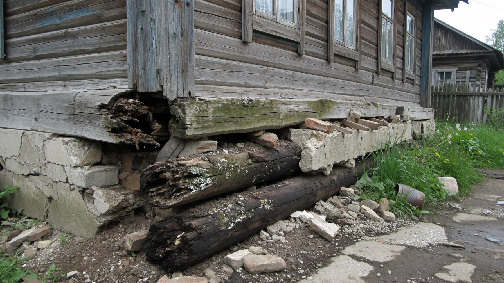
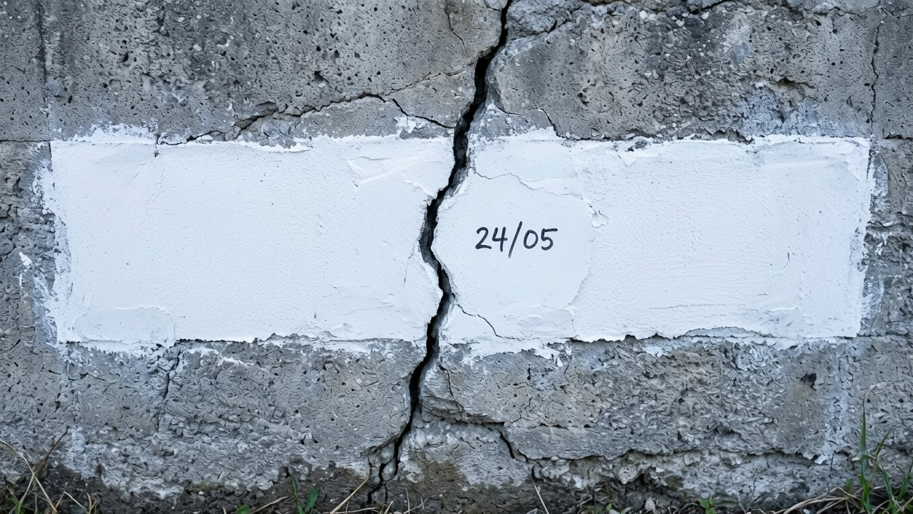
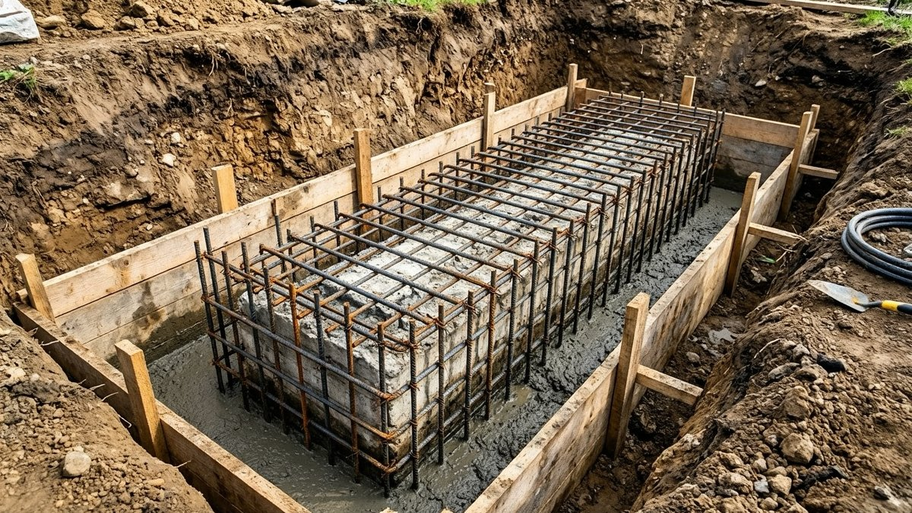
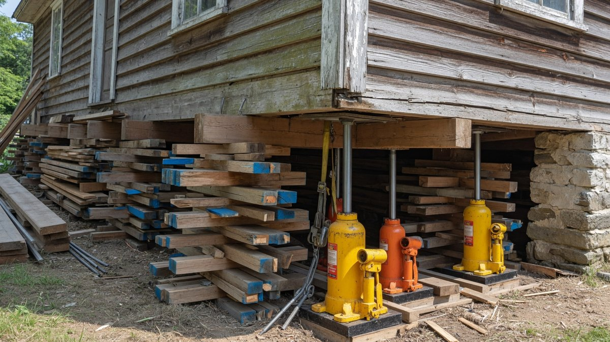
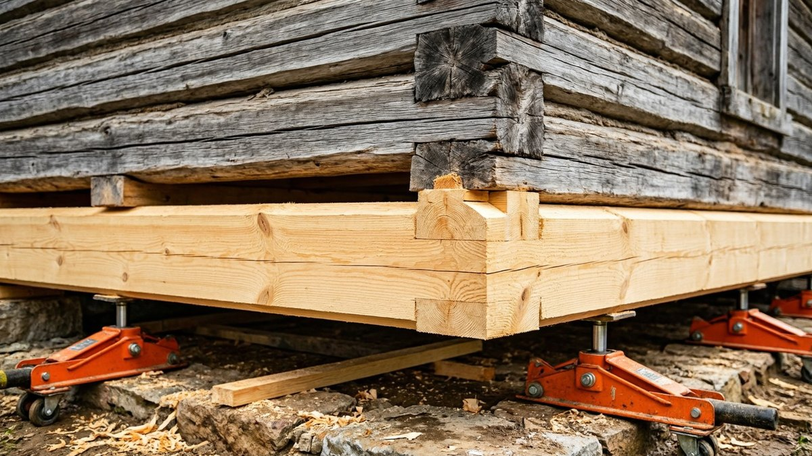
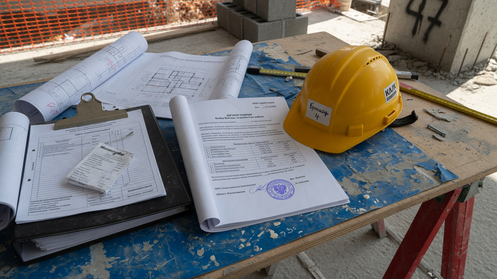
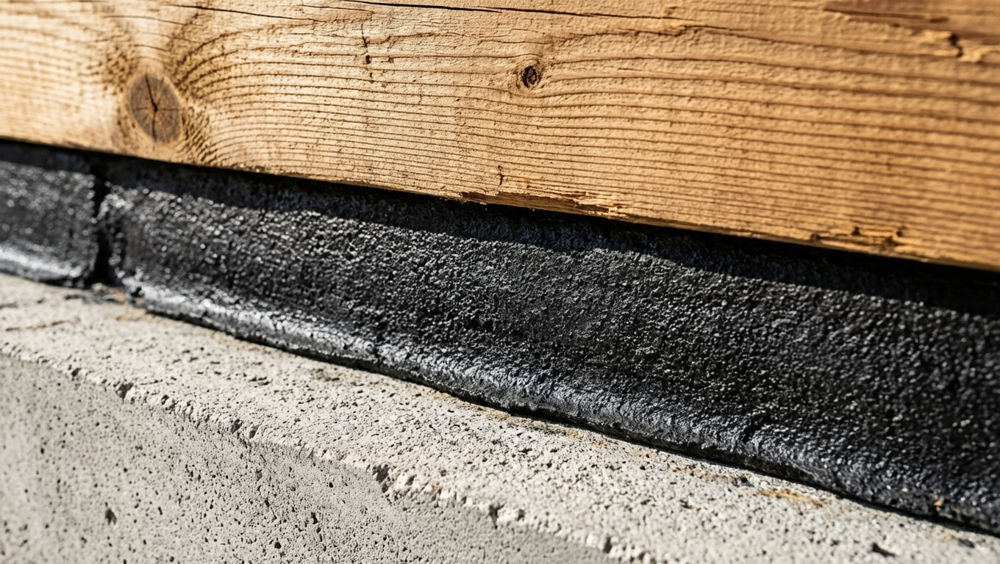
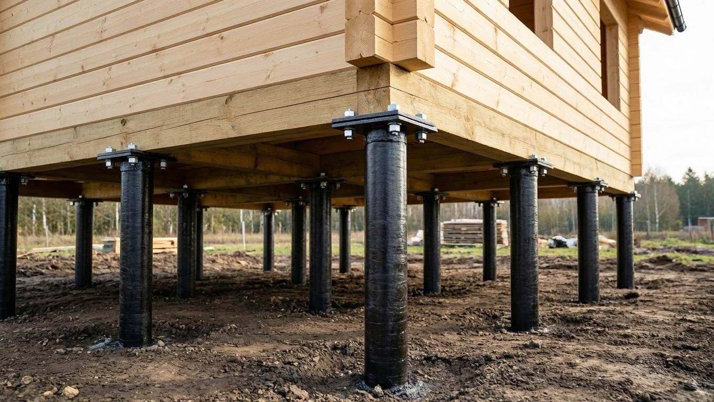

Трещина в фундаменте и труха вместо нижних брёвен звучат как приговор дому, но в большинстве случаев это не так. Дома поднимают домкратами, меняют венцы, подводят под них новый фундамент — технология отработана десятилетиями, и старый крепкий сруб после такого ремонта служит ещё полвека. Вопрос обычно не «можно ли», а «сколько это будет стоить и стоит ли овчинка выделки». Разберём: как понять серьёзность проблемы, какие есть способы ремонта, из чего складывается цена, где искать мастеров и на каких подводных камнях чаще всего теряют деньги.

## 🔍 Шаг первый: понять, что происходит с домом

Прежде чем считать деньги, нужно ответить на главный вопрос: **процесс закончился или продолжается?** Дом, который осел двадцать лет назад и с тех пор стоит спокойно, и дом, который «едет» прямо сейчас — это две разные истории и два разных бюджета.

**Как это проверить: маячки на трещинах.** Способ простой и почти бесплатный:

1. Очистите участок трещины от грязи и пыли.
2. Поперёк трещины нанесите **гипсовую или алебастровую полоску** длиной 10–15 см и толщиной несколько миллиметров (либо приклейте полоску стекла или бумаги на цемент).
3. Подпишите дату прямо на маячке.
4. Поставьте несколько маячков — на каждой значимой трещине.
5. **Наблюдайте не меньше месяца**, а лучше через сезон с перепадом влажности (весна и осень).

Результат читается однозначно:

- **маячок цел** — процесс остановился, трещина «мёртвая». Достаточно заделать её и устранить причину;
- **маячок треснул** — движение продолжается, нужен ремонт фундамента, а не косметика;
- **маячок треснул и разошёлся сильно** — процесс активный, тянуть нельзя.

⚠️ **Не заделывайте трещины до наблюдения.** Замазав их сразу, вы потеряете единственный доступный индикатор и узнаете о продолжении осадки, только когда треснет стена.

## 🧩 Почему это произошло: устранять надо причину

Ремонт без устранения причины — деньги на ветер: через пару лет всё повторится. Типичные причины:

- **Пучение грунта.** Фундамент заложен выше глубины промерзания, зимой грунт вспучивается и выдавливает его неравномерно. Самая частая причина у старых дачных домов.
- **Вода.** Нет отмостки и водостоков, вода льётся под фундамент, размывает и подмывает основание. Сюда же — поднявшийся уровень грунтовых вод, канава, которую перестали чистить.
- **Слабое основание.** Фундамент из бута на песке, без армирования, «как получилось» — обычное дело для домов советской постройки.
- **Перегруз.** Пристроили веранду, второй этаж, поставили тяжёлую печь — нагрузка выросла, фундамент не рассчитан.
- **Гниение венцов** — отдельная причина перекоса: дом просел не потому, что фундамент поехал, а потому, что нижние брёвна превратились в труху.

Гниль венцов почти всегда означает одно: **вода и отсутствие вентиляции**. Низкий цоколь, отсутствие гидроизоляции между фундаментом и бревном, заваленные продухи, земля или отмостка вплотную к стене, протекающая кровля — дерево постоянно мокрое и не просыхает.

## 🏗️ Как ремонтируют фундамент

Способ зависит от типа фундамента, состояния и характера проблемы. Основные варианты:

**Заделка «мёртвых» трещин.** Если маячки показали, что движение прекратилось: трещину расшивают, очищают, грунтуют и заполняют ремонтным составом. Дальше — устранение причины (отмостка, водоотвод, дренаж).

**Усиление обоймой.** Вокруг существующего фундамента делают железобетонную «рубашку»: откапывают, ставят арматурный каркас с анкеровкой в старый бетон, заливают. Фундамент становится шире и прочнее, нагрузка перераспределяется. Подходит для лент, у которых не хватает несущей способности.

**Подведение нового фундамента захватками.** Классика для домов, где фундамента фактически нет или он разрушен. Дом подкапывают **участками по 1–2 метра** (никогда не по всему периметру сразу!), под открытый участок заливают новый фундамент, дают набрать прочность, переходят к следующему. Работа долгая и требует опыта, зато без подъёма дома.

**Винтовые сваи.** Дом поднимают, по периметру и под несущими стенами вкручивают сваи, делают обвязку (ростверк) и опускают дом на неё. Быстро, работает на слабых и пучинистых грунтах, не боится сезонности. Требует точного расчёта нагрузки и качественных свай с антикоррозийной защитой.

**Полная замена фундамента.** Дом поднимают на домкратах, старое основание демонтируют, заливают новое. Самый дорогой, но и самый радикальный вариант — по сути дом получает новую жизнь.

## 🪵 Как меняют нижние венцы

Технология одинаковая независимо от того, меняете вы один венец или три.

1. **Разгрузка дома.** Выносят тяжёлые вещи, иногда разбирают печь или отделяют пристройки, снимают крыльцо, отсоединяют коммуникации.
2. **Установка домкратов.** Обычно 4–8 гидравлических домкратов грузоподъёмностью 10–20 тонн, под несущие стены и углы, на прочные опорные площадки (не на грунт).
3. **Подъём.** Дом поднимают **синхронно и понемногу** — по 1–2 см за проход, обходя домкраты по кругу. Общий подъём — ровно столько, чтобы вынуть венец, обычно 10–20 см. Резкий подъём одного угла рвёт сруб и отделку.
4. **Страховка.** Под поднятый дом обязательно ставят временные опоры (клети из бруса) — работать под домом, который держат только домкраты, нельзя.
5. **Демонтаж гнилых венцов** и зачистка опорных поверхностей.
6. **Укладка новых венцов.** Оптимально — **лиственница**: она устойчива к влаге и служит в этом узле дольше сосны. Древесину обязательно обрабатывают антисептиком со всех сторон, включая торцы.
7. **Гидроизоляция.** Между фундаментом и новым венцом укладывают гидроизоляцию (рубероид, битумные материалы) — **именно её отсутствие обычно и сгноило старые брёвна**. Пропустить этот шаг — гарантированно повторить проблему.
8. **Опускание дома** — так же медленно и синхронно.
9. **Восстановление** продухов, отмостки, крыльца, коммуникаций и отделки.

Отдельный вариант — **частичная замена**: если сгнил не весь венец, а участки (углы, места под окнами), меняют фрагменты с врезкой новых кусков в замок. Дешевле, но требует высокой квалификации.

## 📅 Когда лучше делать эти работы

- **Лучшее время — лето и ранняя осень**: сухо, грунт стабилен, бетон нормально набирает прочность, дерево не мокнет под дождём.
- **Весна** — хуже: высокий уровень грунтовых вод и раскисший грунт мешают земляным работам.
- **Зима** — мёрзлый грунт, бетонирование требует прогрева и добавок, стоимость растёт. Подъём дома и замену венцов зимой делают, но это вынужденный вариант.

Если дом «едет» активно — не ждите идеального сезона, ставьте маячки и вызывайте специалиста сразу. Затянувшийся перекос портит стены, стропила и отделку, и ремонт дорожает.

## 💰 Сколько это стоит: из чего складывается цена

Конкретные суммы сильно зависят от региона, состояния дома и подрядчика, а цены быстро устаревают. Поэтому важнее понимать **структуру расходов** — она позволит проверить любую смету на адекватность.

**Как обычно считают:**

- **замена венцов** — за **погонный метр** (по периметру), отдельно за каждый венец;
- **подъём дома** — обычно отдельной позицией, зависит от площади, веса и этажности;
- **фундамент** — за погонный метр ленты или **за сваю**;
- **земляные работы** — за кубометр или метр траншеи.

**Что влияет на итог:**

- **сколько венцов меняется** — один или три-четыре;
- **материал стен и вес дома** — брус легче бревна, дом с мансардой тяжелее;
- **кирпичная печь** — если она стоит на собственном фундаменте, дом вокруг неё поднимать сложнее (иногда печь приходится разбирать);
- **пристройки, веранда, крыльцо** — их нужно поднимать вместе с домом или отрезать и переделывать;
- **доступ техники** — если не подъехать, всё вручную и дороже;
- **состояние, вскрывшееся по ходу** — самая непредсказуемая статья.

**Скрытые расходы, о которых забывают при планировании:**

- материалы (брус или бревно, гидроизоляция, антисептик, бетон, арматура, сваи);
- аренда или покупка домкратов и опор;
- вывоз строительного мусора;
- восстановление отделки внутри — при подъёме трескаются штукатурка, обои, плитка;
- переделка крыльца, веранды, отмостки, водостоков;
- отключение и обратное подключение коммуникаций;
- временное жильё, если дом на время работ станет непригодным.

**Ориентир для решения:** сложите стоимость ремонта с ценой покупки (если дом ещё только присматриваете) и сравните с ценой крепкого дома в том же районе. Иногда выгоднее взять дороже, но целый — эту логику мы разбирали в статье про [покупку старого дома](https://mir-doma.pro/pokupka-starogo-doma/).

## 🤔 Когда дом уже не стоит спасать

Честный список ситуаций, когда ремонт экономически бессмыслен:

- **сгнили не только венцы, но и стены выше** — гниль поднялась на 3–4 венца и дальше;
- **разрушены стропила и перекрытия**, кровля течёт давно;
- **сруб «сложился»** — геометрия нарушена так, что дом ведёт по диагонали;
- **фундамента фактически нет**, а дом стоит на слабом грунте с высокой водой;
- **суммарный ремонт приближается к стоимости нового дома** аналогичной площади;
- **дом маленький и неудобный** — вкладывать в реанимацию того, в чём вы всё равно не хотите жить, нерационально.

Иногда правильное решение — разобрать дом на дрова и поставить новый: каркасник или брусовой дом небольшой площади может обойтись дешевле капитального восстановления руины.

## 👷 Где искать мастеров и как выбрать

Это специфическая работа, и бригад «на все руки» лучше избегать: подъём дома требует опыта, оборудования и понимания, как поведёт себя сруб.

**Где искать:**

- **соседи и местные жители** — лучший источник: спросите, кто в округе поднимал дома, и попроситесь посмотреть результат через несколько лет;
- **местные группы и сообщества** в соцсетях по вашему району;
- **специализированные бригады** — те, кто занимается именно подъёмом домов и заменой венцов, а не «ремонтом под ключ» вообще;
- **строительные базы и магазины** — там часто знают работающие бригады;
- **профильные форумы** с реальными отчётами о работах.

**На что смотреть при выборе:**

| Хороший признак | Тревожный признак |
|---|---|
| Приехал на осмотр до разговора о цене | Называет цену по телефону, не видя дома |
| Показывает фото **процесса**, а не только «до/после» | Портфолио из чужих или обезличенных фото |
| Объясняет технологию и обосновывает решение | «Не переживайте, сделаем как надо» |
| Готов дать контакты прошлых заказчиков | Отказывается давать рекомендации |
| Предлагает договор со сметой и этапами | Работает «на словах» |
| Аванс на материалы, оплата по этапам | Требует большую предоплату вперёд |
| Спрашивает про печь, пристройки, коммуникации | Не задаёт уточняющих вопросов |
| Работает в регионе давно | Приезжая бригада «проездом», без адреса |

**Обязательно зафиксируйте в договоре:** объём работ, материалы (порода дерева, марка бетона), сроки, порядок оплаты по этапам, что делать при обнаружении скрытых дефектов, гарантию и ответственность за повреждения при подъёме.

## ⚠️ Подводные камни

- **Смета вырастет.** Почти всегда: вскрыли — а гнили больше. Закладывайте резерв 20–30% сверху и обсуждайте порядок согласования доплат **заранее**, а не по факту.
- **«Мы уже начали, нужно ещё денег».** Классическая схема давления: дом стоит на домкратах, отказаться невозможно. Защита — договор с этапами и умеренный аванс.
- **Печь и дымоход.** Кирпичная печь стоит на своём фундаменте и при подъёме дома остаётся на месте — это конфликт, который надо решить до начала работ. Иногда печь разбирают и складывают заново; про варианты замены — в статье о [печи для дачи](https://mir-doma.pro/pech-dlya-dachi/).
- **Коммуникации.** Трубы, кабели, канализация жёстко связывают дом с землёй — их отсоединяют заранее, иначе порвёт.
- **Отделка треснет.** Штукатурка, плитка, обои, натяжные потолки — при подъёме это почти неизбежно. Закладывайте косметику в бюджет.
- **Забыли про гидроизоляцию** между фундаментом и новым венцом — и через 10–15 лет всё повторится. Проконтролируйте этот момент лично.
- **Не устранили причину.** Поменяли венцы, но оставили заваленные продухи и отсутствие отмостки — гниль вернётся.
- **Работа под домом без страховочных опор** — вопрос безопасности, а не экономии. Если бригада работает только на домкратах, это повод остановить работы.

## 🛡️ Что сделать после ремонта, чтобы не повторилось

- **отмостка** по периметру с уклоном от дома;
- **водостоки** с отводом воды подальше от фундамента;
- **дренаж**, если участок сырой или в низине;
- **продухи** в подполе — открытые и работающие;
- **гидроизоляция** между фундаментом и деревом (проверить при работах);
- **зазор между грунтом и деревом** — земля, отмостка и клумбы не должны касаться нижнего венца;
- **обработка антисептиком** нижних венцов и лаг;
- **вентиляция подпола** и сухость — при необходимости с принудительной вытяжкой.

Крыльцо часто стоит на отдельном, более лёгком основании, и просаживается
независимо от основного дома — стоит проверить его отдельно, даже если
фундамент дома в порядке. Диагностика и ремонт крыльца разобраны в статье
[ремонт крыльца на даче своими руками](https://mir-doma.pro/remont-kryltsa-svoimi-rukami/).

## ❓ Частые вопросы

**Можно ли отремонтировать треснувший фундамент, не разбирая дом?**
Да. В зависимости от ситуации применяют заделку «мёртвых» трещин, усиление железобетонной обоймой, подведение нового фундамента участками по 1–2 метра или винтовые сваи. Полная замена с подъёмом дома нужна далеко не всегда.

**Как понять, опасна трещина в фундаменте или нет?**
Поставьте гипсовые маячки поперёк трещины, подпишите дату и наблюдайте не меньше месяца, лучше через сезон. Целый маячок означает, что процесс остановился; треснувший — что дом продолжает двигаться и нужен ремонт основания.

**Можно ли заменить венцы самому?**
Технически возможно при наличии опыта, домкратов и помощников, но риск высок: неравномерный подъём рвёт сруб, а работа под домом без страховочных опор опасна для жизни. Для дома целиком разумнее нанять бригаду, самостоятельно можно взяться разве что за небольшую хозпостройку.

**Из какого дерева делать новые венцы?**
Лучший выбор — лиственница: она устойчива к влаге и в этом узле служит дольше сосны. Древесину обязательно обрабатывают антисептиком со всех сторон, а между фундаментом и венцом укладывают гидроизоляцию.

**Сколько стоит поднять дом и заменить венцы?**
Замену венцов считают за погонный метр периметра, подъём дома — отдельной позицией, фундамент — за метр ленты или за сваю. Итог зависит от количества венцов, веса дома, наличия печи и пристроек, доступа техники. Обязательно закладывайте резерв 20–30% на скрытые дефекты и восстановление отделки.

**Как выбрать бригаду для подъёма дома?**
Ищите тех, кто специализируется именно на подъёме домов, а не на ремонте вообще. Хорошие признаки: приезжают на осмотр до разговора о цене, показывают фото процесса своих работ, дают контакты заказчиков, предлагают договор со сметой и оплатой по этапам, спрашивают про печь и коммуникации.

**Что делать в первую очередь, если дом просел?**
Поставить маячки и определить, продолжается ли движение, затем найти причину (вода, пучение, гниль, перегруз) и только потом выбирать способ ремонта. Ремонт без устранения причины через пару лет придётся повторять.

---

Треснувший фундамент и сгнившие венцы — не приговор, а вопрос диагностики и денег. Начните с маячков и поиска причины, а не с поиска бригады: понимание, что именно происходит с домом, экономит и время, и бюджет. И помните два правила, которые чаще всего игнорируют: устранить причину и не забыть гидроизоляцию между фундаментом и деревом — без них ремонт придётся повторять.

**Куда идти дальше:**

- Если дом вы ещё только присматриваете, оцените масштаб проблем до сделки — это сильный аргумент для торга: [покупка старого дома](https://mir-doma.pro/pokupka-starogo-doma/).
- После ремонта основания логично привести дом в порядок целиком — план работ и порядок действий в статье про [обновление старой дачи](https://mir-doma.pro/kak-obnovit-staruyu-dachu/).
- Прогнившие лаги и полы обычно идут в комплекте с гнилыми венцами, но это уже посильно своими руками: [ремонт деревянного пола](https://mir-doma.pro/remont-derevyannogo-pola/).
- И пока подпол открыт, самое время утеплить пол — второй раз лезть туда не захочется: [утепление пола на даче](https://mir-doma.pro/uteplenie-pola-na-dache/).
