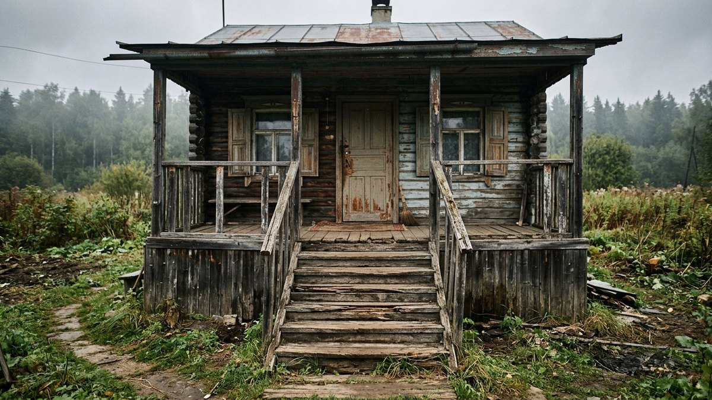
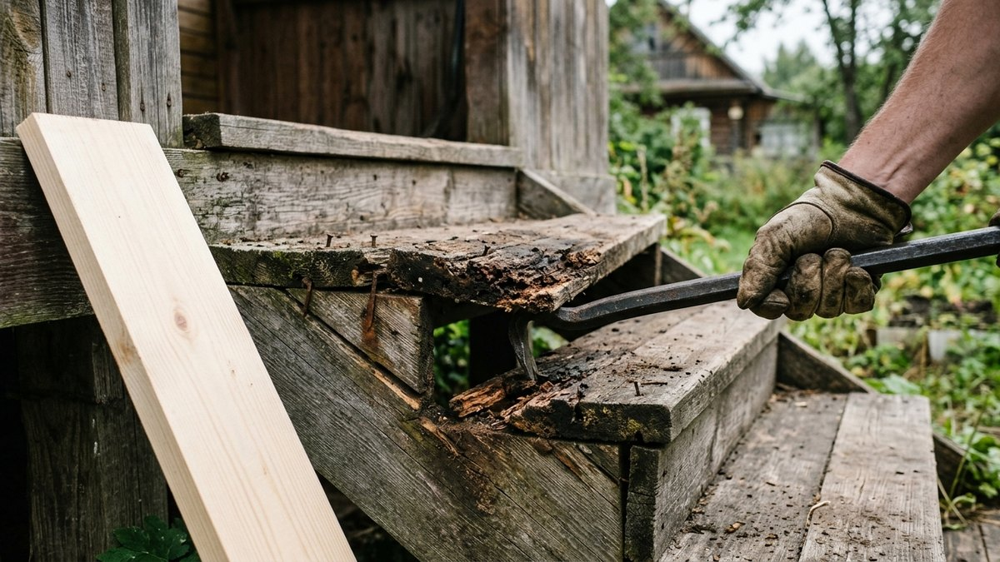
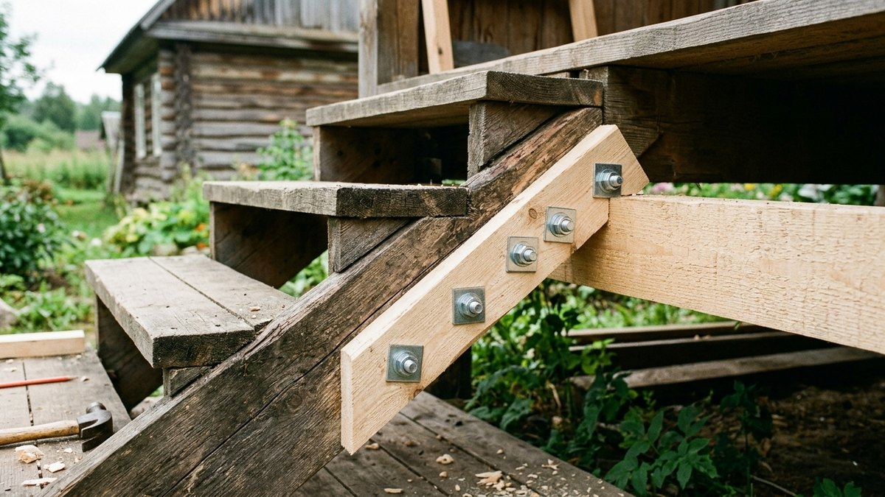
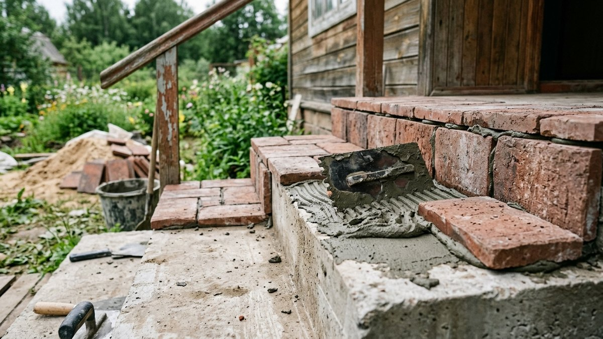
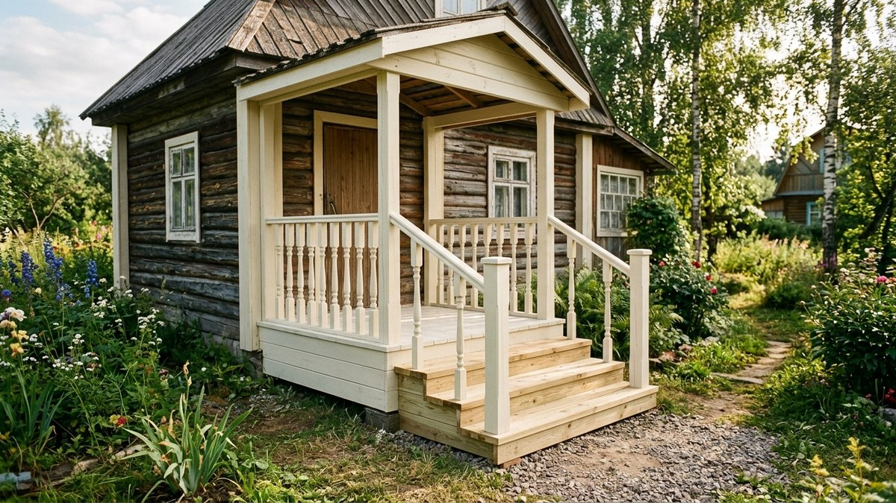
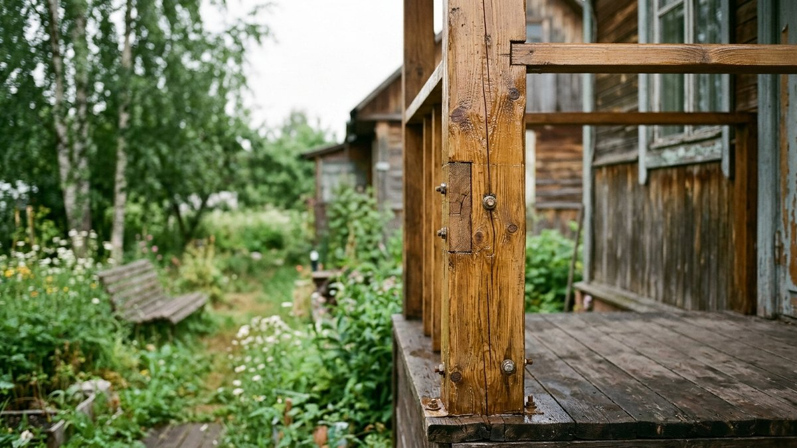

Скрипучие ступени, шатающиеся перила или отслаивающееся бетонное покрытие —
крыльцо на старой даче обычно требует ремонта раньше остального дома: оно
принимает на себя и осадки, и перепады температуры, и ежедневную нагрузку.
Разберём, как определить причину проблемы и отремонтировать крыльцо своими
руками — деревянное и бетонное — без полной перестройки.

*Крыльцо дачного дома, требующее ремонта*

## С чего начать: диагностика проблемы

Прежде чем менять доски или заливать бетон, найдите первопричину:

- **Крыльцо просело или накренилось целиком** — проблема в основании: столбы
  или бетонная подушка сдвинулись из-за пучения грунта. Ремонт ступеней
  здесь бесполезен, пока не поправлено основание — тот же принцип, что и при
  выравнивании дома, разобран в статье [ремонт фундамента и замена
  венцов](https://mir-doma.pro/remont-fundamenta-i-venczov/).
- **Отдельные доски скрипят или прогибаются** — гниют опорные балки
  (косоуры) или сами ступени, при этом основание крыльца в порядке.
- **Бетонные ступени крошатся и трескаются по краям** — обычно
  поверхностное разрушение от воды и мороза, само основание чаще всего
  цело.
- **Перила шатаются** — почти всегда просто ослабло крепление стоек, редко
  требует серьёзного ремонта.

## Ремонт деревянного крыльца

### Замена сгнивших ступеней и досок

1. Снимите повреждённую доску, поддев её монтировкой у мест крепления.
2. Проверьте состояние косоуров (несущих боковых балок) под ней — если
   дерево мягкое и крошится под ножом, косоур тоже подлежит замене или
   усилению накладкой из нового бруса рядом со старым.
3. Выпилите новую доску по размеру старой, обработайте антисептиком со всех
   сторон, включая торцы — именно они впитывают влагу быстрее всего.
4. Закрепите саморезами по дереву, оставляя зазор 3–5 мм между досками для
   стока воды.

*Замена повреждённой доски крыльца*

### Усиление и замена косоуров

Если несущая балка подгнила частично, её можно усилить, прикрутив рядом
новый брус того же сечения (сплотить старую и новую балку между собой), не
разбирая всё крыльцо. Полностью прогнившие косоуры проще заменить целиком:
крыльцо временно подпирают домкратом или брусом, снимают настил, меняют
косоур и собирают конструкцию заново.

*Усиление несущей балки крыльца*

## Ремонт бетонного крыльца

### Заделка трещин и сколов

Небольшие трещины и сколы на бетонных ступенях заделывают ремонтным
раствором на основе цемента с полимерными добавками — он лучше сцепляется
со старым бетоном, чем обычный цементный раствор. Перед заделкой край
трещины расширяют и очищают от рыхлого бетона, иначе заплатка отвалится
через один сезон.

### Восстановление ступеней облицовкой

Если бетонное основание крепкое, а разрушена только поверхность, крыльцо
не обязательно перезаливать — сверху укладывают плитку, керамогранит или
клинкер на плиточный клей для наружных работ. Такой вариант дешевле полной
заливки и заодно освежает внешний вид крыльца.

*Облицовка бетонных ступеней крыльца*

## Ремонт и укрепление перил

Шатающиеся перила чаще всего от ослабленного крепления стойки к настилу или
косоуру. Стойку демонтируют, отверстие под крепёж рассверливают чуть шире,
заполняют столярным клеем или эпоксидным составом и вставляют стойку с
креплением на длинные саморезы или шпильки — так она держится заметно
крепче, чем на исходном креплении. Прогнившую нижнюю часть стойки, которая
касалась настила, при необходимости подрезают и наращивают новым куском
дерева на кленовых или металлических накладках.

## Гидроизоляция и защита после ремонта

Отремонтированное деревянное крыльцо обязательно обрабатывают антисептиком
и покрывают защитным составом для наружных работ — без этого повторный
ремонт понадобится через один-два сезона. Бетонные ступени после заделки
трещин желательно пропитать гидрофобизатором — состав закрывает поры
бетона и снижает впитывание воды, из-за которой бетон и разрушается зимой
при замерзании влаги внутри.

*Крыльцо после ремонта и финишной обработки*

## Частые ошибки

- **Меняют доски настила, не проверив косоуры под ними** — новая доска
  быстро расшатывается на сгнившей несущей балке.
- **Заделывают трещины в бетоне без расчистки** — раствор ложится на рыхлый
  край и отваливается за один сезон.
- **Пропускают обработку антисептиком новых деталей** — свежее дерево без
  защиты гниёт даже быстрее старого, потому что более пористое.
- **Ремонтируют ступени при просевшем основании** — без выравнивания
  основания косметический ремонт держится недолго, крыльцо снова
  перекашивает.

*Укреплённые перила крыльца*

## Частые вопросы

### Как понять, что крыльцо нужно не ремонтировать, а перестраивать

Если просело или накренилось основание целиком, а не отдельные ступени, —
это повод разобрать конструкцию и поправить опору, а не латать сверху.
Косметический ремонт сгнивших досок или заделка бетонных сколов оправданы,
только когда основание крыльца устойчиво.

### Сколько стоит отремонтировать крыльцо на даче своими руками

Ремонт деревянного крыльца обходится дешевле полной перестройки — расходы
идут в основном на доску для замены прогнивших элементов, антисептик и
крепёж. Ремонт бетонных ступеней облицовкой плиткой дороже точечной заделки
трещин, но заметно дешевле новой заливки.

### Чем заделать трещины в бетонных ступенях крыльца

Ремонтным цементно-полимерным составом для наружных работ — он лучше
держится на старом бетоне, чем обычный цементный раствор. Перед заделкой
край трещины обязательно расчищают от рыхлого бетона.

### Как укрепить шатающиеся перила крыльца

Чаще всего достаточно снять стойку, расширить и очистить отверстие
крепления, залить эпоксидным составом или столярным клеем и заново
закрепить на длинных саморезах или шпильках — так соединение держится
надёжнее исходного.

### Можно ли отремонтировать деревянное крыльцо без замены всей конструкции

Да, если проблема в отдельных досках настила или частично подгнивших
косоурах — их усиливают или меняют точечно. Полная перестройка нужна только
при повреждении основания или большинства несущих элементов одновременно.
