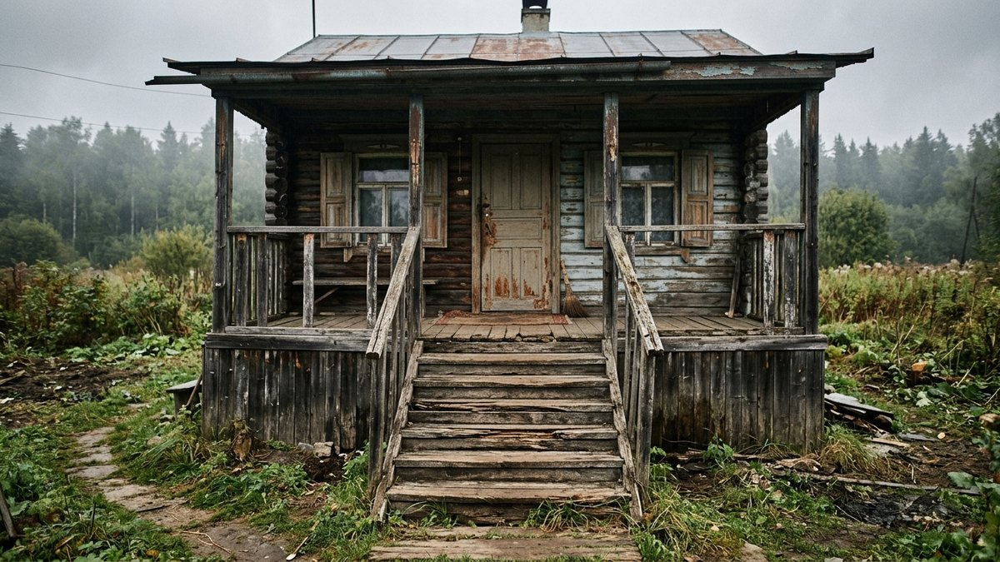
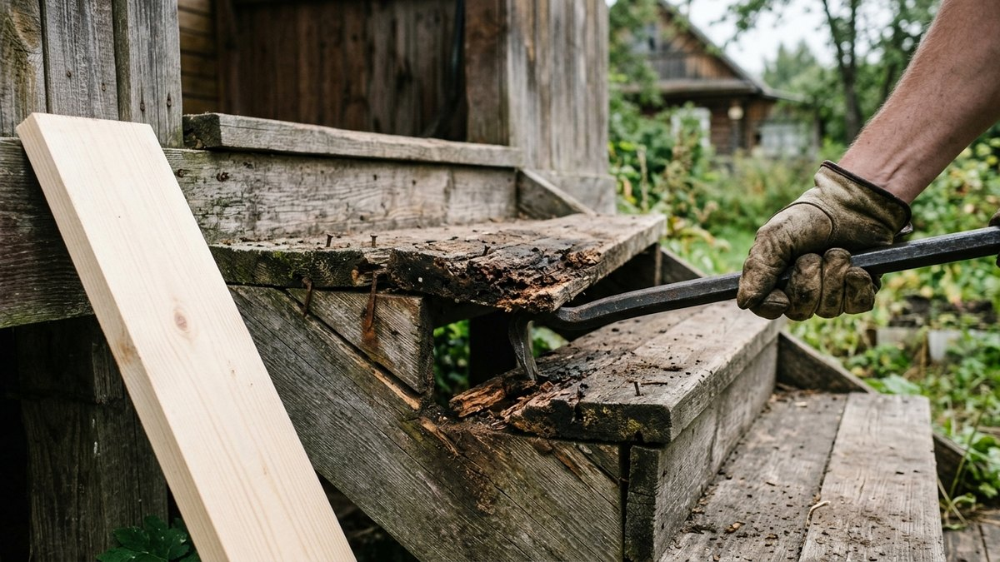
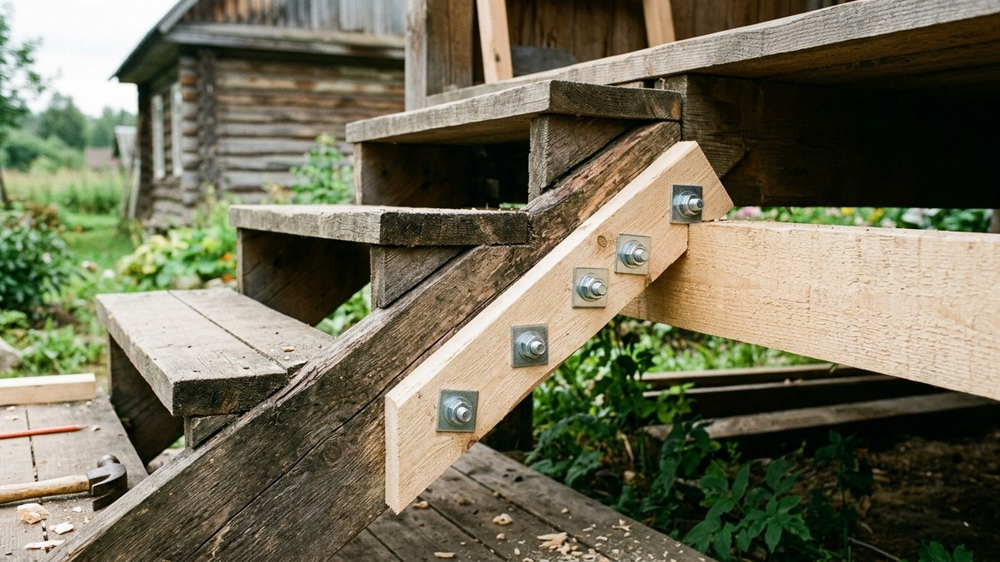
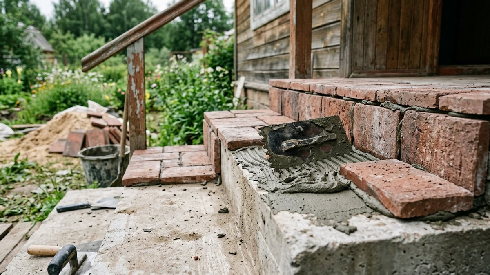
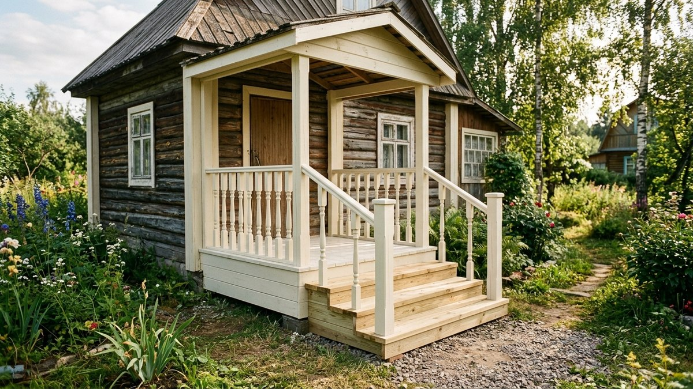
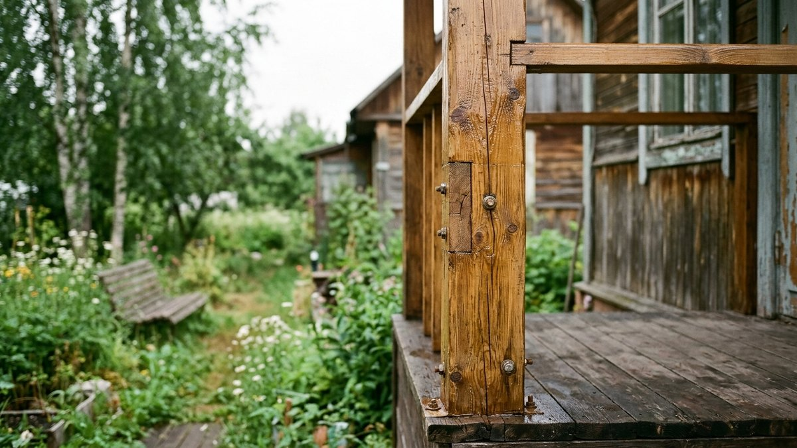

Скрипучие ступени, шатающиеся перила или отслаивающееся бетонное покрытие —
крыльцо на старой даче обычно требует ремонта раньше остального дома: оно
принимает на себя и осадки, и перепады температуры, и ежедневную нагрузку.
Разберём, как определить причину проблемы и отремонтировать крыльцо своими
руками — деревянное и бетонное — без полной перестройки.

*Крыльцо дачного дома, требующее ремонта*

## С чего начать: диагностика проблемы

Прежде чем менять доски или заливать бетон, найдите первопричину:

- **Крыльцо просело или накренилось целиком** — проблема в основании: столбы
  или бетонная подушка сдвинулись из-за пучения грунта. Ремонт ступеней
  здесь бесполезен, пока не поправлено основание — тот же принцип, что и при
  выравнивании дома, разобран в статье [ремонт фундамента и замена
  венцов](https://mir-doma.pro/remont-fundamenta-i-venczov/).
- **Отдельные доски скрипят или прогибаются** — гниют опорные балки
  (косоуры) или сами ступени, при этом основание крыльца в порядке.
- **Бетонные ступени крошатся и трескаются по краям** — обычно
  поверхностное разрушение от воды и мороза, само основание чаще всего
  цело.
- **Перила шатаются** — почти всегда просто ослабло крепление стоек, редко
  требует серьёзного ремонта.

## Ремонт деревянного крыльца

### Замена сгнивших ступеней и досок

1. Снимите повреждённую доску, поддев её монтировкой у мест крепления.
2. Проверьте состояние косоуров (несущих боковых балок) под ней — если
   дерево мягкое и крошится под ножом, косоур тоже подлежит замене или
   усилению накладкой из нового бруса рядом со старым.
3. Выпилите новую доску по размеру старой, обработайте антисептиком со всех
   сторон, включая торцы — именно они впитывают влагу быстрее всего.
4. Закрепите саморезами по дереву, оставляя зазор 3–5 мм между досками для
   стока воды.

*Замена повреждённой доски крыльца*

### Усиление и замена косоуров

Если несущая балка подгнила частично, её можно усилить, прикрутив рядом
новый брус того же сечения (сплотить старую и новую балку между собой), не
разбирая всё крыльцо. Полностью прогнившие косоуры проще заменить целиком:
крыльцо временно подпирают домкратом или брусом, снимают настил, меняют
косоур и собирают конструкцию заново.

*Усиление несущей балки крыльца*

## Ремонт бетонного крыльца

### Заделка трещин и сколов

Небольшие трещины и сколы на бетонных ступенях заделывают ремонтным
раствором на основе цемента с полимерными добавками — он лучше сцепляется
со старым бетоном, чем обычный цементный раствор. Перед заделкой край
трещины расширяют и очищают от рыхлого бетона, иначе заплатка отвалится
через один сезон.

### Восстановление ступеней облицовкой

Если бетонное основание крепкое, а разрушена только поверхность, крыльцо
не обязательно перезаливать — сверху укладывают плитку, керамогранит или
клинкер на плиточный клей для наружных работ. Такой вариант дешевле полной
заливки и заодно освежает внешний вид крыльца.

*Облицовка бетонных ступеней крыльца*

## Ремонт и укрепление перил

Шатающиеся перила чаще всего от ослабленного крепления стойки к настилу или
косоуру. Стойку демонтируют, отверстие под крепёж рассверливают чуть шире,
заполняют столярным клеем или эпоксидным составом и вставляют стойку с
креплением на длинные саморезы или шпильки — так она держится заметно
крепче, чем на исходном креплении. Прогнившую нижнюю часть стойки, которая
касалась настила, при необходимости подрезают и наращивают новым куском
дерева на кленовых или металлических накладках.

## Гидроизоляция и защита после ремонта

Отремонтированное деревянное крыльцо обязательно обрабатывают антисептиком
и покрывают защитным составом для наружных работ — без этого повторный
ремонт понадобится через один-два сезона. Бетонные ступени после заделки
трещин желательно пропитать гидрофобизатором — состав закрывает поры
бетона и снижает впитывание воды, из-за которой бетон и разрушается зимой
при замерзании влаги внутри.

*Крыльцо после ремонта и финишной обработки*

## Крыльцо зимой: чтобы не было скользко

На крыльце чаще всего падают зимой, и почти всегда виноваты три вещи:
вода с крыши, гладкое покрытие и ступень без уклона. Всё это проще
исправить осенью, до снега.

- **Капель с крыши.** Если над крыльцом нет козырька, водостока или
  снегозадержателей, днём на ступени капает талая вода, а к вечеру она
  становится льдом. Сначала решите это: организуйте сток с ската над
  входом — как собрать [водосток своими
  руками](https://mir-doma.pro/vodostok-svoimi-rukami/) — и поставьте
  [снегозадержатели](https://mir-doma.pro/snegozaderzhateli-na-kryshu/),
  чтобы снег не съезжал пластом прямо на ступени.
- **Уклон ступени.** Проступь делают с уклоном наружу 1–2%, то есть
  1–2 мм на каждые 10 см. Если вода стоит лужицей у подступенка,
  ступень перекошена внутрь, и лёд будет на ней каждое утро.
- **Покрытие.** Глазурованная плитка и доска, покрытая лаком или
  глянцевой эмалью, зимой скользят даже без льда. Выход — резиновые
  накладки или абразивная лента на край ступени. Перед покраской можно
  добавить в краску кварцевый песок, тогда покрытие станет шершавым.
- **Перила.** Если в крыльце больше трёх ступеней, перила нужны хотя бы
  с одной стороны. Зимой за них держатся чаще, чем кажется.

**Чем посыпать.** Песок или гранитная крошка безопасны для любых
ступеней. Соль и реагенты разрушают бетон и плитку: вода с солью
проникает в поры и рвёт их при каждом замерзании. Деревянное крыльцо
соль лишает защитного покрытия за одну зиму. Лёд с бетона не скалывайте
ломом, иначе останутся сколы. Посыпьте его песком и дождитесь оттепели.

## Калькулятор ступеней крыльца

Если ступени всё равно перекладывают, удобно сразу сделать их
правильной высоты. Введите высоту от земли до порога двери. Калькулятор
подберёт число ступеней и их размеры по формуле удобного шага: две
высоты ступени плюс глубина проступи — 60–65 см. Это та же формула,
что и для лестницы в доме, только уличные ступени делают ниже и
глубже. Расчёт внутренней лестницы — в статье [лестница на второй
этаж своими руками](https://mir-doma.pro/lestnica-na-vtoroy-etazh-svoimi-rukami/).

<!-- wp:html -->

  
Калькулятор ступеней крыльца

  <label class="md-calc__label" for="mdKrH">Высота от земли до порога двери, см</label>
  <input type="number" id="mdKrH" class="md-calc__input" min="10" step="1" value="75">
  <label class="md-calc__label" for="mdKrD">Ширина входной двери, см</label>
  <input type="number" id="mdKrD" class="md-calc__input" min="60" step="1" value="90">
  <label class="md-calc__label" for="mdKrO">Дверь открывается</label>
  <select id="mdKrO" class="md-calc__input">
    <option value="out" selected>Наружу, на крыльцо</option>
    <option value="in">Внутрь дома</option>
  </select>
  
Заполните поля

<!-- /wp:html -->

## Частые ошибки

- **Меняют доски настила, не проверив косоуры под ними** — новая доска
  быстро расшатывается на сгнившей несущей балке.
- **Заделывают трещины в бетоне без расчистки** — раствор ложится на рыхлый
  край и отваливается за один сезон.
- **Пропускают обработку антисептиком новых деталей** — свежее дерево без
  защиты гниёт даже быстрее старого, потому что более пористое.
- **Ремонтируют ступени при просевшем основании** — без выравнивания
  основания косметический ремонт держится недолго, крыльцо снова
  перекашивает.

*Укреплённые перила крыльца*

## Частые вопросы

### Как понять, что крыльцо нужно не ремонтировать, а перестраивать

Если просело или накренилось основание целиком, а не отдельные ступени, —
это повод разобрать конструкцию и поправить опору, а не латать сверху.
Косметический ремонт сгнивших досок или заделка бетонных сколов оправданы,
только когда основание крыльца устойчиво.

### Сколько стоит отремонтировать крыльцо на даче своими руками

Ремонт деревянного крыльца обходится дешевле полной перестройки — расходы
идут в основном на доску для замены прогнивших элементов, антисептик и
крепёж. Ремонт бетонных ступеней облицовкой плиткой дороже точечной заделки
трещин, но заметно дешевле новой заливки.

### Чем заделать трещины в бетонных ступенях крыльца

Ремонтным цементно-полимерным составом для наружных работ — он лучше
держится на старом бетоне, чем обычный цементный раствор. Перед заделкой
край трещины обязательно расчищают от рыхлого бетона.

### Чем посыпать крыльцо от гололёда

Песком или гранитной крошкой: они безопасны и для бетона, и для дерева,
и для плитки. Соль и реагенты разрушают бетон и плитку при каждом
замерзании, а с деревянных ступеней смывают защитное покрытие.

### Какой высоты делать ступени крыльца

Для улицы удобны ступени высотой 15–17 см и глубиной 30–35 см. Проверка —
формула шага: две высоты плюс глубина проступи должны дать 60–65 см.
Калькулятор в статье подберёт ступени под высоту вашего порога.

### Как укрепить шатающиеся перила крыльца

Чаще всего достаточно снять стойку, расширить и очистить отверстие
крепления, залить эпоксидным составом или столярным клеем и заново
закрепить на длинных саморезах или шпильках — так соединение держится
надёжнее исходного.

### Можно ли отремонтировать деревянное крыльцо без замены всей конструкции

Да, если проблема в отдельных досках настила или частично подгнивших
косоурах — их усиливают или меняют точечно. Полная перестройка нужна только
при повреждении основания или большинства несущих элементов одновременно.
