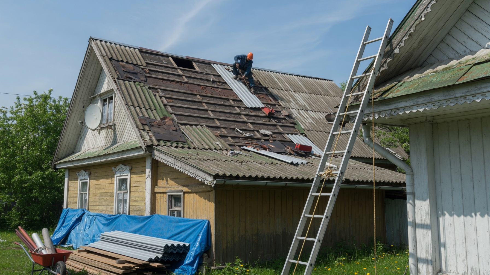
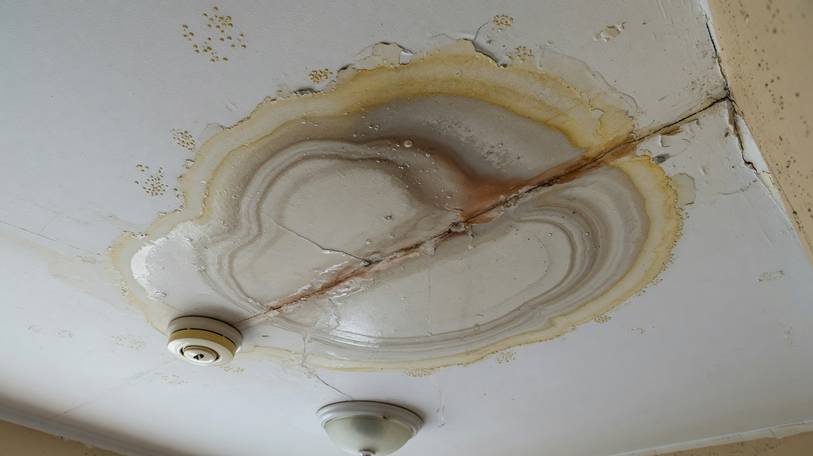
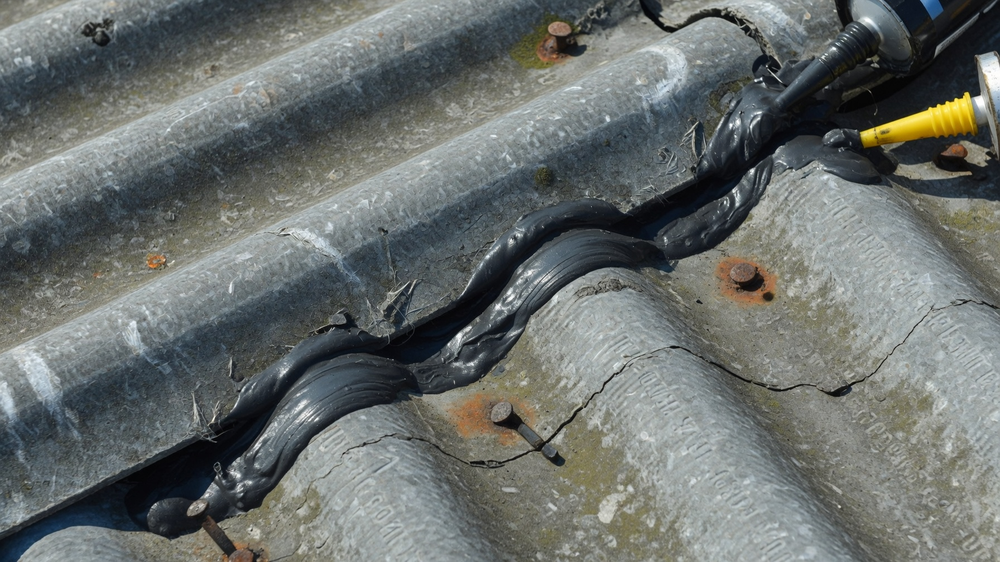
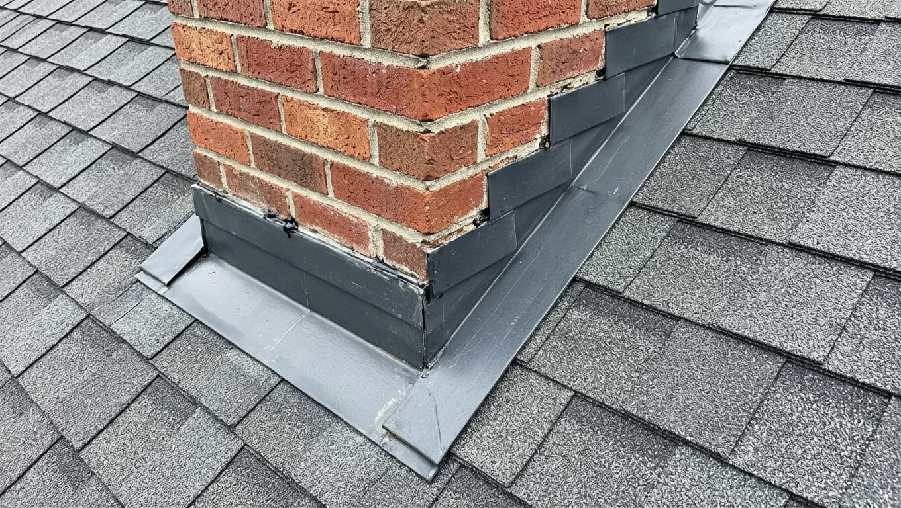
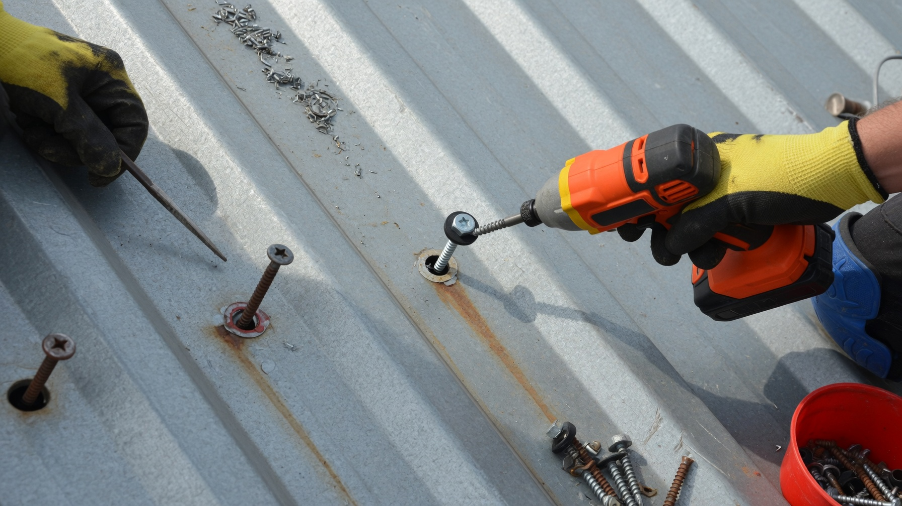
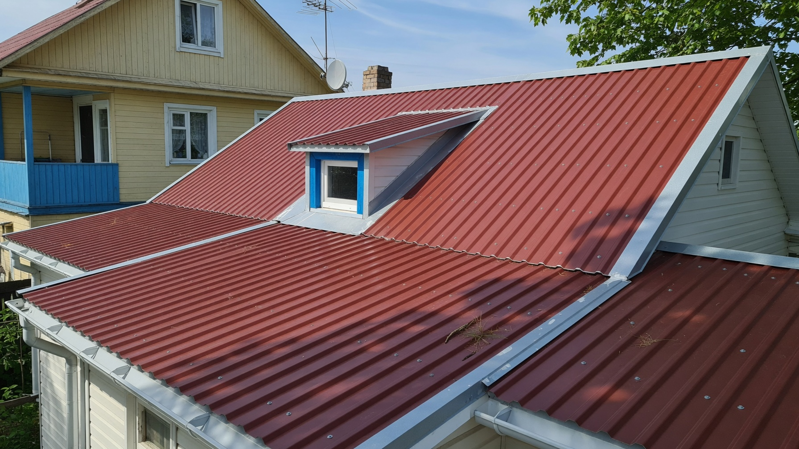

Крыша защищает дом от дождя, снега и холода, поэтому любую протечку лучше устранить до осенних дождей и зимы — иначе вода испортит утеплитель, перекрытия и отделку. Хорошая новость: большинство мелких проблем с кровлей можно найти и починить своими руками. Разберём, как обнаружить течь и отремонтировать крышу на даче — шифер, профнастил и мягкую кровлю — и когда ремонт уже не спасёт и крышу пора менять.

## 🔍 Признаки, что крыше нужен ремонт

Обратите внимание на тревожные сигналы:

- пятна, потёки и плесень на потолке и стенах верхнего этажа;
- капель или сырость на чердаке после дождя;
- ржавчина, трещины, сколы на кровельном материале;
- отставшие, сдвинутые или загремевшие на ветру листы;
- прогнившая обрешётка и стропила, труха на чердаке.

Чем раньше замечена проблема, тем дешевле ремонт: запущенная протечка разрушает не только кровлю, но и всю конструкцию под ней.

## 💧 Как найти течь

Главная сложность в том, что **вода течёт не там, где капает**: попав под кровлю, она стекает по обрешётке и стропилам и проявляется в другом месте. Ищут течь так:

- осматривают чердак в дождь или сразу после — по мокрым следам поднимаются к источнику;
- проверяют самые уязвимые места: стыки, ендовы (внутренние углы), примыкания к дымоходу и стенам, места крепежа;
- при сухой погоде кровлю можно пролить водой из шланга, наблюдая изнутри, откуда потечёт.

Найдя источник, определяют причину — повреждённый лист, разошедшийся стык или прохудившееся примыкание.

## 🩹 Ремонт по типу кровли

Способ ремонта зависит от материала крыши:

- **Шифер (асбестоцемент).** Трещины заделывают специальным герметиком или заплаткой из ткани, пропитанной битумной мастикой; сильно повреждённый лист меняют. Ходить по шиферу нужно осторожно, по доскам-трапам.
- **Профнастил и металлочерепица.** Подтягивают ослабшие саморезы (заменяя на кровельные с уплотнителем), зачищают и подкрашивают ржавчину антикоррозийной краской, мелкие отверстия герметизируют, повреждённый лист заменяют. Подробно о таком покрытии — в статье про [крышу из профнастила](https://mir-doma.pro/krysha-iz-profnastila-svoimi-rukami/).
- **Мягкая (битумная) кровля.** Небольшие повреждения заделывают битумной мастикой и заплатками, вздувшиеся места вскрывают, просушивают и приклеивают заново.
- **Черепица.** Треснувшие элементы просто заменяют на целые.

## 🔧 Ремонт примыканий и элементов

Чаще всего течёт не сама кровля, а её слабые места — стыки и переходы:

- **Примыкание к дымоходу и стенам** — самое течивое место; старую герметизацию удаляют и делают новую (фартук, планки примыкания, герметик).
- **Ендовы (внутренние углы)** — здесь скапливается вода и мусор; их чистят и восстанавливают гидроизоляцию.
- **Конёк** — проверяют крепление и уплотнение коньковых элементов.
- **Водостоки** — прочищают и закрепляют жёлоба и трубы: забитый водосток переливается под кровлю.

Именно с примыканий и ендов стоит начинать поиск причины протечки.

## 🏗️ Ремонт или замена крыши

Иногда локальный ремонт уже не имеет смысла:

- **Локальный ремонт** оправдан, когда повреждения точечные, а основная кровля и стропила целы.
- **Полную замену** делают, если кровля изношена по всей площади, протекает во многих местах, а обрешётка и стропила поражены гнилью.

Если вы всё равно вскрываете кровлю, разумно сразу утеплить крышу и мансарду — как это делается, в статье про [утепление дома](https://mir-doma.pro/kak-uteplit-dachnyy-dom/). А капитальное обновление крыши удобно совместить с общим [обновлением старой дачи](https://mir-doma.pro/kak-obnovit-staruyu-dachu/).

## 🛡️ Профилактика протечек

Чтобы крыша реже требовала ремонта:

- осматривайте кровлю и чердак дважды в год — весной и осенью;
- вовремя чистите водостоки и ендовы от листьев и мусора;
- после сильного ветра проверяйте, не сдвинулись ли листы;
- не откладывайте мелкий ремонт — маленькая течь быстро превращается в большую проблему;
- убирайте с крыши тяжёлый мокрый снег зимой, чтобы не деформировать покрытие.

## 🧗 Безопасность при работе на крыше

Ремонт крыши — это работа на высоте, поэтому безопасность важнее скорости:

- работайте только в сухую безветренную погоду — мокрая или обледенелая кровля очень скользкая;
- используйте страховку: страховочный пояс с верёвкой, закреплённой за надёжную опору, особенно на крутых скатах;
- по хрупкой кровле (шифер, ондулин) передвигайтесь по доскам-трапам, распределяющим вес, а не наступайте на покрытие между обрешёткой;
- устойчиво закрепите приставную лестницу, а инструмент поднимайте в сумке, освободив руки;
- не работайте на крыше в одиночку — рядом должен быть помощник.

Если крыша высокая, крутая или требует серьёзного ремонта, разумнее привлечь профессионалов: падение с высоты опаснее любой протечки.

## ❌ Частые ошибки

- **Заделали пятно на потолке, не найдя течь** — вода продолжает разрушать конструкцию.
- **Ходили по шиферу без трапов** — треснули соседние листы.
- **Прикрутили профнастил обычными саморезами без уплотнителя** — крепёж сам становится источником протечки.
- **Забыли про водостоки** — забитые жёлоба переливаются под кровлю.
- **Тянут с ремонтом до зимы** — мороз и снег усугубляют повреждения.

## ❓ Частые вопросы

**Как найти течь в крыше?**
Осмотреть чердак во время или сразу после дождя, поднимаясь по мокрым следам к источнику. Вода течёт не там, где капает, поэтому проверяют стыки, ендовы и примыкания. В сухую погоду кровлю можно пролить из шланга.

**Чем заделать течь в шиферной крыше?**
Трещину заделывают битумным герметиком или заплаткой из ткани с мастикой. Сильно повреждённый лист лучше заменить, передвигаясь по крыше по доскам-трапам.

**Как отремонтировать крышу из профнастила?**
Подтянуть или заменить саморезы на кровельные с уплотнителем, зачистить и подкрасить ржавчину, мелкие отверстия загерметизировать, а повреждённый лист заменить.

**Можно ли ремонтировать крышу зимой?**
Мелкий аварийный ремонт возможен, но полноценно чинить кровлю лучше в сухую тёплую погоду: битумные материалы и герметики плохо работают на морозе. Поэтому крышу приводят в порядок до зимы.

**Когда крышу пора менять, а не ремонтировать?**
Когда кровля изношена по всей площади, течёт во многих местах, а обрешётка и стропила поражены гнилью. Точечные повреждения при целой основе достаточно отремонтировать.

**Чем замазать стык крыши у дымохода?**
Старую герметизацию удаляют и делают новое примыкание с планками и кровельным герметиком (или фартуком). Это одно из самых уязвимых мест, поэтому работу выполняют тщательно.

---

Ремонт крыши по силам сделать самому: найдите течь, определите причину и заделайте повреждение подходящим для вашей кровли способом. Главное — не откладывать: устранённая вовремя протечка обходится в разы дешевле восстановления сгнивших стропил и потолка. И помните — крышу лучше привести в порядок до осенних дождей и снега.
