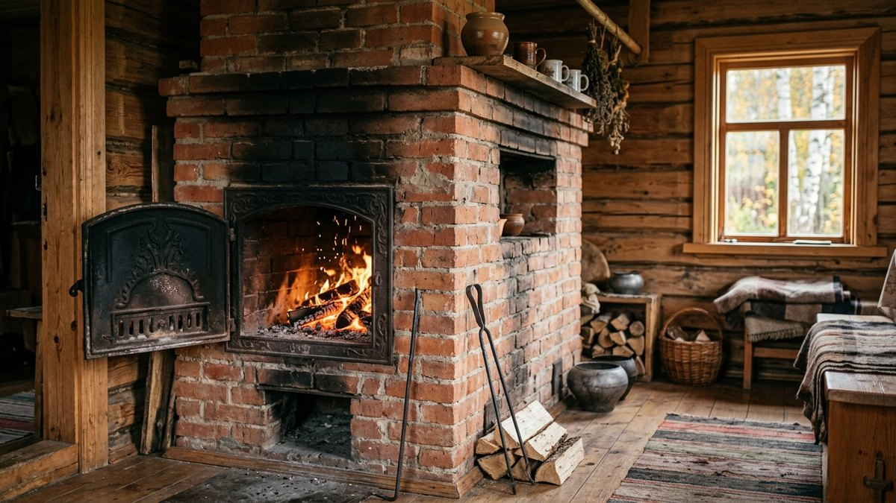
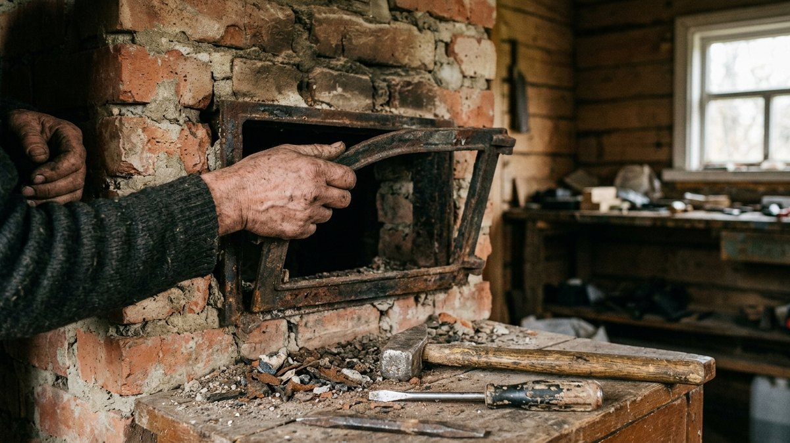
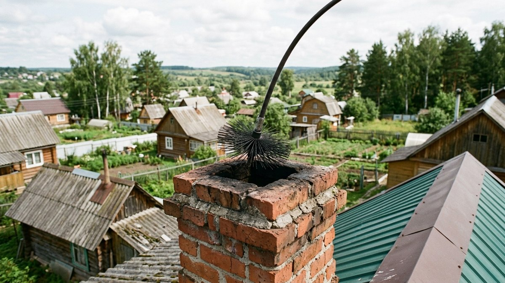
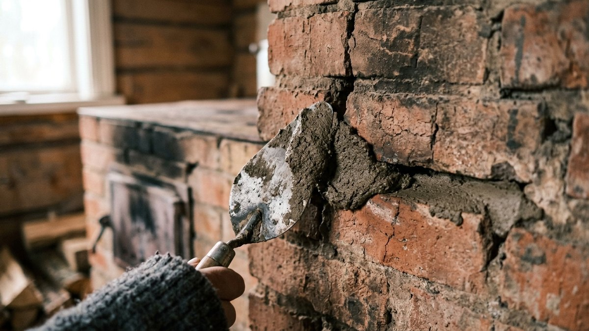
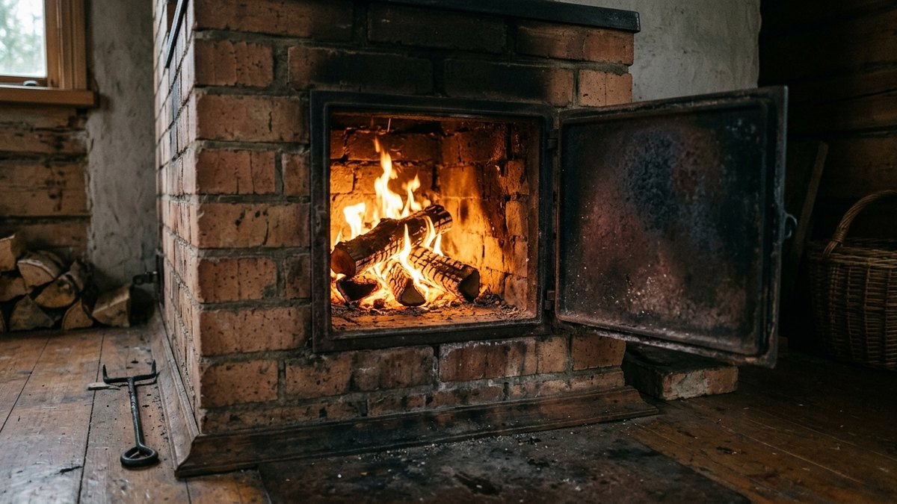
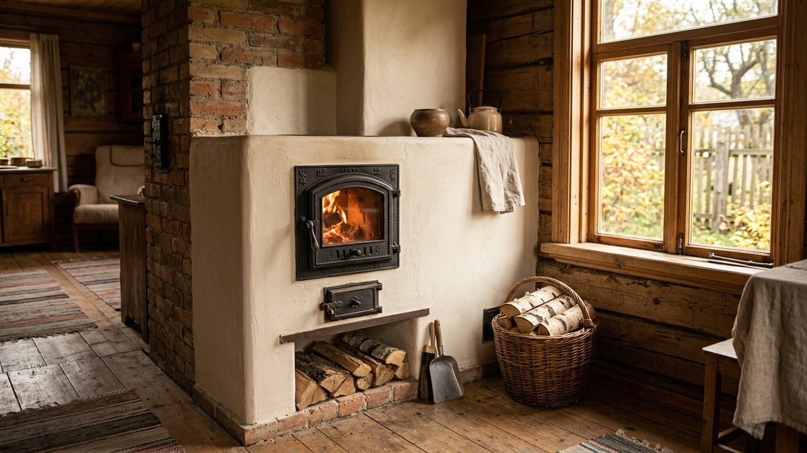

Печь, которая простояла нетопленой всё лето, редко готова к сезону без
осмотра: за несколько месяцев простоя дверца топки может перекоситься,
в кладке появляются трещины от сезонных подвижек дома, а дымоход забивается
сажей и гнёздами птиц. Топить неисправную печь опасно — угарный газ и риск
возгорания сажи в дымоходе не те вещи, с которыми стоит затягивать до
первого дыма в комнате. Разбираем три самых частых вида ремонта печи на
даче: замену дверцы, чистку дымохода и заделку трещин в кладке.

## Как понять, что печь нуждается в ремонте

Прежде чем топить после долгого простоя, стоит проверить три признака:

- **Дым идёт в помещение при растопке**, а не только из трубы — верный
  признак засора дымохода или проблем с тягой.
- **На кладке видны трещины**, особенно вокруг дверцы топки и на переходе
  между печью и дымоходом — через них угарный газ может просачиваться в
  комнату, даже если снаружи это незаметно.
- **Дверца топки неплотно закрывается** или разболталась на петлях — при
  топке в комнату поступает лишний воздух, из-за чего дрова горят
  неравномерно, а через щели может выбиваться дым.

Любой из этих признаков — повод отремонтировать печь до начала
отопительного сезона, а не после первой растопки.

## Замена дверцы топки

Дверца — расходная часть печи: металл со временем деформируется от
постоянных перепадов температуры, петли разбалтываются, а асбестовый шнур
уплотнителя истирается и перестаёт держать плотное прилегание.

1. **Демонтировать старую дверцу.** Разобрать кладку вокруг рамки дверцы
   аккуратно, не повредив соседние кирпичи — обычно рамка держится на
   растворе и стальных лапках, вмурованных в кладку.
2. **Очистить посадочное место** от старого раствора и остатков
   уплотнителя.
3. **Подобрать новую дверцу по размеру старой рамки** — стандартные
   размеры топочных дверц унифицированы, но перед покупкой стоит
   обязательно замерить проём.
4. **Установить новый шнуровой уплотнитель** на раму дверцы — без него
   дверца будет пропускать воздух даже при плотном закрытии на защёлку.
5. **Закрепить рамку на жаростойкий раствор**, лапки утопить в свежий шов
   кладки, дать раствору набрать прочность минимум сутки перед растопкой.

Если помимо дверцы предстоит перекладка части топки или замена колосников
целиком, конструкция и материал печи имеют значение — устройство печи на
примере банной разобрано в статье
[печь для бани из металла](https://mir-doma.pro/pech-dlya-bani-iz-metalla/):
принципы кладки и работы с жаростойкими материалами там применимы и к
печи дачного дома.

## Чистка дымохода

Дымоход забивается сажей неравномерно: узкие участки и повороты канала
зарастают быстрее прямых вертикальных участков. Признак, что пора
чистить, — не только плохая тяга, но и потрескивающий звук при растопке
(горящая сажа) или запах гари без видимого дыма в помещении.

1. **Осмотреть дымоход сверху**, с крыши — по возможности с фонарём,
   оценить степень засора визуально.
2. **Использовать ёршик на гибкой штанге** подходящего диаметра — плотный
   металлический или пластиковый ёршик протягивается через канал сверху
   вниз с прокруткой.
3. **Утяжелитель на тросе** — если засор плотный (смолистые отложения),
   к ёршику крепится груз, чтобы механически сбивать наросты.
4. **Проверить прочистные дверцы** в основании дымохода — именно туда
   ссыпается основная масса сбитой сажи, оттуда её убирают совком.
5. **Провести контрольную растопку** после чистки — устойчивый белый дым
   без чёрных хлопьев сажи говорит о том, что канал прочищен полностью.

Чистить дымоход стоит минимум раз в год, перед началом отопительного
сезона, а при активной топке (постоянное проживание, баня рядом) — дважды
в год.

## Заделка трещин в кладке

Мелкие трещины в штукатурке печи — обычное дело после сезонных подвижек
дома и перепадов температуры, но их нельзя игнорировать: через трещину
угарный газ попадает в жилое помещение незаметно для глаза.

1. **Расширить трещину** шпателем или узким зубилом на 3–5 мм в глубину —
   раствор не держится в волосяной трещине, нужен небольшой паз.
2. **Очистить и увлажнить** место ремонта водой из пульверизатора — сухая
   поверхность вытянет влагу из свежего раствора слишком быстро, и заплата
   растрескается повторно.
3. **Заполнить жаростойким глиняно-песчаным раствором или готовой печной
   смесью** — обычная цементная штукатурка на печи трескается от нагрева
   в первый же сезон, для контакта с горячей поверхностью нужен именно
   печной состав.
4. **Разгладить заподлицо** с окружающей поверхностью, дать просохнуть
   минимум 2–3 суток при комнатной температуре без топки печи.
5. **Протопить постепенно**, небольшим количеством дров в первые разы —
   резкий нагрев свежего раствора приводит к новым трещинам.

Если трещины возникают регулярно в одном и том же месте, причина обычно
не в самой печи, а в подвижках фундамента дома — стоит проверить состояние
основания в целом, разбор в статье
[ремонт фундамента и венцов](https://mir-doma.pro/remont-fundamenta-i-venczov/).

## Когда ремонт бессмысленен и нужна перекладка

- кладка печи сильно разрушена по всему периметру, а не в отдельных
  местах — трещины появляются заново после каждого ремонта;
- колосниковая решётка и топка прогорели насквозь, металл истончился и
  деформировался;
- печь заваливается или отходит от стены — признак проблем с
  фундаментом печи, а не с самой кладкой;
- дымоход имеет разрушения по всей высоте, а не локальный засор или
  трещину в одном сечении.

В этих случаях латание кладки — трата времени и материала, печь придётся
разбирать и класть заново с новым фундаментом под неё. Заодно стоит
проверить остальной дом на похожие сезонные повреждения — трещины в печи
нередко идут рука об руку со щелями в срубе или каркасе, разбор их
заделки — в статье
[чем заделать щели в деревянном доме](https://mir-doma.pro/chem-zadelat-shcheli-v-derevyannom-dome/).

## Частые ошибки

- **Использование обычного цементного раствора вместо печного.**
  Цементная смесь не выдерживает циклов нагрева и трескается уже после
  нескольких протопок.
- **Растопка сразу после ремонта без просушки.** Свежий раствор должен
  набрать прочность минимум 2–3 суток, иначе заплата растрескается от
  первого же нагрева.
- **Игнорирование трещин вокруг дверцы под предлогом «печь же топится».**
  Именно через такие трещины чаще всего просачивается угарный газ.
- **Чистка дымохода жёсткой металлической щёткой без учёта материала
  трубы.** На кирпичном дымоходе агрессивная чистка может повредить
  внутреннюю облицовку швов.
- **Откладывание ремонта до первого дыма в комнате.** Трещины и засоры
  дымохода не появляются одномоментно — регулярный осмотр перед сезоном
  дешевле экстренного ремонта посреди зимы.

## Частые вопросы

### Как часто нужно чистить дымоход на даче

Минимум раз в год, перед началом отопительного сезона. При интенсивной
топке (постоянное проживание, регулярная баня) — дважды в год, осенью и
в середине зимы.

### Чем заделать трещину в печи

Жаростойким глиняно-песчаным раствором или готовой печной смесью на
основе шамотной глины. Обычный цементный раствор для контакта с горячей
поверхностью печи не подходит — трескается от нагрева.

### Можно ли топить печь с трещиной в кладке

Не рекомендуется. Даже небольшая трещина, особенно рядом с дверцей
топки или на переходе к дымоходу, может пропускать угарный газ в
помещение незаметно для находящихся в доме людей.

### Как понять, что дымоход забился

По ухудшению тяги, задымлению помещения при растопке, потрескивающему
звуку возгорания сажи внутри канала или устойчивому запаху гари без
видимого источника дыма в комнате.

### Сколько служит дверца печи до замены

В среднем 8–15 лет при регулярной эксплуатации — точный срок зависит от
качества металла, частоты топки и резких перепадов температуры. Первым
обычно изнашивается уплотнитель, а не сама рамка дверцы.
