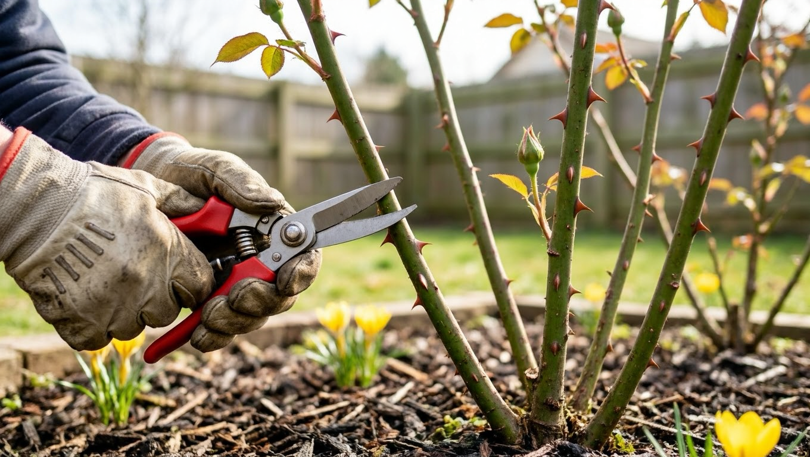
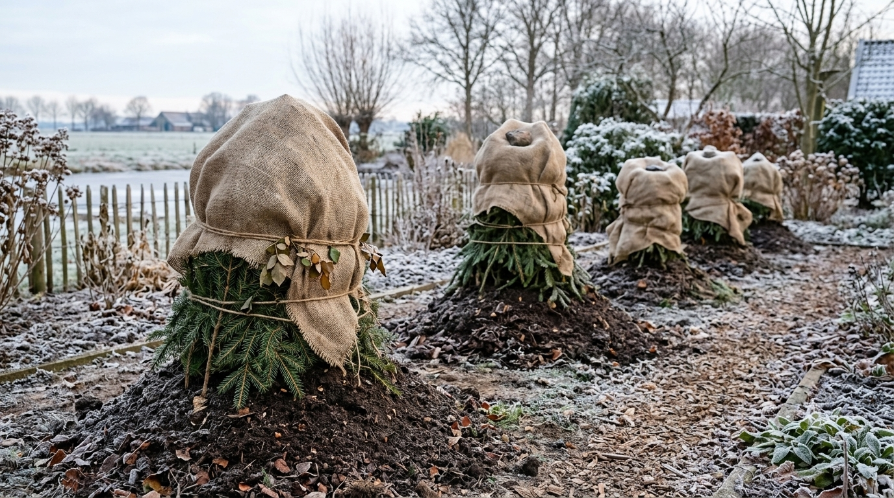

Розу заслуженно называют королевой сада — и при этом она вовсе не так капризна, как кажется новичкам. Если правильно выбрать саженец, посадить его в удачном месте и освоить несколько простых правил ухода, роза будет пышно цвести год за годом. В этой статье собрали всё главное о посадке и уходе за розами для начинающих: как выбрать саженцы, где и когда сажать, как поливать, подкармливать, обрезать и укрывать розы на зиму.

## 🌹 Виды и группы роз

Прежде чем покупать розу, полезно понимать, какие они бывают — от группы зависит и уход, и место в саду:

- **Чайно-гибридные** — классические розы на длинном стебле, эталон срезки. Красивы, но требовательны к уходу и укрытию.
- **Флорибунда** — обильно и долго цветут кистями, выносливее чайно-гибридных, хороши для клумб.
- **Плетистые** — длинные побеги для арок, пергол и стен.
- **Почвопокровные** — низкие раскидистые кусты, неприхотливые, закрывают землю ковром.
- **Парковые (кустарниковые)** — самые зимостойкие и неприхотливые, часто зимуют без укрытия.

Начинающим проще всего с флорибунды, почвопокровных и парковых роз — они прощают ошибки.

## 🛒 Как выбрать саженцы роз

От качества саженца зависит половина успеха. Саженцы бывают двух типов:

- **С открытой корневой системой (ОКС)** — продаются без земли, дешевле. Сажают только весной или осенью, корни должны быть живыми, не пересушенными.
- **С закрытой корневой системой (ЗКС)** — в контейнере с землёй. Дороже, но приживаются лучше и сажать их можно почти весь сезон.

Хороший саженец имеет 2–3 крепких зелёных побега, здоровую кору без пятен и морщин, развитые корни и место прививки без повреждений. Вялые, подсохшие или уже проросшие в магазине бледными побегами саженцы лучше не брать.

## 📍 Где посадить розы

Розы любят солнце и не любят сквозняков. Идеальное место:

- **Освещённое** — минимум 5–6 часов солнца в день; в глубокой тени роза вытягивается и почти не цветёт.
- **Защищённое от холодного ветра**, но проветриваемое — застой сырого воздуха провоцирует болезни.
- **С хорошим дренажом** — розы не выносят застоя воды у корней; в низинах и на тяжёлой глине корни загнивают.

Почва предпочтительна рыхлая, плодородная, слабокислая. Тяжёлую глину улучшают песком и компостом, песчаную — перегноем.

## 🌱 Посадка роз: когда и как

**Сроки.** Розы сажают весной (после того как минует угроза сильных заморозков) или осенью (за месяц до устойчивых холодов, чтобы куст успел укорениться). Саженцы в контейнерах можно высаживать в течение всего сезона.

**Пошагово:**

1. Выкопать яму 50×50 см, на дно уложить дренаж и слой перегноя с почвой.
2. У саженца с ОКС подрезать слишком длинные корни, замочить их в воде на несколько часов.
3. Установить куст так, чтобы **место прививки было заглублено на 3–5 см** ниже уровня почвы — это защищает его зимой и стимулирует рост побегов.
4. Расправить корни, засыпать землёй, уплотнить.
5. Обильно полить и окучить основание на первое время.

## 💧 Полив

Розы поливают редко, но обильно — глубокий полив под корень раз в несколько дней лучше частого поверхностного. В жару частоту увеличивают, но следят, чтобы вода не застаивалась. Поливают утром или вечером, под корень, стараясь не мочить листья (мокрая листва в жару и вечером — путь к болезням). Мульча в приствольном круге удерживает влагу и бережёт корни от перегрева.

## 🍽️ Подкормки

Чтобы роза обильно цвела, её кормят несколько раз за сезон:

- **Весной** — азот для роста побегов и листвы.
- **Летом, перед цветением и после первой волны** — фосфор и калий для бутонов и повторного цветения.
- **Осенью** — только фосфор и калий, без азота, чтобы куст подготовился к зиме.

Розы отзывчивы на органику (перегной, настои) и комплексные удобрения с микроэлементами. Общие принципы питания растений разбирали в статье про [летние подкормки](https://mir-doma.pro/letnie-podkormki-ovoshchey/).

## ✂️ Обрезка роз

Обрезка держит куст здоровым и обильно цветущим. Основные виды:

- **Весенняя** — главная: удаляют подмёрзшие, сухие и слабые побеги, формируют куст. Срез делают над внешней почкой.
- **Санитарная летом** — убирают отцветшие бутоны (это продлевает цветение) и больные ветви.
- **Осенняя** — лёгкая, перед укрытием: укорачивают длинные побеги и убирают невызревшие.

Глубина весенней обрезки зависит от группы: чайно-гибридные и флорибунду обрезают сильнее, плетистые и парковые — щадяще. Инструмент должен быть острым и чистым.

## 🦠 Болезни и вредители

Даже за здоровой розой нужен присмотр. Самые частые проблемы:

- **Чёрная пятнистость** — тёмные пятна на листьях, вокруг них лист желтеет и опадает.
- **Мучнистая роса** — белый налёт, деформация листьев.
- **Тля** — облепляет бутоны и молодые побеги; как с ней справиться, подробно в статье [как избавиться от тли](https://mir-doma.pro/kak-izbavitsya-ot-tli/).
- **Паутинный клещ** — в жару даёт паутину и мелкие точки на листьях.

Первый сигнал неблагополучия — пожелтение и опадение листвы. Почему это происходит и что делать по каждой причине, разобрали отдельно: [почему желтеют листья у роз](https://mir-doma.pro/zhelteyut-listya-u-roz/). Больные листья обрывают, куст обрабатывают фунгицидами и инсектицидами, а осенью убирают опавшую листву, в которой зимует инфекция.

## ❄️ Укрытие роз на зиму

Большинству садовых роз (кроме самых зимостойких парковых) в средней полосе нужно укрытие. Осенью, после лёгких морозов, побеги укорачивают, окучивают основание куста и укрывают лапником, лутрасилом или устраивают воздушно-сухое укрытие. Спешить нельзя: под преждевременным укрытием в тепло роза выпревает. Укрывают только после установления устойчивых лёгких морозов. Как подготовить кусты, чем укрывать разные виды роз и когда снимать укрытие весной — подробно в статье про [укрытие роз на зиму](https://mir-doma.pro/ukrytie-roz-na-zimu/).

## 🌸 Секреты обильного цветения

Чтобы роза цвела пышно и долго, а не отдавала пару бутонов за лето, помогают несколько простых приёмов:

- **Удаляйте отцветшие цветки.** Куст перестаёт тратить силы на семена и закладывает новые бутоны — это заметно продлевает и усиливает цветение.
- **Не перекармливайте азотом.** Избыток азота гонит листву в ущерб бутонам: роза «жирует» и почти не цветёт. После весны переходят на фосфор и калий.
- **Не жалейте солнца.** В тени цветение всегда скудное — розе нужно минимум 5–6 часов прямого света.
- **Соблюдайте правильное заглубление прививки.** Слишком глубокая или, наоборот, оголённая прививка ослабляет куст и снижает цветение.
- **Вовремя обрезайте.** Загущённый, не обрезанный куст хуже проветривается, болеет и цветёт слабее.

Регулярный, но несложный уход куда важнее для цветения, чем дорогие удобрения. Здоровая, правильно посаженная роза цветёт обильно сама.

## 🗓️ Календарь ухода за розами

Коротко по сезонам:

- **Весна:** снять укрытие, обрезка, первая азотная подкормка, обработка от болезней.
- **Лето:** полив, подкормки фосфором и калием, удаление отцветших бутонов, контроль вредителей.
- **Осень:** фосфорно-калийная подкормка, лёгкая обрезка, уборка листвы, укрытие после морозов.

## ❓ Частые вопросы

**Когда сажать розы?**
Весной после сильных заморозков или осенью за месяц до устойчивых холодов. Розы в контейнерах (ЗКС) можно высаживать в течение всего сезона.

**Как ухаживать за розами для начинающих?**
Базовый минимум: солнечное место, редкий но глубокий полив под корень, подкормки по сезону, весенняя обрезка и укрытие на зиму. Начинать проще с неприхотливых групп — флорибунды и парковых роз.

**Нужно ли обрезать розы?**
Да. Главная — весенняя обрезка: убирают сухие и слабые побеги и формируют куст. Летом удаляют отцветшие бутоны, осенью слегка укорачивают перед укрытием.

**Чем подкормить розы для обильного цветения?**
Весной — азотом для роста, летом перед цветением — фосфором и калием, осенью — снова фосфором и калием без азота. Полезны органика и комплексные удобрения с микроэлементами.

**Как укрыть розы на зиму?**
После лёгких морозов окучить основание, укоротить побеги и укрыть лапником или укрывным материалом. Главное — не укрывать раньше времени, чтобы куст не выпрел.

**Почему роза не цветёт?**
Частые причины — мало солнца, избыток азота (жирует в листву), отсутствие обрезки или слишком глубокая либо мелкая посадка. Проверьте место, режим подкормок и заглубление прививки.

---

Розы не требуют сверхусилий — им нужны солнце, правильная посадка и несложный сезонный уход. Освойте базу из этой статьи, и королева сада отблагодарит вас обильным цветением. А чтобы клумба радовала всё лето, дополните розы [неприхотливыми многолетниками](https://mir-doma.pro/mnogoletnie-tsvety-dlya-dachi/).
