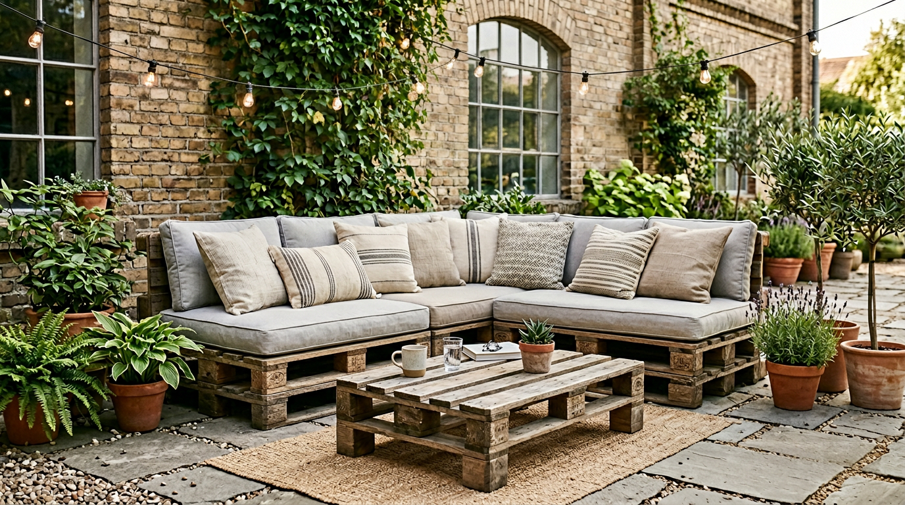
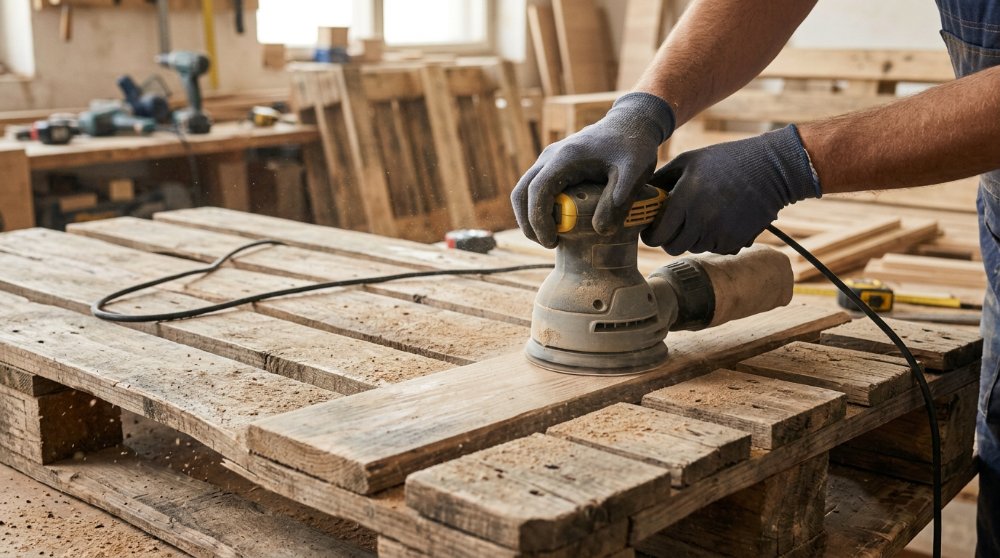
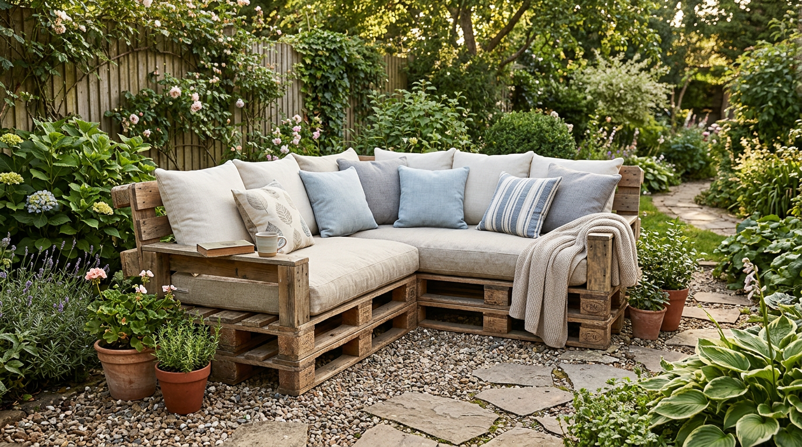
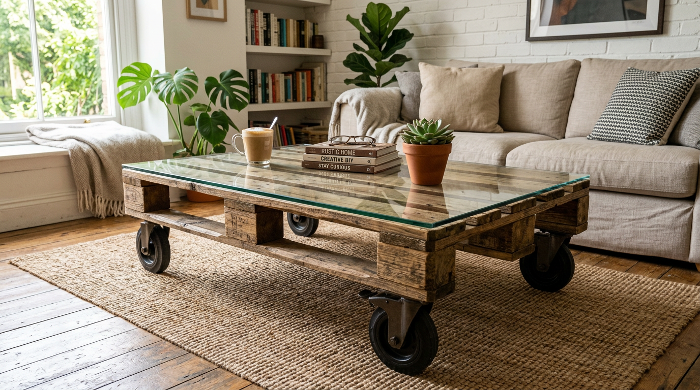
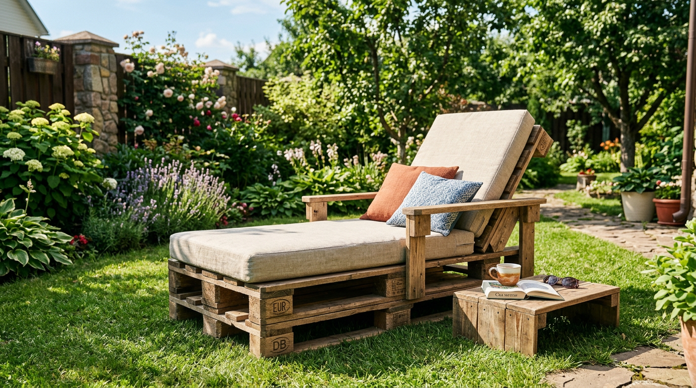
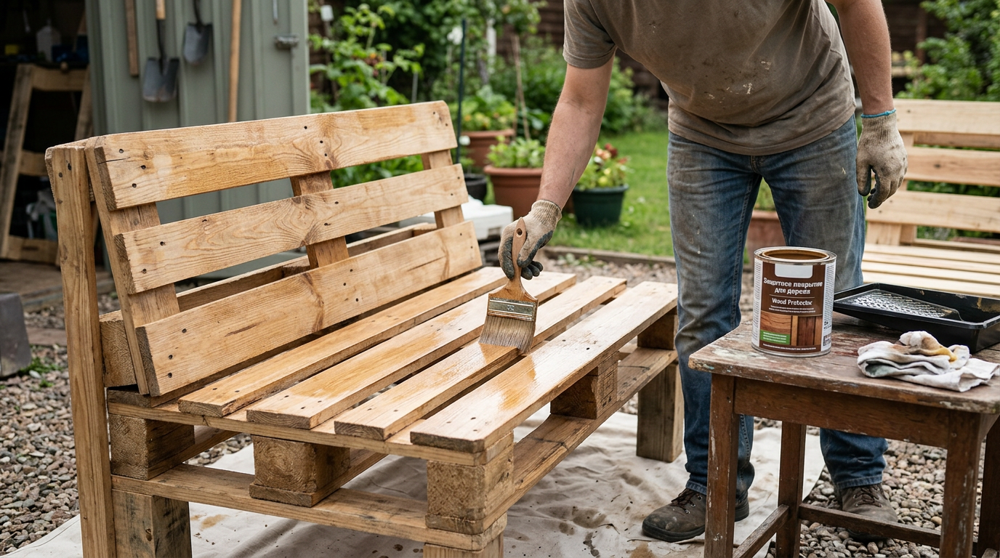

Мебель из деревянных поддонов — модный, бюджетный и невероятно практичный способ обустроить зону отдыха на даче. Из обычных паллет, которые часто отдают почти даром, получаются стильные диваны, столики, кресла и лежаки в популярном стиле лофт. А главное — сделать такую мебель можно своими руками, даже без серьёзных столярных навыков. В этой статье собрали идеи садовой мебели из поддонов, расскажем, как выбрать и подготовить паллеты, как сделать диван пошагово и как защитить мебель от влаги, чтобы она прослужила долго.

## 🪵 Чем хороши поддоны как материал

Поддоны (паллеты) стали популярны у дачников не случайно. У них масса достоинств:

- **Дёшево, а часто и бесплатно** — поддоны нередко отдают даром магазины и склады.
- **Готовая форма** — паллета уже представляет собой прочный модуль, из которого легко собрать мебель.
- **Прочность** — поддоны рассчитаны на большой вес, поэтому мебель из них надёжная.
- **Модный вид** — натуральное дерево отлично вписывается в стиль лофт, рустик и эко.
- **Простота сборки** — для большинства предметов хватает шуруповёрта и минимума инструментов.

Из поддонов получается мебель и для сада, и для дома, и для балкона — от диванов до журнальных столиков. Вдобавок это экологично: вы даёте вторую жизнь материалу, который иначе отправился бы на свалку. Неудивительно, что мебель из паллет так популярна в эко- и лофт-интерьерах.

## 🔍 Какие поддоны выбрать

Не все поддоны одинаково годятся для мебели, особенно если она будет в доме или контактировать с людьми.

- **Целые и сухие** — без трещин, плесени, гнили и масляных пятен.
- **Безопасная обработка.** На поддонах есть клеймо: ищите маркировку **HT** (термообработка — безопасно) и избегайте **MB** (обработка бромистым метилом — это токсичное вещество). Европоддоны с клеймом EPAL/EUR проходят термообработку и подходят.
- **Стандартного размера.** Европаллеты (1200×800 мм) удобны и прочны, найти их проще всего.

Лучше взять несколько одинаковых поддонов — так мебель получится аккуратной и ровной.

## 🧰 Подготовка поддонов

От качества подготовки зависит и вид, и долговечность мебели. Этот этап пропускать нельзя.

1. **Очистите** поддоны от грязи и пыли, при необходимости вымойте и просушите.
2. **Отшлифуйте** все поверхности — шлифмашинкой или наждачной бумагой. Это убирает занозы и заусенцы и делает дерево гладким. Шаг обязательный, особенно если на мебели будут сидеть.
3. **Обработайте антисептиком** (пропиткой для дерева) — он защищает от влаги, гнили и насекомых. Для уличной мебели это критично.
4. **При желании загрунтуйте** перед покраской для лучшего сцепления.

После подготовки поддоны готовы к сборке и покраске.

## 🧰 Что понадобится для работы

Большой плюс мебели из поддонов в том, что для неё не нужен профессиональный инструмент. Базовый набор такой:

- **Инструменты:** шуруповёрт, шлифмашинка (или наждачная бумага), пила или ножовка, рулетка, угольник, кисть или валик для покраски. Для разборки поддонов пригодится гвоздодёр.
- **Материалы:** сами поддоны, саморезы по дереву и мебельные уголки, антисептик-пропитка, краска или масло/лак, при желании — колёсики, петли, поролон и ткань для подушек.

Этого комплекта достаточно для большинства предметов. А если планируете много мебели, шлифмашинку и шуруповёрт стоит взять помощнее или напрокат.

## 💡 Идеи мебели из поддонов

Из паллет можно сделать почти любую мебель. Вот самые популярные и удачные идеи.

### Диван и угловой диван

Самый востребованный предмет. Сиденье собирают из двух поддонов, поставленных друг на друга, спинку — из третьего, закреплённого вертикально. Сверху кладут матрас или подушки. Из нескольких паллет легко собрать вместительный угловой диван для всей компании.

### Столы и столики

Из одного-двух поддонов выходит отличный журнальный столик — особенно если приделать колёсики и положить сверху столешницу или стекло. Из паллет повыше делают обеденные и садовые столы, а узкие — превращают в барную стойку.

### Кресла и лежаки

По тому же принципу, что и диван, из поддонов делают кресла, шезлонги и лежаки для загара. Достаточно добавить мягкие подушки — и получается удобное место для отдыха в саду.

### Полки, стеллажи и кашпо

Поддон, закреплённый на стене, сам по себе становится полкой или стеллажом — в его «карманах» удобно хранить мелочи, инструмент или расставлять цветы. А ещё из паллет делают вертикальные грядки и кашпо для зелени и цветов — отличное решение для маленького участка, где каждый метр на счету. В такой вертикальной конструкции удобно выращивать клубнику, зелень и цветы, а смотрится она очень декоративно.

### Кровати и системы хранения

В дачном домике из поддонов собирают каркас кровати: он получается прочным, с естественной вентиляцией под матрасом, а в нишах можно хранить вещи. Под колёсиками такая кровать легко передвигается. Из поддонов делают и системы хранения — стеллажи в сарае, обувницы, подставки под инструмент: дерево прочное и выдерживает серьёзную нагрузку.

## 🛠️ Как сделать диван из поддонов: пошагово

Разберём сборку простого садового дивана — самого популярного предмета:

1. **Подготовьте 3 поддона** — отшлифуйте и обработайте антисептиком.
2. **Соберите основание сиденья.** Поставьте два поддона друг на друга и скрепите их между собой саморезами или мебельными уголками для жёсткости.
3. **Закрепите спинку.** Третий поддон установите вертикально с задней стороны и надёжно прикрутите к основанию уголками.
4. **Добавьте колёсики или ножки** при желании — на колёсиках диван удобно передвигать и закатывать под навес. Чтобы он не царапал пол или террасу, на ножки наклеивают мягкие накладки.
5. **Покрасьте или покройте** дерево защитным составом и дайте высохнуть.
6. **Положите подушки или матрас** — и диван готов.

Готовый диван можно дополнить подлокотниками из досок и подушками в тон, чтобы зона отдыха выглядела законченной и уютной.

## 🎨 Отделка и уход

Чтобы мебель из поддонов служила долго и красиво выглядела, важно правильно её отделать:

- **Покрытие.** Для улицы используйте влагостойкие составы — масло для дерева, яхтный лак или фасадную краску. Они защищают от дождя и солнца. Внутри можно ограничиться лаком или морилкой.
- **Цвет.** Натуральное дерево подчёркивают маслом или морилкой, а яркая краска оживляет зону отдыха. Популярны белый, серый, синий и природные оттенки.
- **Текстиль.** Подушки и матрасы для уличной мебели лучше брать из влагостойких тканей или со съёмными чехлами, которые легко стирать. Под размеры поддона (120×80 см) подушки подбирают готовые или шьют сами — это заметно дешевле.
- **Уход.** Раз в сезон обновляйте защитное покрытие, на зиму уличную мебель и подушки убирайте под навес или в помещение.

Аккуратная мебель из поддонов отлично смотрится рядом с [беседкой](https://mir-doma.pro/besedka-svoimi-rukami/) и [садовыми дорожками](https://mir-doma.pro/sadovye-dorozhki-svoimi-rukami/) — вместе они создают единую уютную зону отдыха на участке.

## 🛡️ Частые ошибки и советы

Чтобы мебель получилась удобной и долговечной, учтите типичные ошибки:

- **Пропуск шлифовки.** Необработанные поддоны — это занозы и неопрятный вид. Шлифуйте обязательно.
- **Сырые или химически обработанные поддоны.** Влажное дерево поведёт, а паллеты с маркировкой MB опасны. Берите сухие поддоны с клеймом HT.
- **Нет защиты от влаги.** Без пропитки и покрытия уличная мебель быстро сереет и гниёт.
- **Слабое крепление.** Поддоны нужно надёжно скреплять между собой саморезами и уголками, иначе мебель расшатается.
- **Неудобная высота.** Продумайте высоту сиденья заранее, чтобы диваном и креслами было комфортно пользоваться.

## ❓ Частые вопросы

### Безопасно ли делать мебель из поддонов?

Да, если выбрать правильные поддоны. Ищите клеймо HT (термообработка) и избегайте маркировки MB (обработка бромистым метилом — токсично). Поддоны нужно очистить, отшлифовать и обработать защитной пропиткой — тогда мебель полностью безопасна.

### Какие поддоны лучше — европоддоны или обычные?

Европоддоны (с клеймом EPAL/EUR) прочнее, ровнее и проходят термообработку, поэтому для мебели они предпочтительнее. Обычные поддоны тоже подойдут, если они целые, сухие и с безопасной маркировкой HT, но качество у них бывает разным.

### Где взять поддоны для мебели?

Поддоны часто бесплатно или недорого отдают магазины, склады, строительные базы и точки продажи стройматериалов — для них это тара. Также их продают на досках объявлений. Выбирайте целые сухие паллеты без плесени и пятен.

### Нужно ли разбирать поддоны?

Не обязательно. Многие предметы (диваны, столики, кровати) собирают из целых поддонов — это проще и быстрее. Разбирают паллеты на доски, когда нужен другой формат или более тонкая мебель, но это трудоёмко из-за ершёных гвоздей.

### Чем покрасить мебель из поддонов для улицы?

Для уличной мебели подходят влагостойкие покрытия: масло для дерева, яхтный лак или фасадная краска. Они защищают дерево от дождя и ультрафиолета. Перед покраской поддоны шлифуют и обрабатывают антисептиком.

### Сколько поддонов нужно для дивана?

Для простого садового дивана обычно достаточно трёх поддонов: два на сиденье (друг на друга) и один на спинку. Для углового или большого дивана берут больше — по числу секций. Точное количество зависит от желаемого размера.

### Сколько служит мебель из поддонов?

При правильной подготовке и уходе уличная мебель из поддонов служит несколько лет, а домашняя — намного дольше. Срок зависит от защиты от влаги: если регулярно обновлять покрытие и убирать мебель на зиму под навес, она прослужит долго.

### Можно ли сделать мебель из поддонов без опыта?

Да, это один из самых доступных видов самодельной мебели. Поддон уже готовый прочный модуль, поэтому собрать диван или столик можно даже без столярных навыков — достаточно отшлифовать, скрепить саморезами и покрасить. Это отличный первый проект для новичка.

### Как защитить мебель из поддонов от влаги?

Обработайте дерево антисептиком, а сверху нанесите влагостойкое покрытие — масло, лак или краску для наружных работ. Обновляйте покрытие раз в сезон, а на зиму убирайте мебель под навес или в помещение, чтобы продлить срок службы.

## Заключение

Садовая мебель из поддонов — это простой способ недорого и стильно обустроить зону отдыха своими руками. Из доступных паллет получаются диваны, столики, кресла, полки и даже кровати в модном стиле лофт. Главное — выбрать безопасные сухие поддоны с клеймом HT, тщательно их отшлифовать, обработать от влаги и надёжно скрепить. Добавьте мягкие подушки и защитное покрытие — и удобная, красивая мебель прослужит вам не один сезон, а зона отдыха на даче станет любимым местом всей семьи. Начните с простого — журнального столика или одного кресла, — и, освоив принцип, вы легко соберёте целый комплект мебели для сада в едином стиле.

А вы делали мебель из поддонов? Делитесь идеями и фото в комментариях и подписывайтесь, чтобы не пропустить новые статьи об обустройстве дачи и дома.
