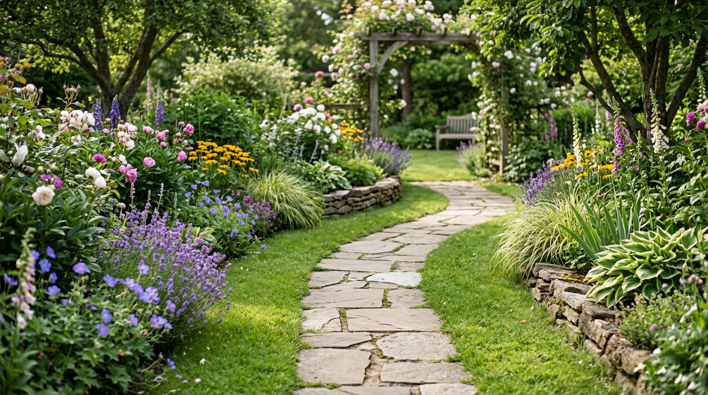
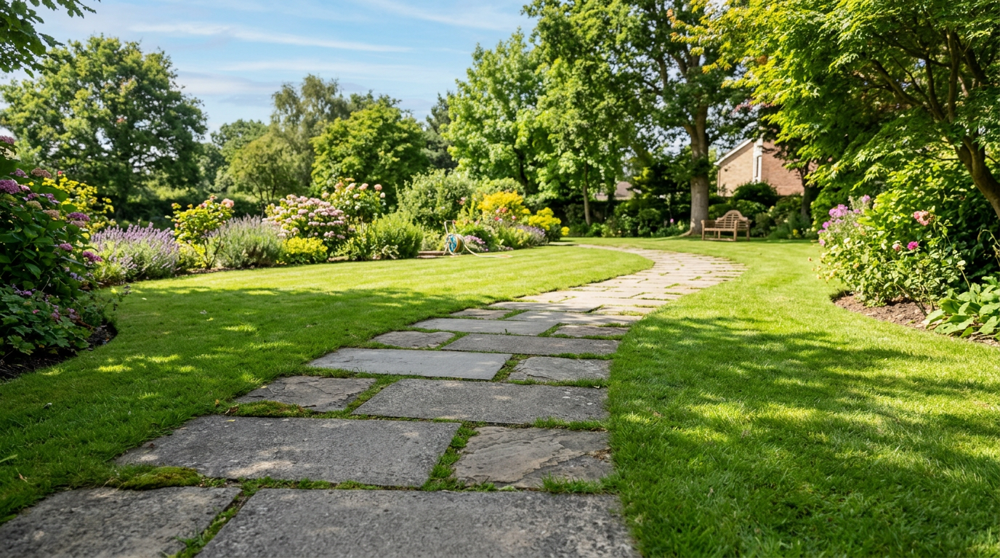
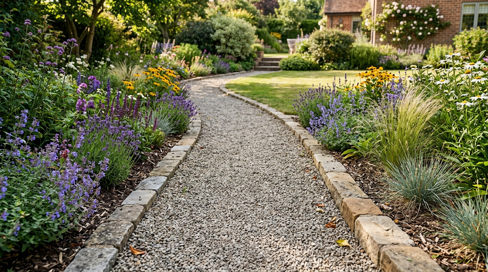
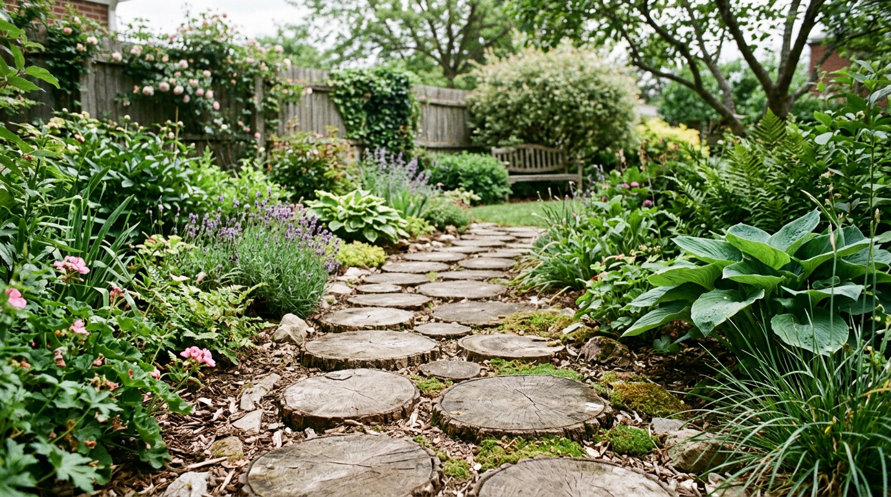
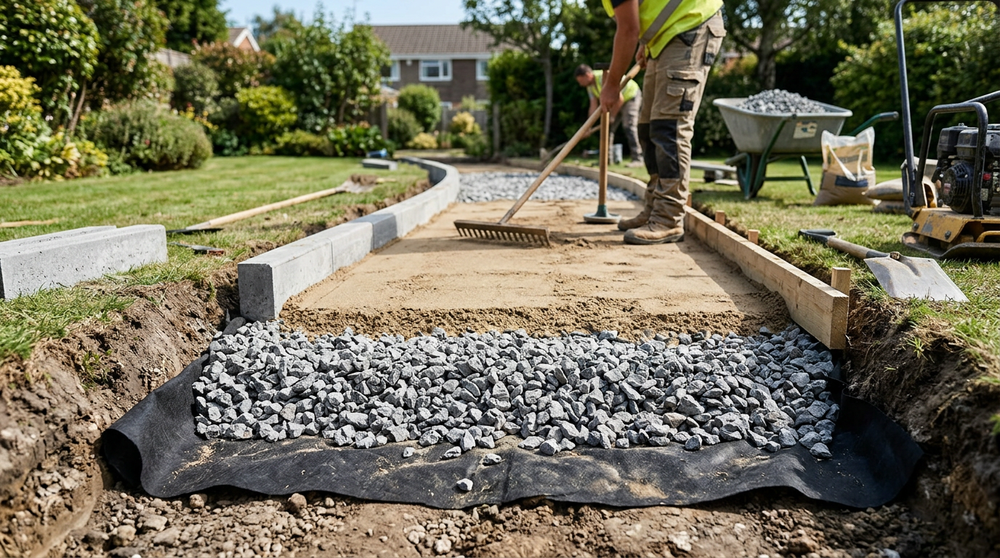
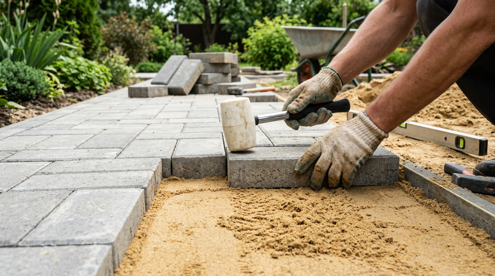

Удобные садовые дорожки — это не только красота, но и порядок на участке: по ним сухо пройти после дождя, не растаптывая грязь, легко прокатить тачку и приятно гулять по саду. И сделать их своими руками вполне реально — от простой насыпной тропинки за пару часов до аккуратной мощёной дорожки на годы. В этой статье разберём, из чего можно сделать садовые дорожки, как подготовить надёжное основание, как уложить плитку пошагово и какие бюджетные варианты бывают, а также каких ошибок избегать.

## 🛤️ С чего начать: планировка и разметка

Прежде чем браться за материалы, дорожки нужно спланировать. От этого зависит, будут ли они удобными.

- **Наметьте маршруты.** Дорожки прокладывают там, где вы реально ходите: от калитки к дому, к беседке, грядкам, бане. Понаблюдайте, где уже протоптаны тропинки, — это лучшая подсказка.
- **Выберите ширину.** Главные дорожки делают шириной 60–80 см (чтобы разойтись и прокатить тачку), второстепенные — 40–50 см.
- **Определите форму.** Прямые дорожки строже и экономнее, плавно изогнутые выглядят естественнее и интереснее.
- **Предусмотрите уклон.** Небольшой поперечный уклон (1–2 см на метр) нужен, чтобы вода стекала и не застаивалась лужами.

Разметьте будущие дорожки колышками и шнуром прямо на местности, пройдитесь по маршруту — так вы заранее поймёте, удобно ли получается. На этом же этапе прикиньте количество материала: измерьте общую длину и ширину дорожек, чтобы рассчитать, сколько понадобится плитки, щебня или бетона, и не покупать лишнего.

## 🧱 Из чего сделать садовые дорожки

Материалов для дорожек много, и у каждого свои плюсы. Выбор зависит от бюджета, нагрузки и стиля участка.

### Тротуарная плитка и брусчатка

Самый популярный вариант: прочно, аккуратно, большой выбор форм и цветов. Плитку укладывают на песчано-щебёночное основание, она служит десятилетиями и ремонтопригодна — отдельную плитку легко заменить. Минус — потребуется аккуратность при укладке и затраты на материал. Плитка бывает разной толщины: для пешеходных дорожек достаточно 4–5 см, а если по дорожке будет заезжать техника, берут толще — от 6 см. Форма и фактура — на любой вкус, от классической брусчатки до плит с имитацией камня.

### Бетон

Бетонные дорожки заливают в опалубку или используют специальные пластиковые формы, имитирующие камень или плитку. Это дешевле плитки и очень долговечно, но трудоёмко и не прощает ошибок: застывший бетон уже не переделать. Зато такая дорожка монолитна и выдерживает большие нагрузки. Чтобы бетон не растрескался, в него закладывают армирующую сетку и делают температурные швы, а свежую заливку первые дни проливают водой, чтобы она набирала прочность равномерно.

### Щебень и гравий

Самый быстрый и бюджетный вариант: отсыпать дорожку щебнем или гравием по геотекстилю с бордюрами. Делается за пару часов, выглядит естественно. Минусы — щебень рассыпается за края, по нему тяжелее катить тачку, и со временем приходится подсыпать. Идеальна для второстепенных тропинок. Чтобы щебень меньше расползался и не тонул в земле, под него обязательно стелют геотекстиль и ставят бордюр повыше. Для ходьбы приятнее мелкая фракция (5–20 мм), а крупный щебень используют как дренажный нижний слой.

### Дерево и спилы

Дорожки из деревянных спилов или досок смотрятся уютно и натурально, особенно в саду в природном стиле. Но дерево недолговечно: оно гниёт от влаги, поэтому его обязательно обрабатывают антисептиком и укладывают на дренажную подушку. Срок службы — несколько лет, после чего элементы меняют.

### Натуральный камень и кирпич

Природный камень (плитняк) и клинкерный кирпич — красивые и очень долговечные материалы. Камень выглядит благородно и служит вечно, но стоит дорого и требует навыка укладки. Кирпич даёт аккуратный «классический» рисунок. Важно брать именно клинкерный (тротуарный) кирпич, а не обычный строительный: последний быстро разрушается от влаги и мороза. Натуральный плитняк укладывают как на бетон, так и на песчаную подушку, подбирая плоские камни по толщине.

Чтобы выбрать материал, удобно сравнить их по основным параметрам:

| Материал | Цена | Долговечность | Сложность укладки |
|----------|------|---------------|-------------------|
| Тротуарная плитка | Средняя | 20+ лет | Средняя |
| Бетон | Низкая | 20+ лет | Высокая |
| Щебень, гравий | Низкая | 5–10 лет | Низкая |
| Дерево, спилы | Низкая | 3–7 лет | Низкая |
| Натуральный камень | Высокая | Десятилетия | Высокая |

## 🧰 Что понадобится для работы

Набор зависит от выбранного материала, но базовый комплект для большинства дорожек такой:

- **Инструменты:** лопата, тачка, трамбовка (ручная или виброплита), уровень, правило, резиновый молоток, шнур и колышки для разметки, мастерок.
- **Материалы:** геотекстиль, щебень и песок для подушки, бордюры, само покрытие (плитка, камень, бетон или щебень), а для плитки — песок или гарцовка для швов.

Виброплита сильно облегчает и ускоряет трамбовку, поэтому для большой площади её стоит взять напрокат. Для короткой тропинки хватит и ручной трамбовки.

## 📐 Подготовка основания

Главный секрет долговечной дорожки — правильное основание. Именно из-за его отсутствия дорожки проседают и перекашиваются. Основание готовят почти одинаково для плитки, камня и бетона.

1. **Снимите грунт** по разметке на глубину 20–30 см (под насыпные дорожки достаточно 15–20 см).
2. **Уложите геотекстиль** на дно траншеи — он не даёт подушке смешиваться с грунтом и сдерживает сорняки.
3. **Насыпьте щебень** слоем 10–15 см и утрамбуйте — это дренаж и несущий слой.
4. **Насыпьте песок** слоем 5–10 см, пролейте водой и снова утрамбуйте — это выравнивающий слой.
5. **Установите бордюры** по краям — они удерживают дорожку от расползания и придают аккуратный вид.

Не забывайте про уклон для стока воды — его задают ещё на этапе основания. Хорошо подготовленная подушка с трамбовкой — это 80% успеха. Каждый слой подушки трамбуют отдельно: насыпали щебень — утрамбовали, насыпали песок — пролили и утрамбовали. Чем плотнее основание, тем меньше дорожка просядет со временем. На пучинистых глинистых грунтах подушку делают потолще, чтобы компенсировать сезонные подвижки земли.

## 🧰 Укладка тротуарной плитки пошагово

Разберём самый востребованный вариант — мощение плиткой по готовому основанию:

1. **Натяните шнур-ориентир** по уровню с нужным уклоном — по нему вы будете выравнивать плитку.
2. **Уложите выравнивающий слой.** На утрамбованный песок насыпают тонкий слой песка или сухой гарцовки (смесь песка и цемента) и разравнивают правилом.
3. **Укладывайте плитку** от края, плотно подгоняя элементы друг к другу с небольшим зазором. Каждую плитку осаживают резиновым молотком, проверяя уровень.
4. **Контролируйте плоскость** уровнем или правилом — дорожка должна быть ровной, с заданным уклоном, без перепадов.
5. **Заполните швы.** Готовую дорожку засыпают песком или гарцовкой и сметают щёткой, заполняя зазоры между плитками.
6. **Пролейте водой.** Если использовали гарцовку, дорожку проливают водой — цемент в швах схватывается и фиксирует плитку.

После этого дорожке дают постоять, при необходимости подсыпают швы — и она готова служить долгие годы. Первое время по свежеуложенной дорожке на гарцовке лучше ходить аккуратно, дав швам как следует схватиться. Если отдельная плитка со временем просядет, её несложно поднять, подсыпать песка и вернуть на место — в этом большой плюс мощения перед монолитным бетоном.

## 🪨 Бюджетные дорожки своими руками

Если хочется сделать дорожки быстро и недорого, есть простые варианты:

- **Насыпная из щебня или коры** — геотекстиль, бордюр и слой щебня или декоративной коры. Минимум труда.
- **Из бетона в форме** — пластиковая форма «под камень» заполняется бетоном прямо на месте, и за несколько проходов получается мощёная дорожка по цене цемента.
- **Из спилов дерева** — обрезки брёвен, обработанные антисептиком, вкапывают в дренажную подушку.
- **Из старой плитки или кирпича** — оставшиеся от стройки материалы отлично идут на тропинки.

Бюджетные дорожки экономят деньги, но и у них основание лучше не пропускать — хотя бы геотекстиль и подушку, иначе тропинка быстро зарастёт и просядет.

## 🌿 Несколько советов по дизайну

Дорожки задают характер всему участку, поэтому стоит подумать и об их виде:

- сочетайте материал дорожек с домом, [беседкой](https://mir-doma.pro/besedka-svoimi-rukami/), [теплицей](https://mir-doma.pro/teplitsa-iz-polikarbonata-svoimi-rukami/) и другими постройками, чтобы участок смотрелся единым;
- плавные изгибы выглядят естественнее прямых линий и зрительно увеличивают сад;
- вдоль дорожек красиво смотрятся бордюрные растения, низкие цветники или подсветка;
- комбинируйте материалы: например, плитку с галькой или газоном в швах;
- не делайте дорожки слишком узкими — по ним должно быть удобно ходить и возить тачку.

Красивая дорожка, ведущая к уютной зоне отдыха, сама по себе становится украшением сада.

## 🛡️ Частые ошибки

Чтобы дорожка прослужила долго, избегайте типичных промахов:

- **Укладка без основания.** Плитка или камень, положенные прямо на грунт, быстро проседают и перекашиваются.
- **Нет уклона.** На ровной дорожке без уклона после дождя стоят лужи, а зимой образуется наледь.
- **Без бордюров.** Дорожка без ограничителей расползается по краям и теряет форму.
- **Плохая трамбовка.** Неуплотнённая подушка даёт усадку, и дорожка проваливается.
- **Дерево без обработки.** Необработанные спилы и доски сгнивают за пару сезонов.
- **Слишком узкие дорожки.** По ним неудобно ходить и невозможно прокатить тачку.

## ❓ Частые вопросы

### Когда лучше делать садовые дорожки?

Удобнее всего в тёплый сухой сезон — с конца весны до начала осени, когда земля сухая и с ней легко работать. Бетонные работы не проводят в жару (бетон пересыхает) и в заморозки. Сухая нежаркая погода — идеальное время для укладки.

### Из чего дешевле всего сделать садовую дорожку?

Самый бюджетный вариант — насыпная дорожка из щебня или гравия по геотекстилю с бордюром: материалы недорогие, а сделать можно за пару часов. Ещё дешевле обходятся дорожки из бетона, залитого в многоразовую форму «под камень».

### Нужно ли основание под садовую дорожку?

Да, основание — главное условие долговечности. Без песчано-щебёночной подушки дорожка проседает, перекашивается и зарастает. Даже для бюджетных насыпных дорожек стоит постелить геотекстиль и сделать хотя бы небольшую подушку.

### Какой уклон делать у садовой дорожки?

Достаточно небольшого поперечного уклона около 1–2 см на метр ширины, чтобы вода стекала и не застаивалась. Уклон задают ещё на этапе подготовки основания.

### Можно ли укладывать плитку прямо на землю?

Не рекомендуется: на грунте без подушки плитка быстро проседает от пучения почвы, перекашивается и зарастает травой в швах. Минимально нужны утрамбованный песок и бордюр, а лучше полноценное песчано-щебёночное основание.

### Какая ширина садовой дорожки оптимальна?

Главные дорожки, по которым ходят часто и возят тачку, делают шириной 60–80 см, чтобы разойтись вдвоём. Второстепенные тропинки к грядкам или клумбам достаточно 40–50 см. Слишком узкие дорожки неудобны в использовании.

### Нужны ли бордюры для садовой дорожки?

Желательны почти всегда: бордюры удерживают покрытие от расползания, не дают краям проседать и придают дорожке аккуратный завершённый вид. Особенно важны они для насыпных дорожек из щебня и для плитки, уложенной на песок.

### Чем заполнить швы между плиткой на дорожке?

Швы засыпают песком или сухой гарцовкой (смесью песка и цемента), сметая её щёткой в зазоры. Гарцовку затем проливают водой, чтобы цемент схватился и зафиксировал плитку. Песок в швах периодически подсыпают.

### Как сделать дорожку, чтобы не росла трава?

Постелите под основание плотный геотекстиль — он не даёт прорастать сорнякам. Швы заполняйте гарцовкой, а не только песком, и устанавливайте бордюры. Полностью трава всё равно может пробиваться в швах, но её будет в разы меньше.

## Заключение

Садовые дорожки своими руками — посильная задача даже для новичка, если действовать по порядку: спланировать маршруты, выбрать материал по бюджету, подготовить надёжное основание и аккуратно уложить покрытие. Тротуарная плитка даст самый практичный и красивый результат, бетон — самый долговечный, щебень — самый быстрый и дешёвый. Главное — не экономьте на основании и уклоне, и тогда дорожки будут радовать ровной поверхностью и аккуратным видом долгие годы, связывая весь участок в единое удобное пространство.

Начать можно с одной короткой дорожки — например, от крыльца к беседке, — а освоив технологию, постепенно связать дорожками весь участок. А из чего сделаны дорожки на вашем участке? Делитесь идеями и фото в комментариях и подписывайтесь, чтобы не пропустить новые статьи об обустройстве дачи.
