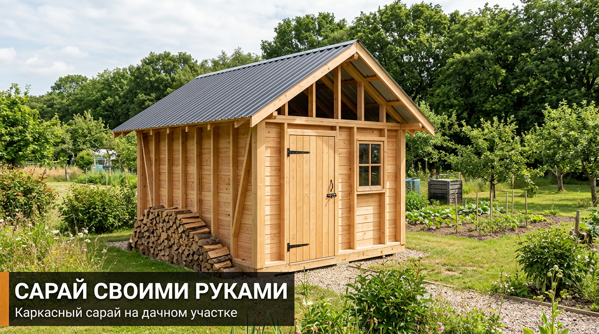
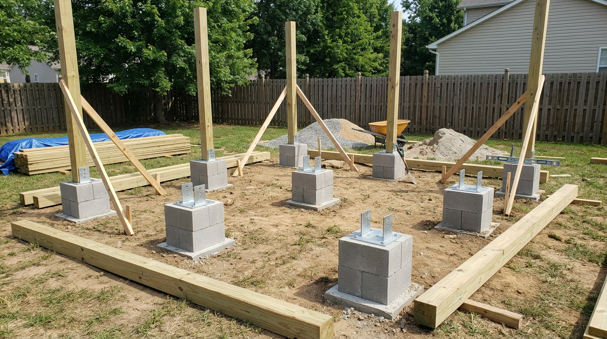
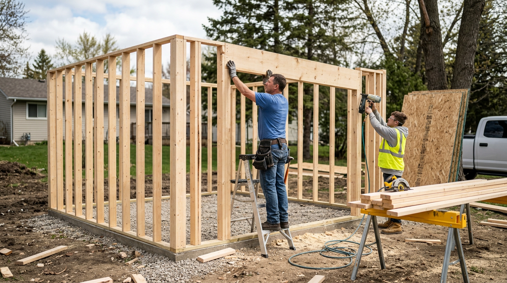
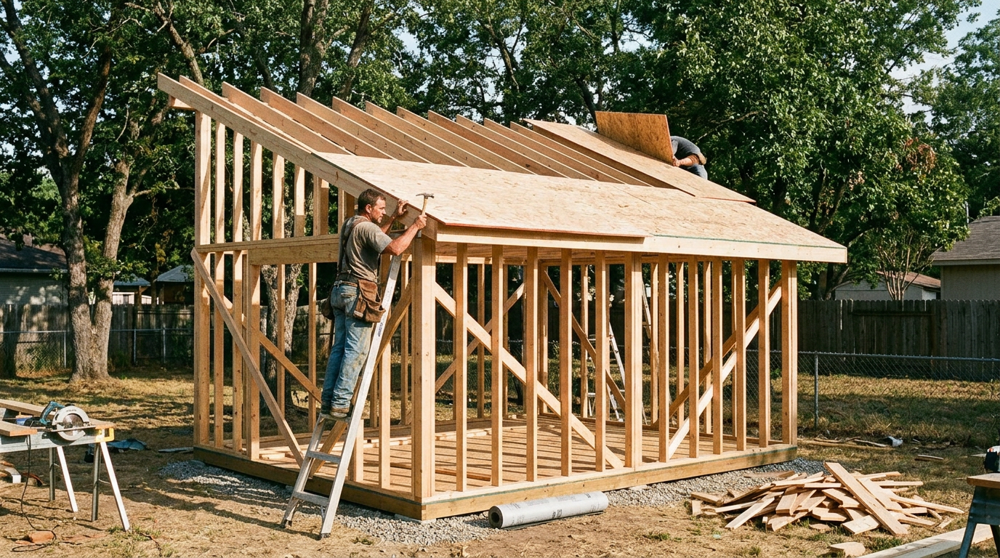
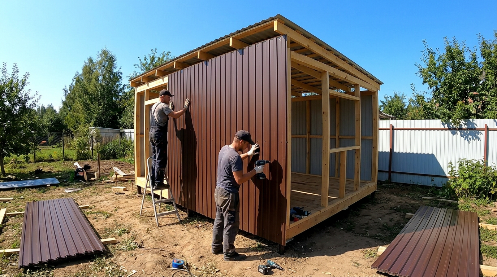
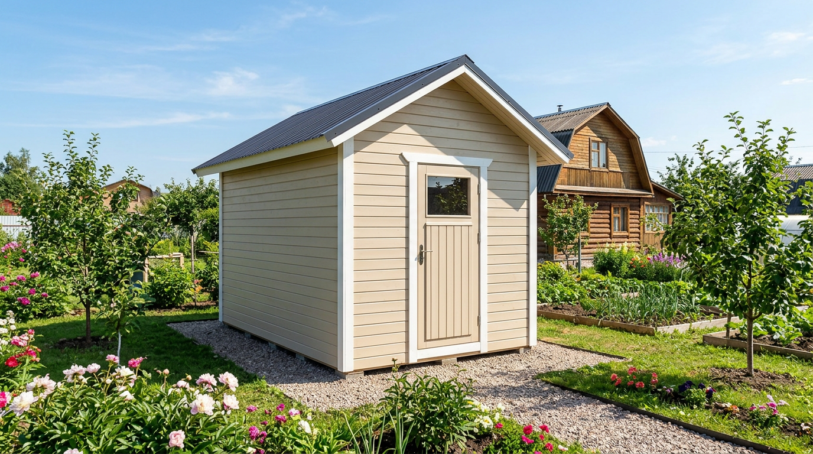

Сарай — первая постройка, которую возводят на любой даче: без него инструмент, инвентарь, дрова и техника так и валяются под открытым небом. Самый простой и быстрый способ обзавестись хозблоком — построить каркасный сарай своими руками. Он недорогой, лёгкий, не требует мощного фундамента и собирается буквально за несколько выходных. В этой статье разберём, как построить сарай своими руками по каркасной технологии: где его поставить, какой сделать фундамент, как собрать каркас, крышу и обшить стены, а также каких ошибок избегать.

## 🏚️ Зачем нужен сарай и каким он бывает

Сарай на даче решает сразу много задач: в нём хранят садовый инвентарь, инструмент, дрова, технику, иногда обустраивают мастерскую или место для птицы. Построить его можно из разных материалов:

- **Каркасный** — деревянный каркас с обшивкой; самый популярный для дачи.
- **Из блоков или кирпича** — капитальный, но дороже и тяжелее.
- **Из бруса или брёвен** — добротный, но затратный по материалу и труду.

Для большинства дачников лучший выбор — каркасный сарай: он сочетает скорость, доступную цену и возможность всё сделать самому. К тому же каркасный сарай при желании легко расширить или переоборудовать — например, пристроить дровник или навес.

## 🪵 Почему каркасная технология

Каркасный сарай выигрывает у других вариантов по нескольким причинам:

- **Быстро** — собирается за несколько дней.
- **Недорого** — минимум материалов, лёгкий фундамент.
- **Лёгкий** — не нужен массивный фундамент, как под кирпич.
- **По силам одному-двум людям** — без тяжёлой техники и спецнавыков.
- **Можно утеплить** — при желании сарай легко превратить в тёплую мастерскую.

## 📐 Планировка и размер

Прежде чем строить, определитесь с местом и размером.

Сарай обычно ставят в хозяйственной зоне, в дальнем или незаметном углу участка, — продумать его расположение удобно ещё на этапе [планировки участка](https://mir-doma.pro/planirovka-uchastka-10-sotok/). Размер выбирают по задачам: для инвентаря хватит 2×3 метра, для мастерской или хранения техники берут больше — 3×4 или 3×6 метров. Заранее решите, где будут дверь (шириной не менее 80–90 см, а для техники — ворота) и нужно ли окно для естественного света. Вход удобно ориентировать в сторону дома или дорожки, чтобы носить инструмент было недалеко, а сам сарай по возможности скрыть от парадной части участка.

## 🧱 Фундамент

Лёгкому каркасному сараю не нужен мощный фундамент — достаточно одного из вариантов:

- **Столбчатый** — бетонные блоки или столбики по углам и периметру с шагом 1,5–2 метра. Самый простой и распространённый вариант.
- **Винтовые сваи** — удобны на неровном участке и слабом грунте.
- **Мелкозаглублённая лента** — если нужен более капитальный сарай.

Между фундаментом и деревянной обвязкой обязательно укладывают гидроизоляцию (рубероид) — иначе дерево будет тянуть влагу и гнить. Все опоры выставляют в одной горизонтальной плоскости по уровню: от этого зависит, будет ли ровным весь сарай.

## 🛠️ Сборка каркаса

Каркас — основа сарая. Собирают его по порядку:

1. **Нижняя обвязка.** По фундаменту укладывают брус (например, 100×100 мм), обработанный антисептиком, и соединяют по углам. Это основание стен.
2. **Лаги пола.** Между брусьями обвязки врезают лаги для будущего пола.
3. **Вертикальные стойки.** Устанавливают стойки из бруса или доски (например, 50×100 мм) с шагом около 60 см, выставляя по уровню. Для односкатной крыши задние стойки делают ниже передних, чтобы получился уклон.
4. **Верхняя обвязка.** Стойки сверху связывают брусом — каркас становится жёстким.
5. **Укосины.** В углах ставят раскосы для устойчивости конструкции.

Все деревянные элементы обрабатывают антисептиком — это главное условие долговечности. Каркас собирают на оцинкованный крепёж — гвозди, саморезы, металлические уголки и пластины; они придают конструкции прочность и не ржавеют.

## 🏠 Крыша

Для сарая проще всего сделать **односкатную крышу** — она дешевле и легче двускатной. На верхнюю обвязку укладывают стропила (балки) с уклоном, поверх — обрешётку, а на неё кровельный материал. Чаще всего сарай кроют профнастилом или ондулином. Технология близка к монтажу обычной кровли — подробнее в статье о [крыше из профнастила своими руками](https://mir-doma.pro/krysha-iz-profnastila-svoimi-rukami/). Уклон обязателен, чтобы вода и снег сходили, а не задерживались на крыше. Скат односкатной крыши направляют назад или вбок, подальше от входа, чтобы вода не лилась перед дверью. Свес крыши делают с небольшим выносом за стены — он защищает обшивку от дождя.

## 🧰 Обшивка стен

Готовый каркас обшивают снаружи. Вариантов несколько:

- **Профнастил** — быстро, дёшево и долговечно; удобно подобрать в цвет [забора](https://mir-doma.pro/zabor-iz-profnastila-svoimi-rukami/).
- **Обрезная доска** внахлёст («ёлочкой») — классический деревенский вид.
- **OSB-плиты** с последующей отделкой.
- **Вагонка или имитация бруса** — аккуратно и красиво.

При необходимости между стойками укладывают утеплитель, а изнутри зашивают стены — так сарай превращается в тёплое помещение. Не забудьте про вентиляцию, чтобы внутри не было сырости. Для неотапливаемого сарая под обшивку можно проложить ветрозащитную плёнку — она убережёт каркас от влаги и продувания.

## 🚪 Двери, пол и окна

Завершают сарай дверь, пол и при желании окно:

- **Пол** настилают из доски или влагостойкой плиты по лагам; для тяжёлой техники или мастерской иногда делают бетонный — он прочнее и не боится нагрузок.
- **Дверь** собирают из доски или бруска и навешивают на петли; для въезда техники ставят широкие ворота.
- **Окно** добавляют, если нужен дневной свет, например в мастерской.

## 🛡️ Частые ошибки

- **Нет фундамента или гидроизоляции.** Каркас прямо на земле быстро сгнивает. Нужен фундамент и рубероид под обвязкой.
- **Необработанное дерево.** Без антисептика каркас поражают гниль и насекомые.
- **Нет уклона крыши.** На плоской крыше застаивается вода, и она течёт. Делайте уклон.
- **Редкие стойки.** При большом шаге стены получаются хлипкими — выдерживайте около 60 см.
- **Нет вентиляции.** В закрытом сарае без продухов сыро, инструмент ржавеет, дрова не сохнут.

## ❓ Частые вопросы

### Какой сарай проще построить своими руками?

Каркасный — он самый простой, быстрый и недорогой. Лёгкий деревянный каркас на столбчатом фундаменте обшивают профнастилом или доской и накрывают односкатной крышей. Такой сарай по силам собрать одному-двум людям за несколько выходных без спецтехники.

### Какой фундамент нужен для каркасного сарая?

Достаточно лёгкого фундамента: столбчатого из блоков по углам и периметру или винтовых свай. Массивная лента или плита каркасному сараю не нужны. Между фундаментом и деревянной обвязкой обязательно укладывают гидроизоляцию.

### Какие размеры сделать у сарая?

Для хранения садового инвентаря хватит 2×3 метра, для мастерской или хранения техники берут 3×4 или 3×6 метров. Размер подбирают под задачи и место на участке, заранее предусмотрев удобную дверь или ворота.

### Чем обшить сарай снаружи?

Чаще всего профнастилом — это быстро, дёшево и долговечно. Также используют обрезную доску внахлёст, OSB с отделкой, вагонку или имитацию бруса. Профнастил удобно подобрать в один цвет с забором и крышей.

### Сколько времени строится каркасный сарай?

Небольшой каркасный сарай вдвоём реально построить за несколько выходных, не считая времени на застывание бетона под фундаментом. Самые долгие этапы — фундамент и сборка каркаса, а обшивка и кровля профнастилом идут быстро.

### Нужно ли утеплять сарай?

Для хранения инвентаря и дров утепление не нужно. Но если планируете мастерскую или содержание птицы, между стойками каркаса укладывают утеплитель и зашивают стены изнутри. Каркасная технология как раз и удобна тем, что сарай легко утеплить.

### Какую крышу сделать на сарае?

Проще и дешевле всего односкатная крыша с уклоном — она легко собирается и хорошо отводит воду и снег. Кроют сарай обычно профнастилом или ондулином по обрешётке. Главное — выдержать уклон, чтобы на крыше не застаивалась вода.

## Заключение

Сарай своими руками по каркасной технологии — посильный проект даже для новичка в стройке. Выберите место в хозяйственной зоне, сделайте лёгкий фундамент с гидроизоляцией, соберите деревянный каркас, накройте односкатной крышей и обшейте профнастилом или доской. Не забывайте про антисептик, уклон крыши и вентиляцию — и крепкий, аккуратный сарай прослужит вам долгие годы, а на участке наконец появится порядок. А подобрав обшивку и кровлю в цвет других построек — забора и беседки, — вы сделаете двор по-настоящему ухоженным и стильным.

А какой сарай построили или планируете вы? Делитесь опытом в комментариях и подписывайтесь, чтобы не пропустить новые статьи о стройке и обустройстве дачи.
