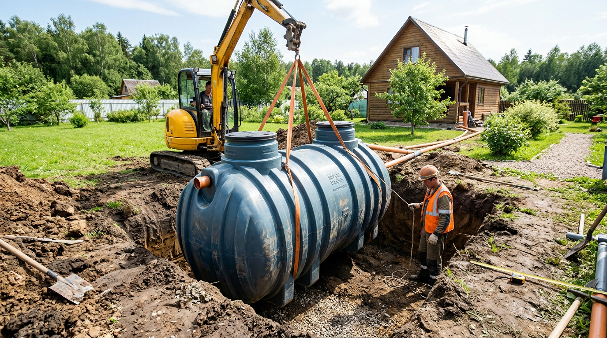
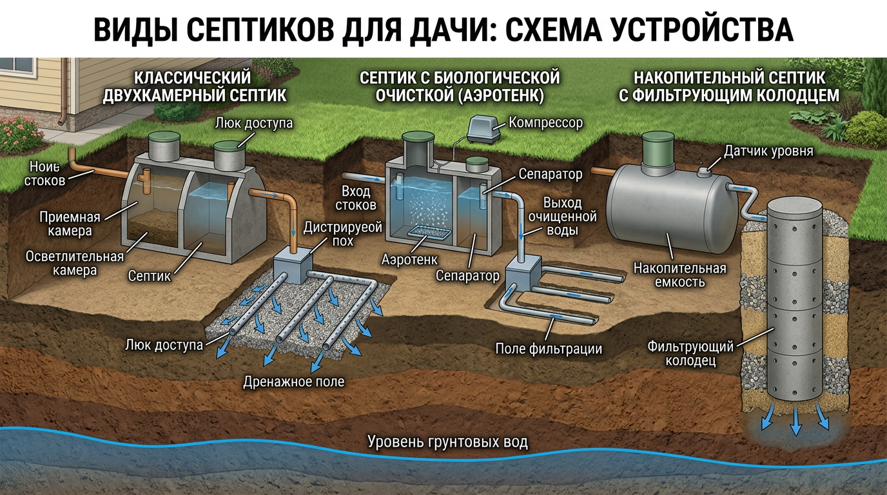
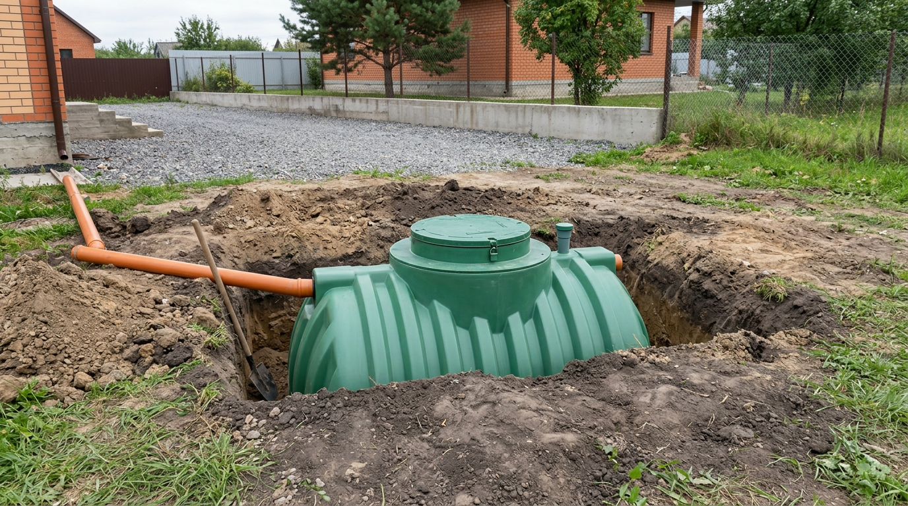
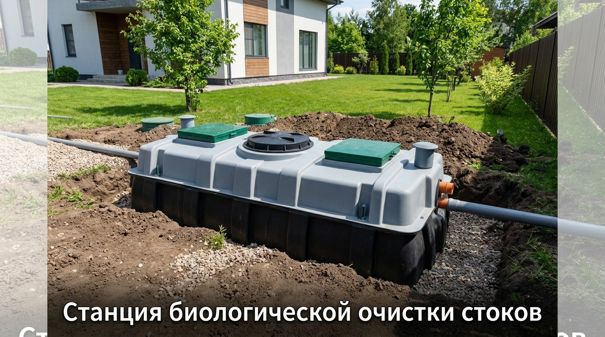
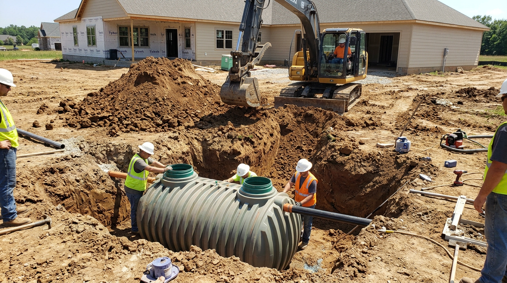
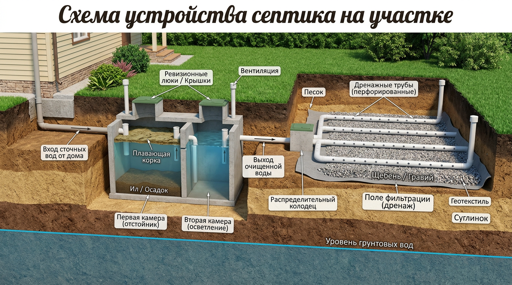

Своя канализация на даче — это комфорт, без которого сегодня трудно представить загородную жизнь. И сердце такой канализации — септик: он принимает и очищает стоки, избавляя от запаха, антисанитарии и частых вызовов ассенизатора. Но септиков существует несколько видов, и выбрать подходящий под свой участок, грунт и режим проживания не так-то просто. В этой статье разберём, какой септик выбрать для дачи, чем отличаются накопительные, переливные септики и станции биоочистки, как установить септик и какие нормы и правила обслуживания нужно соблюдать.

## 🚽 Зачем нужен септик

Раньше на дачах обходились выгребной ямой, но у неё много минусов: запах, необходимость частой откачки и риск загрязнения почвы и грунтовых вод. Септик решает эти проблемы — он не просто копит стоки, а **очищает их**: твёрдые частицы оседают и разлагаются бактериями, а осветлённая вода уходит на доочистку в грунт или откачивается уже частично очищенной.

В результате вы получаете полноценную автономную канализацию: без запаха, с редкой откачкой и без вреда для участка. Это особенно важно, если на даче есть туалет, душ, кухня и вы бываете там регулярно. По сути, септик превращает дачу с удобствами «во дворе» в дом с полноценной канализацией, как в городе, — а это совсем другой уровень комфорта для всей семьи.

## 🧩 Виды септиков для дачи

Септиков для загородного дома три основных типа, и выбор зависит от объёма стоков, грунта и бюджета.

### Накопительный септик

Это герметичная ёмкость, в которой стоки просто накапливаются, как в выгребной яме, но без протечек в грунт.

**Плюсы:** простая и недорогая установка, не зависит от типа грунта и уровня грунтовых вод, не нужно электричество.
**Минусы:** требует регулярной откачки ассенизатором — чем больше стоков, тем чаще и дороже.

Накопительный септик хорош для дач, где бывают редко и стоков немного. Объём ёмкости подбирают так, чтобы откачка требовалась не слишком часто: чем больше бак, тем реже приезжает ассенизатор, но тем дороже сама ёмкость и земляные работы.

### Переливной септик (с почвенной доочисткой)

Это две-три соединённые камеры. В них стоки отстаиваются, твёрдая часть оседает и разлагается бактериями, а осветлённая вода переливается в следующую камеру и затем уходит на доочистку — в поле фильтрации, фильтрующий колодец или дренаж.

**Плюсы:** редкая откачка (раз в год-два убирают только ил), не нужно электричество, экономично в обслуживании.
**Минусы:** требует хорошо впитывающего грунта; на глине и при высоком уровне грунтовых вод вода плохо уходит, и нужна доработка дренажа.

Это самый популярный вариант для дачи и загородного дома: при подходящем грунте он сочетает разумную цену и редкое обслуживание.

### Станция биологической очистки

Это компактная установка с принудительной аэрацией: стоки очищают активный ил и бактерии при подаче воздуха компрессором. На выходе — вода, очищенная до 95–98%, которую можно отводить в канаву или на грунт.

**Плюсы:** высокая степень очистки, компактность, не зависит от грунта, почти нет запаха.
**Минусы:** дороже, нужно постоянное электричество для компрессора и регулярный приток стоков — для дачи с редким посещением подходит хуже.

## 📊 Как выбрать септик: сравнение

Чтобы определиться, удобно сравнить типы по основным параметрам.

| Тип септика | Цена | Обслуживание | Зависит от грунта | Электричество |
|-------------|------|--------------|-------------------|---------------|
| Накопительный | Низкая | Частая откачка | Нет | Не нужно |
| Переливной | Средняя | Редкая откачка | Да | Не нужно |
| Станция биоочистки | Высокая | Минимальное | Нет | Нужно |

## 🔍 Что учесть при выборе

Подбирая септик, ориентируйтесь на несколько ключевых факторов:

- **Число пользователей и объём стоков.** Чем больше людей и сантехники, тем больше нужен объём септика. Ориентир — суточный объём стоков на человека умножают на запас в три раза (столько стоки отстаиваются в септике).
- **Режим проживания.** Для дачи наездами проще накопительный или переливной; для постоянного проживания — станция или большой переливной.
- **Тип грунта и уровень грунтовых вод.** Для переливного септика нужен впитывающий грунт; на глине и при высокой воде выбирают накопительный или станцию.
- **Бюджет.** Учитывайте не только цену установки, но и стоимость обслуживания: дешёвый накопительный может выйти дороже из-за частой откачки.
- **Наличие электричества.** Станции биоочистки без него не работают.

Расположение септика стоит продумать ещё на этапе [планировки участка](https://mir-doma.pro/planirovka-uchastka-10-sotok/) — его размещают с учётом санитарных норм, о которых ниже.

## 🛠️ Установка септика: основные этапы

Монтаж готового септика вполне реально выполнить своими руками или с минимальной помощью техники.

1. **Выберите место** по санитарным нормам (см. ниже) — с учётом расстояний до дома, колодца и границ.
2. **Выкопайте котлован** под размер септика, с запасом по бокам и в глубину под основание.
3. **Подготовьте основание.** На дно насыпают и трамбуют песок, а при высоком уровне грунтовых вод укладывают бетонную плиту и крепят к ней лёгкую ёмкость, чтобы её не выдавило водой.
4. **Установите септик** в котлован строго по уровню.
5. **Подведите канализационную трубу** от дома с уклоном около 2 см на метр, чтобы стоки шли самотёком и не застаивались. Трубу укладывают ниже глубины промерзания или утепляют.
6. **Сделайте доочистку** (для переливного) — поле фильтрации или фильтрующий колодец.
7. **Выполните обратную засыпку**, заполняя ёмкость водой одновременно с засыпкой, чтобы не деформировать стенки.

## 📏 Нормы и расположение

Септик размещают по санитарным нормам, чтобы не загрязнить воду и не поссориться с соседями. Ориентировочные расстояния:

- от жилого дома — от 5 метров;
- от колодца или скважины — от 20 до 50 метров (зависит от грунта);
- от границы участка — около 2–4 метров;
- от водоёма — от 10 метров.

Точные значения зависят от действующих норм (СанПиН, СП) и типа грунта, поэтому их обязательно уточняют перед установкой. Правильное место выбирают так, чтобы к септику мог подъехать ассенизатор.

## 🧰 Обслуживание септика

Чтобы канализация работала без сбоев, за септиком нужен минимальный уход:

- **Откачка.** Накопительный откачивают по мере наполнения, переливной — раз в 1–2 года убирают накопившийся ил, станцию чистят по инструкции.
- **Биопрепараты.** Для переливных септиков и станций используют бактерии, которые ускоряют разложение стоков, уменьшают количество ила и убирают запах. Важно не сливать в такой септик агрессивную химию и хлор — они убивают полезные бактерии.
- **Зимовка.** Станцию биоочистки нельзя надолго оставлять без стоков и электричества; накопительный и переливной на зиму консервируют, частично заполнив водой, чтобы их не выдавило грунтом.

## 🛡️ Частые ошибки

Чтобы септик служил долго и без проблем, избегайте типичных промахов:

- **Переливной на глине или высокой воде.** Осветлённая вода не уходит, септик переполняется. На таких грунтах нужен накопительный или станция.
- **Ёмкость не закреплена.** При высоком уровне грунтовых вод лёгкий пластиковый септик выдавливает на поверхность. Его якорят к бетонному основанию.
- **Нет уклона трубы.** Без уклона стоки застаиваются и образуются засоры. Выдерживайте около 2 см на метр.
- **Неправильное место.** Слишком близко к колодцу — риск загрязнения воды; без подъезда — невозможна откачка.
- **Станция без стоков.** Если надолго оставить станцию без поступления стоков и электричества, бактерии погибают.

## ❓ Частые вопросы

### Какой септик лучше для дачи?

Зависит от режима проживания и грунта. Для редких визитов и малого объёма стоков подойдёт накопительный, для регулярного проживания на впитывающем грунте — переливной, а для постоянного проживания и сложных грунтов — станция биологической очистки. Универсального ответа нет — выбирают под свои условия.

### Чем септик отличается от выгребной ямы?

Выгребная яма просто копит стоки и требует частой откачки, а септик их очищает: твёрдая часть оседает и разлагается, осветлённая вода уходит на доочистку. Поэтому септик откачивают реже, он не даёт запаха и не загрязняет почву.

### Можно ли установить септик своими руками?

Да, готовый септик вполне реально установить самостоятельно или с помощью техники для котлована. Важно правильно выбрать место по нормам, сделать надёжное основание, выдержать уклон трубы и аккуратно выполнить обратную засыпку. Сложнее всего — земляные работы.

### На каком расстоянии от дома и колодца ставить септик?

Ориентировочно: от дома — не менее 5 метров, от колодца или скважины — от 20 до 50 метров в зависимости от грунта, от границы участка — 2–4 метра. Точные нормы зависят от действующих правил и типа грунта, их уточняют перед установкой.

### Нужно ли электричество для септика?

Накопительному и переливному септику электричество не нужно — они работают самотёком. А вот станция биологической очистки требует постоянного электропитания для компрессора, который подаёт воздух для работы бактерий.

### Какой объём септика нужен для дачи?

Объём подбирают по числу пользователей и суточному расходу воды: обычно берут трёхкратный суточный объём стоков, чтобы они успевали отстаиваться. Для семьи из 3–4 человек, постоянно живущей на даче, нужен заметно больший септик, чем для редких визитов.

### Замёрзнет ли септик зимой?

При правильной установке — нет. Трубу укладывают ниже глубины промерзания или утепляют, а сам септик заглублён в грунт, где тепло от стоков и земли не даёт ему замёрзнуть. Станцию биоочистки на зиму не отключают, если ею пользуются.

### Как часто откачивать септик?

Накопительный откачивают по мере наполнения — от нескольких раз в год. Переливной требует откачки ила примерно раз в 1–2 года. Станция биоочистки нуждается лишь в периодической чистке. Частота зависит от объёма стоков и числа пользователей.

## Заключение

Септик для дачи — это удобная и экологичная автономная канализация, которая делает загородную жизнь по-настоящему комфортной. Выбирая септик, отталкивайтесь от режима проживания, объёма стоков, типа грунта и бюджета: накопительный — для редких визитов, переливной — для впитывающих грунтов, станция — для постоянного проживания. Установите его по санитарным нормам, выдержите уклон трубы и надёжное основание — и автономная канализация будет служить долго и без хлопот, а на даче появится комфорт городского уровня.

А какой септик стоит у вас на участке и довольны ли вы выбором? Делитесь опытом в комментариях и подписывайтесь, чтобы не пропустить новые статьи об обустройстве дачи и дома.
