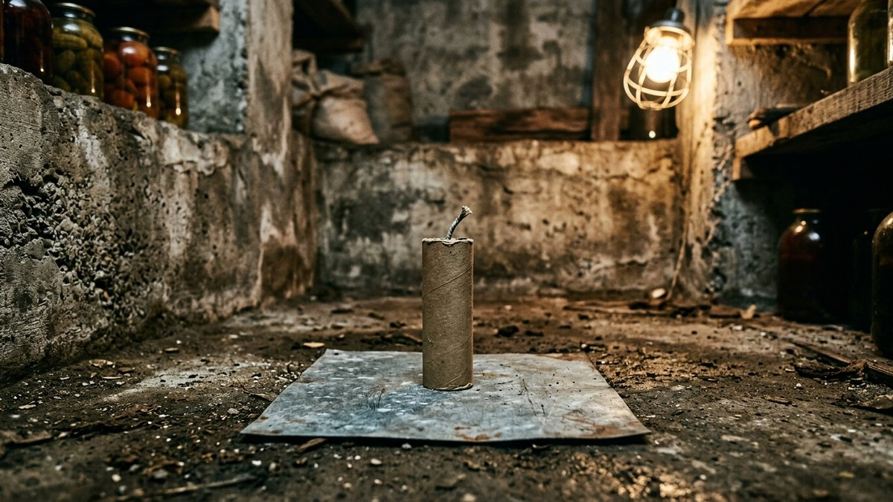
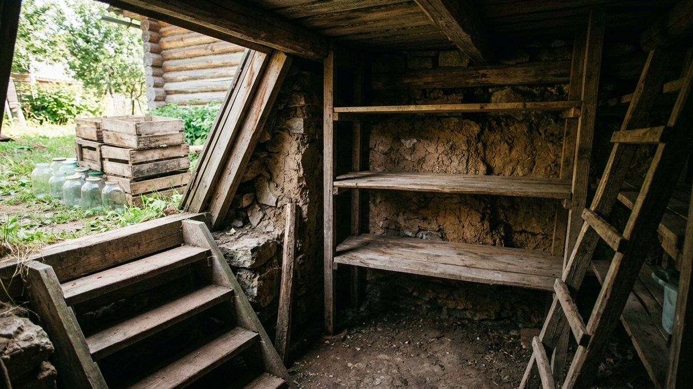
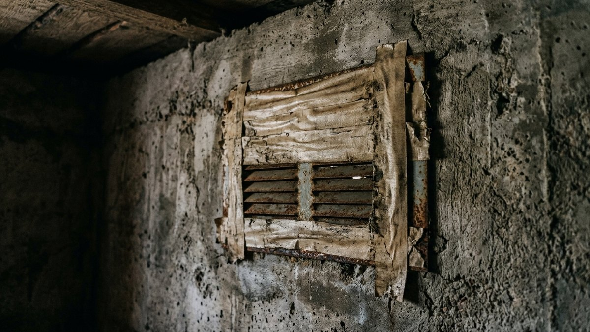
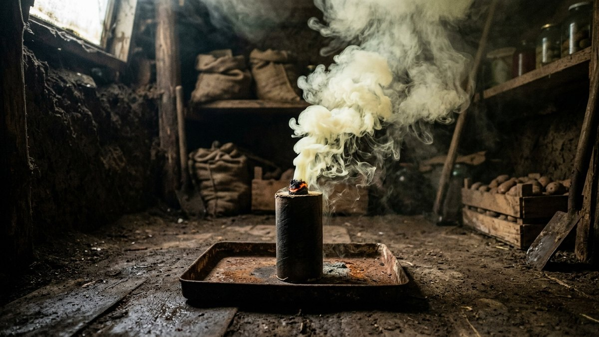
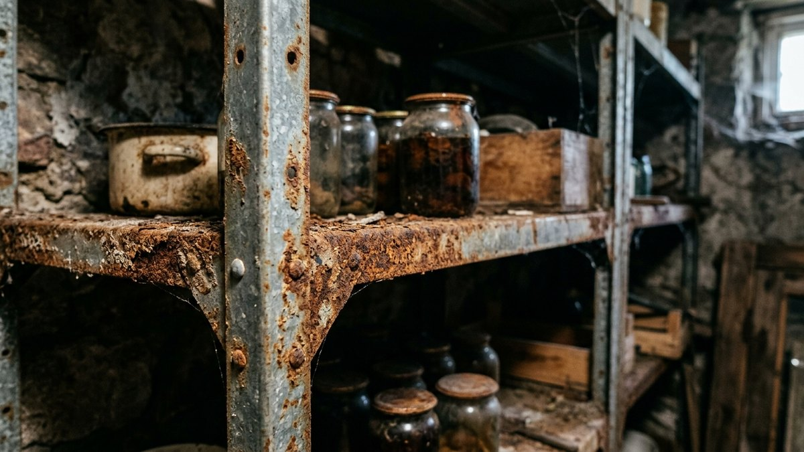
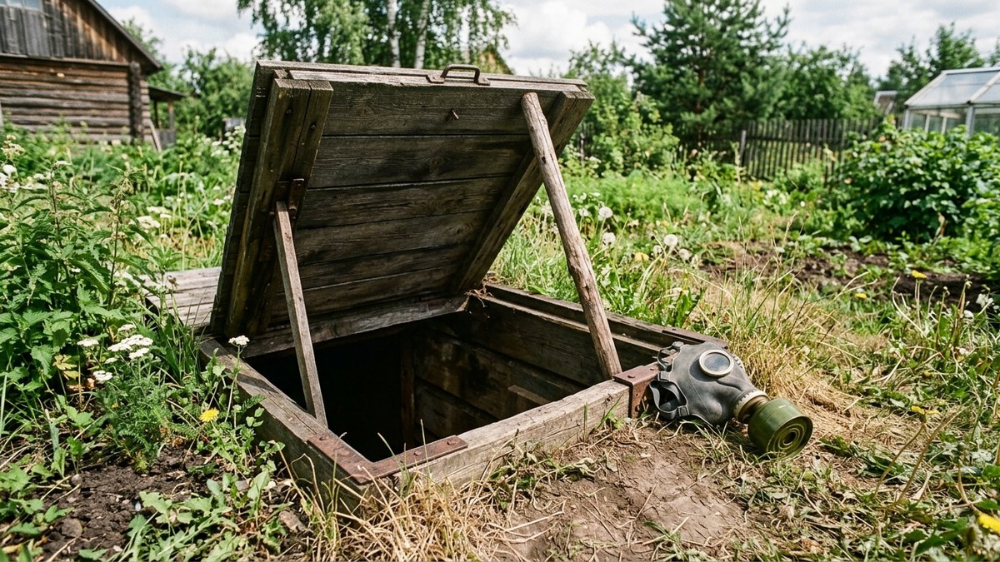

# Серная шашка для погреба: инструкция по применению

Купленную с верным расчётом серную шашку легко испортить на этапе применения:
недогерметизировали люк — газ ушёл раньше времени и грибок выжил, зашли в погреб
раньше срока — надышались сернистым ангидридом, не убрали металл — стеллажи
проржавели насквозь за одну обработку. Если норма на объём ещё не посчитана,
это отдельный вопрос — разобран в статье [сколько нужно серной шашки на
погреб](https://mir-doma.pro/raschet-sernoy-shashki-dlya-pogreba/). Здесь —
только применение: что сделать до поджига, как герметизировать, сколько
держать погреб закрытым и что происходит с металлом внутри.

## Что подготовить до обработки

- **Вынести всё, что портится от запаха и газа.** Банки с заготовками,
  овощи, тара — всё выносится полностью. Сернистый ангидрид впитывается
  в продукты так же, как в стены и стеллажи, и запах потом не выветривается.
- **Убрать или защитить металл.** Оцинкованные стеллажи, металлические
  полки, крепёж, трубы — по возможности вынести. То, что вынести нельзя,
  плотно укрыть плёнкой без зазоров.
- **Проверить общее состояние погреба.** Если параллельно нужна не только
  обработка, а полная подготовка к сезону — вентиляция, гидроизоляция,
  ревизия стеллажей — это отдельный протокол, он разобран в статье
  [обустройство погреба](https://mir-doma.pro/obustroystvo-pogreba/).
- **Подготовить средства защиты.** Респиратор от кислых газов (не обычная
  медицинская маска), перчатки, при входе после обработки — защита глаз.

## Пошаговая инструкция по применению

### Шаг 1. Герметизация погреба

Перед поджигом закрывают все пути, которыми газ может уйти раньше времени:
продухи, вытяжную трубу, щели в люке и вокруг дверной коробки. Продухи и
трубу забивают ветошью или заклеивают скотчем, щели — герметиком или той же
клейкой лентой. Смысл в том, чтобы газ подействовал на весь объём погреба,
а не улетучился за час через щель — тогда обработка окажется бесполезной.

### Шаг 2. Установка и поджиг

Шашку ставят на негорючую подставку — металлический лист, кирпичи, старую
сковороду — в центре погреба или на нескольких точках, если объём большой
и шашек несколько. Поджигают фитиль и **сразу покидают помещение**, плотно
закрывая за собой люк. Находиться в погребе во время и сразу после поджига
нельзя: концентрация сернистого газа в первые минуты — самая опасная точка
всего процесса.

### Шаг 3. Время выдержки

Погреб держат герметично закрытым **не менее 2–3 суток**. Именно за это
время газ успевает подействовать на грибок и плесень по всему объёму,
включая труднодоступные углы и щели в кладке. Открывать раньше — значит
свести обработку к нулю: газ не успеет отработать там, куда сложно попасть
обычной уборкой.

### Шаг 4. Проветривание

После выдержки люк открывают **не заходя внутрь** и оставляют погреб
проветриваться несколько дней — от 3 до 7 в зависимости от объёма и того,
насколько активна вентиляция. Если в погребе есть постоянная приточно-
вытяжная система, процесс идёт быстрее — устройство такой системы разобрано
в статье [вентиляция в погребе](https://mir-doma.pro/ventilyaciya-v-pogrebe/).
Заходить внутрь до исчезновения запаха серы нельзя даже в респираторе —
запах указывает на остаточную концентрацию газа в воздухе.

## Коррозия: что серная шашка делает с металлом

Об этом нужно сказать прямо: сернистый газ при контакте с влажным воздухом
образует сернистую и серную кислоту, а она разъедает металл. Оцинкованные
стеллажи, стальной крепёж, металлические полки и трубы после обработки
серной шашкой ржавеют быстрее, чем от обычной сырости погреба — иногда
насквозь за один сезон. Это не редкий побочный эффект, а прямое следствие
химии процесса, и защита металла — не опциональный пункт, а обязательная
часть подготовки.

Если металлических конструкций в погребе много и вынести их нельзя, разумнее
рассмотреть другое средство обработки либо один раз заменить металлические
стеллажи на деревянные, которые серный газ не разрушает — материалы, расчёт
нагрузки и обработка дерева под сырость погреба разобраны в статье
[полки в погреб своими руками](https://mir-doma.pro/polki-v-pogreb-svoimi-rukami/).

## Меры безопасности

- **Никогда не находиться в погребе во время обработки и в первые минуты
  после поджига** — сернистый газ поражает дыхательные пути даже в малой
  концентрации.
- **Дети и животные не должны иметь доступ к погребу** весь период выдержки
  и проветривания — люк держат закрытым или заблокированным.
- **При входе для проверки или уборки после проветривания** — респиратор от
  кислых газов, если запах серы всё ещё ощущается у входа.
- **Не сокращать сроки выдержки и проветривания** ради того, чтобы быстрее
  занести урожай — газ, не успевший выветриться, впитается в продукты.

## Частые ошибки

- **Поджигают шашку и сразу уходят из дома**, не проверив герметизацию —
  щели в люке выпускают газ раньше срока, и обработка не действует на весь
  объём.
- **Заходят в погреб на следующий день**, ориентируясь на календарь, а не
  на запах — минимальный срок выдержки нарушается, эффект от обработки
  падает.
- **Оставляют металлические стеллажи открытыми**, понадеявшись, что «один
  раз ничего не будет» — именно один раз и даёт видимую коррозию.
- **Проветривают погреб несколько часов вместо нескольких дней** и сразу
  заносят заготовки — продукты впитывают остаточный запах серы.

## Частые вопросы

**Сколько держать серную шашку в погребе закрытым?**
Минимум 2–3 суток герметично закрытым, затем ещё 3–7 дней на проветривание
с открытым люком, без захода внутрь до исчезновения запаха.

**Через сколько дней можно заходить в погреб после серной шашки?**
Обычно не раньше 5–7 суток от момента поджига — 2–3 суток выдержки плюс
несколько дней активного проветривания. Точный срок зависит от объёма
погреба и вентиляции.

**Портит ли серная шашка металлические стеллажи?**
Да, сернистый газ вызывает коррозию металла, особенно во влажном воздухе
погреба. Металл на время обработки либо выносят, либо плотно укрывают
плёнкой без зазоров.

**Нужен ли респиратор при заходе в погреб после обработки?**
Да, если у входа ещё ощущается запах серы — это признак остаточного газа
в воздухе. При полностью выветрившемся запахе респиратор не обязателен, но
осторожность не помешает.

**Можно ли применять серную шашку, если в погребе остались продукты?**
Нет, все заготовки, овощи и тара выносятся полностью перед обработкой —
газ впитывается в продукты так же, как в стены и стеллажи.
