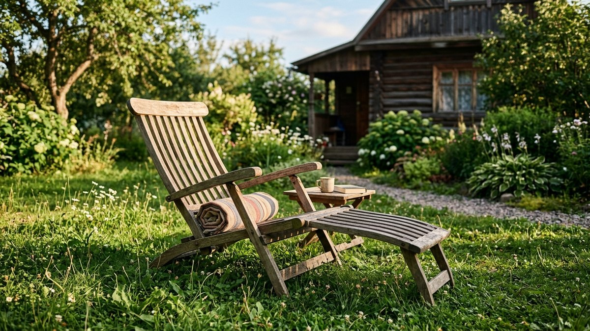
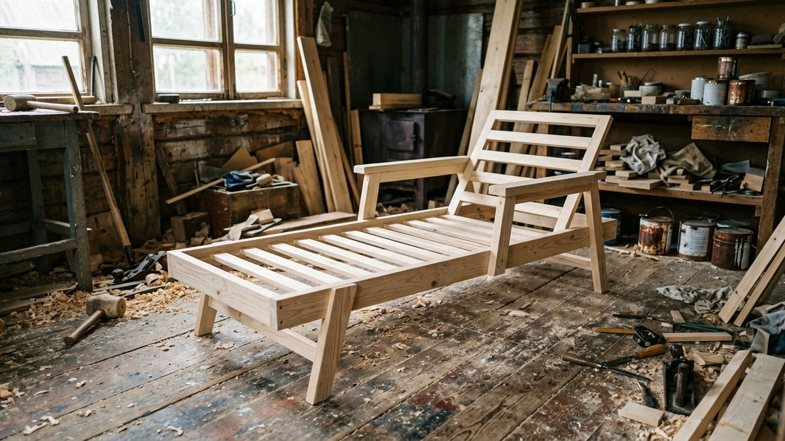
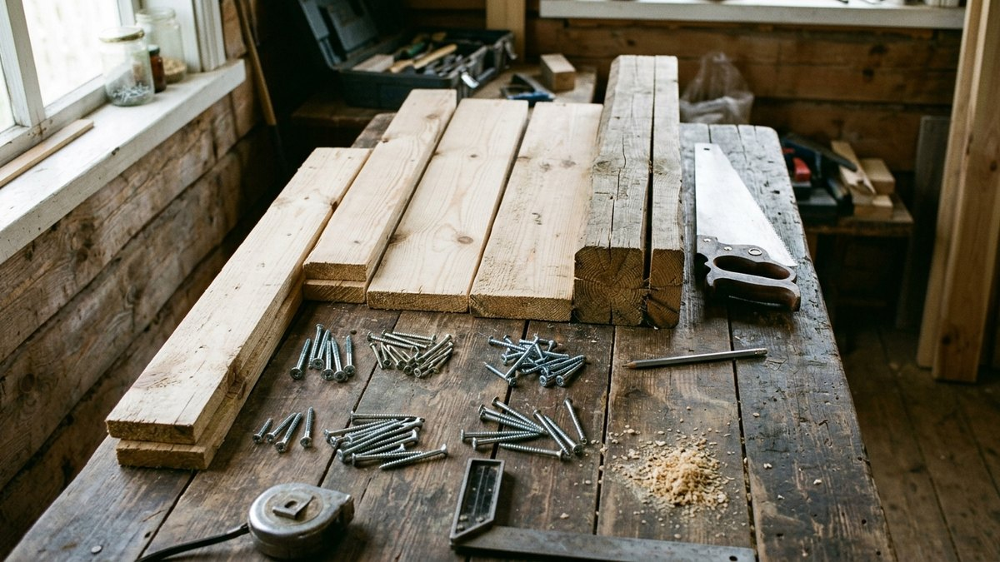
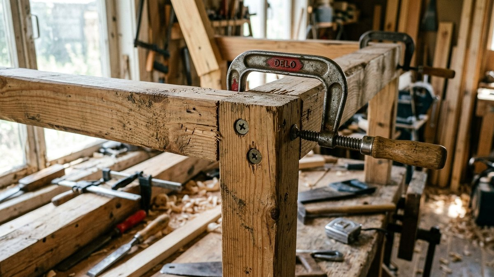
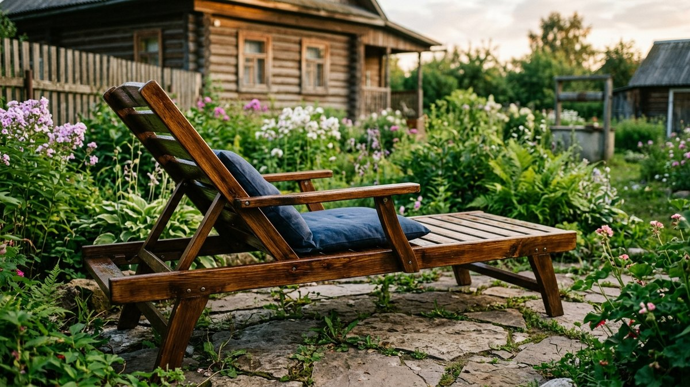
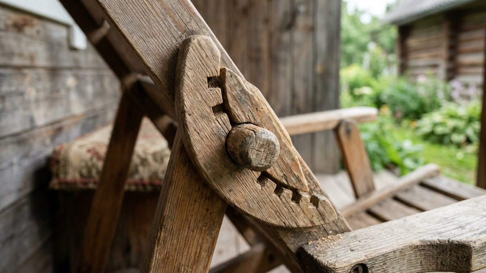

# Шезлонг своими руками из дерева: чертежи и сборка

Готовый деревянный шезлонг в магазине стоит как половина материала и
крепежа на три-четыре штуки — конструкция простая: рама, реечный настил
и механизм наклона спинки на несколько положений. Разберём чертёж с
размерами, какую древесину брать, чтобы шезлонг не рассохся за сезон, и
пошаговую сборку от рамы до финишной пропитки.

## Чертёж и размеры

Комфортный шезлонг для взрослого — длина 190–200 см, ширина сиденья
55–60 см, высота от земли 30–35 см. Спинка регулируется в 3–4 положениях
углом от 15° (почти лёжа) до 45° (полусидя).

- **Боковины (лонжероны)** — две доски 40×140 мм длиной 190–200 см с
  вырезанными пазами или отверстиями под фиксацию угла спинки.
- **Поперечины** — 4–5 брусков 40×40 мм, соединяющих боковины и держащих
  форму рамы.
- **Настил** — 8–10 реек 20×60 мм с зазором 1,5–2 см между ними — зазор
  нужен для стока воды после дождя и вентиляции снизу.
- **Спинка** — отдельная секция на петлях с упором (перекладина, штырь
  в отверстие или откидная нога), которая фиксирует нужный угол.

## Выбор древесины

- **Сосна** — доступнее всего, но требует более частой обработки от
  влаги: шезлонг стоит на улице, контактирует с травой и росой снизу.
- **Лиственница** — заметно устойчивее к влаге без пропитки, дороже
  сосны на 30–40%, оправдана, если шезлонг не убирают на зиму под навес.
- **Термодерево** — обработанная при высокой температуре древесина, почти
  не впитывает влагу и не рассыхается, но и стоит как готовое изделие —
  выбор скорее для тех, кому важна долговечность без ежегодного ухода.

Для рамы и лонжеронов важна прямослойная древесина без сучков в местах
пропилов под пазы — сучок на изгибе паза резко снижает прочность именно
там, где нагрузка при сидении максимальна.

## Материалы и инструмент

| Материал/инструмент | Назначение |
|---|---|
| Брус и доска (сосна или лиственница) | Рама, боковины, настил |
| Шурупы или конфирматы | Соединение рамы |
| Мебельные болты с гайками-барашками | Разборные узлы наклона спинки |
| Наждачная бумага P120–P240 | Шлифовка перед пропиткой |
| Антисептик и масло для дерева | Защита от влаги и УФ |
| Лобзик, шуруповёрт, струбцины | Раскрой и сборка |

## Пошаговая сборка

1. **Раскроите детали** по чертежу — лонжероны, поперечины, рейки настила
   и секцию спинки, сразу отшлифуйте кромки, чтобы не занозить руки при
   сидении.
2. **Соберите раму** — лонжероны и поперечины на шурупы или конфирматы,
   углы проверяйте по диагонали, а не только по угольнику.
3. **Закрепите настил** — рейки с зазором 1,5–2 см, начиная от изножья,
   последнюю рейку подрезают под фактический остаток длины.
4. **Соберите секцию спинки** отдельно и навесьте на петли к раме в зоне
   плеч — примерно на 60–65 см от изголовья.
5. **Установите механизм фиксации угла** — пазы с перекладиной, штыри в
   ряд отверстий или откидную ногу-упор — и проверьте все положения под
   нагрузкой, прежде чем садиться в шезлонг в первый раз.

## Защита и финиш

1. **Шлифовка** всей конструкции наждачной бумагой — от крупного зерна к
   мелкому, особое внимание торцам и краям реек настила.
2. **Антисептик глубокого проникновения** в 1–2 слоя, с обязательной
   промазкой торцов — они впитывают влагу быстрее плоскости.
3. **Финишное масло или лак для наружных работ** поверх антисептика —
   масло проще обновлять точечно, лак даёт более стойкое покрытие, но
   требует полной перешлифовки при обновлении.
4. **Ежегодная профилактика** — осмотр на трещины и обновление масла на
   открытых поверхностях перед началом сезона.

## Где поставить шезлонг на участке

Прямое солнце весь день ускоряет выгорание и растрескивание древесины —
удобнее место с полутенью хотя бы во второй половине дня: под кроной
дерева, у [перголы](https://mir-doma.pro/pergola-na-dache-svoimi-rukami/)
или навеса. На зиму деревянный шезлонг лучше убирать под крышу или
укрывать — постоянный контакт со снегом и талой водой сокращает срок
службы обшивки настила заметнее, чем обычная уличная эксплуатация летом.

## Частые ошибки

- **Настил без зазоров между рейками.** Вода стоит на поверхности после
  дождя и держит влагу дольше — рейки начинают темнеть и подгнивать
  быстрее, чем с нормальным зазором.
- **Сучковатая древесина в местах пазов под фиксацию угла.** Именно
  здесь нагрузка при откидывании спинки максимальна — сучок на изгибе
  резко повышает риск раскола.
- **Экономия на пропитке торцов.** Торец доски впитывает влагу в разы
  быстрее плоскости — необработанный торец начинает гнить первым, даже
  если остальная поверхность защищена.
- **Слишком тонкая доска для лонжеронов.** Лонжерон несёт вес всего тела
  на изгиб — брус тоньше 40 мм по толщине заметно чаще трескается в
  зоне механизма фиксации угла.

## Частые вопросы

### Какой размер шезлонга удобен для взрослого

Длина 190–200 см, ширина сиденья 55–60 см — при таких размерах шезлонг
подходит человеку ростом до 185–190 см без свисания ног за край.

### Какое дерево лучше для шезлонга: сосна или лиственница

Лиственница устойчивее к влаге и служит дольше без ежегодной пропитки,
но дороже сосны на 30–40%. Сосна — бюджетный вариант, требующий более
внимательного и частого ухода.

### Сколько положений спинки нужно у шезлонга

3–4 положения — от почти горизонтального (15°) до полусидячего (45°) —
покрывают весь диапазон использования: от сна до чтения книги.

### Нужно ли убирать шезлонг на зиму

Да, если конструкция деревянная без пропитки, устойчивой к морозу и
переменной влажности. Постоянный контакт со снегом и талой водой
сокращает срок службы настила заметнее, чем обычная летняя эксплуатация.

### Чем покрыть шезлонг, чтобы он не темнел на солнце

Маслом или лаком для наружных работ с УФ-фильтром — обычная пропитка без
УФ-защиты не спасает от выгорания и потемнения открытой на солнце
древесины за один сезон.

## Заключение

Шезлонг из дерева — одна из самых простых конструкций в разделе садовой
мебели: рама, реечный настил и механизм фиксации угла спинки. Главное —
не экономить на толщине лонжеронов и пропитке торцов, тогда конструкция
без проблем переживёт несколько сезонов даже без ежегодной замены реек.
