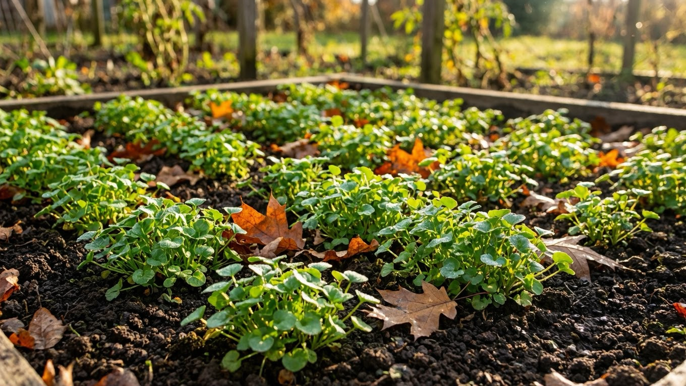
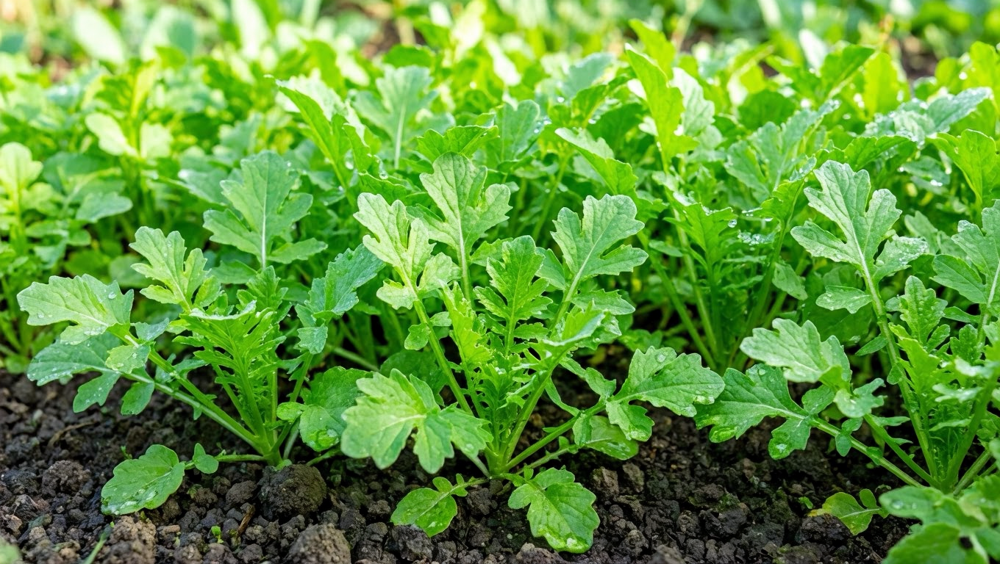
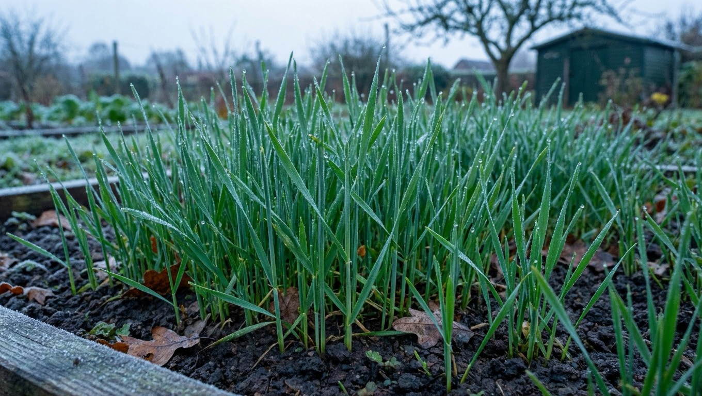
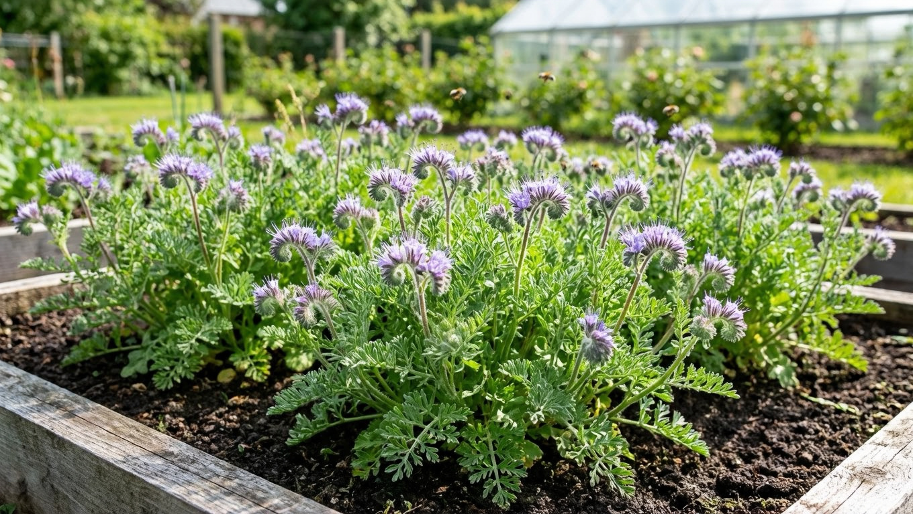
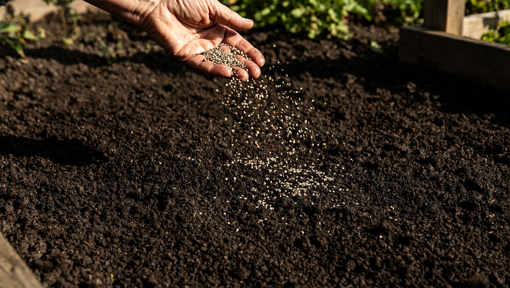
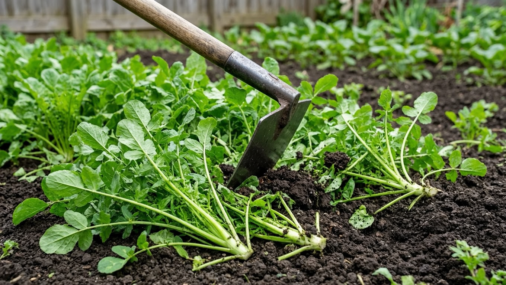

Грядка, освободившаяся в августе, за месяц зарастает сорняками, а верхний слой почвы пересыхает и выдувается. Сидераты решают обе задачи разом: занимают место, рыхлят землю корнями и к весне отдают ей органику. Но есть нюанс, из-за которого половина посевов работает вхолостую — **сидерат подбирают не по красоте, а по севообороту**: горчица после капусты вредит не меньше, чем сама капуста на том же месте второй год. Разберём, что сеять после чего, в какие сроки, сколько семян нужно на квадратный метр и когда всё это заделывать.

## 🌱 Что дают сидераты и почему их сеют именно осенью

Сидераты — растения, которые выращивают не ради урожая, а ради почвы. Осенний посев особенно выгоден:

- **корни рыхлят землю** без лопаты, оставляя после разложения каналы для воздуха и воды;
- **органика возвращается в почву** — зелёная масса перегнивает и работает как лёгкое удобрение;
- **сорнякам не остаётся места** — сидераты забивают их ростом;
- **почву не размывает и не выдувает** осенними дождями и зимними ветрами;
- **бобовые накапливают азот** прямо из воздуха;
- **некоторые виды оздоравливают грунт** — подавляют патогенов и отпугивают вредителей.

Важно понимать границы: сидераты **не заменяют навоз и минеральные подкормки** по количеству питания. Их сила в структуре почвы и её оздоровлении, а не в объёме питательных веществ. Чем именно подкормить сад и грядки осенью, разобрано в статье про [осенние подкормки](https://mir-doma.pro/osennie-podkormki/).

## 📊 Какие сидераты сеять осенью: таблица

| Сидерат | Семейство | Что даёт почве | Норма высева | Срок посева | Когда заделывать |
|---|---|---|---|---|---|
| **Горчица белая** | Крестоцветные | Рыхлит, подавляет патогенов и проволочника | 3–5 г/м² | до середины сентября | через 4–6 недель или оставить под зиму |
| **Фацелия** | Водолистниковые | Универсальна, снижает кислотность, медонос | 5–10 г/м² | до середины сентября | через 5–6 недель |
| **Редька масличная** | Крестоцветные | Мощный корень, разбивает плотный грунт | 2–3 г/м² | до середины сентября | через 5–6 недель |
| **Овёс** | Злаки | Структурирует почву, много зелёной массы | 15–20 г/м² | до конца сентября | вымерзает, оставляют мульчей |
| **Вика** | Бобовые | Накапливает азот | 15–18 г/м² | до середины сентября | через 5–6 недель |
| **Рожь озимая** | Злаки | Мощная корневая, давит сорняки | 15–20 г/м² | сентябрь–начало октября | **весной**, за 2–3 недели до посадки |

**Как читать таблицу под свою задачу:**

- **почва плотная, тяжёлая** → редька масличная или рожь: у них самые сильные корни;
- **нужен азот** → вика или другие бобовые;
- **был бактериоз, гнили, проволочник** → горчица или редька масличная (фитонциды крестоцветных подавляют патогенов);
- **не знаете, что выбрать, или на грядке росло всё подряд** → фацелия: она не родственна ни одной огородной культуре и подходит после чего угодно;
- **посеять хочется, а времени мало** → овёс: всходит быстро, зимой вымерзает и ложится мульчей, весной ничего заделывать не нужно.

Самая частая комбинация у дачников — **вико-овсяная смесь**: овёс даёт структуру и массу, вика — азот.

## ⚠️ Главное правило: севооборот

Сидерат — такое же растение, как культурное, и у него есть родня. **Нельзя сеять сидерат того же семейства, что и культура, которая росла или будет расти на грядке**: у них общие болезни и вредители, и вместо оздоровления вы получите накопление заразы в почве.

| Семейство | Сидераты | Нельзя сочетать с |
|---|---|---|
| **Крестоцветные** | Горчица белая, редька масличная, рапс, сурепица | Капуста, редис, редька, репа, дайкон, кресс-салат |
| **Бобовые** | Вика, люпин, горох, клевер | Горох, фасоль, бобы |
| **Злаки** | Рожь, овёс, ячмень | Кукуруза, злаковые культуры |
| **Водолистниковые** | **Фацелия** | **Ни с чем — универсальна** |

**Практические выводы:**

- после капусты, редиса и редьки **не сейте горчицу** — это одно семейство. Берите фацелию, овёс или вику.
- после гороха и фасоли не имеет смысла сеять вику — и семейство то же, и азота в почве уже достаточно.
- **фацелия — палочка-выручалочка**: единственная не пересекается с огородными культурами, её можно сеять где угодно и после чего угодно.

Отдельный момент про **рожь**: она подавляет сорняки лучше всех, но и сама трудно выводится, сильно иссушает почву и может привлечь проволочника. Её сеют там, где весной планируется картофель или другие крупные посадки, а не мелкосемянная зелень.

## 📅 Когда сеять: сроки и главный ориентир

Сеять нужно **сразу после уборки культуры**, пока почва тёплая и влажная. Чем раньше, тем больше массы успеет нарасти.

**Главный ориентир, важнее календаря:** от посева до устойчивых холодов должно оставаться **не меньше 30–40 дней**. За это время сидерат успевает подняться на 15–20 см — а именно ради этой зелёной массы всё и затевается. Если времени меньше, всходы уйдут под зиму слабыми, и толку будет мало.

**Ориентировочные сроки по регионам:**

| Регион | Крайний срок посева |
|---|---|
| Северо-Запад, Урал, Сибирь | до конца августа — начала сентября |
| Средняя полоса, Подмосковье | первая половина сентября |
| Юг России | до начала октября |

**Если опоздали** — есть два рабочих варианта:

1. Посеять **озимую рожь**: она уйдёт под снег и продолжит расти весной.
2. Посеять **овёс или горчицу поздно и не заделывать**: они не успеют нарастить массу, но всё равно прикроют почву и вымерзнут, оставив мульчу. Это лучше, чем голая грядка.

## 🌾 Как посеять: пошагово

Никакой сложной агротехники здесь нет, но пара деталей влияет на результат.

1. **Убрать растительные остатки** предшественника — ботву, сорняки, падалицу. Больные растения выносят с участка.
2. **Слегка разрыхлить** почву граблями или плоскорезом на 3–5 см. Перекапывать не нужно.
3. **Посеять вразброс** — самый простой способ. Семена рассыпают по грядке равномерно, придерживаясь нормы из таблицы.
4. **Заделать граблями**: мелкие семена (горчица, фацелия, редька) — на **1–2 см**, крупные (рожь, овёс, вика) — на **3–4 см**.
5. **Полить**, если почва сухая. Влага нужна для дружных всходов; при осенних дождях полив не требуется.
6. **Прикатать или прихлопать** поверхность — семена лучше контактируют с почвой.

**Норму лучше не превышать.** Загущённый посев даёт тонкие слабые растения, которые вытягиваются и полегают, а зелёной массы получается меньше, чем при нормальном.

## ✂️ Заделывать или оставить под зиму: развилка

Это второй вопрос после выбора сидерата, и однозначного ответа нет — есть два подхода.

**Вариант 1. Скосить и заделать осенью.**

Подходит, если сидерат нарос до 15–25 см и **до устойчивых холодов остаётся 2–3 недели** — этого хватит, чтобы зелень начала разлагаться.

- скосить плоскорезом, тяпкой или триммером;
- заделать в верхний слой на **5–8 см**, не глубже;
- при желании пролить раствором биопрепарата для ускорения разложения.

**Почему не глубже 5–8 см:** органика перегнивает с участием кислорода. Закопанная глубоко зелёная масса не превращается в перегной, а закисает без доступа воздуха — с неприятным запахом и без пользы. Это самая частая ошибка при заделке.

**Вариант 2. Скосить и оставить мульчей (или не трогать вовсе).**

Подходит для позднего посева и для тех, кто практикует минимальную обработку почвы.

- срезанную массу оставляют лежать на грядке — она перегниёт до весны и укроет почву от промерзания;
- **горчица и овёс** зимой вымерзают сами, их можно вообще не косить: полегут и лягут мульчей;
- весной остатки просто заделывают граблями перед посадкой.

**Отдельный случай — озимая рожь.** Её не трогают осенью: она зимует, весной идёт в рост и её скашивают и заделывают **за 2–3 недели до посадки** основной культуры. Если заделать позже, разлагающаяся масса будет угнетать всходы.

**Универсальное правило:** не давайте сидерату **зацвести и обсемениться**. После цветения стебли грубеют, разлагаются дольше, а самосев превращает сидерат в сорняк. Скашивают до или в самом начале цветения.

## 🍅 Сидераты в теплице

Отдельная история: в теплице почва истощается и накапливает болезни быстрее, чем на открытых грядках, поэтому сидераты там особенно полезны.

- сеют сразу после уборки томатов или огурцов;
- **лучший выбор — фацелия или горчица**: они подавляют патогенов, накопившихся за сезон;
- **не сейте в теплице то же семейство**, что и основная культура;
- сидераты не отменяют дезинфекцию: если летом была вспышка болезни, сначала обработка, потом посев — подробно в статье про [обработку теплицы осенью](https://mir-doma.pro/obrabotka-teplicy-osenyu/).

## ❌ Частые ошибки

- **Посеяли сидерат того же семейства**, что предшественник или будущая культура — накопили общие болезни вместо оздоровления.
- **Опоздали с посевом** — до холодов меньше месяца, масса не наросла, эффекта нет.
- **Заделали слишком глубоко** — органика закисает без доступа воздуха.
- **Дали зацвести и обсемениться** — сидерат превратился в сорняк, стебли огрубели.
- **Загустили посев** — растения вытянулись и полегли, массы меньше.
- **Посеяли рожь перед мелкосемянными культурами** — весной с ней трудно справиться, а почва иссушена.
- **Рассчитывают на сидераты как на полноценное удобрение** — они улучшают структуру, но не заменяют подкормки.

## ❓ Частые вопросы

**Какие сидераты сеять осенью?**
Универсальный выбор — фацелия: она не родственна огородным культурам и подходит после чего угодно. Для плотной почвы лучше редька масличная или рожь, для азота — вика, для оздоровления от гнилей и проволочника — горчица белая. Овёс хорош, когда времени мало.

**Когда сеять сидераты осенью?**
Сразу после уборки культуры, ориентируясь на главное правило: до устойчивых холодов должно оставаться не меньше 30–40 дней. В средней полосе это первая половина сентября, на Урале и в Сибири — конец августа, на юге — до начала октября.

**Сколько семян нужно на квадратный метр?**
Горчица — 3–5 г, фацелия — 5–10 г, редька масличная — 2–3 г, овёс и рожь — 15–20 г, вика — 15–18 г на м². Норму лучше не превышать: загущённый посев даёт слабые вытянутые растения.

**Нужно ли закапывать сидераты осенью?**
Не обязательно. Если масса наросла и до холодов есть 2–3 недели, их скашивают и заделывают на 5–8 см. При позднем посеве проще оставить как есть: горчица и овёс вымерзнут и лягут мульчей, а весной остатки заделывают граблями.

**На какую глубину заделывать сидераты?**
На 5–8 см, не глубже. Глубоко закопанная зелёная масса не перегнивает, а закисает без доступа кислорода — пользы не будет, зато появится неприятный запах.

**Можно ли сеять горчицу после капусты?**
Нет. Горчица и капуста — крестоцветные, у них общие болезни и вредители, и такой посев накапливает заразу в почве вместо оздоровления. После капусты, редиса и редьки сейте фацелию, овёс или вику.

**Что делать с сидератами весной?**
Озимую рожь скашивают и заделывают за 2–3 недели до посадки основной культуры, иначе разлагающаяся масса будет угнетать всходы. Остатки вымерзших сидератов просто заделывают граблями в верхний слой.

---

Сидераты — самый дешёвый способ привести грядки в порядок: пакет семян стоит копейки, а работы на полчаса. Запомните три вещи — **сеять сразу после уборки, проверять семейство по севообороту и заделывать неглубоко** — и к весне почва станет заметно рыхлее.

**Куда идти дальше:**

- Сидераты структурируют почву, но питание ей дают подкормки — что и когда вносить под деревья, кусты и грядки: [осенние подкормки](https://mir-doma.pro/osennie-podkormki/).
- Если после сидератов планируете озимую посадку, сроки придётся состыковать: как и когда сажать [чеснок под зиму](https://mir-doma.pro/chesnok-pod-zimu/).
- В теплице сидераты работают только после дезинфекции — иначе вы сеете в грунт с накопленной инфекцией: [обработка теплицы осенью](https://mir-doma.pro/obrabotka-teplicy-osenyu/).
- И полный список осенних дел, чтобы ничего не забыть до морозов: [подготовка сада к зиме](https://mir-doma.pro/podgotovka-sada-k-zime/).
