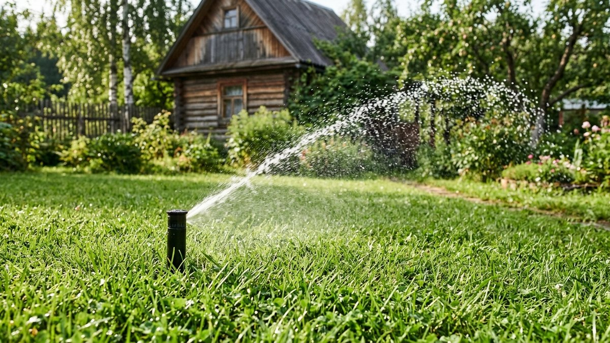
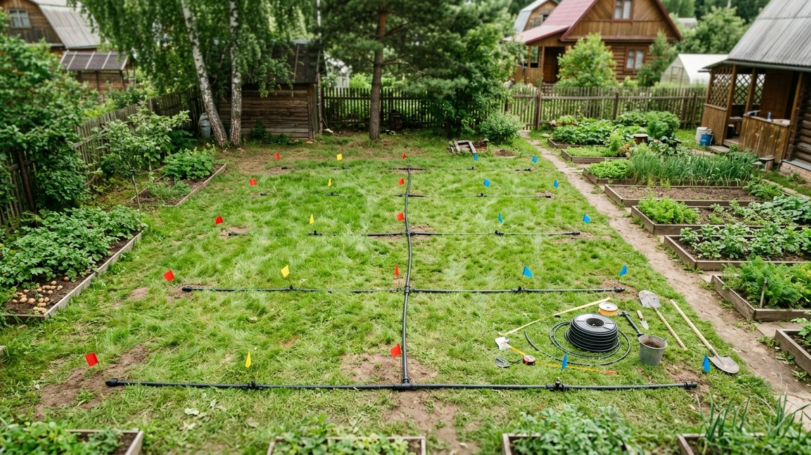
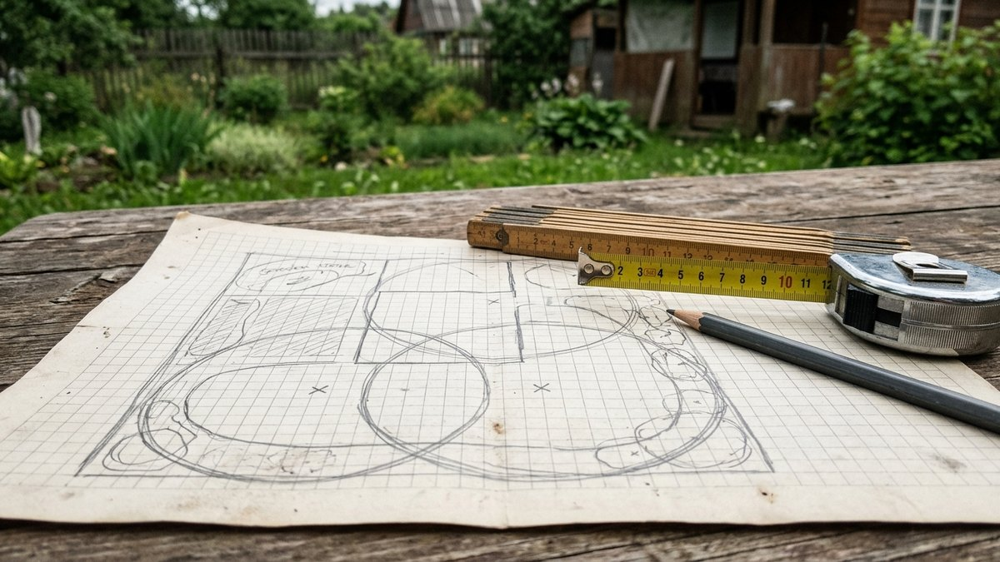
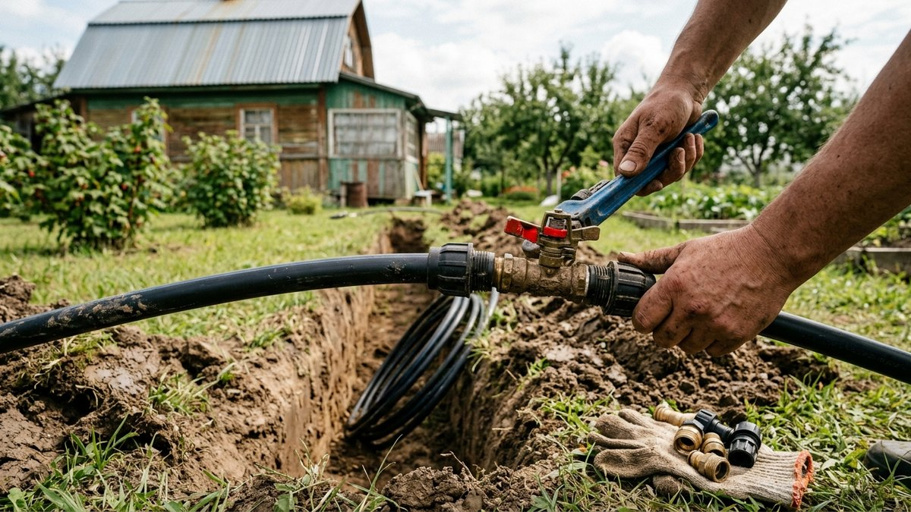
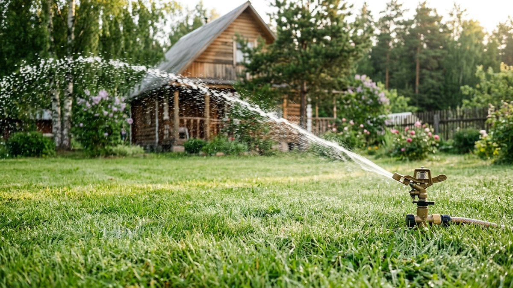
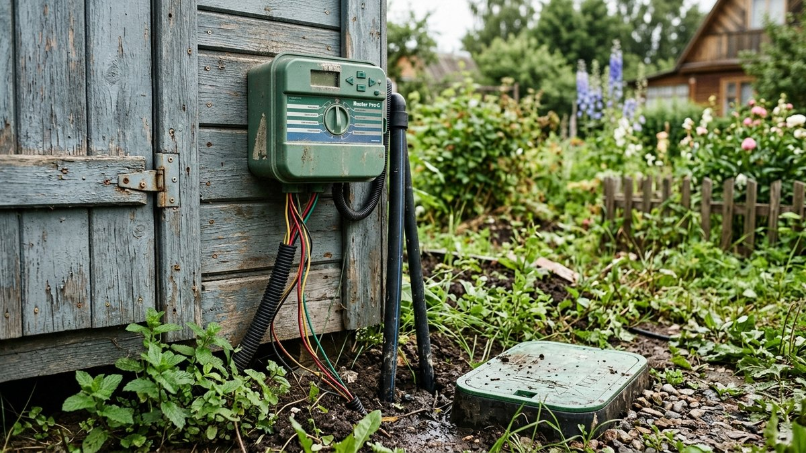

Газон, который поливают шлангом от случая к случаю, желтеет пятнами — где-то
воды слишком много, где-то не хватает совсем. Автоматическая система с
дождевателями решает это раз и навсегда: вода льётся равномерно, по
расписанию и без вашего участия. В статье — из чего состоит система,
как рассчитать зоны полива и как собрать всё своими руками.

*Автоматический полив газона на дачном участке*

## Из чего состоит система

- **Источник воды** — водопровод, скважина или накопительная ёмкость с
  насосом, дающим нужное давление;
- **Магистральные трубы** — обычно полиэтиленовые или ПВХ, прокладываются
  под землёй ниже уровня скашивания;
- **Клапаны зон полива** — делят газон на участки, которые поливаются по
  очереди, а не одновременно, чтобы хватало давления;
- **Дождеватели (спринклеры)** — выдвижные роторные или веерные насадки,
  прячутся в грунт заподлицо с газоном и поднимаются только во время полива;
- **Контроллер (таймер)** — задаёт расписание и длительность полива по
  зонам, у продвинутых моделей — ещё и с датчиком дождя или влажности почвы.

Если участок запитан от собственной скважины, узел подключения удобно
спрятать в [декоративный домик для
скважины](https://mir-doma.pro/domik-dlya-skvazhiny-na-dache/) — заодно
защитит арматуру от мороза и мусора.

*Схема системы автополива газона*

## Роторные и веерные дождеватели: что выбрать

- **Веерные (спрей)** — поливают сектор до 5 м радиусом плоским веером
  воды, подходят для небольших и средних газонов и клумб у дорожек.
- **Роторные** — вращающаяся струя бьёт на 5–12 м, расходуют воду
  экономнее веерных на квадратный метр и лучше подходят для больших
  открытых лужаек.

На одном участке систему часто комбинируют: роторные — на открытой площади
газона, веерные — вдоль узких полос у дорожек и клумб, где радиус
роторных избыточен.

## Расчёт зон полива

Одна зона объединяет дождеватели с похожим расходом воды, чтобы давление в
системе не проседало. Количество зон зависит от давления в источнике и
суммарного расхода насадок: если давления не хватает на весь газон
одновременно, участок делят на 2–4 зоны, которые поливаются по очереди по
расписанию контроллера. Дождеватели в одной зоне располагают так, чтобы
радиусы полива соседних насадок перекрывались на 10–15% — иначе между ними
остаются сухие полосы.

*Расчёт зон полива на плане участка*

## Пошаговый монтаж

1. **Начертите план газона** с расположением дождевателей и разметьте зоны
   полива с учётом перекрытия радиусов.
2. **Выкопайте траншеи** под магистральные трубы глубиной 20–30 см — этого
   достаточно, чтобы не повредить их при аэрации газона граблями или
   вилами, но необходимо для труб основной подачи копать глубже, ниже
   уровня промерзания, если система не консервируется на зиму полностью.
3. **Проложите трубы** от источника воды к каждой зоне, установите клапаны
   зон в удобном для обслуживания месте — обычно в пластиковом коробе
   вровень с землёй.
4. **Установите дождеватели** на нужных точках, подключив их к трубе через
   гибкую вставку — она компенсирует небольшие смещения при промерзании
   грунта.
5. **Подключите контроллер** к клапанам зон и источнику питания, настройте
   расписание полива по зонам.
6. **Проверьте систему** — включите каждую зону по отдельности, проверьте
   перекрытие радиусов и отсутствие протечек в местах соединений.
7. **Засыпьте траншеи**, утрамбуйте грунт и досейте газонную траву на
   потревоженных полосах, если она пострадала при копке.

*Прокладка труб и установка дождевателей*

## Режим полива для газона

Газон поливают редко, но обильно — так корни тянутся глубже и трава лучше
переносит жару. Оптимально — 1–2 полива в неделю рано утром, по
15–20 минут на зону в зависимости от расхода дождевателей, а не ежедневно
понемногу: частый поверхностный полив приучает корни оставаться у
поверхности, и газон быстрее выгорает в засуху.

*Роторный дождеватель во время полива*

*Контроллер с расписанием полива по зонам*

## Частые ошибки

- **Дождеватели без перекрытия радиусов** — между насадками остаются сухие
  полосы, которые желтеют первыми в жару.
- **Все зоны запущены одновременно** — давления не хватает, дождеватели
  «недобивают» и поливают неравномерно.
- **Трубы уложены слишком мелко** — их повреждают вилами или скарификатором
  при уходе за газоном.
- **Нет клапана зон, только один общий кран** — систему невозможно
  настроить по-разному под солнечные и тенистые участки газона, которым
  нужна разная норма полива.
- **Систему не консервируют на зиму** — вода, оставшаяся в трубах и
  дождевателях, при замерзании разрывает их. Как правильно готовить систему
  к холодам — в статье [как законсервировать систему полива на
  зиму](https://mir-doma.pro/konservaciya-poliva-na-zimu/).

## Частые вопросы

### Сколько стоит система автополива газона под ключ

Цена сильно зависит от площади газона, числа зон и типа дождевателей —
роторные насадки и контроллер с датчиками обходятся дороже простых
веерных моделей. При монтаже своими руками экономия идёт за счёт стоимости
работ — материалы всё равно нужно закладывать по площади и числу зон.

### Как устроена система автоматического полива газона

Вода от источника идёт по магистральным трубам к клапанам зон, контроллер
по расписанию открывает нужный клапан, и дождеватели в этой зоне
выдвигаются из грунта и поливают закреплённый за ними участок, а затем
убираются обратно вровень с газоном.

### Нужен ли насос для системы полива газона

Нужен, если давления в водопроводе или скважине не хватает для одновременной
работы дождевателей одной зоны — обычно это актуально при поливе от
накопительной бочки или маломощной скважины. От магистрального водопровода
с достаточным напором насос может не потребоваться.

### Можно ли сделать систему полива газона без электричества

Полностью механическую систему без контроллера сделать можно, но тогда
включать и выключать зоны придётся вручную краном — теряется главное
преимущество автополива. Есть автономные контроллеры на батарейках, которым
не нужна проводка к электросети.

### На какую глубину закапывать трубы для полива газона

Магистральные трубы прокладывают на 20–30 см, ниже уровня работы граблей и
скарификатора при уходе за газоном. Если система не консервируется зимой
полностью, трубы с водой в холодное время года нужно укладывать ниже
глубины промерзания грунта в вашем регионе.

### Как часто нужно поливать газон автополивом

Оптимально — 1–2 раза в неделю обильно, а не ежедневно понемногу: это
приучает корни травы уходить глубже и делает газон устойчивее к жаре и
засухе.
