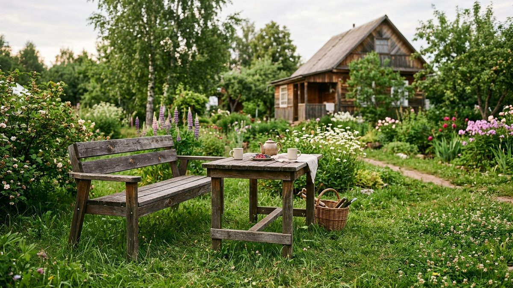
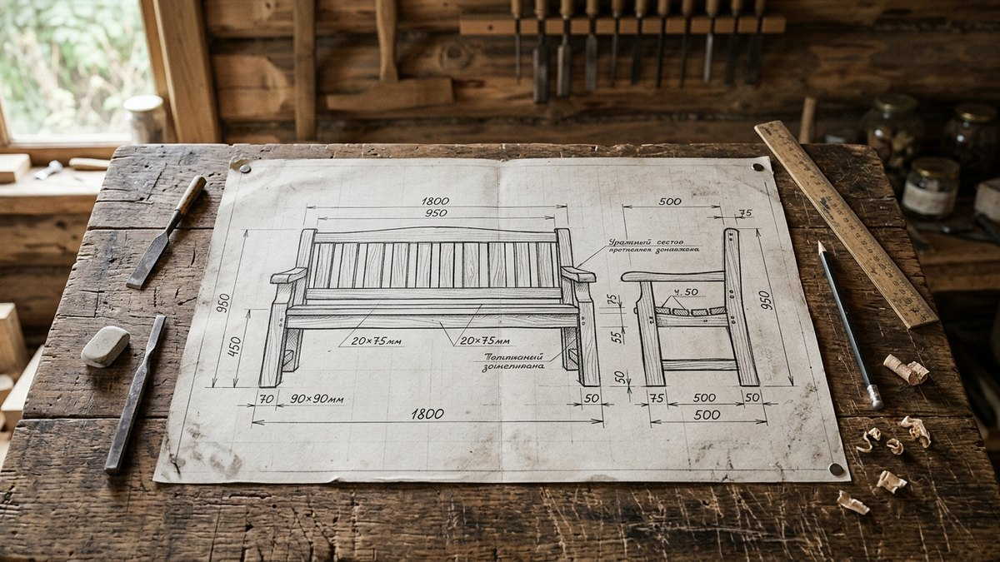
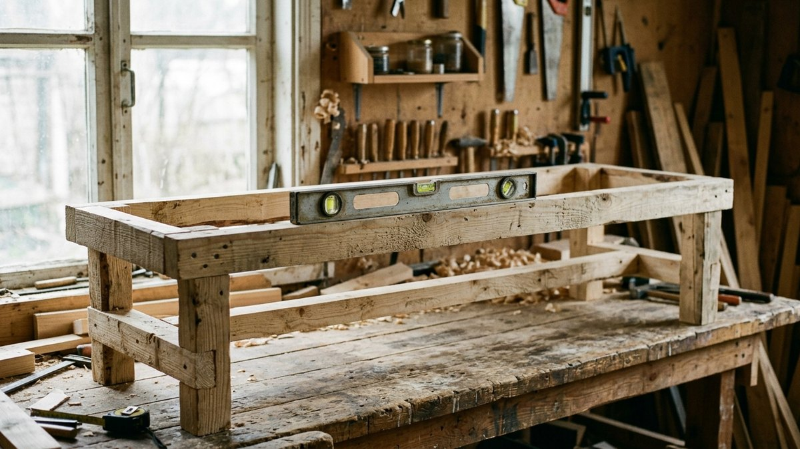
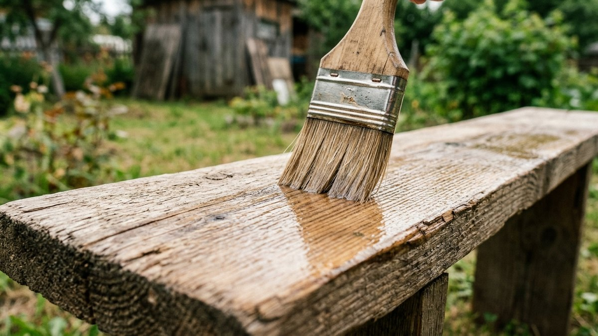
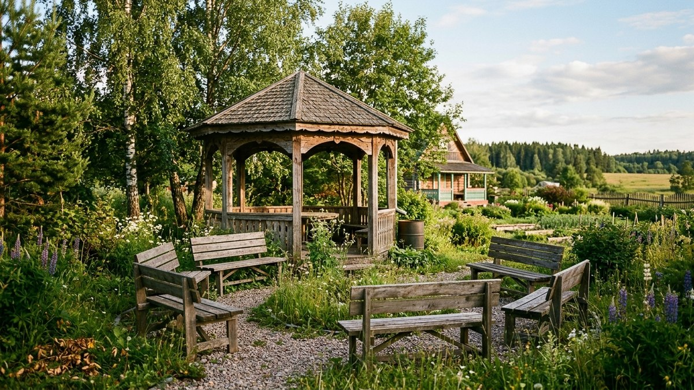
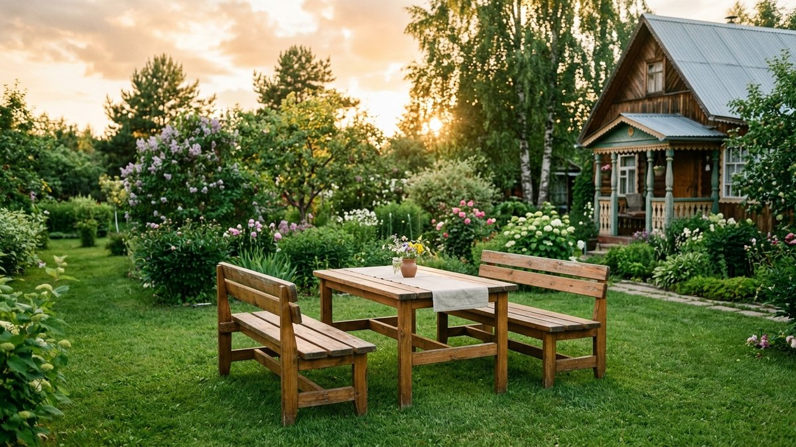

# Скамейка для дачи своими руками: чертежи и сборка

Скамейка без расчёта высоты сиденья и жёсткого каркаса шатается уже после
первого сезона или оказывается неудобной — слишком низкой или слишком
глубокой. Разберём, какую конструкцию выбрать, как рассчитать размеры под
рост и высоту стола, из чего собрать каркас и чем защитить дерево на
улице, чтобы скамейка простояла не один сезон.

## Какую скамейку сделать

- **Простая скамья без спинки** — самая быстрая в сборке, подходит к
  обеденному столу или для расстановки по периметру беседки.
- **Скамья со спинкой** — удобнее для долгого сидения, но требует больше
  материала и более жёсткого каркаса из-за нагрузки на спинку.
- **Скамья-ящик** — сиденье откидывается, внутри хранятся подушки или
  садовый инвентарь. Хороший вариант, если место для хранения на участке
  ограничено.

## Чертёж и размеры

Скамейку удобнее всего рассчитывать под уже имеющийся стол — тогда высота
сиденья и стола совпадут по эргономике. Ориентиры:

- **Высота сиденья** — 42–45 см от земли.
- **Глубина сиденья** — 35–40 см, глубже уже неудобно без спинки.
- **Длина** — под стол, которым будете пользоваться: если стол
  рассчитан на 6 человек, длину скамьи под него разбирали в статье
  [стол для дачи своими руками](https://mir-doma.pro/stol-dlya-dachi-svoimi-rukami/) —
  логика расчёта места на человека (по 55–60 см) та же.
- **Высота спинки** (если есть) — 35–40 см от сиденья, с наклоном
  5–10 градусов назад для удобства.

На чертеже отмечают сиденье, четыре или шесть ножек (в зависимости от
длины) и царги — горизонтальные перемычки, которые держат жёсткость
конструкции и не дают ножкам разъезжаться под нагрузкой.

## Материалы и инструмент

- **Доска для сиденья** — 25–30 мм толщиной, хвоя или лиственница.
- **Брус для ножек** — 40×40 или 50×50 мм, сечение зависит от длины
  скамьи: чем длиннее пролёт между ножками, тем толще нужен брус.
- **Царги** — доска 20×70–100 мм.
- Из инструмента: ножовка или пила, шуруповёрт, уровень, рулетка,
  наждачная бумага, антисептик для наружных работ.

## Пошаговая сборка

1. **Раскрой деталей** по чертежу — сиденье, ножки, царги, при
   необходимости спинка.
2. **Сборка каркаса ножек**: две пары ножек соединяют царгами в жёсткие
   П-образные опоры.
3. **Соединение опор продольными царгами** — они держат опоры на нужном
   расстоянии и дают продольную жёсткость всей конструкции.
4. **Крепление сиденья** саморезами сверху, с зазором 5–7 мм между
   досками для стока воды и вентиляции.
5. **Шлифовка** всех кромок и углов наждачной бумагой — убирает занозы и
   острые срезы.

## Защита от влаги и финиш

Готовую скамейку обрабатывают антисептиком для наружных работ в 2 слоя,
уделяя особое внимание торцам досок и нижним концам ножек — они впитывают
влагу от земли быстрее, чем плоские поверхности. Декоративный лак или
масляная краска без пропитки — не лучший выбор для уличной мебели: под
плёнкой влага, попавшая внутрь древесины, не уходит, и дерево гниёт
незаметно. Похожий принцип защиты дерева на улице действует и для мебели
из поддонов — разбор в статье [садовая мебель из поддонов своими
руками](https://mir-doma.pro/sadovaya-mebel-iz-poddonov/).

## Где поставить скамейку

Скамейку без спинки удобно расставлять по периметру беседки или у мангала
— компактно и не мешает проходу. Проекты этих построек с чертежами
разобраны в статьях [беседка своими руками](https://mir-doma.pro/besedka-svoimi-rukami/)
и [навес для мангала своими руками](https://mir-doma.pro/naves-dlya-mangala-svoimi-rukami/).
Ещё один вариант — поставить пару скамеек под [перголой на даче своими
руками](https://mir-doma.pro/pergola-na-dache-svoimi-rukami/): решётчатая
крыша даёт лёгкую тень, а зона отдыха обходится дешевле закрытой беседки.

## Частые ошибки

- **Делают сиденье без зазора между досками** — вода застаивается,
  дерево темнеет и гниёт быстрее.
- **Экономят на сечении ножек при длинной скамье** — тонкие ножки
  прогибаются и шатаются под нагрузкой нескольких человек.
- **Красят декоративным лаком без пропитки-антисептика** — влага
  запечатывается под плёнкой, гниение идёт изнутри незаметно.
- **Не обрабатывают торцы и нижние концы ножек** — именно там дерево
  чаще всего начинает гнить в первую очередь.

## Частые вопросы

**Какой высоты должна быть скамейка для дачи?**
Оптимальная высота сиденья — 42–45 см от земли, это совпадает с высотой
большинства обеденных дачных столов.

**Из какого дерева лучше делать скамейку для улицы?**
Хвойные породы или лиственница с обработкой антисептиком для наружных
работ — практичный и доступный вариант для уличной мебели.

**Нужна ли скамейке спинка?**
Не обязательно — скамья без спинки быстрее в сборке и компактнее у стола
или беседки. Спинка нужна, если планируется долгое сидение, например
у костра или мангала.

**Чем покрыть скамейку, чтобы она не гнила на улице?**
Пропиткой-антисептиком для наружных работ в 2 слоя, с особым вниманием к
торцам досок. Декоративный лак и краска без пропитки хуже защищают от
гниения.

**Сколько прослужит деревянная скамейка на улице?**
При правильной обработке антисептиком и ежегодном обновлении покрытия —
5–10 лет и больше, в зависимости от породы дерева и климата.
