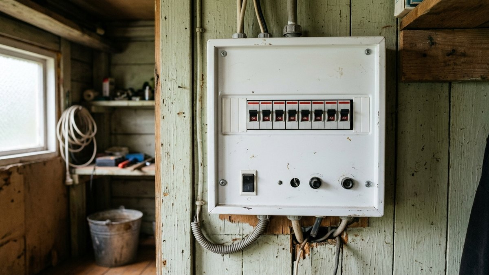
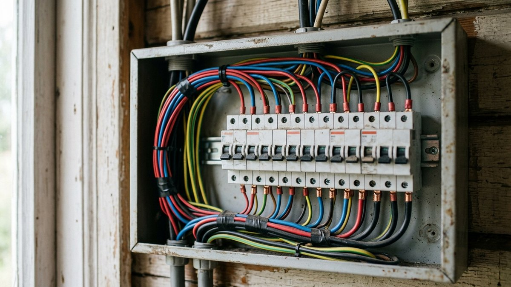
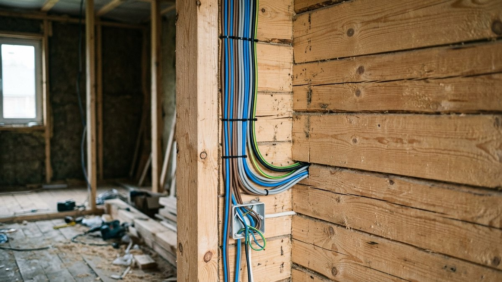
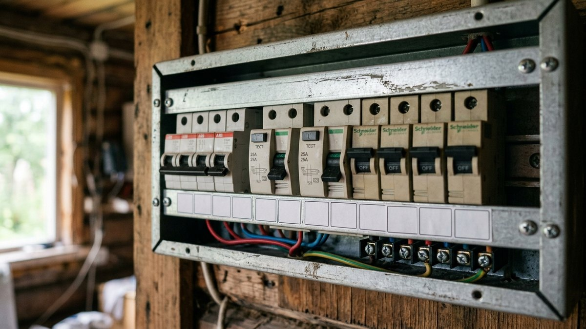
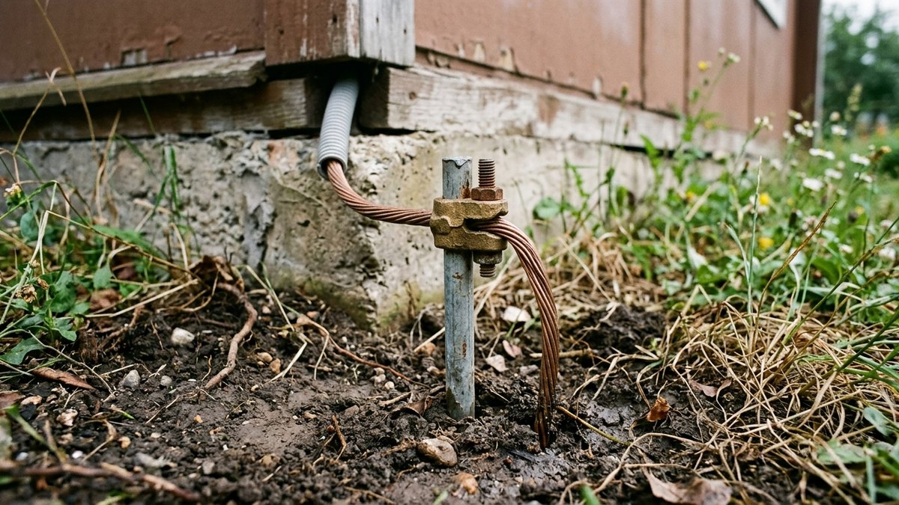
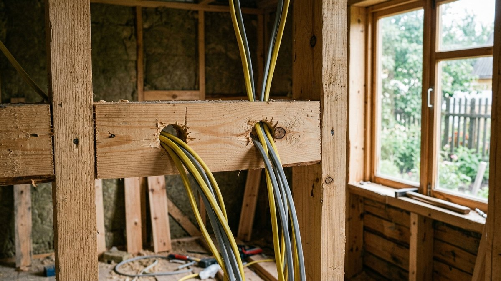

Как рассчитать нагрузку и выбрать сечение кабеля, на сайте уже разобрано подробно. Здесь — практический вопрос следующего шага: как разбить дом на группы, сколько нужно автоматов и УЗО и как обычно выглядит схема для типового дачного дома. В конце — калькулятор материалов под вашу планировку.

## Принцип деления на группы

Проводку никогда не делают одним общим кабелем на весь дом — если он выбьет, света не будет нигде, а при коротком замыкании сгорит вся линия. Дом делят на группы, каждая — свой автомат, иногда свой УЗО:

- **По комнатам** — одна-две смежные комнаты на группу освещения и группу розеток.
- **По мощным потребителям отдельно** — кухня с плитой и техникой, санузел со стиральной машиной и водонагревателем всегда выделяются в отдельные группы.
- **По зонам риска** — всё, что связано с водой (санузел, кухня, улица), обязательно через УЗО: эти группы чаще всего под угрозой утечки тока.
- **Свет и розетки — раздельно.** Если выбьет группу розеток, освещение должно остаться рабочим, и наоборот.

Как рассчитать сечение кабеля под нагрузку каждой группы и общую мощность ввода — подробно в статье [как провести электричество на даче](https://mir-doma.pro/elektrichestvo-na-dache-svoimi-rukami/).

## Готовая схема для дома 1–2 комнаты + кухня

Типовой дачный домик без отдельного санузла внутри:

1. Вводной автомат.
2. Группа освещения, весь дом — один автомат 10А, если комнат немного.
3. Группа розеток, жилая часть — автомат 16А.
4. Группа кухни (плита, чайник, холодильник) — отдельный автомат 16–25А через УЗО.
5. Группа наружного освещения и розеток на улице — автомат 16А через УЗО.

Итого — 5 автоматов, из них 2 с УЗО.

## Готовая схема для дома с кухней и санузлом

Для дома с внутренним санузлом и стиральной машиной или водонагревателем добавляются две группы:

1. Вводной автомат.
2. Группа освещения — 1–2 автомата на весь дом в зависимости от площади.
3. Группа розеток жилых комнат.
4. Группа кухни через УЗО.
5. Группа санузла (розетка под стиральную машину, водонагреватель) через отдельное УЗО — санузел всегда изолируют от кухонной группы, а не объединяют.
6. Группа наружного освещения и розеток через УЗО.

Итого — 6–7 автоматов, из них 3 с УЗО.

## Что учесть при разводке

- **Розетки на кухне** — минимум 4–5 точек с учётом отдельной под холодильник, который не стоит вырубать вместе с общей группой.
- **Санузел** — розетка под стиральную машину и, если есть, под водонагреватель, ставят отдельными линиями, не через удлинитель от жилой комнаты.
- **Веранда и улица** — отдельная группа обязательна, если есть уличное освещение или розетка для инструмента: она чаще других страдает от влаги и требует своего УЗО. Отдельная группа удобна и тем, что её проще всего обесточить на зиму — что ещё отключают перед холодами, в статье [консервация дачи на зиму](https://mir-doma.pro/konservaciya-dachi-na-zimu/).
- **Резерв под будущее** — 1–2 свободных места в щитке для группы, которая понадобится позже (кондиционер, насос, тёплый пол), дешевле оставить сразу, чем менять щиток целиком.

## Калькулятор: материалы под вашу планировку

Укажите состав дома — калькулятор прикинет число автоматов, УЗО, метраж кабеля и ориентир по стоимости материалов.

<!-- wp:html -->

<h3 class="md-ep__title">Калькулятор электропроводки</h3>

Ориентир по материалам без стоимости работы электрика — она считается отдельно по числу точек.

<label class="md-ep__f">Жилых комнат<input type="number" id="epRooms" value="2" min="1" max="10" step="1"></label>
<label class="md-ep__f">Расстояние от щитка до дальней точки, м<input type="number" id="epDist" value="15" min="1" max="100" step="1"></label>

<label class="md-ep__chk"><input type="checkbox" id="epKitchen" checked>Кухня</label>
<label class="md-ep__chk"><input type="checkbox" id="epBath" checked>Санузел / стиральная машина</label>
<label class="md-ep__chk"><input type="checkbox" id="epOut" checked>Улица / веранда</label>

Групп (автоматов)<b id="epGroups">0</b>

Из них с УЗО<b id="epUzo">0</b>

Кабель, ориентир<b id="epCable">0 м</b>

Материалы, ориентир<b id="epCost">—</b>

Ориентир без учёта сложной планировки, второго этажа и мощных отдельных потребителей вроде тёплого пола.

<button type="button" id="epCopy" class="md-ep__btn md-ep__btn--main">Скопировать результат</button>
<a id="epVk" class="md-ep__btn md-ep__btn--vk" href="#" target="_blank" rel="noopener noreferrer">Поделиться ВКонтакте</a>
<a id="epTg" class="md-ep__btn md-ep__btn--tg" href="#" target="_blank" rel="noopener noreferrer">Поделиться в Telegram</a>
<button type="button" id="epPrint" class="md-ep__btn">Печать</button>

<!-- /wp:html -->

## Заземление и провод для каждой группы

Для розеточных групп используют трёхжильный кабель с заземляющей жилой — без заземления современная бытовая техника (стиральная машина, водонагреватель) небезопасна при пробое изоляции. Для группы освещения заземление тоже желательно, хотя многие светильники обходятся без него. Подробно про контур заземления и его монтаж — в статье [как провести электричество на даче](https://mir-doma.pro/elektrichestvo-na-dache-svoimi-rukami/). Это отдельная задача от молниезащиты дома — той для отвода прямого удара молнии, устройство разобрано в статье [как сделать молниезащиту в частном доме](https://mir-doma.pro/molniezashchita-chastnogo-doma/).

## Частые ошибки

- **Одна группа на весь дом.** Если пробьёт проводку в одной комнате, без электричества остаётся весь дом — деление на группы существует именно для локализации проблемы.
- **Санузел и кухня в одной группе с УЗО.** При срабатывании УЗО в кухне выбивает и санузел — их разделяют, даже если оба «мокрые» помещения.
- **Экономия на сечении кабеля для мощных групп.** Кухня с электроплитой и чайником требует более толстого кабеля, чем освещение — использование одного сечения на всё приводит к перегреву проводки под нагрузкой.
- **Отсутствие резервных мест в щитке.** Через пару лет обычно появляется что-то новое (кондиционер, насос) — щиток без запаса модулей приходится менять целиком.

## Частые вопросы

### Сколько групп нужно на маленький дачный домик?

Для домика в одну-две комнаты без отдельного санузла обычно достаточно 4–5 групп: освещение, розетки, кухня, улица — плюс вводной автомат.

### Обязательно ли УЗО на каждую группу?

Нет, УЗО обязательно на группы с повышенным риском — кухня, санузел, улица, влажные помещения. На группу освещения в сухой комнате УЗО не требуется, хотя не будет лишним.

### Можно ли объединить розетки и освещение в одну группу в маленьком доме?

Технически можно, но не рекомендуется даже в маленьком доме: при срабатывании автомата вы останетесь без света и без розеток одновременно, в том числе вечером.

### Какой автомат ставить на группу с электроплитой?

Зависит от мощности плиты — обычно 25–32А с кабелем увеличенного сечения (не менее 4 мм²). Точный номинал считают по паспортной мощности конкретной плиты.

### Нужен ли отдельный автомат на насос и скважину?

Да, насос — отдельная группа, обычно с УЗО, особенно если оборудование стоит на улице или в неотапливаемом помещении. Подробнее — в статье [скважина или колодец](https://mir-doma.pro/skvazhina-ili-kolodec/).

### Сколько стоит развести электропроводку в дачном доме своими руками?

По калькулятору выше — только материалы, без оплаты работы электрика. Для дома с 2 комнатами, кухней и санузлом ориентир — 35 000–45 000 ₽ на материалы; итоговая цена зависит от расстояний и сложности планировки.
