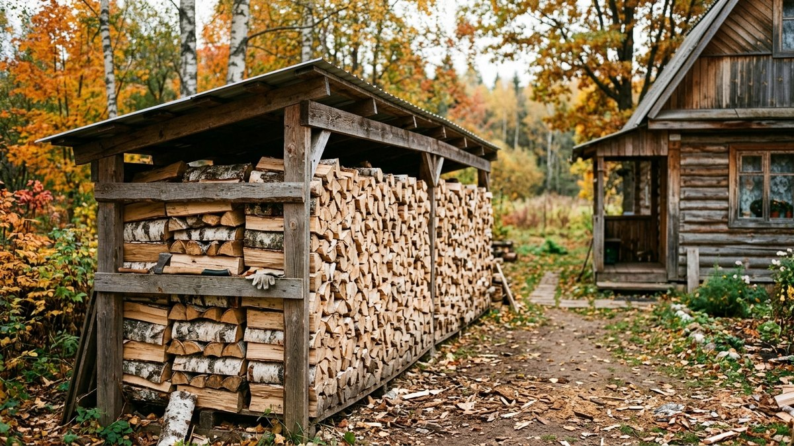
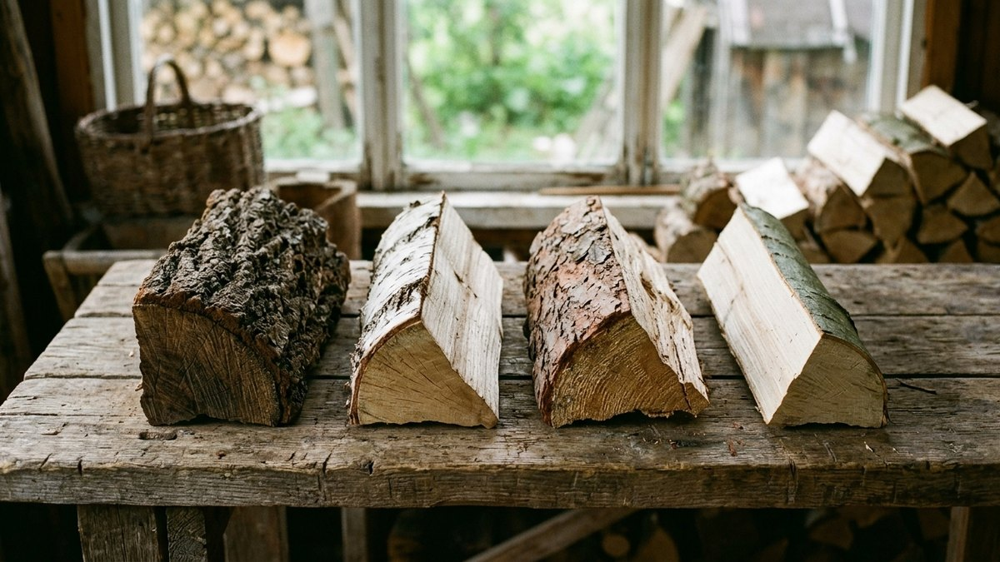
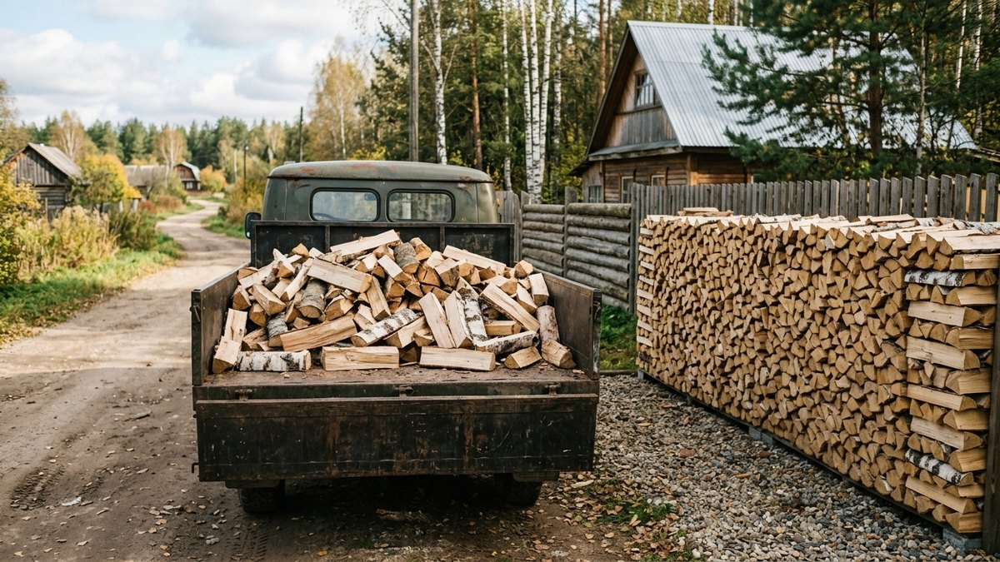
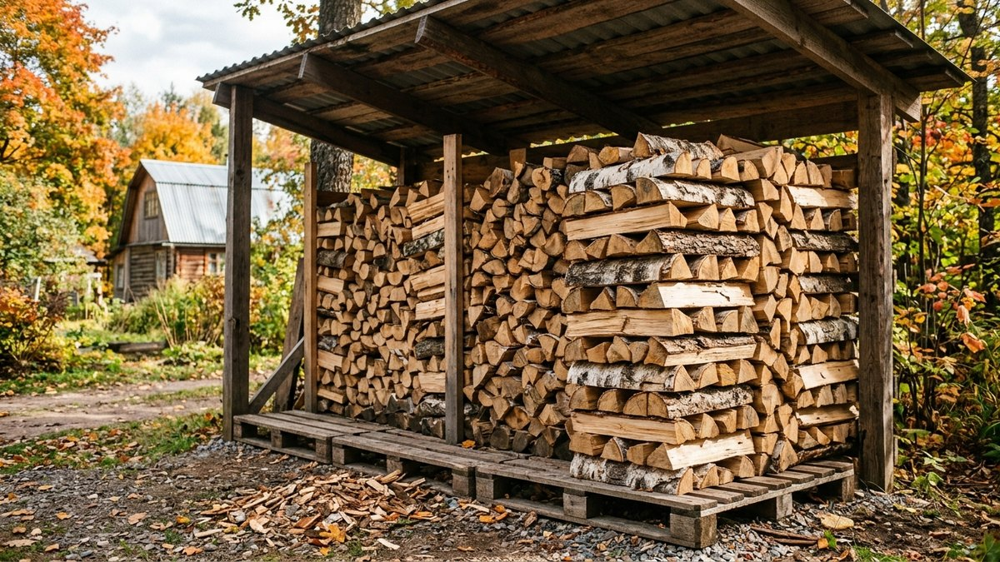
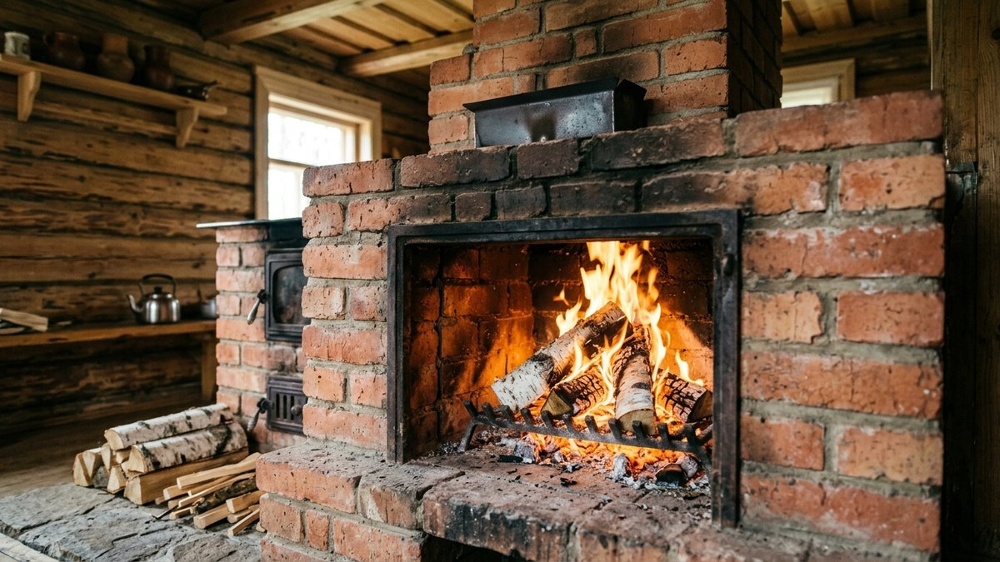
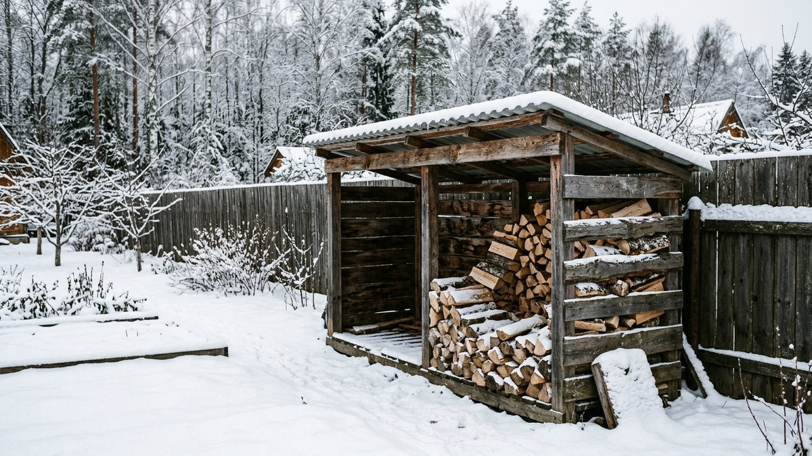

# Сколько дров нужно на зиму: расчёт кубометров для дома и дачи

«Сколько дров брать на зиму» — вопрос, на который соседи отвечают
по-разному: кто-то сжигает пять кубов, кто-то пятнадцать, и оба правы.
Расход зависит от площади дома, утепления, породы дров, их влажности,
печи и того, живёте вы на даче постоянно или приезжаете на выходные.
Разберём, как посчитать, сколько дров нужно на зиму именно вам, чем
складочный кубометр отличается от насыпного и почему сырые дрова
обходятся дороже сухих, даже если они дешевле за куб. В калькуляторе
ниже учтены все эти факторы.

## От чего зависит расход дров

1. **Сколько тепла теряет дом.** Главный множитель — утепление. Дом без
   утепления в средней полосе за сезон постоянного отопления теряет
   150–200 кВт·ч на каждый квадратный метр, со стандартным утеплением —
   80–120, хорошо утеплённый — 40–70. Разница в три-четыре раза.
2. **Порода дров.** Кубометр дуба даёт почти в полтора раза больше тепла,
   чем кубометр осины.
3. **Влажность.** Свежесрубленная древесина тратит заметную часть энергии
   на испарение воды. Сухие дрова дают больше тепла с каждого куба.
4. **Печь или котёл.** Металлическая печь отдаёт в дом около половины
   энергии дров, кирпичная и котёл длительного горения — больше.
5. **Режим.** Постоянное проживание или выезды на выходные меняют
   расход в разы.
6. **Климат.** На юге сезон короче и мягче, на Урале и в Сибири — длиннее
   и холоднее.

Как утепление влияет на расходы при любом топливе и что выгоднее —
дрова, газ или электричество, — в статье
[отопление дачи: что дешевле](https://mir-doma.pro/otoplenie-dachi-chto-deshevle/).

## Сколько тепла в кубометре дров

Ориентиры для складочного кубометра (дрова, уложенные в поленницу) при
влажности около 20%, то есть после сушки под навесом:

| Порода | Тепла в складочном м³, примерно |
|---|---|
| Дуб, ясень | 1900–2000 кВт·ч |
| Берёза | 1750–1850 кВт·ч |
| Ольха | около 1500 кВт·ч |
| Сосна | около 1450 кВт·ч |
| Осина, липа | около 1400 кВт·ч |

Это приблизительные значения: реальная теплотворность зависит от
конкретной партии, плотности и влажности. Для сравнения пород их
достаточно, для точной закупки лучше взять запас 10–15%.

## Калькулятор: сколько дров нужно на зиму

<!-- wp:html -->

  
Сколько кубов дров нужно на сезон

  <label class="md-calc__label" for="mdWdS">Отапливаемая площадь, м²</label>
  <input type="number" id="mdWdS" class="md-calc__input" min="10" step="5" value="60">
  <label class="md-calc__label" for="mdWdI">Утепление дома</label>
  <select id="mdWdI" class="md-calc__input">
    <option value="175">Без утепления</option>
    <option value="100" selected>Стандартное</option>
    <option value="55">Хорошее</option>
  </select>
  <label class="md-calc__label" for="mdWdR">Регион</label>
  <select id="mdWdR" class="md-calc__input">
    <option value="0.7">Юг</option>
    <option value="1" selected>Средняя полоса</option>
    <option value="1.3">Урал, Сибирь, север</option>
  </select>
  <label class="md-calc__label" for="mdWdM">Режим</label>
  <select id="mdWdM" class="md-calc__input">
    <option value="1">Живём постоянно всю зиму</option>
    <option value="0.4" selected>Приезжаем на выходные</option>
    <option value="0.2">Приезжаем пару раз в месяц</option>
  </select>
  <label class="md-calc__label" for="mdWdW">Порода дров</label>
  <select id="mdWdW" class="md-calc__input">
    <option value="1950">Дуб, ясень</option>
    <option value="1800" selected>Берёза</option>
    <option value="1500">Ольха</option>
    <option value="1450">Сосна</option>
    <option value="1400">Осина, липа</option>
  </select>
  <label class="md-calc__label" for="mdWdH">Влажность дров</label>
  <select id="mdWdH" class="md-calc__input">
    <option value="1" selected>Сухие (сохли под навесом год)</option>
    <option value="0.75">Подсохшие (один сезон)</option>
    <option value="0.6">Свежесрубленные</option>
  </select>
  <label class="md-calc__label" for="mdWdK">Чем топите</label>
  <select id="mdWdK" class="md-calc__input">
    <option value="0.55">Металлическая печь</option>
    <option value="0.7" selected>Кирпичная печь</option>
    <option value="0.75">Котёл длительного горения</option>
  </select>
  
Заполните поля

<!-- /wp:html -->

Режим «на выходные» — грубая оценка: прогрев промёрзшего дома
съедает больше дров, чем поддержание тепла, поэтому два дня в неделю
обходятся заметно дороже, чем 2/7 от постоянного проживания. Если
возможно, держите дом на дежурной плюсовой температуре электричеством:
как это сделать с телефона, разобрано в статье
[удалённое управление отоплением на даче](https://mir-doma.pro/udalennoe-upravlenie-otopleniem-na-dache/).

## Складочный, насыпной и плотный кубометр

Дрова продают тремя «кубами», и путаница в них — главный способ
переплатить.

- **Плотный кубометр** — кубометр сплошной древесины без пустот.
  Так считают круглый лес на лесопилке.
- **Складочный кубометр (складометр)** — дрова, аккуратно уложенные в
  поленницу 1×1×1 м. Древесины в нём около 0,7 плотного, остальное —
  воздух между поленьями.
- **Насыпной кубометр** — дрова, свалённые навалом в кузов. Древесины в
  нём ещё меньше, около половины плотного.

Калькулятор выше считает в складочных кубометрах — так удобнее всего
проверять: сложили в поленницу, измерили длину, высоту и глубину.

**Как не переплатить:**

- уточняйте, какой кубометр в цене;
- если везут навалом, считайте, что складочных кубов будет примерно
  на треть меньше, чем насыпных;
- просите замерить кузов и не соглашайтесь на «машину дров» без
  объёма.

## Почему сырые дрова дороже

Свежесрубленная берёза содержит до половины воды по массе. Пока вода
не испарится, дерево не горит в полную силу. Часть энергии уходит
на сушку прямо в топке, в трубе оседает смола и конденсат, а дымоход
приходится чистить чаще. В итоге сырых дров уходит заметно больше, и
низкая цена за кубометр съедается расходом.

Дрова сохнут под навесом с продувом около года. Покупать на эту зиму
лучше сухие, а сырые брать весной — на следующий сезон.

## Как хранить и складывать дрова

- **Под навесом**, с открытыми боками для продува. Под плёнкой без
  продува дрова отсыревают и гниют.
- **На поддонах или лагах**, не на земле.
- **Корой вверх** в верхнем ряду — она работает как черепица.
- **Торцы поленницы** выкладывают клеткой, чтобы она не завалилась.
- **Не вплотную к стене дома**: отступ для проветривания, а заодно
  меньше риск пожара и насекомых в стене.

Колоть дрова удобнее сразу после распила, пока древесина сырая, а
станок для колки можно собрать самому — варианты в статье
[дровокол своими руками](https://mir-doma.pro/drovokol-svoimi-rukami/).

## Как уменьшить расход дров

- **Утепление.** Главный резерв: в хорошо утеплённом доме дров нужно в
  три-четыре раза меньше, чем в неутеплённом.
- **Печь с высоким КПД.** Кирпичная или котёл длительного горения
  отдают дому больше энергии дров, чем простая металлическая печь.
  Какую выбрать под дачу, разобрано в статье
  [печь для дачи](https://mir-doma.pro/pech-dlya-dachi/).
- **Сухие дрова.** Разница в расходе ощутимее, чем разница в цене.
- **Чистый дымоход.** Сажа ухудшает тягу и теплоотдачу.
- **Закладка по правилам**: плотно, но не впритык к дверце, с доступом
  воздуха снизу.

## Частые ошибки

- **Покупать «машину дров» без объёма.** Навалом в кузове может быть
  вдвое меньше древесины, чем кажется.
- **Сырые дрова на эту зиму.** Больше расход, больше сажи, хуже тяга.
- **Хранение под плёнкой без продува.** Дрова отсыревают к середине
  зимы.
- **Считать по соседу.** У соседа другой дом, другая печь и другой
  режим.
- **Без запаса.** Холодный февраль съедает лишние 10–20%.

## Частые вопросы

### Сколько кубов дров нужно на зиму для дома 100 м²

При постоянном проживании в средней полосе, стандартном утеплении,
берёзовых сухих дровах и кирпичной печи — порядка 8–9 складочных
кубометров плюс запас. Для неутеплённого дома — заметно больше.
Точнее — в калькуляторе.

### Сколько дров нужно на зиму для дачи, если приезжать на выходные

Обычно в 2–3 раза меньше, чем при постоянном проживании. Но прогрев
промёрзшего дома требует много дров, поэтому экономия меньше, чем
кажется по числу дней.

### Какие дрова лучше для печи

Берёза — лучший баланс тепла, цены и доступности. Дуб даёт больше
тепла, но дороже и труднее колется. Хвойные дают больше смолы, их лучше
смешивать с лиственными.

### Сколько сохнут дрова

Под навесом с продувом — около года. Колотые сохнут быстрее, чем
чурки.

### Чем складочный кубометр отличается от насыпного

Складочный — дрова в поленнице, около 0,7 кубометра древесины.
Насыпной — навалом, около половины. Поэтому за насыпной куб нужно
платить меньше.

## Итог

Сколько дров нужно на зиму, определяют утепление, режим, порода и
влажность дров. Посчитайте в калькуляторе, возьмите 10% запаса,
покупайте в складочных кубометрах и сухими. Сырые дрова берите весной
на следующий год.
