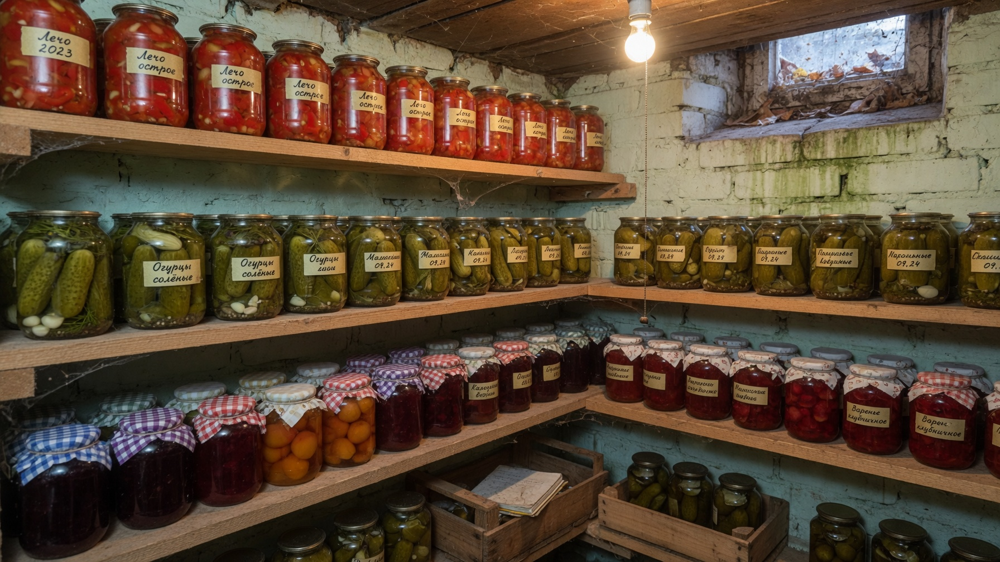
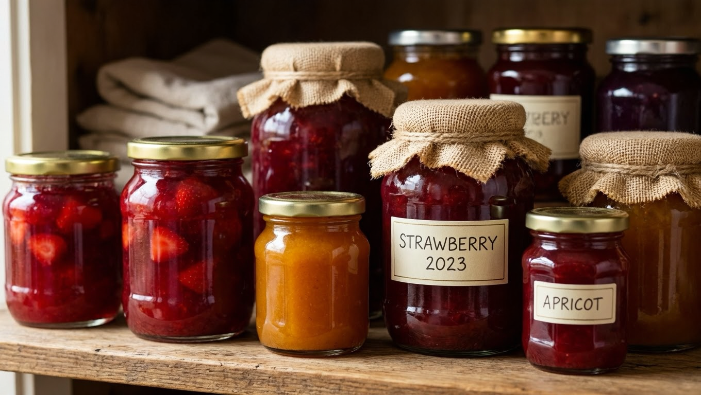
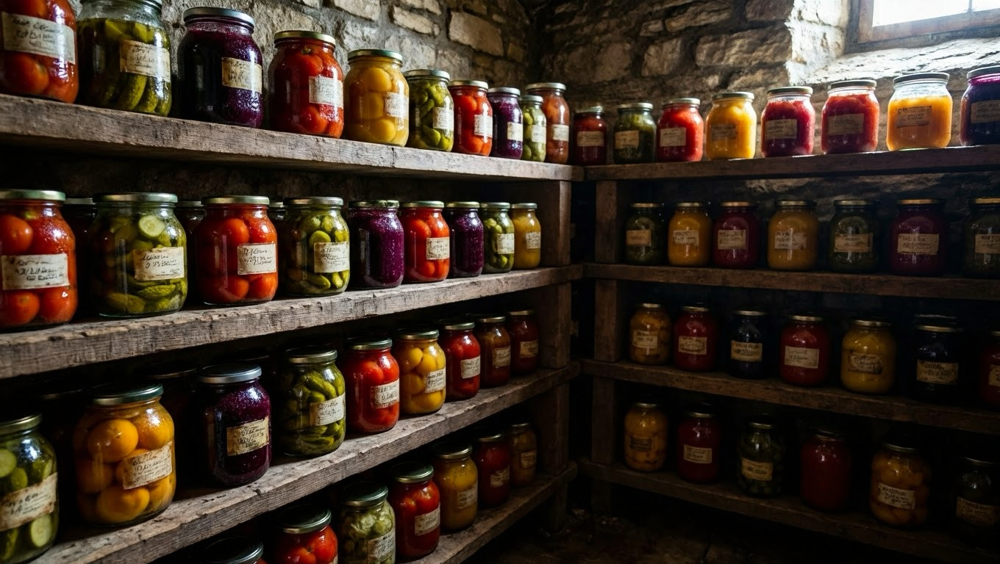
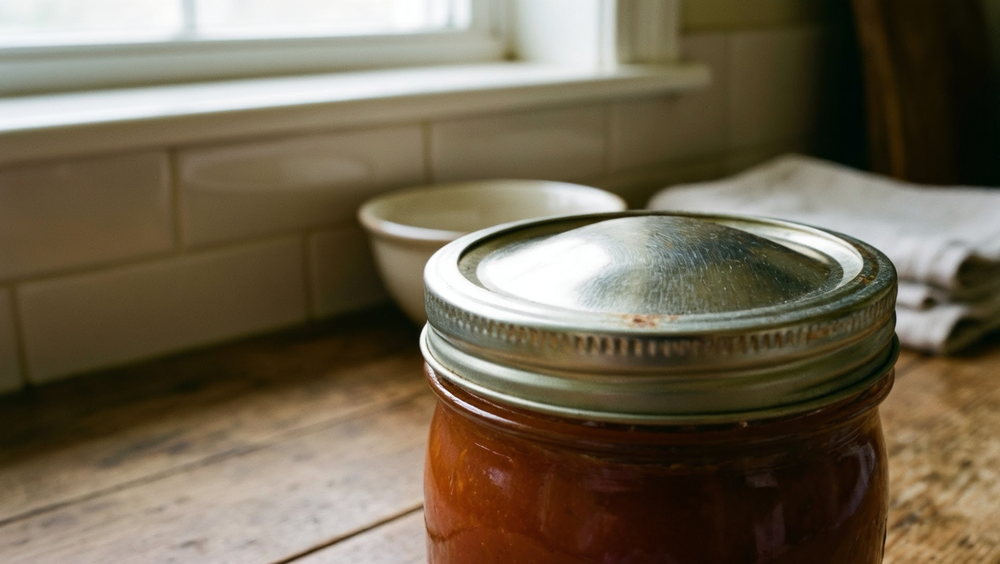
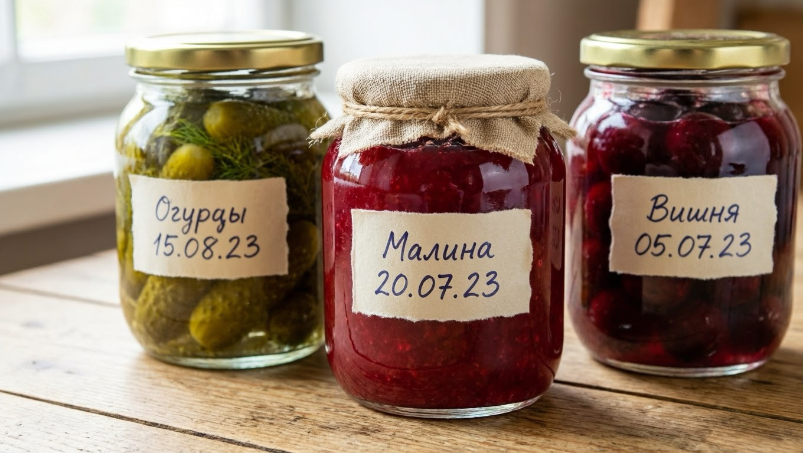
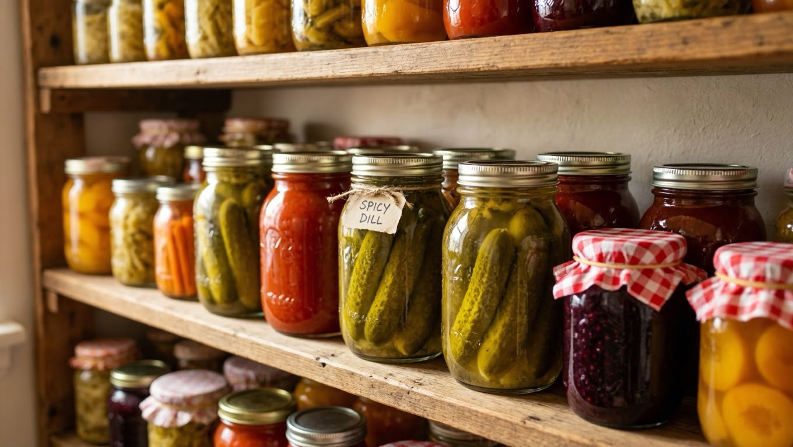

Осенью полки заполняются банками, а к весне возникает вопрос: что из этого ещё можно есть, а что пора выбросить? Универсального ответа нет — маринованные огурцы простоят два года, а сырая аджика испортится за месяц в тепле. Разберём, сколько хранятся разные заготовки, при какой температуре их держать и как без риска определить, что банка испортилась.

## 📋 Таблица сроков хранения

Сроки указаны для правильно приготовленных заготовок в стерильной таре при соблюдении условий хранения.

| Заготовка | Срок | Где хранить |
|---|---|---|
| **Маринованные овощи** (огурцы, помидоры, с уксусом) | 1–2 года | Тёмное прохладное место, 0…+15 °C |
| **Солёные и квашеные** (без уксуса) | 6–9 месяцев | Только холод: погреб, холодильник, 0…+4 °C |
| **Малосольные огурцы** | 3–5 дней | Только холодильник |
| **Варенье классическое, джем, повидло** | 2–3 года | Прохладное тёмное место |
| **Варенье-пятиминутка** | 1–2 года | Надёжнее в прохладе |
| **Варенье сырое (без варки)** | 3–6 месяцев | Только холодильник или холодный погреб |
| **Компоты** без косточек | 2–3 года | Прохладное тёмное место |
| **Компоты с косточками** (вишня, слива, абрикос) | **не более 1 года** | Прохладное тёмное место |
| **Лечо, овощная икра** | 1–2 года | Прохладное тёмное место |
| **Аджика варёная** | 1–2 года | Прохладное тёмное место |
| **Аджика сырая (без варки)** | 3–6 месяцев | Только холодильник или погреб |
| **Соки, морсы** домашние | 1–2 года | Прохладное тёмное место |
| **Сушёные овощи, фрукты, грибы** | 1 год | Сухое место, герметичная тара |
| **Замороженные овощи и ягоды** | 8–12 месяцев | Морозилка, −18 °C |
| **Грибы маринованные** | до 1 года | Прохлада, **под капроновой крышкой** |

Главное правило: **чем меньше кислоты и сахара в заготовке, тем короче срок и строже требования к холоду.** Уксус, соль и сахар работают консервантами, и там, где их мало, продукт защищён слабее.

## ⚠️ Отдельно про компоты с косточками и грибы

Два случая, где сроки — не формальность, а вопрос безопасности.

**Компоты и варенье с косточками.** В косточках вишни, сливы, абрикоса и персика содержится амигдалин, который при длительном хранении постепенно превращается в синильную кислоту, переходящую в сироп. Поэтому такие заготовки **не хранят дольше года**, а если планируете держать дольше — удаляйте косточки при готовке.

**Грибные заготовки.** Грибы — продукт с низкой кислотностью, и в герметично закатанной банке без доступа воздуха может развиться возбудитель ботулизма, который не меняет ни вкус, ни запах. Поэтому домашние грибы:

- закрывают **капроновыми крышками**, а не закатывают наглухо;
- хранят только в холоде;
- тщательно моют от земли перед готовкой;
- перед употреблением желательно прокипятить.

По той же причине домашние мясные и рыбные консервы в банках готовить не стоит: безопасно это делается только в автоклаве при температуре, которой домашняя кухня не даёт.

## 🌡️ Условия хранения: что важнее срока

Указанные сроки работают только при правильных условиях. Что на них влияет:

- **Температура.** Оптимум для большинства заготовок — **0…+15 °C**. В тепле (выше +20 °C) заготовки быстрее теряют вкус и могут забродить; при минусе банки замерзают и лопаются.
- **Темнота.** На свету варенье темнеет, овощи выцветают, а витамины разрушаются. Прозрачные банки на солнечном подоконнике — худшее место.
- **Влажность.** В сыром помещении ржавеют крышки, и герметичность нарушается. Отсюда и плесень на банках.
- **Стабильность.** Перепады температур опаснее ровного тепла: они вызывают конденсат внутри банки.

Погреб отвечает этим условиям лучше всего — но только если он сухой и проветривается. Именно сырость чаще всего портит заготовки: крышки ржавеют, на банках появляется налёт. Как рассчитать и сделать [вентиляцию в погребе](https://mir-doma.pro/ventilyaciya-v-pogrebe/), разобрано отдельно, а общее устройство хранилища — в статье про [обустройство погреба](https://mir-doma.pro/obustroystvo-pogreba/).

Если погреба нет, подойдут кладовка, антресоль подальше от батарей или застеклённый балкон осенью — правда, зимой там банки рискуют замёрзнуть.

## 🚫 Как понять, что заготовка испортилась

Проверяйте банку **до того, как открыть**, и никогда не пробуйте содержимое «на вкус» для проверки.

**Явные признаки, при которых банку выбрасывают не открывая:**

- **вздутая крышка** — газ внутри означает, что там идут процессы, которых быть не должно;
- **потёки и следы подтекания** из-под крышки;
- **мутный рассол** там, где он должен быть прозрачным;
- **пузырьки газа**, поднимающиеся со дна;
- **плесень** любого цвета на поверхности или под крышкой;
- **ржавчина** на крышке изнутри;
- **резкий, кислый или неприятный запах** при вскрытии;
- **изменившийся цвет** содержимого, слизь.

**Что с этим делать:** содержимое выбросить, банку тщательно вымыть и прокипятить или тоже выбросить. Не пытайтесь «спасти» заготовку перевариванием — при подозрении на ботулизм кипячение не гарантирует безопасности, а вкус и запах ботулотоксин не меняет.

Отдельно: **вздутая крышка — всегда повод выбросить**, даже если содержимое выглядит нормально. Это не тот случай, где стоит рисковать.

## 📅 Сколько хранится открытая банка

После вскрытия сроки резко сокращаются, и всё уходит в холодильник:

| Открытая заготовка | Сколько хранить в холодильнике |
|---|---|
| Маринованные овощи | 1–2 недели |
| Солёные, квашеные | 1–2 недели |
| Варенье, джем | до месяца |
| Лечо, овощная икра | 3–5 дней |
| Аджика | 1–2 недели |
| Компот | 2–3 дня |
| Соки домашние | 2–3 дня |

Практичный вывод: **закатывайте в банки того объёма, который съедаете за раз-два.** Трёхлитровая банка лечо на семью из двух человек почти гарантированно испортится в холодильнике раньше, чем закончится.

## 💡 Как продлить срок хранения

- **Стерилизуйте банки и крышки** — большинство проблем начинается здесь.
- **Крышки должны быть сухими** перед закаткой: капля воды провоцирует плесень.
- **Переворачивайте банки** после закатки и укутывайте до остывания — это дополнительная самостерилизация и проверка герметичности.
- **Не жалейте консервантов**: уменьшая сахар в варенье или уксус в маринаде, вы сокращаете срок хранения.
- **Подписывайте банки** — вид заготовки и дата. Через полгода в погребе всё выглядит одинаково, а угадывать возраст банки не стоит.
- **Ставьте вперёд старое.** Простое правило склада: новые банки убирайте вглубь полки, старые — вперёд, чтобы съедались первыми.
- **Проверяйте запасы** раз в пару месяцев: одна подтекающая банка портит вид и плодит плесень на соседних.

## ❄️ Что делать с истёкшим сроком

Срок вышел, но банка выглядит нормально — есть или выбросить? Разумный подход:

- **Явные признаки порчи** (см. выше) — выбросить безусловно, без вариантов.
- **Просрочка при идеальном виде и правильном хранении** — риск скорее в потере вкуса и витаминов, чем в отравлении. Но заготовки с косточками и грибы после истечения срока лучше не есть.
- **Сомневаетесь — выбрасывайте.** Банка огурцов не стоит отравления.

Чтобы не накапливать просрочку, планируйте объём заготовок по реальному потреблению: лучше десять банок, которые съедятся, чем тридцать, половина из которых отправится в мусор.

## ❓ Частые вопросы

**Сколько хранятся маринованные огурцы?**
Правильно закатанные с уксусом — 1–2 года в тёмном прохладном месте при 0…+15 °C. Солёные и квашеные без уксуса хранятся меньше, 6–9 месяцев, и только в холоде.

**Сколько хранится аджика?**
Варёная аджика с уксусом — 1–2 года в прохладном тёмном месте. Сырая, без варки, — только 3–6 месяцев и только в холодильнике или холодном погребе: при комнатной температуре она забродит.

**Сколько хранится варенье?**
Классическое варенье, джем и повидло — 2–3 года, пятиминутка — 1–2 года, сырое варенье без варки — 3–6 месяцев в холодильнике. Чем меньше сахара, тем короче срок.

**Почему компот с косточками нельзя хранить больше года?**
В косточках вишни, сливы и абрикоса содержится амигдалин, который со временем переходит в сироп в виде синильной кислоты. Если планируете хранить дольше года, удаляйте косточки при приготовлении.

**Как понять, что заготовка испортилась?**
По вздутой крышке, мутному рассолу, пузырькам газа, плесени, потёкам из-под крышки и резкому запаху. Такую банку выбрасывают не пробуя — вкус и запах ботулотоксина не выдают.

**При какой температуре хранить заготовки?**
Оптимально 0…+15 °C в тёмном месте: погреб, подвал, кладовка. Выше +20 °C заготовки быстрее портятся, при минусе банки лопаются. Солёные, квашеные и сырые заготовки требуют строгого холода 0…+4 °C.

**Сколько хранится открытая банка?**
В холодильнике: маринады и соленья 1–2 недели, варенье до месяца, лечо и икра 3–5 дней, компот и соки 2–3 дня. Поэтому лучше закатывать в банки того объёма, который съедается за один-два раза.

---

Сроки хранения заготовок держатся на трёх вещах: сколько в них консерванта, насколько стерильна тара и в каких условиях стоит банка. Маринады с уксусом простоят пару лет, соленья и сырые заготовки — только в холоде и всего несколько месяцев, а компоты с косточками и грибы требуют отдельной осторожности. Подписывайте банки, ставьте старые вперёд — и вопрос «сколько это стоит на полке» отпадёт сам.

**Куда идти дальше:**

- Если банки в погребе покрываются налётом, а крышки ржавеют — виновата сырость, а не заготовки. Проверьте воздухообмен: [вентиляция в погребе](https://mir-doma.pro/ventilyaciya-v-pogrebe/) решает проблему за один сезон.
- Погреб только планируется или требует ремонта — с чего начать и какие условия обеспечить, в статье про [обустройство погреба](https://mir-doma.pro/obustroystvo-pogreba/).
- Рядом с банками обычно лежит и урожай: как правильно заложить на зиму картошку, морковь и капусту — в материале [как хранить овощи зимой](https://mir-doma.pro/kak-hranit-ovoshchi-zimoy/).
- А если часть урожая ещё не переработана, самый быстрый способ сохранить его без банок — [заморозка](https://mir-doma.pro/chto-zamorozit-na-zimu/).
