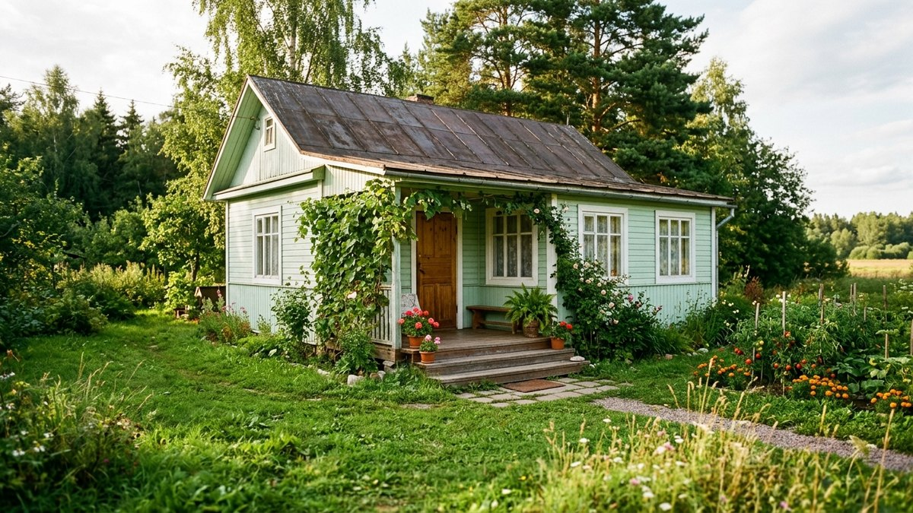
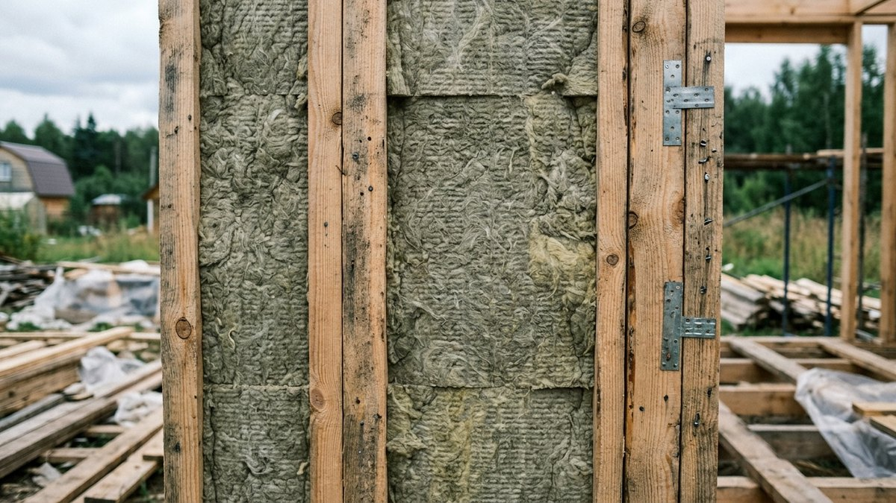
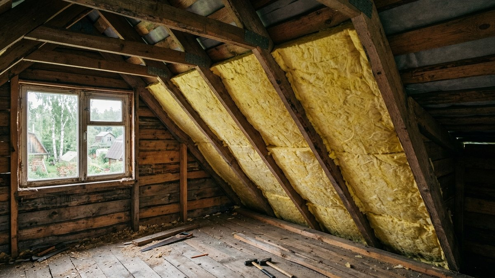
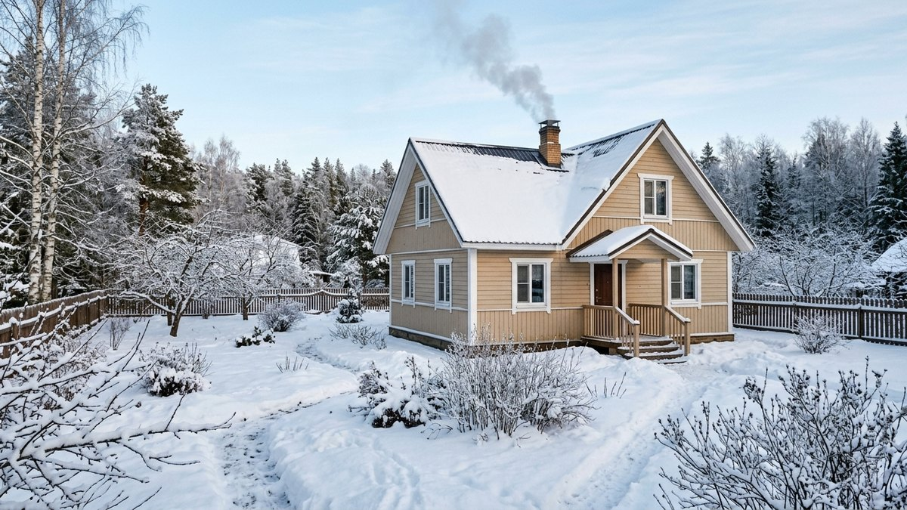
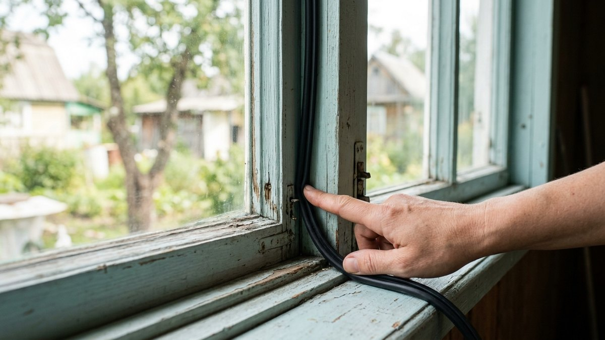
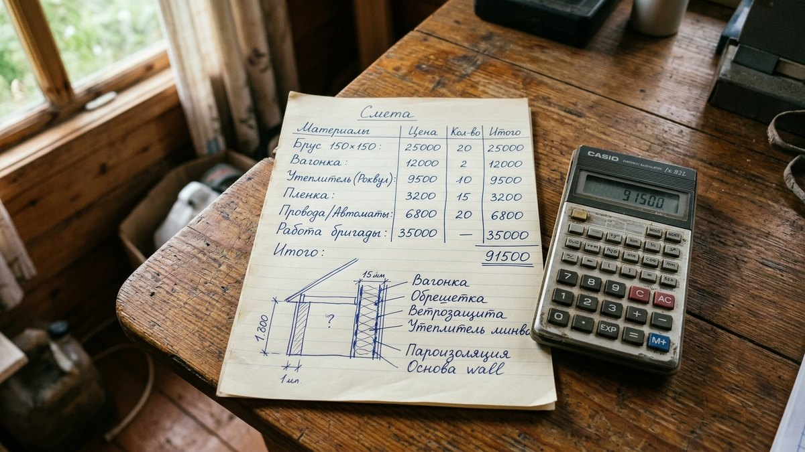

Статьи про то, как утеплить дачу, рассказывают про технологию, но редко называют конкретные суммы — слишком много переменных. Разберём, из чего вообще складывается смета утепления дома, сколько стоит каждая статья расходов и что меняется, если делать самому, нанимать бригаду или заказывать под ключ. В конце — калькулятор, который посчитает ориентир под размеры и задачи вашего дома.

## Из чего складывается смета

Утепление дома редко бывает «утеплить только стены» — тепло уходит через всю оболочку здания, и экономия на одном узле обнуляется потерями через другой.

- **Стены** — обычно самая большая статья по площади. Материал утеплителя, обрешётка, плёнки, крепёж и работа.
- **Крыша и мансарда** — дороже стен за м²: работа на высоте, сложная геометрия скатов, часто требует лесов или подмостей.
- **Пол** — дешевле остальных: доступ снизу или изнутри проще, меньше слоёв пирога.
- **Окна и двери** — считаются не за м², а поштучно: замена на энергоэффективные или утепление существующих.

Отдельная статья бюджета — **финишная отделка фасада** поверх утеплителя: сайдинг, штукатурка, блок-хаус. Она не входит в расчёт ниже, потому что сильно зависит от материала — отдельный калькулятор есть в статье [чем обшить дом снаружи](https://mir-doma.pro/chem-obshit-dom-snaruzhi/).

## Три сценария: сам, бригада, под ключ

| Сценарий | Что входит | Множитель к цене работы |
|---|---|---|
| **Сам** | Только материалы, монтаж своими руками | ×0,6 от базовой сметы |
| **Наёмная бригада** | Материалы + оплата труда по среднему рынку | ×1,0 (база) |
| **Под ключ** | Проект, материалы, работа, гарантия, часто и чистовая отделка в комплексе | ×1,25 |

Утепление стен и пола вентилируемым способом по силам одному человеку с опытом обращения с шуруповёртом — там нет высотных работ и сложной геометрии. Утепление крыши и мансарды разумнее доверить хотя бы помощнику: работа на скате с материалом, который хочет улететь при ветре, опасна в одиночку.

## Ориентир цен по зонам

Цены — «под ключ бригадой», материал среднего сегмента (минвата) с учётом обрешётки, плёнок и крепежа, без финишной отделки:

| Зона | Цена, ₽/м² | Почему так |
|---|---|---|
| Стены | 900–1600 | зависит от толщины утеплителя (100–150 мм) и типа стен |
| Крыша / мансарда | 1300–2000 | доступ и монтаж на скате дороже стен |
| Пол | 700–1100 | самый простой доступ к конструкции |
| Окно (поштучно) | 8 000–15 000 ₽/шт | энергоэффективный стеклопакет с монтажом |
| Входная дверь | 15 000–30 000 ₽/шт | утеплённое полотно с теплоконтуром |

## Калькулятор: смета утепления вашего дома

Отметьте, что нужно утеплить, укажите размеры и выберите сценарий — калькулятор сложит смету по зонам.

<!-- wp:html -->

<h3 class="md-su__title">Калькулятор стоимости утепления</h3>

Ориентир по среднерыночным ценам без финишной отделки фасада — её считайте отдельно.

<label class="md-su__f">Длина дома, м<input type="number" id="suLen" value="8" min="1" max="60" step="0.1"></label>
<label class="md-su__f">Ширина дома, м<input type="number" id="suWid" value="6" min="1" max="60" step="0.1"></label>
<label class="md-su__f">Высота стен, м<input type="number" id="suH" value="2.8" min="1.5" max="12" step="0.1"></label>
<label class="md-su__f">Качество утеплителя
<select id="suTier">
<option value="0.75">Эконом (пенопласт, тонкий слой)</option>
<option value="1" selected>Стандарт (минвата 100–150 мм)</option>
<option value="1.35">Премиум (толще слой, лучший утеплитель)</option>
</select></label>
<label class="md-su__f">Сценарий
<select id="suScen">
<option value="0.6">Сам, только материалы</option>
<option value="1" selected>Наёмная бригада</option>
<option value="1.25">Под ключ, с гарантией</option>
</select></label>
<label class="md-su__f">Окон для утепления/замены, шт<input type="number" id="suWin" value="6" min="0" max="40" step="1"></label>

<label class="md-su__chk"><input type="checkbox" id="suRoof" checked>Утеплять крышу / мансарду</label>
<label class="md-su__chk"><input type="checkbox" id="suFloor" checked>Утеплять пол</label>
<label class="md-su__chk"><input type="checkbox" id="suDoor">Заменить входную дверь на утеплённую</label>

Стены<b id="suWallCost">0 ₽</b>

Крыша<b id="suRoofCost">0 ₽</b>

Пол<b id="suFloorCost">0 ₽</b>

Окна и дверь<b id="suOpCost">0 ₽</b>

Итого по смете<b id="suTotal">—</b>

Ориентир без учёта региона, сложности фасада и финишной отделки поверх утеплителя.

<button type="button" id="suCopy" class="md-su__btn md-su__btn--main">Скопировать результат</button>
<a id="suVk" class="md-su__btn md-su__btn--vk" href="#" target="_blank" rel="noopener noreferrer">Поделиться ВКонтакте</a>
<a id="suTg" class="md-su__btn md-su__btn--tg" href="#" target="_blank" rel="noopener noreferrer">Поделиться в Telegram</a>
<button type="button" id="suPrint" class="md-su__btn">Печать</button>

<!-- /wp:html -->

## Что реально влияет на итог

- **Регион.** В Сибири и на Урале работа и материалы дороже, чем в средней полосе — закладывайте плюс 10–20% к ориентиру.
- **Сложность геометрии.** Эркеры, мансардные окна, ломаная крыша увеличивают трудозатраты на 15–30% относительно простого прямоугольного дома.
- **Доступ к дому.** Если участок далеко от города или к дому неудобный подъезд, бригады закладывают доставку и логистику в смету отдельно.
- **Сезон.** Летом бригады загружены больше и берут дороже; поздней осенью и зимой можно договориться выгоднее — подробнее в статье [что сделать на даче в октябре](https://mir-doma.pro/chto-sdelat-na-dache-v-oktyabre/).

## Где можно сэкономить, а где нельзя

**Можно:** монтаж стен и пола своими руками, материал одной партией со скидкой за объём, отказ от премиального утеплителя там, где хватает стандарта.

**Нельзя экономить:** на толщине утеплителя ниже расчётной для региона, на пароизоляции и вентзазоре — ошибка здесь ведёт к конденсату и гнили, и переделка обойдётся дороже исходной экономии.

## Частые ошибки

- **Считать только утеплитель.** Обрешётка, плёнки, крепёж и работа часто перевешивают материал утеплителя в смете.
- **Забыть про окна.** Дом с толстым слоем ваты в стенах и старыми деревянными рамами теряет тепло именно через щели в окнах — это может быть половина всех теплопотерь.
- **Выбрать дешёвую бригаду без портфолио.** Экономия на работе — самый частый источник переделок: неправильный пирог утепления проявляется только через одну зиму.
- **Не учитывать финишную отделку.** Утеплитель нельзя оставлять открытым — стоимость фасадной отделки нужно закладывать сразу, а не как сюрприз после утепления.

## Частые вопросы

### Сколько стоит утеплить дачный дом полностью?

Для дома 6×8 м со стандартным утеплителем, бригадой и утеплением стен, крыши, пола и замены части окон — ориентир 250 000–400 000 ₽. Точная сумма зависит от региона и сложности дома — посчитайте по калькулятору выше.

### Что дешевле: утеплить самому или нанять бригаду?

Самостоятельный монтаж экономит 35–40% от сметы, но реален только для стен и пола — крышу и мансарду без опыта и помощника делать рискованно.

### С чего начать, если бюджет ограничен?

С окон и дверей — они часто дают наибольший процент теплопотерь на вложенный рубль, а затем — со стен, которые формируют самую большую площадь теплопотерь.

### Входит ли отделка фасада в стоимость утепления?

Нет, в расчёте выше — только утеплитель, обрешётка и монтаж. Финишную обшивку (сайдинг, штукатурку, блок-хаус) считайте отдельно — калькулятор есть в статье [чем обшить дом снаружи](https://mir-doma.pro/chem-obshit-dom-snaruzhi/).

### Можно ли утеплить дом частями, в разные годы?

Да, и это частая практика при ограниченном бюджете: начинают со стен и окон в первый сезон, крышу и пол — в следующий. Главное — не оставлять утеплитель без защитной плёнки и отделки на зиму.

### Окупается ли утепление дачи, если бываете там не круглый год?

Да, если топите дом зимой хотя бы иногда или держите плюсовую температуру для труб — утеплённый дом остывает в разы медленнее, и на протопку уходит меньше топлива каждый раз.
