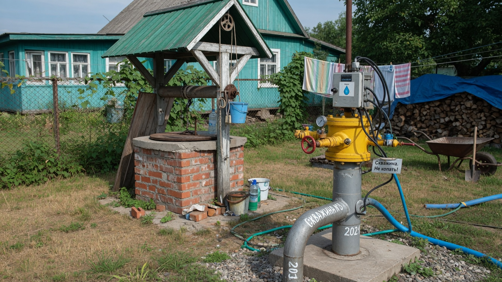
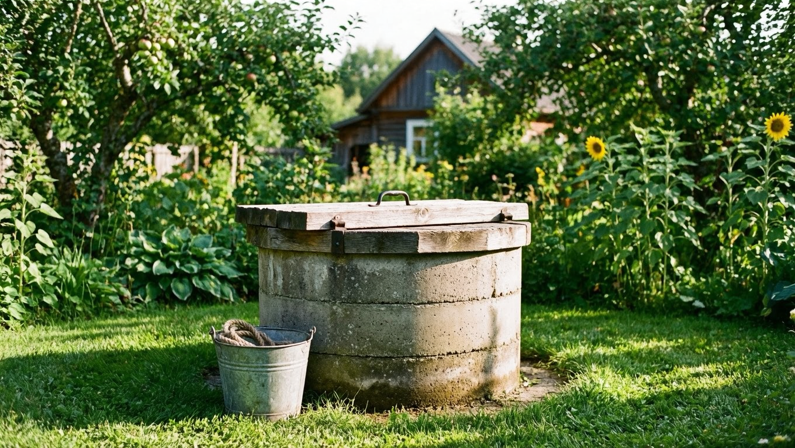
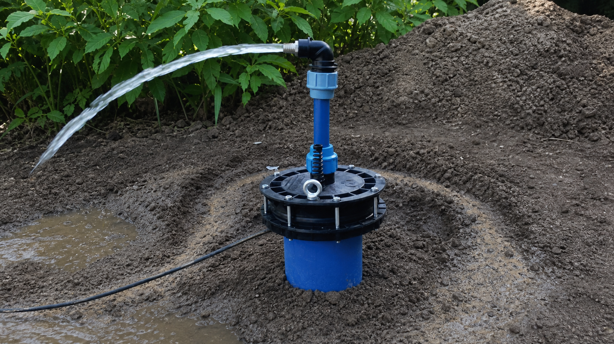
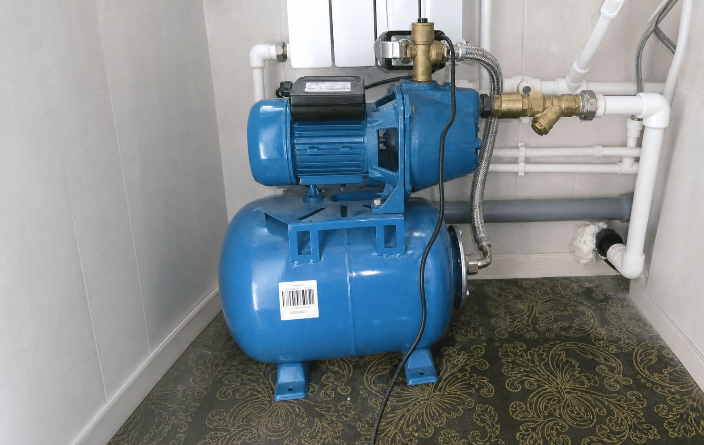
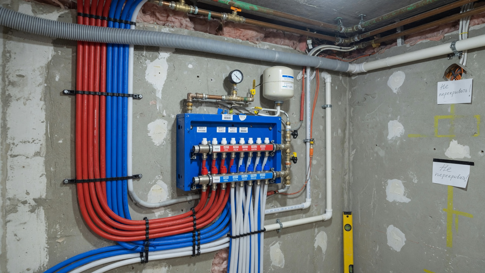
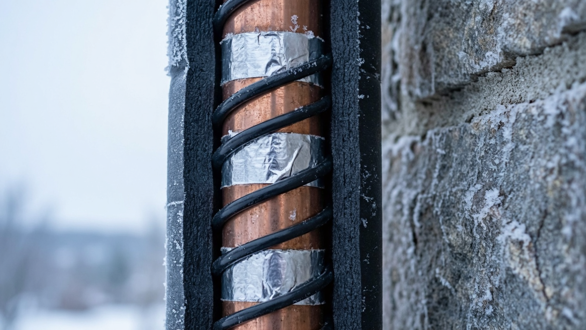

Вода — первое, без чего дача не станет комфортной. И если центрального водопровода нет, встаёт главный вопрос: что делать — копать колодец или бурить скважину? У обоих вариантов свои плюсы, минусы и стоимость, а подходят они для разных условий. Разберём, чем отличаются скважина и колодец, что выбрать для дачи и как провести воду в дом, чтобы она была и летом, и зимой.

## 💧 Источники воды на даче

Обеспечить дачу водой можно тремя способами:

- **Центральный водопровод** — идеально, если есть возможность подключиться: стабильно и без забот. Но доступен далеко не везде.
- **Колодец** — традиционный автономный источник, берёт воду из верхних водоносных слоёв.
- **Скважина** — бурят до более глубоких водоносных горизонтов, вода обычно чище и её больше.

Если центрального водопровода нет, выбор сводится к колодцу или скважине. Рассмотрим каждый.

## 🪣 Колодец: плюсы и минусы

Колодец — проверенный веками вариант.

**Плюсы:**

- не зависит от электричества — воду можно достать ведром при отключении света;
- проще и дешевле обслуживать, легко почистить;
- виден уровень и состояние воды;
- служит долго — при правильном уходе десятилетиями.

**Минусы:**

- вода из верхних слоёв уязвима к загрязнению (стоки, поверхностные воды);
- дебит (запас воды) ограничен, в засуху уровень падает;
- копать имеет смысл только там, где водоносный слой неглубоко.

## 🕳️ Скважина: плюсы и минусы

Скважину бурят, когда нужна чистая вода и её много. Различают скважину «на песок» (неглубокую) и артезианскую (глубокую).

**Плюсы:**

- вода из глубоких слоёв обычно чище и лучше защищена от загрязнения;
- большой и стабильный запас воды, не зависящий от засухи (у артезианской);
- занимает мало места на участке.

**Минусы:**

- дороже колодца, особенно артезианская;
- полностью зависит от насоса и электричества;
- вода бывает жёсткой и с избытком железа — иногда нужна водоподготовка;
- скважину «на песок» нужно регулярно использовать, иначе она заиливается.

## ⚖️ Скважина или колодец: сравнение

| Критерий | Колодец | Скважина |
|---|---|---|
| Глубина | Небольшая (верхние слои) | Средняя и большая |
| Качество воды | Уязвимо к загрязнению | Обычно чище |
| Запас воды | Ограничен, падает в засуху | Больше и стабильнее |
| Зависимость от света | Нет (можно ведром) | Полная (насос) |
| Стоимость | Дешевле | Дороже |
| Обслуживание | Простое, видно воду | Сложнее, нужна чистка/прокачка |
| Срок службы | Десятилетия | Артезианская — очень долго |

## 🎯 Что выбрать под ситуацию

Ориентируйтесь на свои условия:

- **Неглубокая чистая вода, ограниченный бюджет, бывают отключения света** — колодец.
- **Нужен большой стабильный запас чистой воды, есть бюджет** — скважина.
- **Сезонная дача с редкими наездами** — часто достаточно колодца; скважину «на песок» без регулярного использования затягивает илом.
- **Высокое потребление (дом, полив, семья)** — скважина справится лучше.

Перед решением полезно узнать, какие водоносные слои и на какой глубине у соседей — это подскажет, что реально в вашей местности. Учтите источник воды и при [планировке участка](https://mir-doma.pro/planirovka-uchastka-10-sotok/): его размещают с учётом расстояния до дома и септика.

## 🔧 Как провести воду в дом

И из колодца, и из скважины воду в дом подают одинаково — насосом:

- **Насос или насосная станция** поднимает воду из источника. Погружные насосы опускают внутрь, поверхностные ставят рядом.
- **Гидроаккумулятор** поддерживает давление в системе, чтобы вода шла из крана стабильно, а насос не включался постоянно.
- **Разводка труб** — от станции воду разводят по дому к точкам водоразбора; трубу от источника прокладывают ниже глубины промерзания.

Вместе с водоснабжением сразу продумывают и отвод стоков — как устроить [септик для дачи](https://mir-doma.pro/septik-dlya-dachi/), разбирали отдельно. А для грядок удобно подключить [капельный полив](https://mir-doma.pro/kapelnyy-poliv-svoimi-rukami/).

## ❄️ Водоснабжение зимой

Чтобы система пережила морозы, есть два пути:

- **Зимнее водоснабжение** — трубу от источника укладывают ниже глубины промерзания и утепляют (иногда с греющим кабелем), а насос и оборудование размещают в утеплённом кессоне или доме. Тогда водой можно пользоваться круглый год.
- **Консервация на зиму** — если дача сезонная, воду на зиму сливают: осушают трубы, гидроаккумулятор и насос, чтобы остатки воды не разорвали их льдом.

Незамерзающий водопровод — обязательное условие для комфортного зимнего проживания.

## 🚰 Нужна ли очистка воды

И колодезная, и скважинная вода не всегда пригодна для питья без анализа. Частые проблемы — жёсткость (накипь), избыток железа (рыжий налёт и привкус), а в колодце ещё и бактериальное загрязнение. Поэтому перед вводом источника в эксплуатацию воду сдают на анализ, а по результатам при необходимости ставят водоподготовку: механические фильтры от песка и мути, обезжелезиватель, умягчитель, обеззараживание. Это защищает и здоровье, и технику — жёсткая вода с железом быстро выводит из строя бойлеры, стиральные машины и сантехнику. Для полива грядок такая вода годится и без очистки, а вот для питья и бытовой техники фильтрация часто необходима.

## ❌ Частые ошибки

- **Скважину «на песок» пробурили и забросили** — без регулярного использования она заиливается.
- **Трубу проложили выше глубины промерзания** — зимой водопровод перемерзает и рвётся.
- **Забыли слить воду на сезонной даче** — лёд разрывает трубы и оборудование.
- **Колодец рядом с септиком или стоками** — вода загрязняется; источник размещают на безопасном расстоянии.
- **Не сделали водоподготовку** — жёсткую воду с железом используют без очистки, страдают техника и трубы.

## ❓ Частые вопросы

**Что дешевле — скважина или колодец?**
Колодец обычно дешевле в устройстве и обслуживании. Скважина, особенно артезианская, дороже, но даёт больше чистой воды.

**Где вода чище — в скважине или колодце?**
Как правило, в скважине: вода из глубоких слоёв лучше защищена от поверхностных загрязнений. Воду из колодца стоит периодически проверять.

**Сколько служит скважина и колодец?**
Колодец при уходе служит десятилетиями. Артезианская скважина — очень долго, а скважина «на песок» меньше и требует регулярного использования, чтобы не заилиться.

**Нужно ли разрешение на скважину?**
Неглубокая скважина «на песок» для личных нужд обычно бурится свободно, а глубокая артезианская может требовать оформления. Требования зависят от региона — уточняйте на месте.

**Как не заморозить водопровод зимой?**
Проложить трубу ниже глубины промерзания и утеплить, оборудование держать в утеплённом кессоне или доме. На сезонной даче воду на зиму полностью сливают.

**Что выбрать для сезонной дачи с редкими наездами?**
Чаще колодец: он не заиливается от простоя и не зависит от электричества. Скважину «на песок» без регулярного использования быстро затягивает илом.

---

Выбор между скважиной и колодцем зависит от глубины воды, бюджета и того, сколько воды вам нужно. Колодец проще и автономнее, скважина даёт больше чистой воды. Определитесь с источником, грамотно проведите воду в дом и защитите систему от мороза — и дача будет с водой в любой сезон. Не забудьте продумать и отвод стоков — про [септик для дачи](https://mir-doma.pro/septik-dlya-dachi/) есть отдельная статья.
