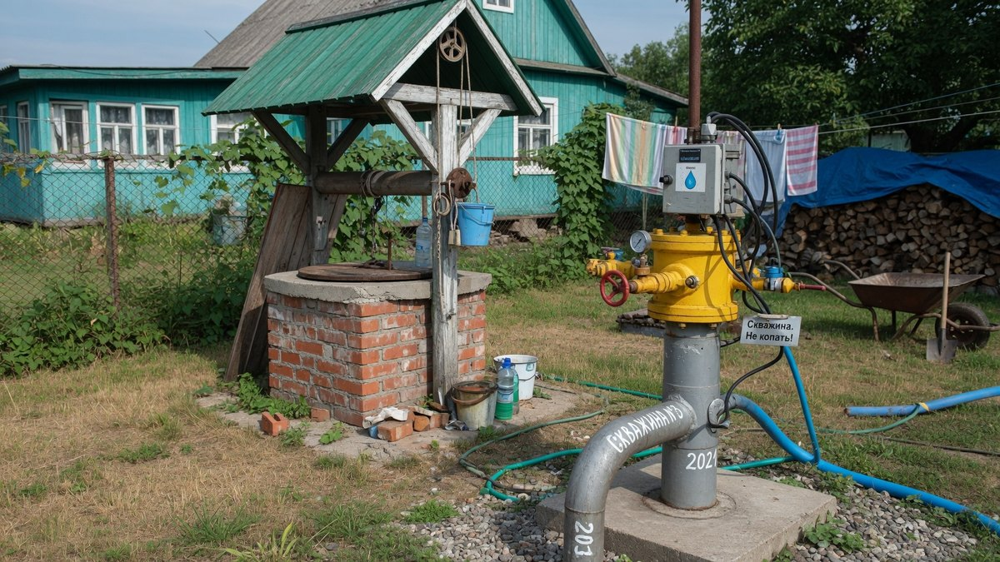
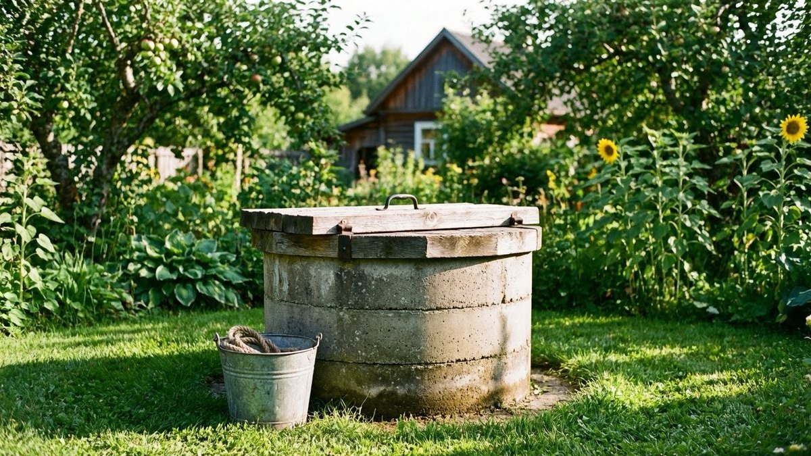
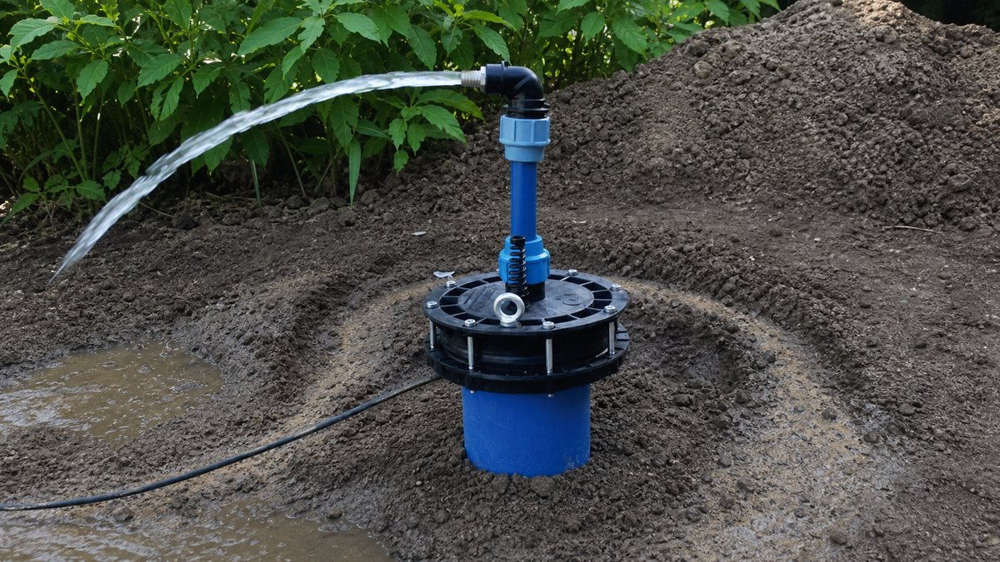
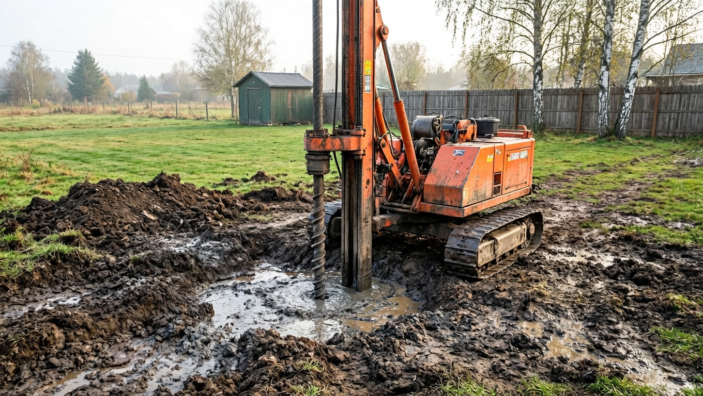
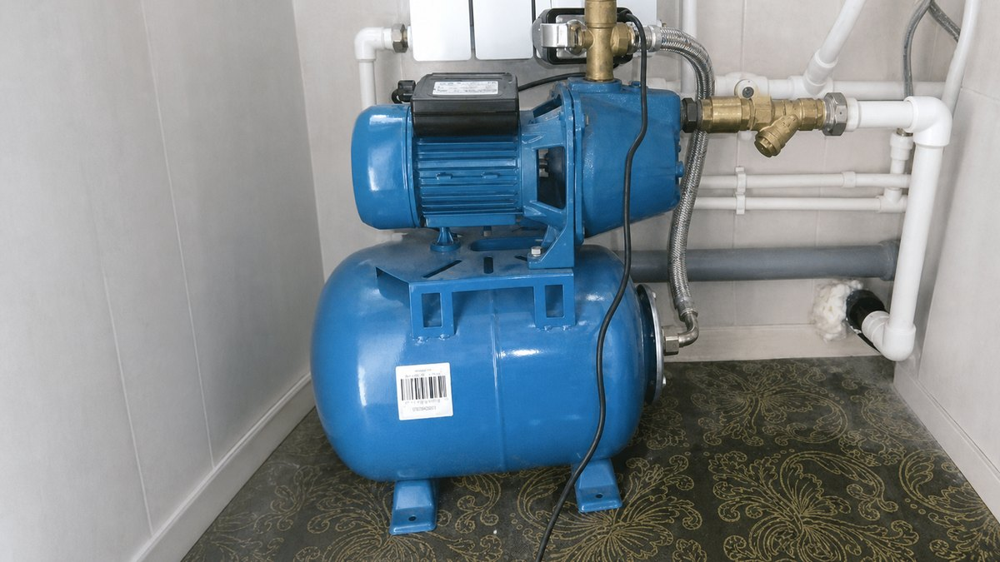
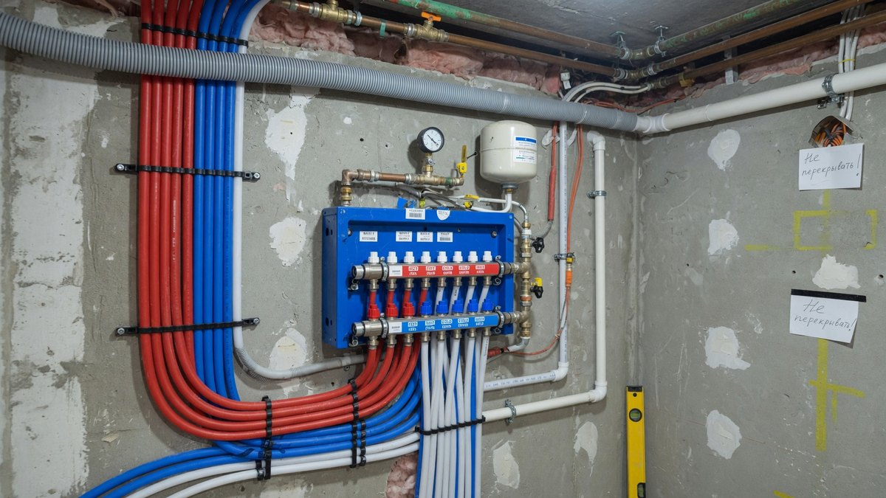
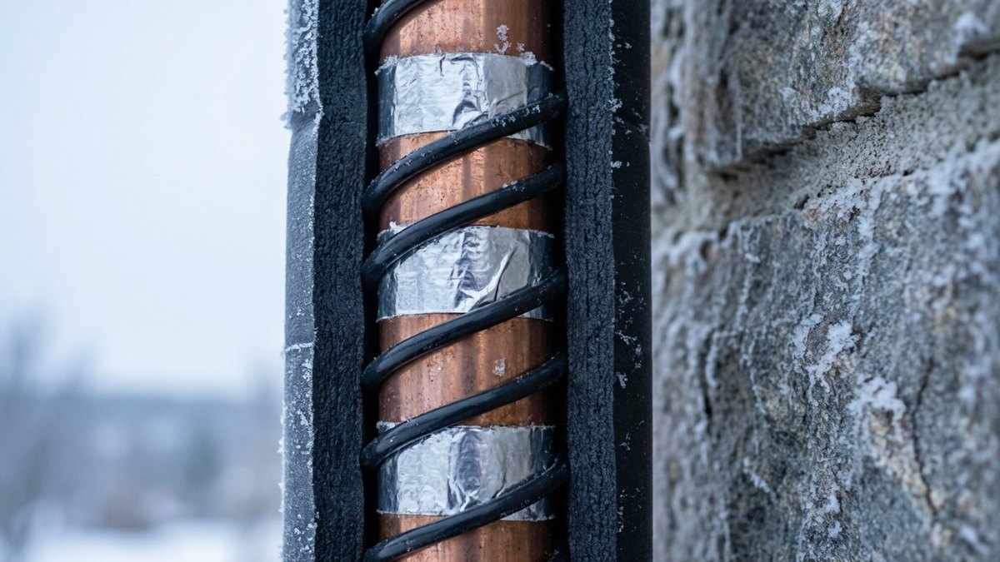

Вода — первое, без чего дача не станет комфортной. И если центрального водопровода нет, встаёт главный вопрос: что делать — копать колодец или бурить скважину? У обоих вариантов свои плюсы, минусы и стоимость, а подходят они для разных условий. Разберём, чем отличаются скважина и колодец, что выбрать для дачи и как провести воду в дом, чтобы она была и летом, и зимой.

## 💧 Источники воды на даче

Обеспечить дачу водой можно тремя способами:

- **Центральный водопровод** — идеально, если есть возможность подключиться: стабильно и без забот. Но доступен далеко не везде.
- **Колодец** — традиционный автономный источник, берёт воду из верхних водоносных слоёв.
- **Скважина** — бурят до более глубоких водоносных горизонтов, вода обычно чище и её больше.

Если центрального водопровода нет, выбор сводится к колодцу или скважине. Рассмотрим каждый.

## 🪣 Колодец: плюсы и минусы

Колодец — проверенный веками вариант.

**Плюсы:**

- не зависит от электричества — воду можно достать ведром при отключении света;
- проще и дешевле обслуживать, легко почистить;
- виден уровень и состояние воды;
- служит долго — при правильном уходе десятилетиями.

**Минусы:**

- вода из верхних слоёв уязвима к загрязнению (стоки, поверхностные воды);
- дебит (запас воды) ограничен, в засуху уровень падает;
- копать имеет смысл только там, где водоносный слой неглубоко.

## 🕳️ Скважина: плюсы и минусы

Скважину бурят, когда нужна чистая вода и её много. Различают скважину «на песок» (неглубокую) и артезианскую (глубокую).

**Плюсы:**

- вода из глубоких слоёв обычно чище и лучше защищена от загрязнения;
- большой и стабильный запас воды, не зависящий от засухи (у артезианской);
- занимает мало места на участке.

**Минусы:**

- дороже колодца, особенно артезианская;
- полностью зависит от насоса и электричества;
- вода бывает жёсткой и с избытком железа — иногда нужна водоподготовка;
- скважину «на песок» нужно регулярно использовать, иначе она заиливается.

## ⚖️ Что лучше — колодец или скважина: сравнение

| Критерий | Колодец | Скважина «на песок» | Артезианская скважина |
|---|---|---|---|
| Глубина | обычно 5–15 м | 20–50 м | 50–200 м и глубже |
| Качество воды | уязвимо к загрязнению с поверхности | обычно чище колодца | самая чистая, но бывает жёсткой |
| Запас воды | ограничен, падает в засуху | больше | практически неисчерпаем |
| Зависимость от света | нет (можно ведром) | полная (насос) | полная (насос) |
| Стоимость работ | ниже всех | средняя | самая высокая |
| Обслуживание | простое, воду видно | чистка, прокачка | минимальное |
| Срок службы | 30–50 лет при уходе | 5–15 лет | 50 лет и больше |
| Простой без использования | не страшен | заиливается | не страшен |

Коротко: **колодец** — дешевле и автономнее, но зависит от верховодки; **скважина на песок** — компромисс по цене и качеству, но боится простоя; **артезианская** — самая надёжная вода и самая дорогая.

## 💰 Сколько стоит колодец и скважина: из чего складывается цена

Главная ошибка при сравнении — считать только сами работы. Реальный бюджет складывается из трёх частей, и вторая часто оказывается больше первой.

**1. Сами работы**

- **Копка колодца** считается **за кольцо** (то есть за метр глубины). Итог зависит от того, на какой глубине вода: попали на 6 метрах — одна сумма, пришлось идти на 12 — вдвое больше.
- **Бурение скважины** считается **за метр проходки**, и цена метра зависит от типа скважины и грунта. Артезианская дороже не только глубиной, но и тарифом за метр — там нужна другая техника.

Отсюда важное следствие: **точную цену никто не назовёт заранее** — глубину до воды на конкретном участке до начала работ знают только приблизительно, по соседям и геологии района.

**2. Обустройство — то, о чём забывают**

Скважина или колодец сами по себе — это ещё не вода в доме. Дополнительно понадобятся:

- **насос** (погружной или насосная станция) — подбирается под глубину, чем глубже, тем дороже;
- **кессон или адаптер** для скважины (защита оголовка от промерзания);
- **гидроаккумулятор**, автоматика, реле давления;
- **обсадная труба** для скважины (входит в бурение, но качество трубы влияет на цену);
- **домик или крышка с утеплением** для колодца;
- **траншея и ввод в дом** — трубы, утепление, монтаж;
- **фильтры**, если анализ покажет, что вода требует очистки.

Нередко обустройство стоит столько же, сколько само бурение. Планируя бюджет, закладывайте обе части сразу.

**3. Обслуживание в течение жизни**

- **Колодец** — периодическая чистка (раз в несколько лет), проверка колец.
- **Скважина на песок** — прокачка и чистка от заиливания, особенно если ей пользуются нерегулярно. Это её слабое место: при редком использовании она может «встать» за несколько лет и потребовать повторного бурения.
- **Артезианская** — обслуживание минимальное, но требует оформления документов.

**Вывод по деньгам:** колодец дешевле на старте, артезианская скважина дороже, но служит десятилетиями почти без вложений. Если считать стоимость на весь срок службы, разрыв сокращается — а для дома с постоянным проживанием скважина часто выходит выгоднее.

## 🔍 Как понять, что подходит вашему участку

Прежде чем решать, соберите четыре факта — они закроют вопрос быстрее любых советов:

1. **Что у соседей.** Самый ценный источник: на какой глубине у них вода, какого она качества, не пересыхает ли летом, не заиливалась ли скважина. Геология на соседних участках почти одинаковая.
2. **Уровень грунтовых вод.** Если вода близко (2–5 м) — колодец очевиден. Если верховодка грязная или её нет — нужна скважина.
3. **Сколько воды вам нужно.** Семья, душ, стиральная машина и полив — это совсем другой расход, чем «приехать на выходные и полить грядки». Колодец имеет ограниченный дебит: он наполняется медленно и в засуху может не успевать.
4. **Как часто вы бываете на даче.** Это решающий фактор для скважины на песок: **регулярное использование ей необходимо**, простой ведёт к заиливанию.

Отдельно проверьте **расстояния до источников загрязнения**: септик, туалет и компост должны быть не ближе 20 метров от источника воды, иначе вопрос качества воды решится сам собой и не в вашу пользу. Нормы разобраны в статье про [расстояние от дома до бани, забора и построек](https://mir-doma.pro/rasstoyanie-ot-doma-do-bani-zabora/), а куда поставить сам септик — в материале про [септик для дачи](https://mir-doma.pro/septik-dlya-dachi/).

## 🎯 Что выбрать для дачи: короткая шпаргалка

Ориентируйтесь на свои условия:

- **Неглубокая чистая вода, ограниченный бюджет, бывают отключения света** — колодец.
- **Нужен большой стабильный запас чистой воды, есть бюджет** — скважина.
- **Сезонная дача с редкими наездами** — часто достаточно колодца; скважину «на песок» без регулярного использования затягивает илом.
- **Высокое потребление (дом, полив, семья)** — скважина справится лучше.

Перед решением полезно узнать, какие водоносные слои и на какой глубине у соседей — это подскажет, что реально в вашей местности. Учтите источник воды и при [планировке участка](https://mir-doma.pro/planirovka-uchastka-10-sotok/): его размещают с учётом расстояния до дома и септика.

## 🔧 Как провести воду в дом

И из колодца, и из скважины воду в дом подают одинаково — насосом:

- **Насос или насосная станция** поднимает воду из источника. Погружные насосы опускают внутрь, поверхностные ставят рядом.
- **Гидроаккумулятор** поддерживает давление в системе, чтобы вода шла из крана стабильно, а насос не включался постоянно.
- **Разводка труб** — от станции воду разводят по дому к точкам водоразбора; трубу от источника прокладывают ниже глубины промерзания.

Вместе с водоснабжением сразу продумывают и отвод стоков — как устроить [септик для дачи](https://mir-doma.pro/septik-dlya-dachi/), разбирали отдельно. А для грядок удобно подключить [капельный полив](https://mir-doma.pro/kapelnyy-poliv-svoimi-rukami/).

## ❄️ Водоснабжение зимой

Чтобы система пережила морозы, есть два пути:

- **Зимнее водоснабжение** — трубу от источника укладывают ниже глубины промерзания и утепляют (иногда с греющим кабелем), а насос и оборудование размещают в утеплённом кессоне или доме. Тогда водой можно пользоваться круглый год.
- **Консервация на зиму** — если дача сезонная, воду на зиму сливают: осушают трубы, гидроаккумулятор и насос, чтобы остатки воды не разорвали их льдом.

Незамерзающий водопровод — обязательное условие для комфортного зимнего проживания.

## 🚰 Нужна ли очистка воды

И колодезная, и скважинная вода не всегда пригодна для питья без анализа. Частые проблемы — жёсткость (накипь), избыток железа (рыжий налёт и привкус), а в колодце ещё и бактериальное загрязнение. Поэтому перед вводом источника в эксплуатацию воду сдают на анализ, а по результатам при необходимости ставят водоподготовку: механические фильтры от песка и мути, обезжелезиватель, умягчитель, обеззараживание. Это защищает и здоровье, и технику — жёсткая вода с железом быстро выводит из строя бойлеры, стиральные машины и сантехнику. Для полива грядок такая вода годится и без очистки, а вот для питья и бытовой техники фильтрация часто необходима.

## ❌ Частые ошибки

- **Скважину «на песок» пробурили и забросили** — без регулярного использования она заиливается.
- **Трубу проложили выше глубины промерзания** — зимой водопровод перемерзает и рвётся.
- **Забыли слить воду на сезонной даче** — лёд разрывает трубы и оборудование.
- **Колодец рядом с септиком или стоками** — вода загрязняется; источник размещают на безопасном расстоянии.
- **Не сделали водоподготовку** — жёсткую воду с железом используют без очистки, страдают техника и трубы.

## ❓ Частые вопросы

**Сколько стоит пробурить скважину или выкопать колодец?**
Колодец считают за кольцо (за метр глубины), скважину — за метр проходки, поэтому итог зависит от того, на какой глубине вода. Точную цену заранее не назовёт никто. Важно закладывать в бюджет не только работы, но и обустройство — насос, автоматику, кессон, ввод в дом: оно нередко стоит столько же, сколько само бурение.

**Какой глубины бывают колодец и скважина?**
Колодец обычно 5–15 метров, скважина «на песок» — 20–50 метров, артезианская — от 50 до 200 метров и глубже. Конкретная глубина зависит от того, где на вашем участке залегает водоносный слой: точнее всего это подскажут соседи.

**Что лучше для постоянного проживания?**
Скважина: она даёт больший и стабильный запас воды, не пересыхает в засуху и справляется с расходом на семью, душ, стиральную машину и полив. Колодец имеет ограниченный дебит и наполняется медленно.

**Что дешевле — скважина или колодец?**
Колодец обычно дешевле в устройстве и обслуживании. Скважина, особенно артезианская, дороже, но даёт больше чистой воды.

**Где вода чище — в скважине или колодце?**
Как правило, в скважине: вода из глубоких слоёв лучше защищена от поверхностных загрязнений. Воду из колодца стоит периодически проверять.

**Сколько служит скважина и колодец?**
Колодец при уходе служит десятилетиями. Артезианская скважина — очень долго, а скважина «на песок» меньше и требует регулярного использования, чтобы не заилиться.

**Нужно ли разрешение на скважину?**
Неглубокая скважина «на песок» для личных нужд обычно бурится свободно, а глубокая артезианская может требовать оформления. Требования зависят от региона — уточняйте на месте.

**Как не заморозить водопровод зимой?**
Проложить трубу ниже глубины промерзания и утеплить, оборудование держать в утеплённом кессоне или доме. На сезонной даче воду на зиму полностью сливают.

**Что выбрать для сезонной дачи с редкими наездами?**
Чаще колодец: он не заиливается от простоя и не зависит от электричества. Скважину «на песок» без регулярного использования быстро затягивает илом.

---

Выбор между скважиной и колодцем упирается в четыре вещи: на какой глубине вода, сколько её нужно, как часто вы бываете на даче и какой бюджет вы готовы заложить **вместе с обустройством**. Колодец проще и автономнее, скважина даёт больше чистой воды и выигрывает на длинной дистанции. Узнайте, что у соседей, — и решение станет почти очевидным.

**Куда идти дальше:**

- Определились с источником и думаете, куда его вписать на участке? В статье про [расположение дома на участке](https://mir-doma.pro/raspolozhenie-doma-na-uchastke/) разобрано, как расставить дом, баню и скважину так, чтобы потом не переделывать.
- Вода в доме — это сразу вопрос стоков: как выбрать и куда поставить [септик для дачи](https://mir-doma.pro/septik-dlya-dachi/), чтобы он не загрязнил ваш же источник.
- Если дача сезонная, водопровод нужно правильно законсервировать осенью — иначе весной вас ждут разорванные трубы: что именно слить и отключить, собрано в статье про [консервацию дачи на зиму](https://mir-doma.pro/konservaciya-dachi-na-zimu/).
