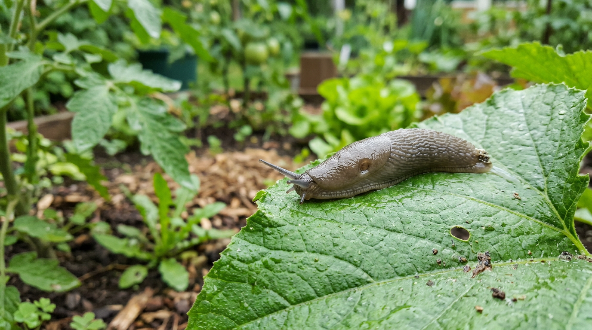
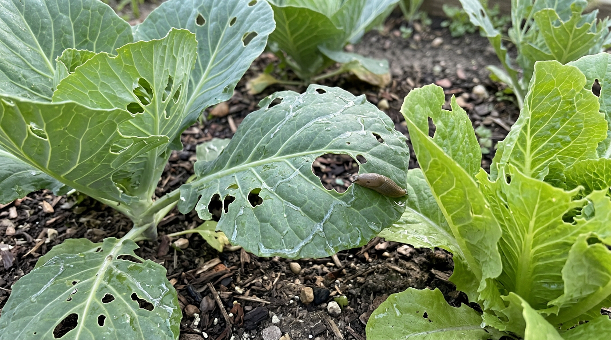
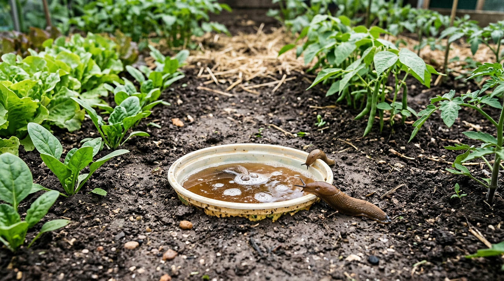
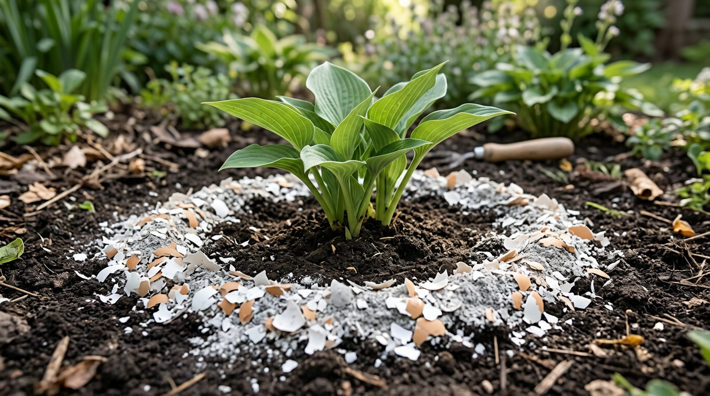
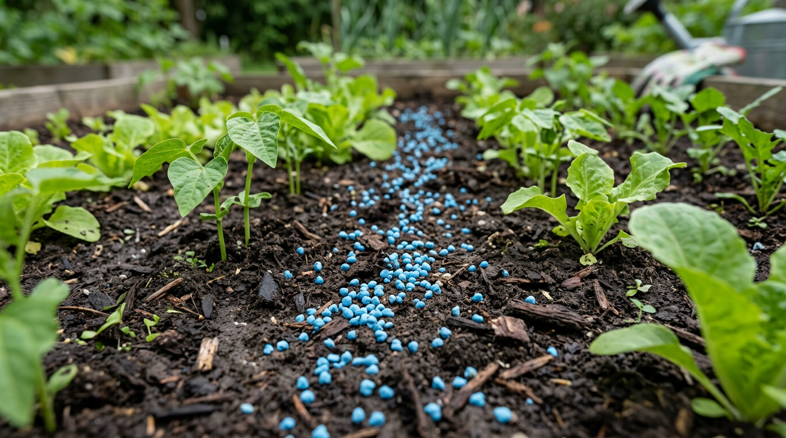
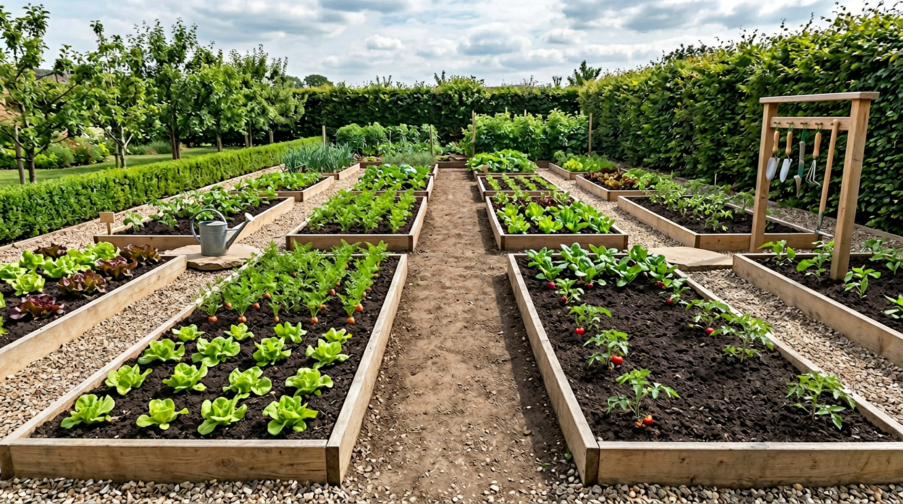

Сырым летом слизни способны за пару ночей превратить грядки в решето: они объедают листья капусты и салата, портят клубнику, перец и огурцы, оставляя дыры и блестящие слизистые дорожки. Эти ночные вредители особенно активны во влажную погоду и размножаются очень быстро. Но справиться с ними вполне реально, причём чаще всего без всякой химии. В этой статье разберём, как избавиться от слизней на огороде народными и химическими средствами, какие ловушки и барьеры работают и как не дать им вернуться.

## 🐌 Чем опасны слизни

Слизни — это брюхоногие моллюски без раковины, и вред они наносят серьёзный:

- **Объедают листья и плоды** — капусту, салат, клубнику, огурцы, перец, всходы.
- **Портят урожай** — выеденные ягоды и овощи быстро загнивают.
- **Переносят болезни** — на слизи разносятся грибки и инфекции.
- **Быстро размножаются** — во влажную погоду их численность растёт лавинообразно.

Особенно достаётся молодым растениям и нежной зелени: слизни могут полностью уничтожить всходы за одну-две ночи. Больше всего страдают капуста, салат, шпинат, клубника и земляника, перец, огурцы и листовая зелень — всё сочное и нежное.

## 🔍 Как понять, что на грядках слизни

Слизни активны ночью и прячутся днём, поэтому самих вредителей вы можете и не увидеть. Распознать их помогают характерные признаки:

- **Неровные дыры** в листьях и плодах с обгрызенными краями.
- **Блестящие серебристые дорожки** засохшей слизи на листьях, земле и дорожках.
- **Выеденные всходы** и нижние листья, лежащие на земле.
- **Сами слизни** — если выйти в огород ночью с фонариком или заглянуть под влажные укрытия, доски и нижние листья.

Чем раньше заметить слизней, тем проще с ними справиться, пока их немного, — поэтому в сырую погоду грядки осматривают чаще.

## 🌧️ Почему появляются слизни

Слизни любят сырость и укрытия, поэтому их появление провоцируют:

- **Влажность** — затяжные дожди, переувлажнённая почва, частый вечерний полив.
- **Загущённые посадки** — в густой зелени влажно и тенисто.
- **Сорняки и растительные остатки** — служат и едой, и укрытием.
- **Доски, камни, плотная мульча** — днём слизни прячутся под ними.
- **Тень и плохое проветривание** — создают комфортный для них микроклимат.
- **Соседство с компостом и густыми кустами** — там слизни прячутся и размножаются.

Понимание причин подсказывает и решение: чем суше и чище грядки, тем меньше слизней.

## 🛡️ Народные средства от слизней

В большинстве случаев со слизнями справляются без химии. Вот проверенные методы.

### Ручной сбор и ловушки

- **Ручной сбор** — вечером или ночью с фонариком, либо рано утром по росе, когда слизни выходят кормиться. Самый простой и экологичный способ при небольшом нашествии; собранных слизней уносят подальше от участка или уничтожают.
- **Пивные ловушки** — вкопайте ёмкость (банку, обрезанную бутылку) вровень с землёй и налейте немного пива: запах брожения привлекает слизней со всей грядки, и они сползаются в ловушку. Ставят их вечером и проверяют утром, расставляя по нескольку штук между грядками.
- **Ловушки-укрытия** — разложите доски, мокрые тряпки, корки от грейпфрута или капустные листья. Слизни прячутся под ними днём, а вы их собираете.

### Барьеры вокруг растений

У слизней нежное тело без панциря, поэтому им неприятно и трудно ползти по сухим, острым и впитывающим влагу поверхностям. На этом и основаны барьеры — их рассыпают кольцом вокруг грядок и отдельных растений:

- измельчённую яичную скорлупу;
- древесную золу (заодно и удобрение);
- крупный песок, мелкий гравий или опилки;
- хвою и толчёный ракушечник.

Барьер обновляют после дождя, когда он намокает и перестаёт работать. Помогает и медная лента по периметру грядок или ёмкостей — при контакте с медью слизни получают слабый неприятный «разряд» и не переползают её. Сыпать барьер нужно сплошной полосой, без разрывов, иначе слизни найдут проход.

### Опрыскивание и привлечение врагов

- **Раствор нашатырного спирта** (несколько ложек на ведро воды) отпугивает слизней и служит азотной подкормкой.
- **Кофейная гуща**, рассыпанная вокруг растений, тоже им неприятна.
- **Естественные враги** — ежи, жабы, лягушки, птицы и жужелицы поедают слизней. Привлекайте их на участок: не прогоняйте ежей, сделайте небольшой водоём для лягушек, не злоупотребляйте химией — и природа сама поможет держать слизней под контролем. Иногда заводят и домашнюю птицу, которая с удовольствием склёвывает вредителей.

Слизни — не единственные вредители огорода: о борьбе с другими читайте в статьях про [тлю](https://mir-doma.pro/kak-izbavitsya-ot-tli/) и [колорадского жука](https://mir-doma.pro/koloradskiy-zhuk-bez-himii/).

## 🧪 Химические и биологические средства

Если слизней очень много, нашествие массовое и народные методы не справляются, применяют специальные препараты — моллюскоциды. Их раскладывают точечно между растениями и в местах скопления вредителей, а не рассыпают сплошь по огороду.

- **Гранулы на основе метальдегида** — эффективны, их рассыпают между растениями. Но они токсичны, поэтому применяйте осторожно, вдали от детей и домашних животных и строго по инструкции.
- **Препараты на основе фосфата железа** — более безопасный вариант, подходящий и для экологического огорода: они действуют на слизней, но безопаснее для питомцев и почвы.

Химию лучше держать как крайнюю меру и сочетать с ловушками, барьерами и профилактикой.

## 🌿 Профилактика

Проще не допустить слизней, чем потом с ними бороться. Поскольку главные их союзники — сырость и укрытия, профилактика сводится к тому, чтобы лишить их и того, и другого. Помогают простые меры:

- **Убирайте укрытия** — доски, камни, кучи травы и растительные остатки.
- **Боритесь с сорняками** — они и еда, и дом для слизней.
- **Прореживайте посадки** — чтобы грядки лучше проветривались и просыхали.
- **Не переувлажняйте** — поливайте утром, а не на ночь, чтобы к вечеру почва подсыхала.
- **Рыхлите почву** — сухая рыхлая корка слизням неприятна, к тому же рыхление разрушает их кладки яиц в верхнем слое земли.
- **Используйте мульчу умеренно** — слишком толстый влажный слой служит им укрытием.

## 🛡️ Частые ошибки

- **Только ручной сбор.** Без барьеров и профилактики слизни возвращаются. Действуйте комплексно.
- **Много соли.** Соль убивает слизней, но засаливает и портит почву — на грядках её не используют.
- **Оставленные укрытия.** Доски, камни и трава сводят на нет все усилия.
- **Переувлажнение.** Вечерний полив и сырость провоцируют новое нашествие.
- **Барьеры не обновляют.** Намокшие зола и скорлупа перестают работать после дождя.

## ❓ Частые вопросы

### Как избавиться от слизней на огороде народными средствами?

Собирайте слизней вручную вечером, ставьте пивные ловушки и укрытия-приманки, рассыпайте вокруг растений барьеры из золы, яичной скорлупы и песка, опрыскивайте раствором нашатырного спирта и привлекайте на участок их врагов — ежей, жаб и птиц. Комплекс этих мер обычно решает проблему без химии.

### Чего боятся слизни?

Слизни не любят сухих, шершавых и колючих поверхностей — золы, измельчённой скорлупы, песка, хвои, а также меди, нашатырного спирта и кофейной гущи. Эти средства используют как барьеры и отпугиватели вокруг грядок и растений.

### Помогает ли пиво от слизней?

Да, пивные ловушки — один из самых известных рабочих способов. Запах пива привлекает слизней, они сползаются к вкопанной ёмкости. Ловушки расставляют между грядками и регулярно очищают и обновляют.

### Почему на огороде много слизней?

Слизни размножаются во влажной среде, поэтому их много в сырое дождливое лето, на загущённых и заросших сорняками грядках, при частом вечернем поливе и обилии укрытий — досок, камней, толстой мульчи. Сухие, чистые и проветриваемые грядки слизней привлекают куда меньше.

### Когда слизни наиболее активны?

Слизни активны ночью и ранним утром, а также в пасмурную сырую погоду и после дождя — днём в сухую жару они прячутся в укрытиях. Поэтому собирать их и проверять ловушки эффективнее всего вечером или рано утром.

### Опасны ли слизни для растений и человека?

Для растений слизни вредны — они уничтожают листья и плоды и переносят грибковые болезни. Для человека сами по себе они не опасны, но повреждённый и покрытый слизью урожай лучше тщательно мыть, а некоторые виды слизней могут быть переносчиками паразитов, поэтому работать в огороде стоит в перчатках.

### Можно ли использовать соль против слизней?

Соль убивает слизней, но засаливает почву и вредит растениям, поэтому рассыпать её на грядках нельзя. Вместо соли используют безопасные барьеры — золу, скорлупу, песок — и ловушки.

### Какие химические средства от слизней самые безопасные?

Из препаратов наиболее безопасны моллюскоциды на основе фосфата железа — они подходят и для экологического огорода. Средства с метальдегидом эффективны, но токсичны, поэтому их применяют осторожно, вдали от детей и животных.

## Заключение

Слизни на огороде — неприятные, но вполне победимые вредители. В большинстве случаев достаточно народных средств: собирать их вручную, ставить пивные ловушки, окружать растения барьерами из золы и скорлупы и привлекать естественных врагов. Если нашествие сильное, на помощь приходят препараты, желательно безопасные — на основе фосфата железа. Но главное — профилактика: убирайте укрытия и сорняки, прореживайте посадки и не переувлажняйте почву. Сухие, чистые и проветриваемые грядки слизням не по душе, и урожай останется целым. Действуйте комплексно — ловушки и сбор убирают тех, кто уже есть, барьеры защищают растения, а профилактика не даёт вредителям вернуться.

А как вы боретесь со слизнями? Делитесь своими способами в комментариях и подписывайтесь, чтобы не пропустить новые статьи о защите урожая.
