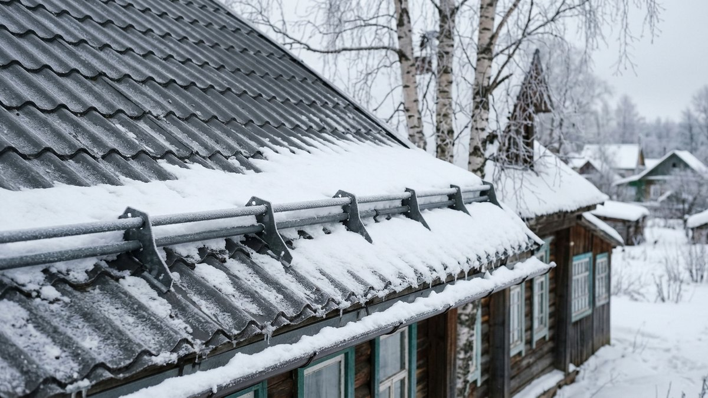
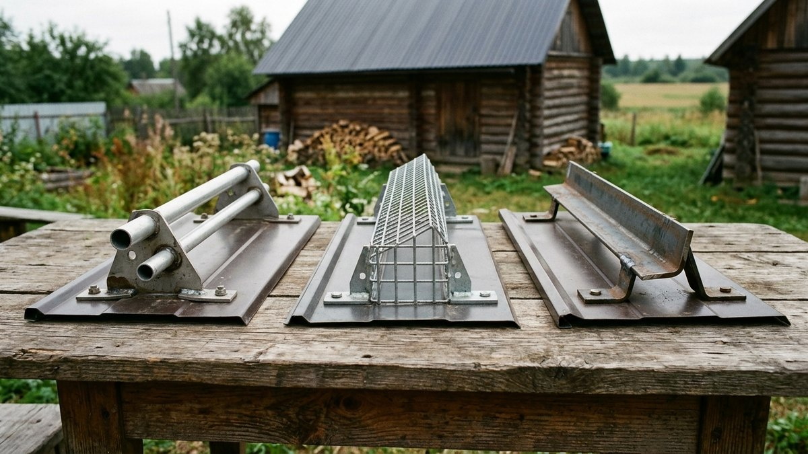
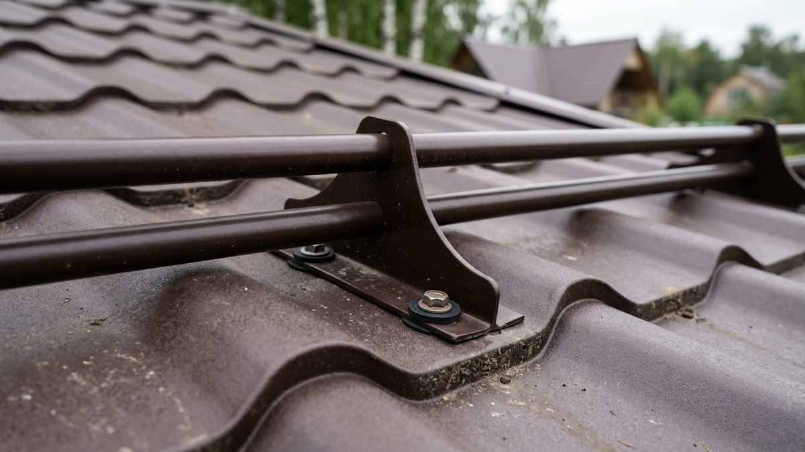
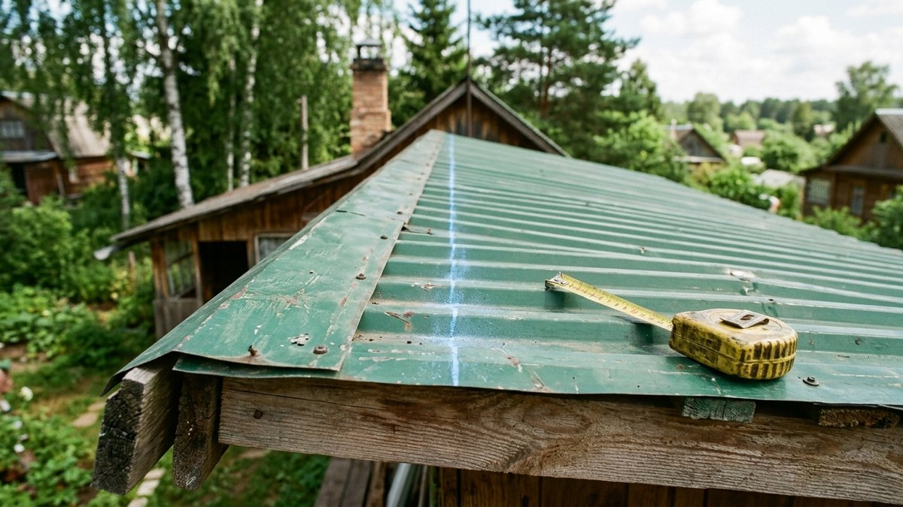
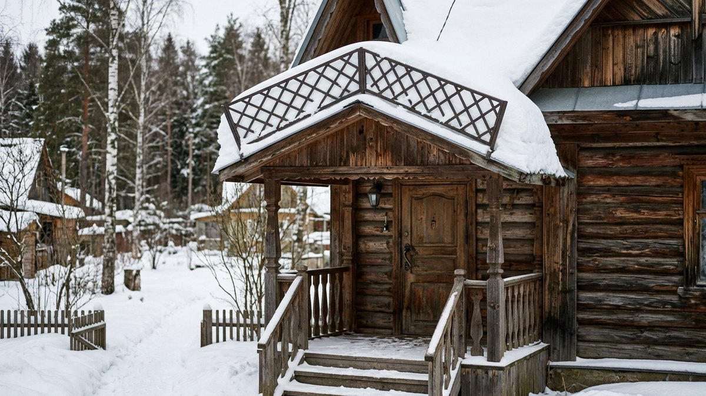
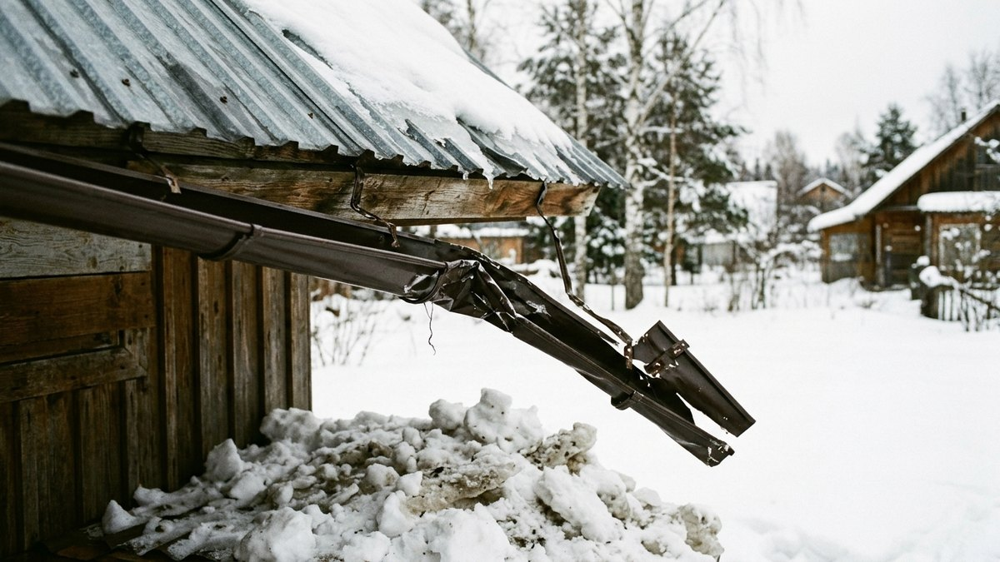

# Снегозадержатели на крышу: какие выбрать, сколько нужно и как установить

С металлической крыши снег не тает постепенно, а съезжает пластом —
сразу со всего ската. Такая лавина сминает водосток, ломает кусты под
окнами, продавливает крышу машины и опасна для людей у крыльца.
Снегозадержатели на крышу держат снег на скате, пока он не растает или
не осыплется частями. Разберём, какие бывают снегозадержатели, где их
ставить, сколько рядов и кронштейнов нужно под ваш скат, и как установить
их своими руками так, чтобы они не вырвали кровлю вместе с саморезами.

## Нужны ли снегозадержатели на вашей крыше

Снегозадержатели нужны почти на любой гладкой кровле: металлочерепица,
профнастил, фальц. Для кровель зданий свод правил СП 17.13330 «Кровли»
предусматривает снегозадерживающие устройства при уклоне от 5% и
наружном водостоке. Для частного дома за этим никто не следит, но смысл
тот же: сход снега опасен.

Особенно они нужны, если под скатом:

- крыльцо, дорожка или парковка;
- [водосток](https://mir-doma.pro/vodostok-svoimi-rukami/) — пласт снега
  срывает желоба вместе с крюками;
- окна, теплица, клумбы, кусты;
- соседский участок: сход снега на чужую территорию — повод для
  претензий.

На мягкой кровле и натуральной черепице снег держится лучше, но
точечные снегозадержатели там всё равно ставят, чтобы снег не сползал
пластами.

## Какие бывают снегозадержатели

| Тип | Как устроен | Для какой кровли | Когда выбирать |
|---|---|---|---|
| Трубчатый | Две трубы на кронштейнах | Металлочерепица, профнастил, фальц | Универсальный вариант для большинства дач |
| Решётчатый | Решётка высотой 15–20 см | Те же кровли | Много снега, крутой скат, над входом |
| Уголковый (пластинчатый) | Сплошная полоса из листа | Профнастил, металлочерепица | Мало снега, пологий скат, бюджет |
| Точечный («крючки») | Отдельные упоры в шахматном порядке | Мягкая кровля, черепица | Кровля с шероховатой поверхностью |

Трубчатый снегозадержатель — золотая середина: пропускает мелкий снег и
лёд, а пласт держит. Уголковый дешевле, но при большом слое снега его
перехлёстывает. Решётка надёжнее всего над крыльцом.

## Где ставить: главное правило

**Снегозадержатели ставят над несущей стеной, а не на свесе.** Свес —
это консоль, и нагрузка от снега там вырывает обрешётку. Первый ряд
обычно выходит в 35–50 см от края кровли, выше линии стены.

Ещё три правила:

- **По всей длине карниза**, а не только над крыльцом. Если держать снег
  только на части ската, пласт сползёт соседними участками и может
  сорвать и сам снегозадержатель.
- **На длинных скатах — несколько рядов.** Частый ориентир производителей:
  при длине ската больше 5,5 м ставят второй ряд примерно посередине.
- **Над слуховыми окнами, трубами и мансардными окнами** — отдельные
  короткие снегозадержатели выше препятствия.

## Сколько нужно: калькулятор

Калькулятор считает число рядов, кронштейнов и погонаж труб для
трубчатого снегозадержателя. Шаг кронштейнов зависит от снеговой
нагрузки и уклона. Ниже заложены средние значения, а точный шаг для
своей модели сверьте с таблицей производителя: она всегда идёт в
комплекте.

<!-- wp:html -->

  
Калькулятор трубчатых снегозадержателей

  <label class="md-calc__label" for="mdSnE">Длина карниза (ската по горизонтали), м</label>
  <input type="number" id="mdSnE" class="md-calc__input" min="1" step="0.1" value="8">
  <label class="md-calc__label" for="mdSnS">Длина ската от конька до края, м</label>
  <input type="number" id="mdSnS" class="md-calc__input" min="1" step="0.1" value="5">
  <label class="md-calc__label" for="mdSnR">Снеговой район</label>
  <select id="mdSnR" class="md-calc__input">
    <option value="1">I–II (юг, мало снега)</option>
    <option value="2" selected>III (средняя полоса)</option>
    <option value="3">IV–V (Урал, Сибирь, много снега)</option>
    <option value="4">VI и выше</option>
  </select>
  <label class="md-calc__label" for="mdSnA">Уклон крыши</label>
  <select id="mdSnA" class="md-calc__input">
    <option value="0">До 30°</option>
    <option value="1">Больше 30°</option>
  </select>
  <label class="md-calc__label" for="mdSnK">Скатов с таким карнизом</label>
  <input type="number" id="mdSnK" class="md-calc__input" min="1" step="1" value="2">
  
Заполните поля

<!-- /wp:html -->

Снеговой район для своего участка можно уточнить по карте в СП 20.13330,
как это делается для расчёта конструкций, объяснено в статье
[расчёт навеса из профильной трубы](https://mir-doma.pro/raschet-navesa-iz-profilnoy-truby/).

## Установка своими руками: по шагам

Работы ведут в сухую погоду, со страховкой. Если кровля ещё только
монтируется, снегозадержатели удобнее ставить сразу, вместе с ней.

1. **Проверьте обрешётку.** Под каждым кронштейном должна быть
   доска или брус, а не пустота. На разреженной обрешётке под линией
   снегозадержателя добавляют доску, иначе саморезы держатся только за
   лист.
2. **Разметьте линию** шнуром параллельно карнизу, над несущей стеной.
3. **Отметьте точки кронштейнов** с шагом из расчёта. На
   металлочерепице кронштейн ставят в нижнюю часть волны, на
   профнастиле — в нижнюю полку, чтобы саморез шёл в обрешётку.
4. **Крепите кронштейны** кровельными саморезами с резиновой шайбой,
   обычно 8×50 или 8×60 мм, в количестве, указанном производителем.
   Шайбу не пережимайте: сплющенная резина протекает так же, как
   недотянутая.
5. **Вставьте трубы**, стыки соедините муфтами или внахлёст, по
   инструкции. Концы закройте заглушками.
6. **Проверьте** равномерность ряда и затяжку всех саморезов.

Порядок монтажа кровли и укладка обрешётки под снегозадержатели
разобраны в статьях
[крыша из профнастила своими руками](https://mir-doma.pro/krysha-iz-profnastila-svoimi-rukami/)
и [устройство кровли из металлочерепицы](https://mir-doma.pro/ustroystvo-krovli-iz-metallocherepitsy/).

## Безопасность на крыше

- Работайте только со страховочным поясом, закреплённым за конёк или
  надёжную опору.
- Не ходите по металлической кровле в мороз и после дождя: она
  скользит как лёд.
- Не ставьте снегозадержатели зимой на крышу со снегом — сначала
  уберите снег, но не сбивайте лёд с металла, повредите покрытие.
- Ходите по нижней части волны, где лист опирается на обрешётку.

## Частые ошибки

- **Снегозадержатель на свесе.** Нагрузка вырывает свес, и кровля
  ломается вместе с ним.
- **Только над крыльцом.** Пласт сползает рядом и сносит короткий
  участок.
- **Саморезы в лист без обрешётки.** При первой большой нагрузке
  кронштейн выворачивает с кусками металла.
- **Один ряд на длинном скате.** Снег перехлёстывает через трубы.
- **Дешёвый крепёж без шайб.** Крыша начинает течь в местах крепления.

## Частые вопросы

### Где ставить снегозадержатели на крыше

Над несущей стеной, примерно в 35–50 см от края кровли, по всей длине
карниза. На длинных скатах — второй ряд посередине ската.

### Какие снегозадержатели лучше для металлочерепицы

Трубчатые: они держат пласт, пропускают мелкий снег и крепятся в нижнюю
волну через обрешётку. На крутом скате и в снежных регионах — решётчатые.

### Сколько нужно снегозадержателей на крышу

По всей длине карниза каждого ската, где есть опасность схода. Число
кронштейнов зависит от шага, обычно 0,6–1,1 м. Расчёт под ваш скат — в
калькуляторе выше.

### Можно ли установить снегозадержатели на готовую крышу

Можно. Главное — найти обрешётку под листом и попасть в неё саморезом.
Если обрешётка разреженная, придётся снимать нижние листы или ставить
модель с другим креплением.

### Нужны ли снегозадержатели на мягкой кровле

Снег на ней держится лучше, чем на металле, но на крутых скатах и над
входом ставят точечные снегозадержатели в шахматном порядке.

## Итог

Снегозадержатели на крышу — это недорогая страховка водостока, крыльца
и машины. Трубчатые подходят большинству дачных кровель. Ставьте их над
несущей стеной, по всей длине карниза, со вторым рядом на длинных скатах
и обязательно с креплением в обрешётку. Количество под ваш скат считает
калькулятор, а точный шаг кронштейнов даёт таблица производителя.
