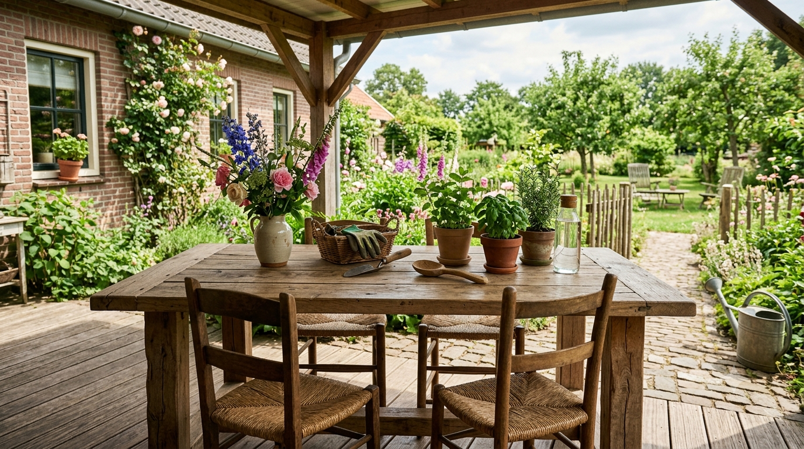
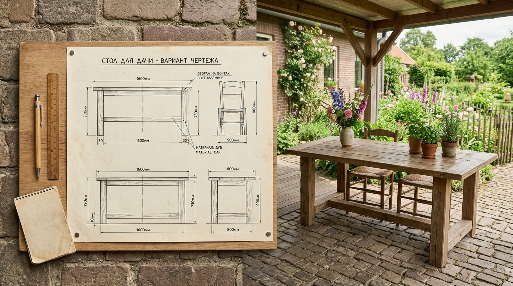
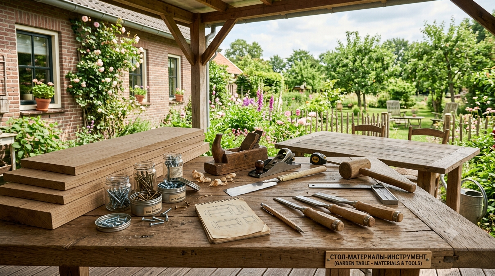
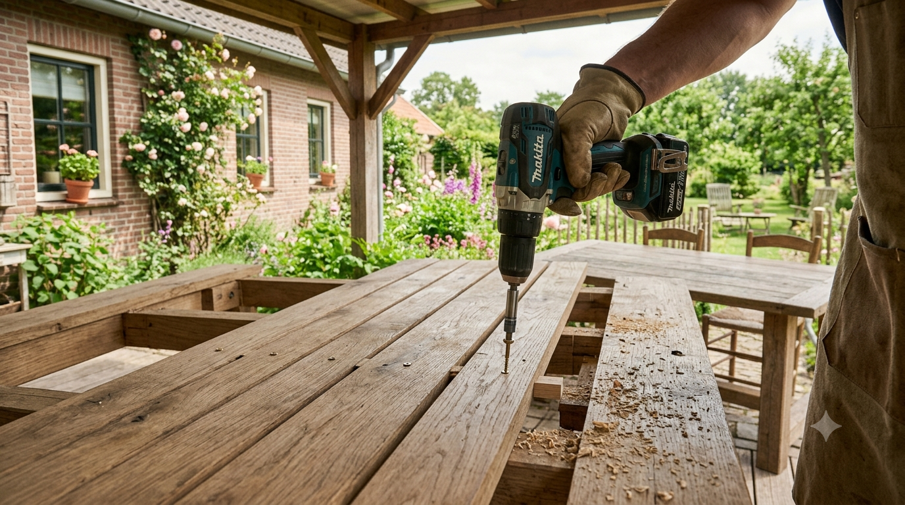
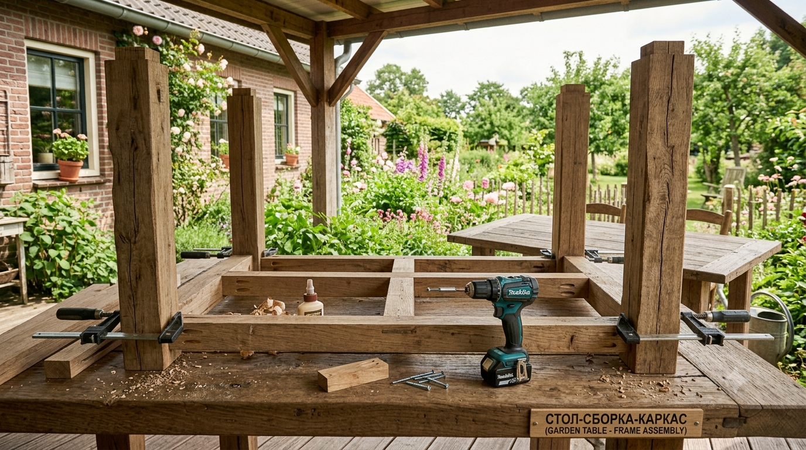
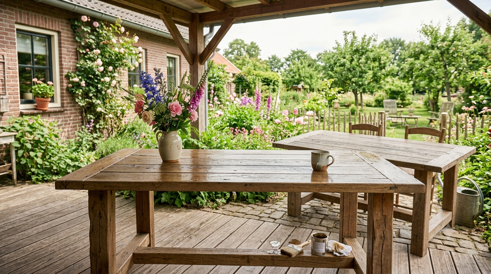

Стол — центр любой дачной зоны отдыха: за ним собираются на обед, чаепитие и посиделки с друзьями. Сделать его своими руками несложно и заметно дешевле, чем купить, а под свои размеры он встанет идеально. Разберём варианты дачного стола, какие нужны материалы и инструмент, и пошагово соберём простой прочный деревянный стол, который прослужит на улице не один сезон.

## 🪑 Какой стол сделать: варианты

Сначала определитесь с типом стола — от него зависят сложность и материалы:

- **Простой стол на четырёх ножках** — классика, подходит для веранды и беседки; самый лёгкий для начинающих.
- **Стол на массивных X-образных опорах** — устойчивый уличный вариант в стиле «пикник», часто в комплекте со скамьями.
- **Стол-пикник со скамьями** — единая конструкция стол + две лавки, удобно для сада.
- **Стол из поддонов** — самый быстрый и бюджетный: почти готовая основа. Подробно об этом — в статье про [садовую мебель из поддонов](https://mir-doma.pro/sadovaya-mebel-iz-poddonov/).
- **Стол вокруг дерева** — декоративный вариант, опоясывающий ствол.

Для первого опыта берите простой прямоугольный стол на ножках с царгами (перемычками) — он прочный и не требует сложных соединений.

## 📐 Чертёж и размеры

Даже простой стол лучше набросать на бумаге с размерами — так вы точно рассчитаете материал. Стандартные ориентиры:

- **высота** — 72–75 см (удобная для обеда);
- **ширина** — 70–90 см;
- **длина** — 120–150 см на 6 человек (по 60 см на человека);
- **свес столешницы** за ножки — 15–20 см с каждой стороны, чтобы удобно сидеть.

На чертеже отметьте столешницу, четыре ножки и царги (перемычки под столешницей, связывающие ножки) — именно они дают жёсткость. По чертежу составьте список деталей с размерами — это ваша «раскройка».

## 🧰 Материалы и инструмент

**Материалы:**

- строганый брус для ножек (например, 50×50 или 70×70 мм);
- доска для столешницы и царг (толщина 25–40 мм);
- саморезы по дереву (лучше нержавеющие или оцинкованные для улицы);
- столярный клей влагостойкий;
- антисептик и защитное покрытие (масло, лак или краска для наружных работ).

**Инструмент:** ножовка или циркулярная пила, шуруповёрт, дрель, шлифмашина (или наждачка), рулетка, угольник, струбцины. Что ещё полезно иметь на даче — в статье про [инструменты для дачи](https://mir-doma.pro/instrumenty-dlya-dachi/).

Дерево берите сухое — сырое поведёт после сборки. Все детали до сборки обработайте антисептиком.

## 🔨 Пошаговая сборка

Соберём простой стол на четырёх ножках с царгами:

1. **Раскрой.** Напилите детали по чертежу: 4 ножки, 4 царги (2 длинные, 2 короткие), доски столешницы. Торцы зашлифуйте.
2. **Каркас (подстолье).** Соедините ножки царгами в две П-образные рамы, затем свяжите их между собой длинными царгами. Крепите на клей и саморезы, углы проверяйте угольником, стягивайте струбцинами.
3. **Проверка геометрии.** Убедитесь, что каркас не «пропеллером»: поставьте на ровный пол, все ножки должны стоять без качания, диагонали равны.
4. **Столешница.** Доски уложите на каркас, оставляя между ними зазор 3–5 мм (для стока воды и подвижек дерева). Прикрутите к царгам снизу или сверху.

5. **Свесы.** Проверьте равномерность свесов столешницы со всех сторон.
6. **Шлифовка.** Отшлифуйте всю поверхность, особенно кромки и торцы — чтобы не было заноз.

## 🛡️ Защита от влаги и финиш

Уличный стол без защиты быстро посереет, растрескается и начнёт гнить. Обязательно:

- **пропитайте антисептиком** все детали (лучше до сборки) — защита от гнили и грибка;
- **нанесите финишное покрытие** для наружных работ:
  - **масло или воск** — сохраняют фактуру дерева, легко обновляются;
  - **яхтный (уличный) лак** — прочная влагостойкая плёнка;
  - **краска для наружных работ** — если хочется цвета;
- **торцы досок** пропитывайте особенно тщательно — через них влага впитывается сильнее всего;
- обновляйте покрытие раз в 1–2 сезона, а на зиму стол лучше заносить под навес или накрывать.

## ❌ Частые ошибки

- **Сырое дерево** — стол ведёт и рассыхается после сборки.
- **Нет царг (перемычек)** — стол шатается; жёсткость дают именно они.
- **Столешница без зазоров** — вода стоит в стыках, доски вздуваются.
- **Обычные чёрные саморезы на улице** — ржавеют и оставляют потёки; нужны оцинкованные или нержавеющие.
- **Не обработали торцы** — с них начинается гниль.
- **Оставили стол зимовать под открытым небом** — срок службы резко сокращается.

## ❓ Частые вопросы

**Из чего сделать стол для дачи?**
Проще всего из строганого бруса и доски: брус на ножки, доска на столешницу и царги. Самый быстрый вариант — стол из деревянных поддонов. Дерево обязательно берут сухое и обрабатывают от влаги.

**Какая высота у дачного стола?**
Стандартная высота обеденного стола — 72–75 см. Ширина — 70–90 см, длина из расчёта 60 см на человека (150 см примерно на 6 персон).

**Как сделать стол устойчивым?**
Связать ножки царгами (перемычками) — они дают жёсткость и убирают шатание. Важно собирать по угольнику и проверить, что все ножки стоят на ровном полу без качания.

**Чем покрыть деревянный стол на улице?**
Сначала антисептиком, затем маслом, яхтным лаком или краской для наружных работ. Торцы пропитывают особенно тщательно, а покрытие обновляют раз в 1–2 сезона.

**Нужно ли оставлять зазоры между досками столешницы?**
Да, зазор 3–5 мм нужен для стока воды и температурных подвижек дерева. Без него вода застаивается в стыках и доски вздуваются.

**Как сохранить дачный стол зимой?**
Лучше занести его под навес, в сарай или беседку либо накрыть влагостойким чехлом. Зимовка под открытым небом резко сокращает срок службы.

---

Дачный стол своими руками — отличный первый столярный проект: минимум деталей, понятная сборка и заметная экономия. Сделайте простой чертёж, возьмите сухое дерево, свяжите ножки царгами и не забудьте про защиту от влаги — и стол прослужит много сезонов. В компанию к нему можно собрать [мебель из поддонов](https://mir-doma.pro/sadovaya-mebel-iz-poddonov/), а поставить всё это удобно в уютной [беседке](https://mir-doma.pro/besedka-svoimi-rukami/).
