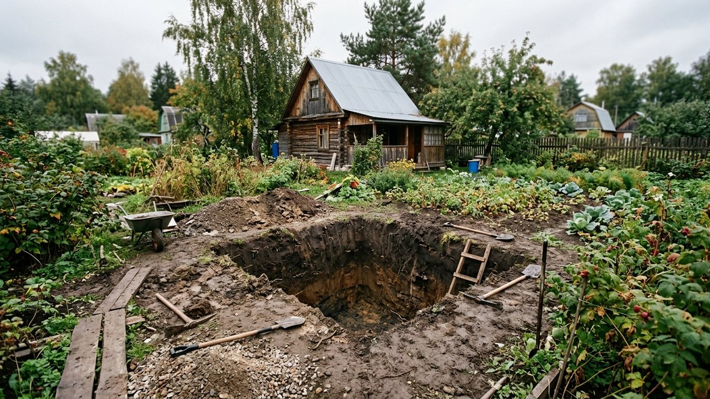
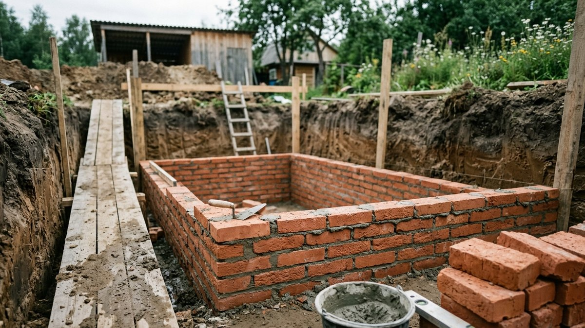
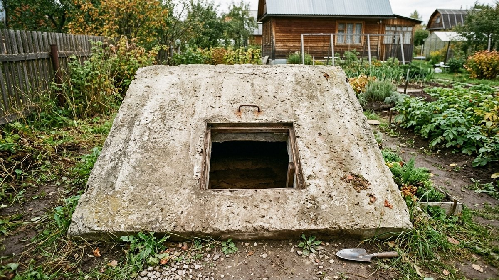
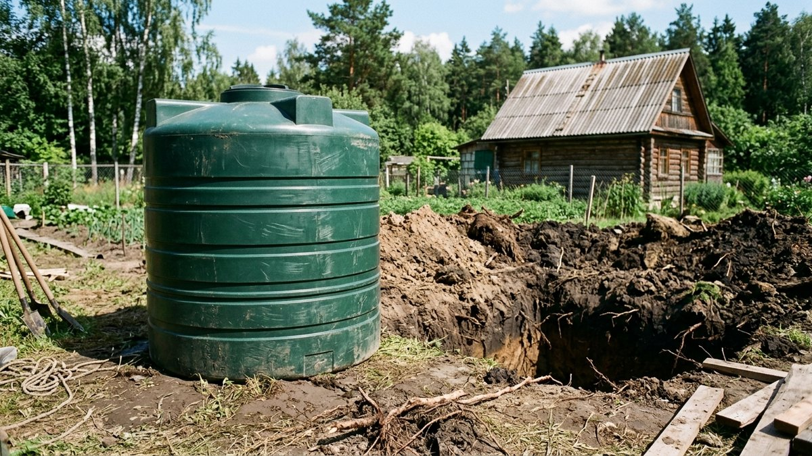
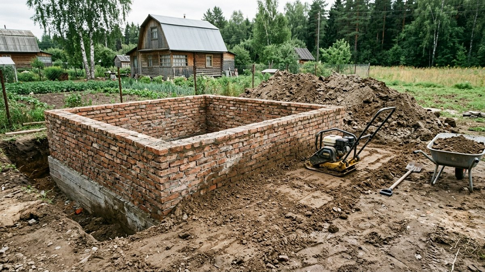
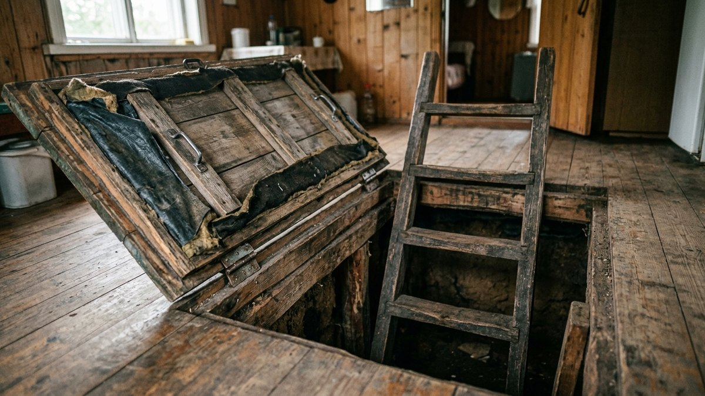

Осенью, когда урожай собран и хранить его негде, вопрос погреба встаёт особенно остро. На сайте уже разобрано, как [обустроить готовый погреб изнутри](https://mir-doma.pro/obustroystvo-pogreba/) — вентиляция, стеллажи, влажность. Здесь — про этап раньше: с чего начать строительство и сколько оно будет стоить в зависимости от материала стен и размера. В конце — калькулятор сметы по объёму.

## Виды погребов по конструкции

- **Погреб под домом.** Экономит место на участке, проще утеплить за счёт тепла от дома сверху, но строить сложнее — нужен доступ к фундаменту на этапе стройки дома или частичная переделка уже готового.
- **Отдельно стоящий врытый погреб.** Котлован в грунте на участке, стены из кирпича, блоков или бетона, засыпка землёй сверху. Самый распространённый вариант на даче.
- **Готовый погребок (пластиковая или металлическая ёмкость).** Заводское изделие закапывают в заранее вырытый котлован целиком — самый быстрый способ, но и самый дорогой за счёт цены готового изделия.

## Из чего строить стены

**Кирпич.** Классика: прочный, служит десятилетиями, но кладка — самая трудоёмкая по времени работа из всех вариантов.

**Блоки ФБС или газоблок.** Быстрее кирпича за счёт крупного размера элемента, дешевле по материалу, но газоблок обязательно нуждается в дополнительной гидроизоляции — он сам по себе впитывает влагу.

**Монолитный бетон.** Заливка в опалубку — самый герметичный вариант при должном качестве бетона, но нужна опалубка и время на набор прочности (минимум 3–4 недели до нагрузки).

**Готовая пластиковая или металлическая ёмкость.** Не требует кладки и заливки вообще — котлован, обратная засыпка, минимум мокрых работ. Дороже остальных за счёт цены изделия, но экономит время и не зависит от погоды при монтаже.

## Из чего складывается смета

- **Земляные работы.** Котлован вручную или экскаватором — зависит от глубины и доступа техники на участок.
- **Материал стен** — кирпич, блоки, бетон или готовая ёмкость.
- **Гидроизоляция.** Обязательна при любом материале, кроме заводской герметичной ёмкости — обмазочная или рулонная, зависит от уровня грунтовых вод.
- **Перекрытие** — бетонная плита или деревянный накат с утеплением и гидроизоляцией сверху.
- **Лестница и люк** — от простой приставной лестницы до капитальной бетонной с люком на петлях.
- **Вентиляция** — минимум две трубы, приток и вытяжка; про принципы работы подробно в статье [обустройство погреба](https://mir-doma.pro/obustroystvo-pogreba/).

## Сравнение по материалу стен

| Материал | Цена под ключ, ₽/м³ | Срок работ |
|---|---|---|
| Блоки ФБС / газоблок | 9 000–14 000 | 1–2 недели |
| Монолитный бетон | 10 000–15 000 | 3–5 недель с застыванием |
| Кирпич | 12 000–18 000 | 2–4 недели |
| Готовая ёмкость (пластик/металл) | 18 000–25 000 | 2–4 дня |

## Калькулятор: смета на строительство погреба

Укажите размеры погреба и материал стен — калькулятор посчитает объём и ориентир по деньгам под ключ.

<!-- wp:html -->

<h3 class="md-pg__title">Калькулятор строительства погреба</h3>

Ориентир под ключ, включая земляные работы, гидроизоляцию и перекрытие. Регион и уровень грунтовых вод сильно меняют смету.

<label class="md-pg__f">Длина, м<input type="number" id="pgLen" value="3" min="1" max="15" step="0.1"></label>
<label class="md-pg__f">Ширина, м<input type="number" id="pgWid" value="2.5" min="1" max="15" step="0.1"></label>
<label class="md-pg__f">Высота (глубина), м<input type="number" id="pgH" value="2" min="1" max="4" step="0.1"></label>
<label class="md-pg__f">Материал стен
<select id="pgMat">
<option value="11500">Блоки ФБС / газоблок — 11 500 ₽/м³</option>
<option value="12500" selected>Монолитный бетон — 12 500 ₽/м³</option>
<option value="15000">Кирпич — 15 000 ₽/м³</option>
<option value="21500">Готовая ёмкость (пластик/металл) — 21 500 ₽/м³</option>
</select></label>

<label class="md-pg__chk"><input type="checkbox" id="pgStair" checked>Лестница и люк (≈15 000 ₽)</label>
<label class="md-pg__chk"><input type="checkbox" id="pgVent" checked>Вентиляция, приток+вытяжка (≈8 000 ₽)</label>

Объём погреба<b id="pgVol">0 м³</b>

Стены и перекрытие<b id="pgWallCost">0 ₽</b>

Итого под ключ<b id="pgTotal">—</b>

Ориентир без учёта сложного грунта, высоких грунтовых вод и удалённости участка.

<button type="button" id="pgCopy" class="md-pg__btn md-pg__btn--main">Скопировать результат</button>
<a id="pgVk" class="md-pg__btn md-pg__btn--vk" href="#" target="_blank" rel="noopener noreferrer">Поделиться ВКонтакте</a>
<a id="pgTg" class="md-pg__btn md-pg__btn--tg" href="#" target="_blank" rel="noopener noreferrer">Поделиться в Telegram</a>
<button type="button" id="pgPrint" class="md-pg__btn">Печать</button>

<!-- /wp:html -->

## Этапы строительства кратко

1. **Разметка и котлован.** Глубина зависит от уровня грунтовых вод — если они высокие, погреб делают мельче и приподнимают над уровнем земли, компенсируя обваловкой.
2. **Основание.** Бетонная подушка или щебёночная подготовка под пол погреба.
3. **Стены.** Кладка, заливка в опалубку или установка готовой ёмкости.
4. **Гидроизоляция.** Обмазочная или рулонная — снаружи стен, до обратной засыпки грунтом.
5. **Перекрытие.** Плита или балки с утеплением и гидроизоляцией сверху, с проёмом под люк.
6. **Засыпка и обваловка.** Грунт вокруг стен утрамбовывают послойно, чтобы не было пустот и просадки.
7. **Вентиляция и лестница.** Финальный этап перед тем, как погреб можно наполнять и обустраивать полками — что для этого нужно, в статье [обустройство погреба](https://mir-doma.pro/obustroystvo-pogreba/).

## Частые ошибки

- **Не проверить уровень грунтовых вод перед копкой.** Погреб в воде — самая частая причина переделки: копают тестовый шурф или спрашивают соседей с погребами о глубине воды.
- **Сэкономить на гидроизоляции.** Течь через стены или пол проявляется не сразу, а с первым паводком или снеготаянием — переделка обходится дороже исходной экономии.
- **Не продезинфицировать новый погреб перед закладкой урожая.** Даже в новых стенах может завестись грибок из-за остаточной влажности после строительства — окуривание серной шашкой перед первой закладкой решает эту проблему, разбор в статье [расчёт серной шашки для погреба](https://mir-doma.pro/raschet-sernoy-shashki-dlya-pogreba/).
- **Забыть про вентиляцию на этапе перекрытия.** Трубы для притока и вытяжки проще заложить в перекрытие сразу, чем сверлить готовую бетонную плиту потом.
- **Засыпать грунт без трамбовки.** Рыхлая засыпка проседает за 1–2 сезона, и вокруг стен образуются пустоты, куда затекает вода.

## Частые вопросы

### Сколько стоит построить погреб 6 м³?

При монолитном бетоне (12 500 ₽/м³) и стандартной комплектации — лестница и вентиляция — ориентировочно 98 000 ₽. Посчитайте точнее под свои размеры и материал по калькулятору выше.

### Можно ли построить погреб своими руками без бригады?

Земляные работы, кладку и гидроизоляцию можно сделать самому — это экономит 30–40% сметы, уходящей на оплату труда. Заливку перекрытия в одиночку делать не стоит: бетон нужно уложить быстро, пока не начал схватываться.

### Какой погреб дешевле: кирпичный или из готовой ёмкости?

Готовая ёмкость дороже по материалу, но экономит время и не требует мокрых работ. Кирпич дешевле по деньгам, но дольше по срокам и требует отдельной гидроизоляции.

### На какую глубину копать погреб?

Стандартная высота погреба — 2–2,2 м для комфортного передвижения, плюс запас на основание и перекрытие сверху — итоговая глубина котлована обычно 2,5–2,8 м. Если грунтовые воды высокие, глубину уменьшают и компенсируют высоту обваловкой над землёй.

### Нужно ли разрешение на строительство погреба?

Отдельно стоящий погреб как хозпостройка обычно не требует отдельного разрешения, но стоит свериться с местными нормами отступов от границ участка и соседних построек — как и для любой хозяйственной постройки.

### Когда лучше строить погреб — весной или осенью?

Земляные работы удобнее в сухой сезон — конец лета или начало осени, когда грунтовые воды на минимуме и не мешают копать котлован. Весной, после таяния снега, уровень воды в грунте обычно самый высокий.
