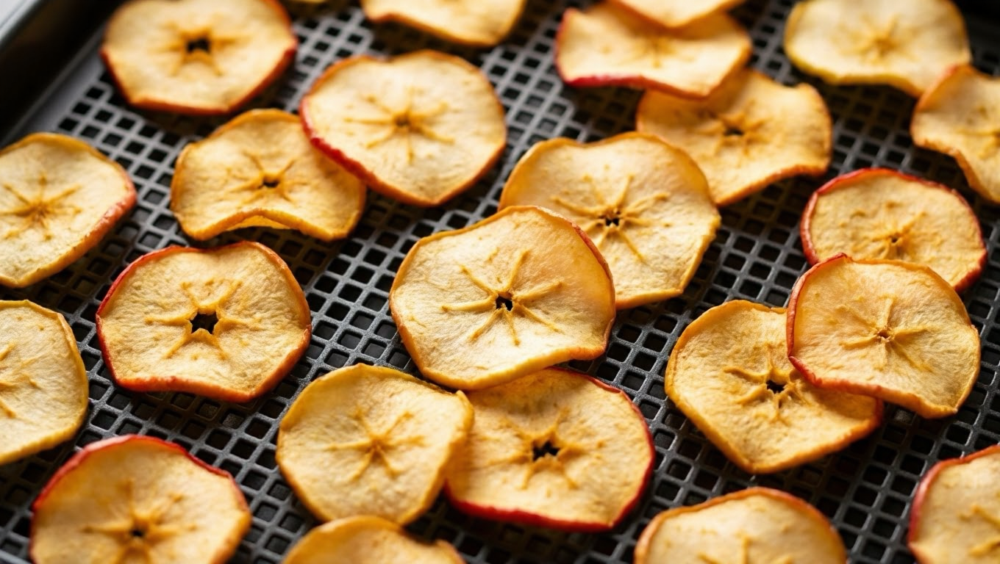
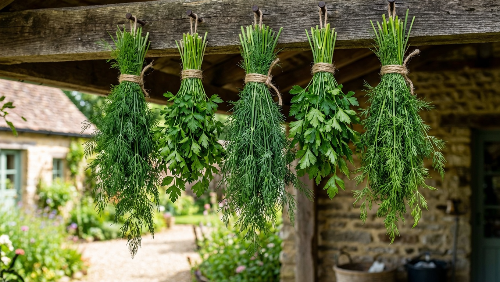
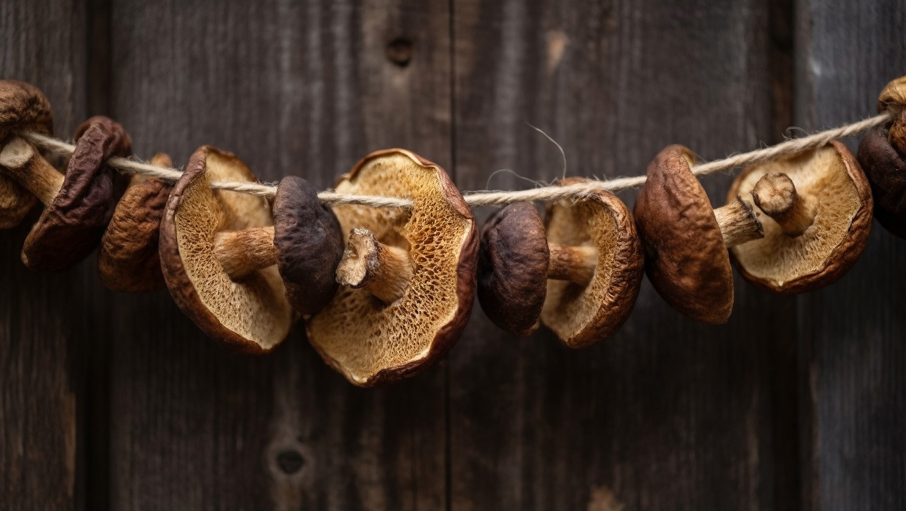
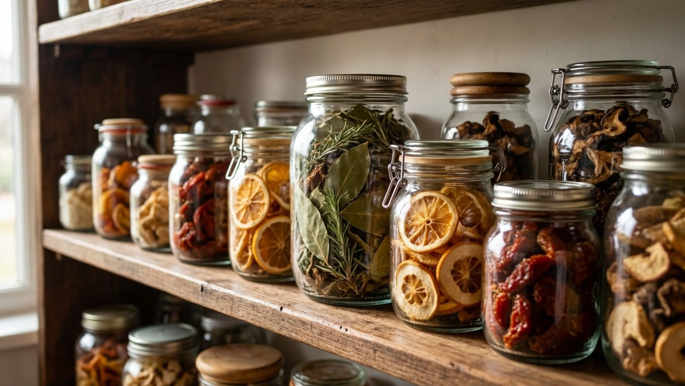

Сушка — древнейший и самый экономичный способ заготовки: она не требует ни сахара, ни соли, ни банок, а сушёные плоды занимают мало места и хранятся долго. При этом продукты сохраняют почти все витамины, а вкус и аромат у них становятся даже концентрированнее. Разберём, как правильно сушить овощи, фрукты, зелень и грибы на зиму: какими способами, при какой температуре и как потом всё это хранить.

## 🌞 Чем хороша сушка

У сушки есть весомые преимущества перед другими заготовками:

- **экономичность** — не нужны сахар, соль, уксус и банки;
- **компактность** — сушёные плоды уменьшаются в разы и почти не занимают места;
- **польза** — сохраняется большинство витаминов и минералов;
- **концентрированный вкус** — сушёные томаты, яблоки, зелень ароматнее свежих;
- **простота хранения** — не нужен холод, достаточно сухого места.

Сушат почти всё: фрукты и ягоды (яблоки, груши, сливы на чернослив, абрикосы на курагу), овощи (томаты, морковь, свёкла, перец, лук), зелень, коренья и грибы.

## 🔧 Способы сушки

Есть три основных способа, и выбор зависит от того, что сушите и чем располагаете.

**Электросушилка (дегидратор).** Самый удобный и надёжный способ: продукт равномерно обдувается тёплым воздухом с заданной температурой. Не нужно следить и переворачивать, результат стабильный. Идеальна для любых продуктов.

**Духовка.** Доступный вариант, если сушилки нет. Сушат при **приоткрытой дверце** (для оттока влаги) и минимальной температуре, с конвекцией — быстрее. Требует внимания: важно не пересушить и не запечь.

**Естественная сушка (на воздухе).** Старый способ: на солнце (фрукты, томаты) или в тени и проветриваемом месте (зелень, грибы на нитке). Бесплатно, но долго и зависит от погоды; продукты защищают от пыли и насекомых марлей.

## 🌡️ Температура и время

Главное правило: **сушить нужно медленно и при невысокой температуре**, иначе продукт «запечётся» снаружи, а внутри останется сырым и заплесневеет. Ориентиры:

- **зелень и травы** — 35–40 °C, сохнет быстро (несколько часов);
- **овощи** — 50–55 °C, от 6 до 12 часов;
- **фрукты и ягоды** — 55–60 °C, от 8 до 20 часов в зависимости от сочности;
- **грибы** — 45–50 °C на старте, затем до 60 °C.

Время всегда ориентировочное — оно зависит от сочности, размера кусочков и способа. Ориентируются не на часы, а на **готовность продукта** (см. ниже).

## 🍎 Сушка фруктов и ягод

Фрукты — самый популярный продукт для сушки:

- **яблоки, груши** — нарезать тонкими дольками или кружочками; чтобы не темнели, сбрызнуть подкислённой водой (с лимонной кислотой);
- **сливы** (на чернослив), **абрикосы** (на курагу) — половинками, косточку удалить;
- **ягоды** — вишню, смородину, виноград (на изюм) сушат целыми;
- **готовность** — ломтики гибкие, эластичные, не липкие и не выделяют сок при сжатии.

Из сушёных фруктов зимой варят [компот](https://mir-doma.pro/kompot-na-zimu/) — он получается особенно ароматным.

## 🥕 Сушка овощей

Сушёные овощи — готовая основа для супов, рагу и приправ:

- **томаты** — половинками или дольками, при желании с солью и травами (вяленые томаты);
- **морковь, свёкла, коренья** — натереть или нарезать соломкой — идеальная заправка для супов;
- **перец** сладкий — полосками, острый — целыми стручками;
- **лук, чеснок** — тонкими кольцами или пластинами;
- **зелёный горошек, стручковая фасоль** — предварительно бланшируют;
- **готовность** — овощи ломкие или упругие, полностью без влаги.

Смесь сушёных кореньев и овощей — это домашняя приправа для первых блюд без консервантов.

## 🌿 Сушка зелени и трав

Зелень сушить проще всего, и сушёная она сохраняет весь аромат:

- **укроп, петрушку, кинзу, базилик, сельдерей** — связать в пучки и подвесить в тени или разложить на решётке;
- сушить в тени и без жары — на солнце и при высокой температуре зелень теряет цвет и аромат;
- **готовность** — листья ломкие, легко растираются в порошок;
- хранить лучше не в порошке, а целыми листьями, растирая перед использованием — так аромат держится дольше.

Так же сушат мяту, мелиссу, чабрец и другие травы для чая.

## 🍄 Сушка грибов

Сушка — лучший способ заготовки для трубчатых грибов (белые, подберёзовики, подосиновики):

- грибы **не моют**, а очищают сухой щёткой (мытые плохо сохнут и темнеют);
- нарезают пластинами или сушат мелкие целиком, нанизывая на нить;
- сушат при умеренной температуре до состояния, когда гриб **гнётся, но при усилии ломается** и не крошится в труху;
- пересушенные грибы крошатся, недосушенные — плесневеют.

Сушёные грибы очень ароматны и зимой заменяют свежие в супах и соусах.

## 🫙 Как хранить сушёные заготовки

Главный враг сушки — влага и вредители. Правила хранения:

- полностью остудить продукт перед закладкой — тёплый отсыреет;
- хранить в **герметичной таре** — стеклянных банках с крышкой, тканевых мешочках (для зелени) или бумажных пакетах в сухом месте;
- держать в **сухом, тёмном и прохладном** месте, отдельно от продуктов с сильным запахом;
- первые пару недель поглядывать: если на стенках банки появился конденсат, продукт недосушен — его досушивают;
- от пищевой моли в банки с сушкой кладут лавровый лист, а тару периодически проверяют.

Сушка отлично уживается с другими заготовками — общие правила в статье [как хранить овощи зимой](https://mir-doma.pro/kak-hranit-ovoshchi-zimoy/), а овощи, которые лучше сохранить свежими или замороженными, разобраны в материале [что заморозить на зиму](https://mir-doma.pro/chto-zamorozit-na-zimu/).

## ❌ Частые ошибки

- **Слишком высокая температура** — продукт запекается снаружи, внутри сырой и плесневеет.
- **Толстая нарезка** — сохнет неравномерно и долго.
- **Не остудили перед хранением** — тёплая сушка отсыревает в банке.
- **Негерметичная тара** — сушка впитывает влагу и запахи, заводится моль.
- **Мыли грибы перед сушкой** — они темнеют и плохо сохнут.
- **Сушили зелень на солнце** — теряется цвет и аромат.

## ❓ Частые вопросы

**При какой температуре сушить овощи и фрукты?**
Зелень — 35–40 °C, овощи — 50–55 °C, фрукты и ягоды — 55–60 °C. Сушить нужно медленно при невысокой температуре, иначе продукт запечётся снаружи и останется сырым внутри.

**Можно ли сушить в духовке?**
Да, при минимальной температуре и приоткрытой дверце, чтобы уходила влага; с конвекцией быстрее. Нужно следить, чтобы не пересушить и не запечь продукт.

**Как понять, что продукт высох?**
Фрукты становятся гибкими и не липкими, овощи — ломкими или упругими без влаги, зелень легко растирается, грибы гнутся, но при усилии ломаются. Из кусочков не должен выделяться сок.

**Как хранить сушёные овощи и фрукты?**
В герметичных банках или тканевых мешочках, в сухом тёмном прохладном месте. Продукт полностью остужают перед закладкой, а от моли кладут лавровый лист.

**Нужно ли мыть грибы перед сушкой?**
Нет, грибы для сушки не моют, а очищают сухой щёткой — мытые темнеют и плохо сохнут.

**Почему сушёные заготовки плесневеют?**
Продукт недосушен или хранился во влажной или негерметичной таре. Если в банке появился конденсат — сушку нужно досушить, а тару держать плотно закрытой в сухом месте.

**Что лучше — сушить или замораживать?**
Зависит от продукта: зелень, грибы, яблоки, томаты отлично сушатся, а сочные ягоды и овощи (кабачки, перец кусочками) часто удобнее заморозить. Многое заготавливают обоими способами.

---

Сушка — самый простой и бюджетный способ сохранить урожай: без сахара, соли и банок, зато с концентрированным вкусом и пользой. Нарезайте тонко, сушите медленно при невысокой температуре и храните в герметичной таре — и всю зиму под рукой будут ароматные фрукты для компота, коренья для супа и душистая зелень. Другие способы заготовки — [что заморозить на зиму](https://mir-doma.pro/chto-zamorozit-na-zimu/), [компот](https://mir-doma.pro/kompot-na-zimu/) и [варенье](https://mir-doma.pro/varene-na-zimu/).
