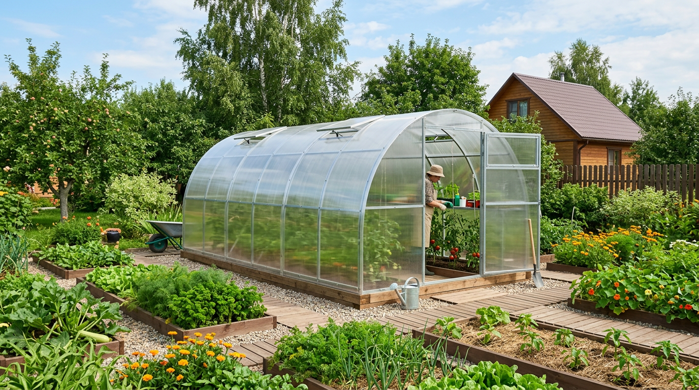
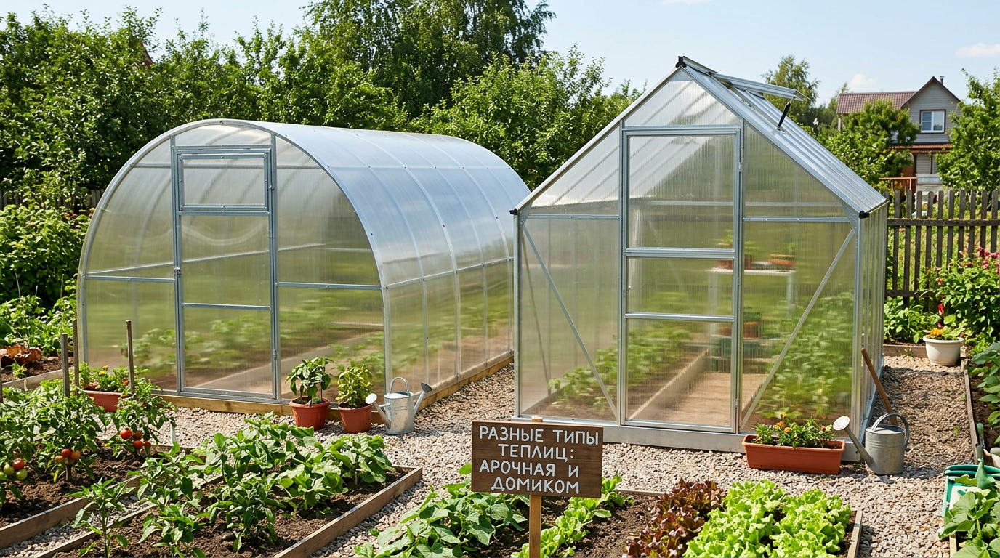
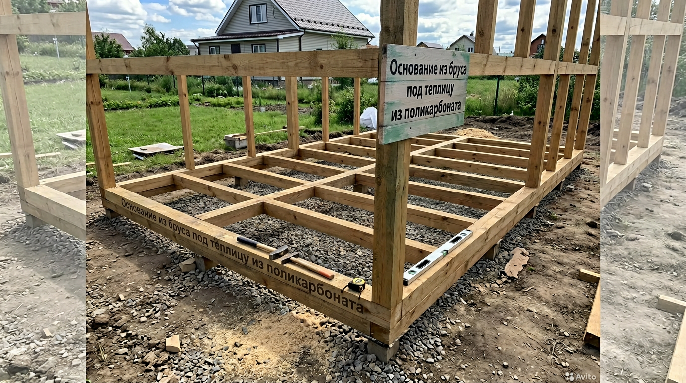
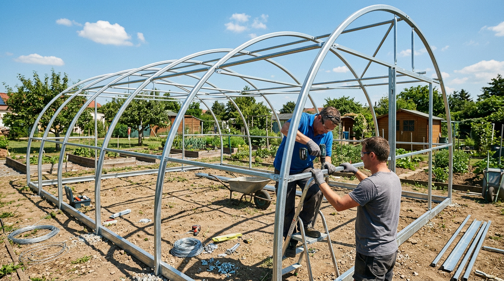
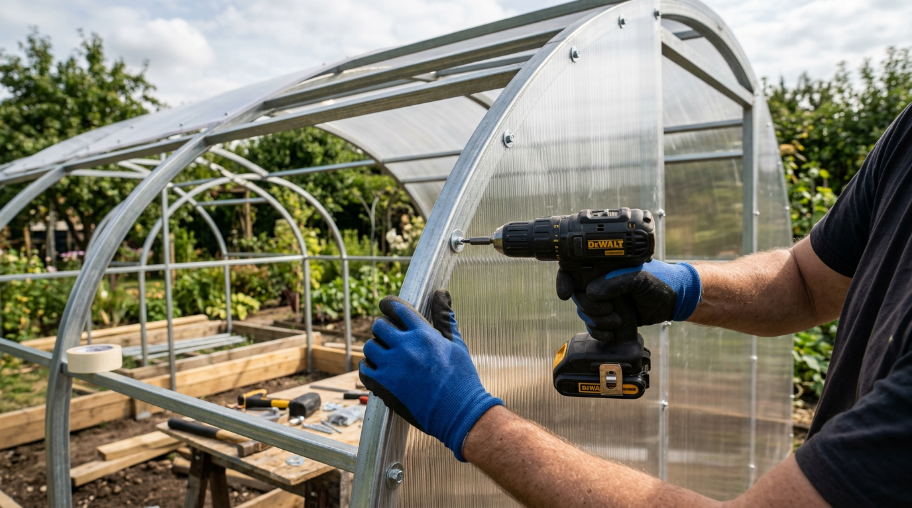
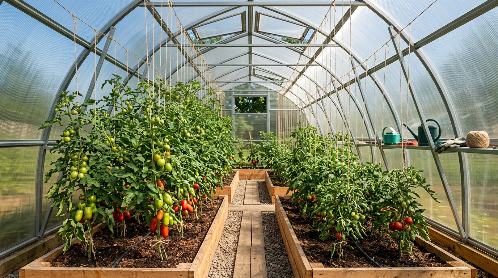

Теплица из поликарбоната продлевает дачный сезон на пару месяцев, защищает растения от заморозков и непогоды и заметно повышает урожай теплолюбивых культур. И хорошая новость в том, что собрать её своими руками вполне по силам — поликарбонат лёгкий, каркас собирается как конструктор, а весь процесс укладывается в выходные. В этой статье разберём, как построить теплицу из поликарбоната своими руками: какие бывают формы и каркасы, как выбрать место, размер и толщину поликарбоната, как заложить основание, собрать каркас, правильно смонтировать листы и обустроить теплицу внутри.

## 🏡 Чем хороша теплица из поликарбоната

Сотовый поликарбонат почти вытеснил плёнку и стекло, и не зря. У него сразу несколько преимуществ перед другими материалами:

- **Сохраняет тепло.** Воздушные каналы внутри листа работают как термос, поэтому в такой теплице теплее, чем под плёнкой или стеклом.
- **Прочность.** Поликарбонат не бьётся, как стекло, выдерживает град и снеговую нагрузку, служит 10–15 лет и дольше.
- **Рассеивает свет.** Он мягко распределяет солнечные лучи, без ожогов на листьях и резких теней.
- **Лёгкий и гибкий.** Листы легко режутся и сгибаются, что позволяет делать арочные конструкции.
- **Защита от ультрафиолета.** На качественном поликарбонате есть UV-слой, который защищает и сам материал, и растения.

Минусы тоже есть: дешёвый тонкий поликарбонат быстро мутнеет и теряет свойства, а при ошибках монтажа в каналы попадает влага и грязь. Поэтому важно и выбрать нормальный материал, и собрать всё правильно — об этом ниже. По сравнению с плёнкой, которую приходится менять каждый сезон, поликарбонат — это разовое вложение на много лет, а в сравнении со стеклом он легче, безопаснее и лучше держит тепло.

## 📐 Какие бывают теплицы

Перед покупкой материалов нужно определиться с формой и типом каркаса.

### По форме

- **Арочная.** Самая популярная: полукруглая крыша, по которой легко скатывается снег, и минимум стыков. Проста в сборке из готовых дуг.
- **Домиком (двускатная).** С вертикальными стенами и скатной крышей — у стен больше полезного места и удобнее подвязывать высокие растения.
- **Каплевидная.** Со заострённым верхом, с которого снег сходит сам — хороший вариант для снежных регионов.

### По каркасу

Каркас — это скелет теплицы, от него зависит долговечность. Чаще всего используют **оцинкованный профиль** или **профильную трубу** (20×20 или 20×40 мм). Оцинковка не ржавеет и служит долго. Деревянный каркас дешевле, но требует обработки антисептиком и менее долговечен. Для самостоятельной сборки удобнее всего готовый заводской каркас из оцинкованной трубы, который остаётся только собрать и обшить поликарбонатом. При выборе обращайте внимание на толщину металла и шаг дуг: слишком тонкий профиль и редкие дуги (больше метра) плохо держат снеговую нагрузку, и теплицу может сложить зимой. Надёжнее брать каркас с дугами через 0,65–1 м и усиленным профилем.

## 📍 Выбор места и размера

### Где поставить теплицу

От расположения зависит освещённость и, в итоге, урожай. Несколько правил:

- Ставьте теплицу на **открытом солнечном месте**, вдали от тени деревьев и построек.
- Ориентируйте её длинной стороной с **запада на восток** — так растения получают максимум света в течение дня.
- Выбирайте ровную площадку без застоя воды; при необходимости выровняйте грунт.
- Учитывайте удобный подход и подвод воды для полива.
- Не ставьте теплицу в низине, где скапливается холодный воздух и вода, и вплотную к забору или стене — нужен доступ со всех сторон для обслуживания.

### Какой размер выбрать

Размер зависит от того, сколько и каких культур вы планируете выращивать. Ориентируйтесь на таблицу:

| Размер теплицы | Площадь | Для чего подходит |
|----------------|---------|-------------------|
| 3×4 м | 12 м² | Небольшая семья, помидоры и огурцы |
| 3×6 м | 18 м² | Универсальный вариант, разные культуры |
| 3×8 м | 24 м² | Большой урожай, продажа излишков |

Самая ходовая ширина — **3 метра**: внутри помещаются две грядки по краям и проход посередине. Длину выбирают кратной 2 метрам (под стандартный лист поликарбоната 2,1×6 м, который режут пополам).

## 🧰 Материалы и инструменты

Для теплицы 3×6 м понадобится примерный набор:

| Материал | Назначение |
|----------|------------|
| Оцинкованный профиль / труба 20×40 мм | Каркас, дуги |
| Сотовый поликарбонат 4–6 мм | Обшивка |
| Брус 100×100 мм или лента | Основание |
| Термошайбы | Крепление листов |
| Соединительный и торцевой профиль | Стыки и торцы листов |
| Саморезы по металлу, анкеры | Сборка и крепление к основанию |
| Антисептик (для деревянного основания) | Защита бруса |

По толщине поликарбоната ориентир такой: **4 мм** — бюджетный вариант для лёгких сезонных теплиц, **6 мм** — оптимум по прочности и теплу, **8–10 мм** — для капитальных и зимних теплиц. Брать тоньше 4 мм не стоит: такой лист хрупкий и быстро выходит из строя. Из инструментов нужны шуруповёрт, ножовка или электролобзик, канцелярский нож, рулетка, уровень и стремянка.

## 🏗️ Основание для теплицы

Многие ставят теплицу прямо на грунт, но это ошибка: конструкцию ведёт при пучении почвы, снизу задувает холод и пролезают сорняки. Поэтому теплице нужно основание.

Самый простой и распространённый вариант — **основание из бруса** 100×100 мм. Брус обрабатывают антисептиком, укладывают по периметру на выровненный грунт (на песчаную подушку и гидроизоляцию), проверяют уровнем и диагонали, скрепляют углы и крепят к грунту анкерами или арматурой. Для капитальной теплицы делают **ленточный фундамент** из бетона — он надёжнее, но дороже и трудозатратнее. Брусовое основание оптимально для большинства дачных теплиц: оно поднимает каркас над землёй, защищает металл от влаги и не даёт конструкции смещаться. Чтобы продлить срок службы бруса, его не только пропитывают антисептиком, но и изолируют от грунта — кладут на слой рубероида или специальной мембраны. Некоторые вместо бруса используют готовые бетонные блоки или винтовые сваи: это дороже, но ещё надёжнее и полностью исключает контакт дерева с землёй.

## 🔩 Сборка каркаса

Когда основание готово, собирают каркас. Если у вас заводской комплект, всё сводится к сборке по инструкции производителя: дуги или стойки соединяют стяжками и крепят к основанию.

Общий порядок такой:

1. Соберите торцевые части теплицы с дверными и форточными проёмами.
2. Установите и закрепите на основании первую и последнюю дуги (или стойки), выставив их строго вертикально.
3. Соедините дуги горизонтальными стяжками — они задают форму и жёсткость.
4. Установите промежуточные дуги с шагом, рекомендованным производителем (обычно 0,5–1 м; чем чаще, тем прочнее).
5. Проверьте геометрию: каркас должен стоять ровно, без перекосов, прежде чем обшивать его поликарбонатом.

Все болтовые соединения на этом этапе затягивают, но не намертво — окончательную протяжку делают после того, как убедились, что каркас стоит ровно. Места крепления оцинкованных деталей, где металл резался или сверлился, желательно обработать защитным составом от ржавчины: именно с таких «ранок» обычно и начинается коррозия.

Сразу предусмотрите достаточно **форточек**: минимум две (в идеале по торцам и на крыше) плюс дверь. Хорошее проветривание критично — без него летом теплица перегревается, а растения болеют.

## 📄 Монтаж поликарбоната

Это самый ответственный этап: от него зависит, как теплица будет держать тепло и сколько прослужит. Главные правила:

- **UV-слоем наружу.** На защитной плёнке листа указано, какая сторона должна смотреть на солнце. Перепутаете — поликарбонат быстро помутнеет и растрескается.
- **Каналы — вертикально или вдоль ската.** Внутренние соты должны идти сверху вниз, чтобы конденсат свободно стекал, а не застаивался внутри листа.
- **Торцы обязательно закрывают.** Верхние торцы — сплошной лентой и торцевым профилем, нижние — перфорированной лентой, чтобы конденсат выходил, но грязь и насекомые внутрь не попадали.
- **Крепят термошайбами.** Это саморезы со специальной шайбой и уплотнителем. Отверстия сверлят чуть больше диаметра ножки — поликарбонат расширяется от тепла, и ему нужен люфт.
- **Не перетягивайте крепёж.** Перетянутая термошайба продавливает лист, и в этом месте он трескается.
- **Стыки листов** соединяют специальным соединительным профилем, а не внахлёст.

Защитную плёнку с листа снимают только после монтажа, чтобы не поцарапать поверхность. Резать поликарбонат удобно канцелярским ножом (по линейке) или электролобзиком с мелким зубом. Работать лучше в нежаркую безветренную погоду: на жаре лист сильно расширяется, а на ветру лёгкие панели парусят. Перед сверлением отверстий под термошайбы размечайте шаг крепления заранее — обычно 30–40 см, чтобы лист нигде не отходил от каркаса.

## 🌱 Обустройство теплицы внутри

Когда теплица собрана, её обустраивают под посадки. Классическая планировка для ширины 3 метра — две грядки по краям шириной около 90 см и проход 60 см посередине; иногда делают три узкие грядки с двумя проходами.

Грядки удобно делать приподнятыми, в коробах из досок или шифера — почва в них быстрее прогревается. Проход застилают плиткой, досками или засыпают щебнем, чтобы не месить грязь. Обязательно продумайте полив: проще всего сделать [капельный полив](https://mir-doma.pro/pasynkovanie-pomidorov/), который экономит воду и не смачивает листья, снижая риск болезней. Для подвязки высоких растений натягивают шпалеры или закрепляют шпагат к верхним стяжкам каркаса.

Сильно облегчает жизнь автоматический проветриватель — термопривод, который сам открывает форточку при нагреве и закрывает при остывании. Он не требует электричества и спасает урожай, если вы бываете на даче не каждый день: без него в жаркий день закрытая теплица перегревается за пару часов, и растения получают тепловой удар.

В теплице особенно важны проветривание и контроль влажности — в замкнутом тёплом пространстве болезни развиваются быстрее. Поэтому держите форточки открытыми в жару, поливайте под корень и не загущайте посадки. Это лучшая профилактика [фитофторы](https://mir-doma.pro/fitoftora-na-pomidorah/) и других грибковых болезней, а правильное [формирование и пасынкование](https://mir-doma.pro/pasynkovanie-pomidorov/) кустов помогает им хорошо проветриваться.

## 🥒 Что выращивают в теплице

Теплица из поликарбоната раскрывается на теплолюбивых культурах, которым в открытом грунте не хватает тепла и которые страдают от перепадов погоды. Чаще всего в ней выращивают:

- **Помидоры** — главная тепличная культура; в теплице они меньше болеют фитофторой и дают урожай раньше. Подробно о высадке — в статье о [помидорах](https://mir-doma.pro/kogda-sazhat-pomidory-na-rassadu-v-2026/).
- **Огурцы** — любят тепло и влажность, в теплице плодоносят дольше.
- **Перец и баклажаны** — теплолюбивые паслёновые, которым нужен длинный тёплый сезон.
- **Зелень и рассаду** — ранней весной теплица отлично подходит для выгонки зелени и подготовки рассады.

Важный нюанс: помидоры и огурцы любят разный микроклимат (помидорам нужно суше и прохладнее, огурцам — теплее и влажнее), поэтому в одной теплице их либо разделяют перегородкой, либо выбирают что-то одно. А чтобы тепличные томаты не загущались и хорошо проветривались, их обязательно [пасынкуют и формируют](https://mir-doma.pro/pasynkovanie-pomidorov/).

## ⚠️ Частые ошибки при сборке теплицы

Чтобы теплица служила долго и не подвела, избегайте типичных промахов:

- **Тонкий поликарбонат.** Листы менее 4 мм хрупкие и недолговечные — экономия выходит боком.
- **UV-слоем внутрь.** Перевёрнутый лист быстро мутнеет и теряет прочность под солнцем.
- **Не закрыты торцы.** В открытые соты затекает вода, набивается грязь, заводятся насекомые, лист теряет прозрачность.
- **Перетянутые термошайбы.** Продавленный поликарбонат трескается в местах крепления.
- **Нет фундамента.** Теплицу без основания ведёт при движении грунта, снизу дует холод.
- **Мало форточек.** Без проветривания теплица перегревается, а растения чаще болеют.
- **Установка в тени.** Недостаток света сводит на нет весь смысл теплицы.

## 💰 На чём можно сэкономить, а на чём нельзя

Теплица — заметная по бюджету покупка, поэтому полезно понимать, где экономия разумна, а где обернётся переделками.

Сэкономить можно на форме (простая арочная дешевле сложных конструкций), на размере (начните с 3×4 м и при необходимости нарастите), на основании (брус дешевле ленточного фундамента) и на обустройстве — грядки и шпалеры легко сделать из подручных материалов.

А вот на чём экономить не стоит — это на толщине и качестве поликарбоната, на толщине металла каркаса и на крепеже. Тонкий поликарбонат мутнеет за пару сезонов, слабый каркас складывается под снегом, а обычные саморезы без термошайб продавливают листы и пропускают воду. Эти три позиции определяют, прослужит теплица три года или пятнадцать, — здесь лучше не экономить.

## 🧊 Уход за теплицей и подготовка к зиме

Чтобы теплица служила долго, за ней нужно ухаживать. Осенью, после сбора урожая, из неё убирают всю ботву и растительные остатки — именно в них зимуют возбудители болезней и вредители. Поликарбонат снаружи и изнутри моют мягкой губкой с мыльным раствором (без абразивов и агрессивной химии, чтобы не повредить UV-слой), а почву обеззараживают или меняют верхний слой. Каркас осматривают на предмет ржавчины и при необходимости подкрашивают.

Отдельный важный момент — снеговая нагрузка. Арочные и каплевидные теплицы обычно сбрасывают снег сами, но в снежных регионах с крыши его всё равно периодически счищают мягкой щёткой, а внутрь на зиму ставят подпорки под дуги, чтобы каркас не прогнулся под тяжёлой снеговой шапкой. Двери и форточки на зиму держат закрытыми, но в сильные оттепели проветривают, чтобы не скапливался конденсат.

## ❓ Частые вопросы

### Какой толщины поликарбонат выбрать для теплицы?

Для сезонной теплицы достаточно 4 мм, оптимальный вариант по прочности и теплу — 6 мм, а для капитальных и зимних теплиц берут 8–10 мм. Тоньше 4 мм брать не стоит — такой лист хрупкий и быстро выходит из строя.

### Нужен ли теплице фундамент?

Хотя бы простое основание из бруса нужно обязательно. Оно поднимает каркас над землёй, защищает металл от влаги, не даёт конструкции смещаться при пучении грунта и преграждает путь холоду и сорнякам снизу.

### Какой стороной крепить поликарбонат?

UV-защитным слоем наружу, к солнцу. Нужная сторона отмечена на заводской плёнке листа. Если перепутать, поликарбонат быстро помутнеет и начнёт разрушаться от ультрафиолета.

### Зачем закрывать торцы поликарбоната?

Открытые соты набирают воду, грязь и пыль, в них заводятся насекомые, а лист теряет прозрачность и теплоизоляцию. Верхние торцы закрывают сплошной лентой, нижние — перфорированной, чтобы конденсат выходил наружу.

### Как сориентировать теплицу по сторонам света?

Длинной стороной с запада на восток — так растения получают максимум солнечного света в течение дня. Само место должно быть открытым, без тени от деревьев и построек.

### Зачем теплице форточки и сколько их нужно?

Форточки нужны для проветривания: без них теплица в жару перегревается, влажность зашкаливает, и растения болеют и плохо опыляются. Минимум — две форточки плюс дверь, лучше — форточки по торцам и на крыше, а ещё удобнее автоматические проветриватели.

### Сколько служит теплица из поликарбоната?

Качественный сотовый поликарбонат с UV-защитой служит 10–15 лет и дольше, а оцинкованный каркас — ещё дольше. Срок сильно зависит от толщины листа и правильности монтажа: тонкий поликарбонат или ошибки при установке сокращают его в разы.

### Когда лучше ставить теплицу — весной или осенью?

Удобнее всего собирать теплицу осенью или ранней весной, когда нет спешки с посадками и стоит нежаркая безветренная погода, комфортная для работы с поликарбонатом. Осенняя установка даёт возможность сразу подготовить грядки и начать сезон максимально рано.

### Нужно ли убирать теплицу на зиму?

Поликарбонатную теплицу на зиму не разбирают — она для того и капитальная. Достаточно убрать растительные остатки, помыть и обеззаразить, а в снежных регионах поставить подпорки под дуги и счищать тяжёлый снег с крыши.

### Можно ли собрать теплицу в одиночку?

Каркас и основание удобнее собирать вдвоём, но монтаж поликарбоната вполне реально выполнить и одному, если погода безветренная — на ветру лёгкие листы парусят и их сложно удержать.

## Заключение

Теплица из поликарбоната своими руками — посильный проект даже для новичка: главное действовать по этапам. Выберите солнечное место и удобный размер, заложите основание из бруса, ровно соберите каркас, правильно смонтируйте поликарбонат (UV-слоем наружу, с закрытыми торцами и термошайбами) и предусмотрите достаточно форточек. Такая теплица прослужит много лет, продлит сезон и подарит ранний и обильный урожай. А грамотный уход за растениями внутри — проветривание, полив под корень и формирование кустов — раскроет весь её потенциал. Собранная аккуратно и по правилам, теплица из поликарбоната окупается уже за пару сезонов более ранним и обильным урожаем.

А какую теплицу планируете вы — компактную на пару грядок или большую для всего урожая? Делитесь планами в комментариях и подписывайтесь, чтобы не пропустить новые статьи о дачном строительстве и огороде.
