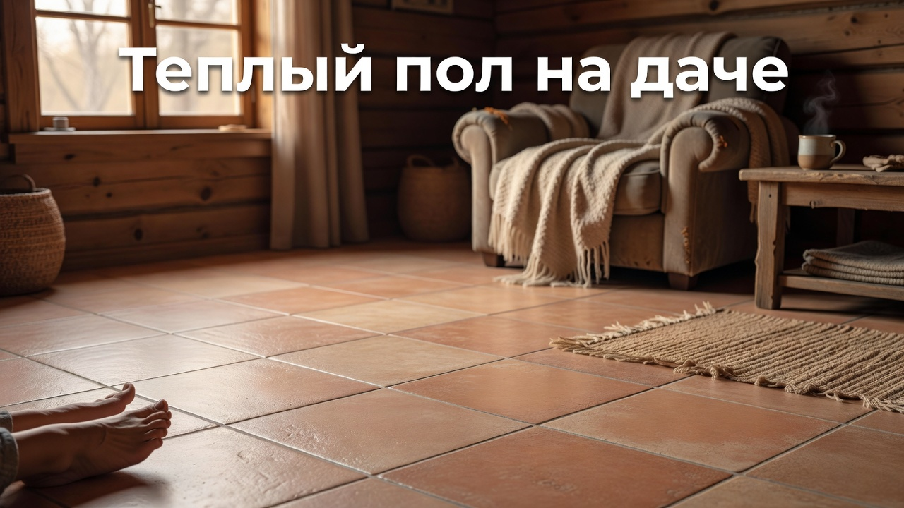
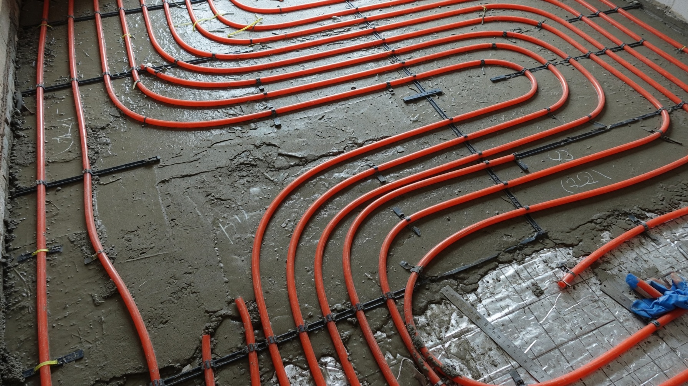
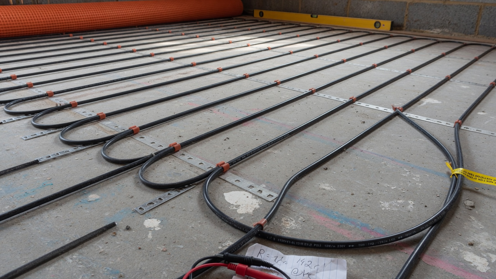
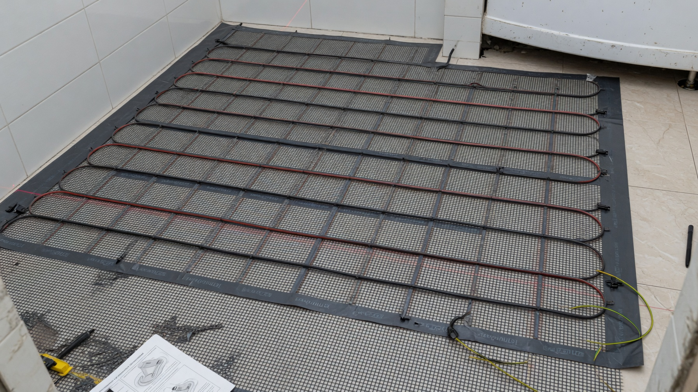
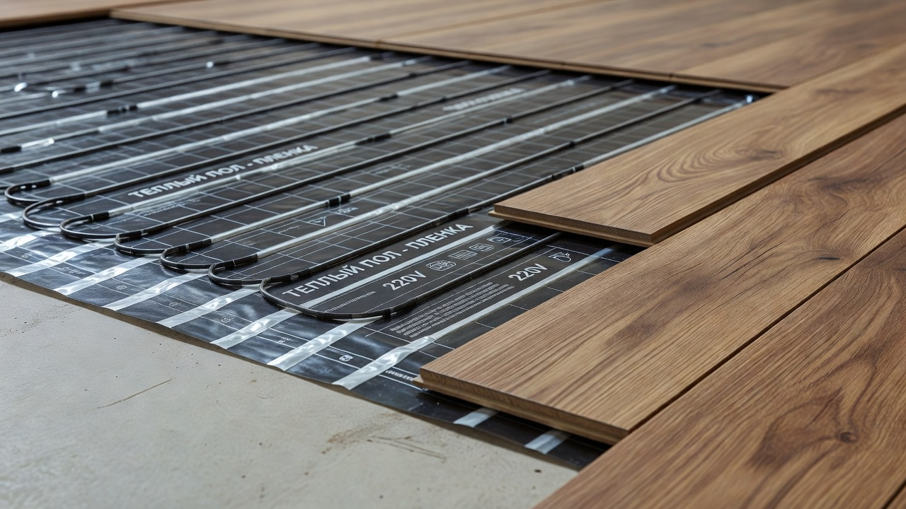
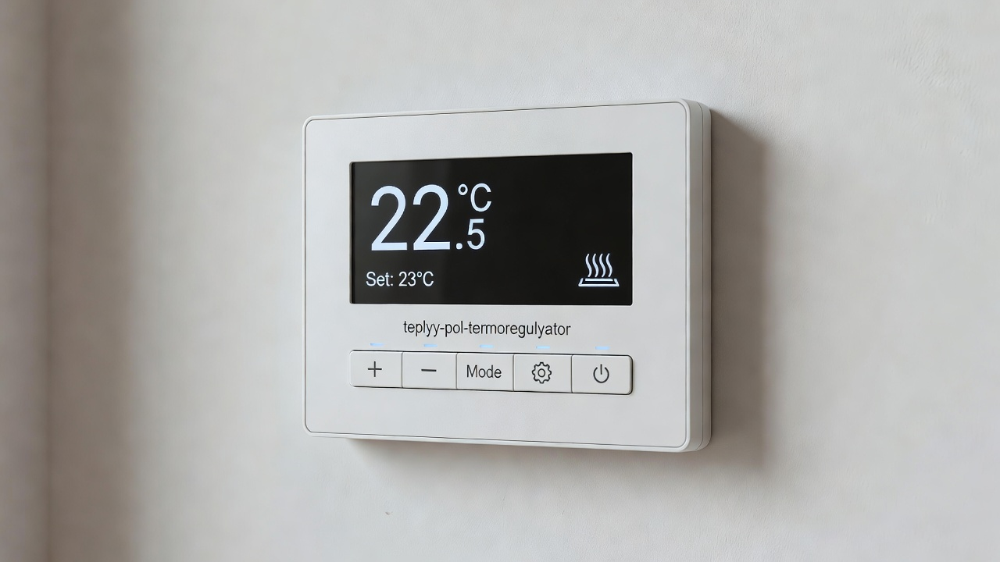

Тёплый пол на даче — это не роскошь, а самый комфортный вид обогрева: тепло идёт снизу, ноги в тепле, а воздух не пересушивается, как от обогревателей. Он может быть и основным отоплением, и приятным дополнением — например, в санузле или на прохладной веранде. Разберём, какой тёплый пол выбрать для дачи, чем электрический отличается от водяного, под какое покрытие что подходит и как всё это устроено.

## 🔌 Электрический или водяной

Первое решение — тип тёплого пола. Для дачи это почти всегда электрический, но разберём оба.

**Электрический** — греющий кабель, маты или плёнка, работающие от сети. Плюсы: проще монтаж, точная регулировка, можно включить только нужную зону, не боится разморозки на сезонной даче. Минус — цена электричества.

**Водяной** — трубы с теплоносителем от котла, залитые в стяжку. Плюсы: дешевле в эксплуатации при большой площади (особенно с газовым [котлом](https://mir-doma.pro/kotel-dlya-dachi/)). Минусы: сложный монтаж, толстая стяжка, риск разморозки зимой на неотапливаемой даче, нужен котёл. Для сезонной дачи водяной пол чаще избыточен.

**Вывод:** для дачи, куда приезжают наездами, практичнее **электрический** тёплый пол — он быстро включается и не боится простоя зимой. Водяной оправдан в доме для постоянного проживания с котлом.

## ⚡ Виды электрического тёплого пола

Электрический пол бывает трёх видов, и это ключевой выбор:

- **Нагревательный кабель** — укладывают в стяжку или слой плиточного клея. Самый мощный, подходит как основное отопление, но требует поднятия уровня пола.
- **Нагревательные маты** — тот же кабель, но на сетке, тонкий. Монтируется прямо под плитку в слой клея, почти не поднимает пол.
- **Инфракрасная плёнка** — тонкая, укладывается насухо под ламинат, линолеум, ковролин, без стяжки и клея. Самый простой монтаж, идеальна для дачи и для укладки своими руками.

## 🎯 Что выбрать под задачу

Ориентируйтесь на то, где и зачем нужен пол:

- **Как основное отопление комнаты** — нагревательный кабель в стяжке, он мощнее и держит тепло.
- **В санузле, на кухне, в прихожей под плитку** — нагревательные маты: тонкие и укладываются под плитку.
- **Под ламинат или линолеум, быстро и без стяжки** — инфракрасная плёнка, особенно если делаете сами.
- **На сезонную дачу наездами** — плёночный пол в нужных зонах: включил, за минуты прогрелся, уехал — не боится простоя.
- **Дополнительный обогрев на прохладной веранде** — тоже плёнка под финишное покрытие.

## 🪵 Под какое покрытие какой пол

Финишное покрытие определяет тип пола:

| Покрытие | Что подходит |
|---|---|
| Плитка, керамогранит | Кабель или маты в клей (лучшее сочетание — плитка отлично проводит тепло) |
| Ламинат, линолеум | Инфракрасная плёнка (маркировка «для тёплого пола») |
| Ковролин | Инфракрасная плёнка (небольшой мощности) |
| Дерево, паркетная доска | С ограничениями и низкой температурой — дерево плохо проводит тепло |

Важно: под тёплый пол берут покрытия **с пометкой «для тёплого пола»** — обычный ламинат от нагрева может выделять вещества и коробиться.

## 🌡️ Терморегулятор — обязателен

Любой тёплый пол ставят через **терморегулятор (термостат)** — без него система работает вслепую и жжёт электричество. Он:

- поддерживает заданную температуру, включая пол только при необходимости;
- экономит электроэнергию — главный расход у электропола;
- программируемые модели включают пол к вашему приезду или по расписанию;
- датчик температуры укладывают между витками кабеля или под плёнку.

Для сезонной дачи удобны термостаты с управлением со смартфона — прогреть пол можно ещё в дороге.

## 🛠️ Как сделать: порядок монтажа

На примере самого «дачного» варианта — инфракрасной плёнки под ламинат:

1. **Основание** выровнять и обязательно утеплить — под плёнку укладывают теплоотражающий подложку-утеплитель, иначе пол будет греть перекрытие, а не комнату.
2. **Разложить плёнку** по площади (не под тяжёлой мебелью), нарезав по линиям реза, не заходя на нагревательные полосы.
3. **Подключить** секции параллельно, изолировать контакты, вывести провода к терморегулятору.
4. **Установить датчик** температуры под плёнку.
5. **Подключить терморегулятор** и проверить работу.
6. **Уложить финишное покрытие** — под ламинат стелют защитную плёнку.

Кабель и маты монтируют сложнее — с заливкой в стяжку или клей, поэтому их чаще доверяют мастеру. А вот основание под любой тёплый пол **обязательно утепляют** — это половина эффективности; как утеплить пол, разобрано в статье про [утепление пола на даче](https://mir-doma.pro/uteplenie-pola-na-dache/).

## ❄️ Тёплый пол и сезонная дача

Несколько важных моментов для дачи, которую зимой не топят постоянно:

- **электрический пол не боится разморозки** — в отличие от водяного, ему простой зимой не страшен;
- **плёночный пол** прогревает зону за минуты — удобно для наездов;
- **основное отопление на тёплом полу** имеет смысл только в утеплённом доме, иначе счета за электричество будут огромными — сначала [утепление](https://mir-doma.pro/kak-uteplit-dachnyy-dom/), потом обогрев;
- как дополнение тёплый пол отлично сочетается с [электрообогревателями](https://mir-doma.pro/elektricheskoe-otoplenie-dachi/) и другими видами отопления.

## ❌ Частые ошибки

- **Уложили без утепления основания** — пол греет перекрытие и улицу, расход огромный.
- **Обычное покрытие вместо «для тёплого пола»** — ламинат коробится и выделяет запах.
- **Плёнка или кабель под мебелью** — перегрев без отвода тепла, риск повреждения.
- **Нет терморегулятора** — перерасход электричества и перегрев.
- **Водяной пол на сезонной даче** — риск разморозки зимой.
- **Тёплый пол в неутеплённом доме как основное отопление** — разорительные счета.

## ❓ Частые вопросы

**Какой тёплый пол выбрать для дачи?**
Для дачи практичнее электрический: он проще в монтаже, точно регулируется и не боится простоя зимой. Плёночный пол удобен для наездов, кабель и маты — как основной обогрев под плитку.

**Что лучше — электрический или водяной тёплый пол?**
На даче обычно электрический: водяной сложнее в монтаже, требует котла и толстой стяжки и рискует разморозиться зимой. Водяной оправдан в доме для постоянного проживания.

**Можно ли сделать тёплый пол своими руками?**
Инфракрасную плёнку под ламинат вполне реально уложить самому. Кабель и маты со стяжкой сложнее, их чаще доверяют мастеру. Терморегулятор нужен в любом случае.

**Какой тёплый пол под ламинат?**
Инфракрасная плёнка — она тонкая, укладывается насухо без стяжки. И ламинат, и плёнка должны иметь маркировку «для тёплого пола».

**Нужно ли утеплять пол под тёплый пол?**
Обязательно. Без теплоотражающей подложки тёплый пол будет греть перекрытие, а не комнату — это половина всего расхода электричества впустую.

**Можно ли оставлять электрический тёплый пол на зиму на даче?**
Да, электрический пол не боится разморозки, в отличие от водяного. Его можно поддерживать в дежурном режиме через терморегулятор или включать к приезду.

---

Тёплый пол делает дачу по-настоящему уютной, а для сезонного дома электрический вариант — самый разумный: быстрый прогрев, точная регулировка и никакого страха разморозки. Выберите тип под задачу, не забудьте про утепление основания и терморегулятор — и пол будет тёплым без лишних счетов. В связке с [утеплением дома](https://mir-doma.pro/kak-uteplit-dachnyy-dom/) и грамотным [отоплением](https://mir-doma.pro/elektricheskoe-otoplenie-dachi/) дача станет комфортной даже в холода.
