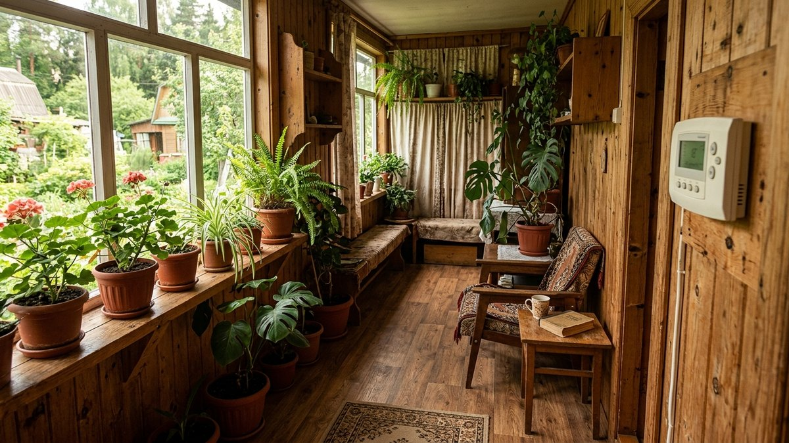
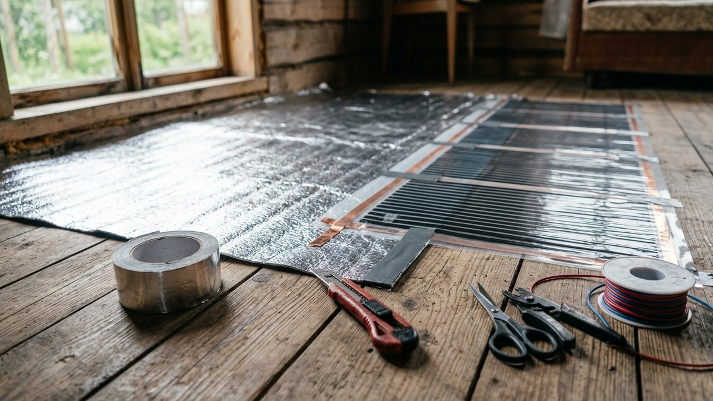
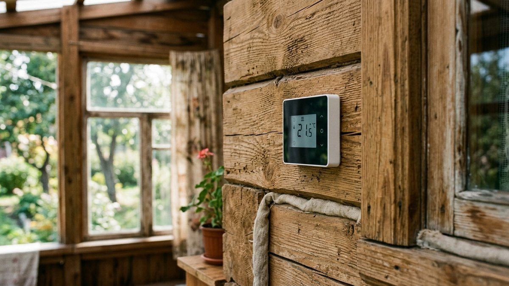
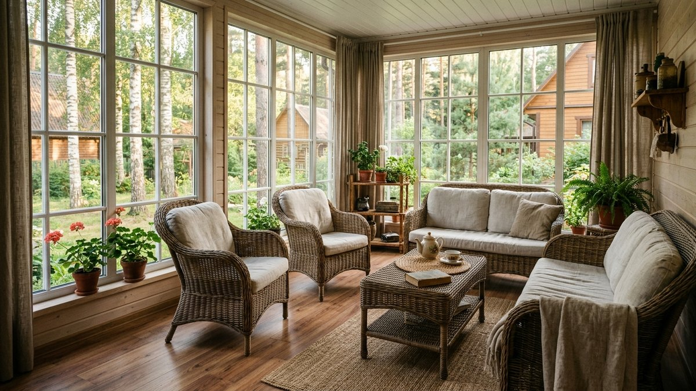
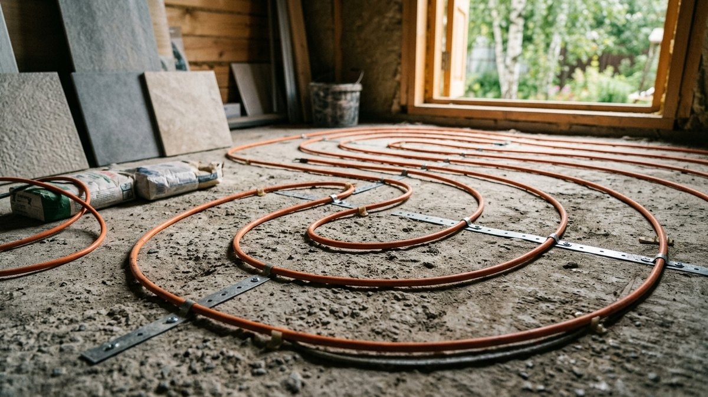
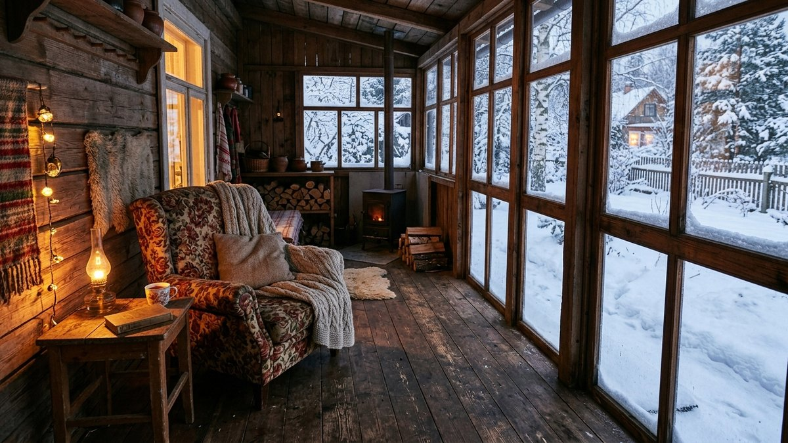

# Тёплый пол на веранде: можно ли сделать и сколько это стоит

На веранде почти всегда деревянный пол на лагах, а не бетонная стяжка, как в
доме, — и это меняет весь выбор тёплого пола. Не любой тип монтируется на
деревянное основание, не любой оправдан для помещения, которое топится по
выходным, и не для каждой веранды это вообще имеет смысл. Разберём, какой
тёплый пол реально ставится на веранде, сколько стоит на типовую площадь
10–15 м² и когда деньги лучше потратить на утепление, а не на подогрев пола.

## Можно ли класть тёплый пол на деревянный пол веранды

Да, но не любой тип. Кабельный тёплый пол и водяной контур укладываются в
стяжку — а стяжку на лаговый деревянный пол веранды не льют, разве что
веранда стоит на монолитной плите или ленточном фундаменте с бетонным полом.
Для типовой веранды на винтовых сваях или столбчатом фундаменте с деревянным
черновым полом подходит только плёночный инфракрасный тёплый пол — он
монтируется прямо под финишное покрытие без стяжки, толщина плёнки — доли
миллиметра.

## Какой тип выбрать

- **Плёночный инфракрасный** — единственный вариант для деревянного пола на
  лагах. Укладывается под ламинат, линолеум или паркетную доску, не годится
  под плитку без дополнительной подложки. Быстро прогревается, экономичен
  при работе не круглосуточно.
- **Кабельный в стяжке** — только если веранда на бетонном основании
  (монолитная плита, ленточный фундамент со стяжкой). Дороже и дольше в
  монтаже, зато под плитку и керамогранит.
- **Водяной** — оправдан, если веранда пристроена к дому и можно завести
  отдельный контур от общего котла. Для отдельно стоящей или сезонной
  веранды не имеет смысла: тянуть контур ради одного помещения дороже, чем
  электрический пол, а зимой при простое дома контур придётся сливать, чтобы
  не разморозило.

Общий разбор типов тёплого пола для дома и выбор терморегулятора — в статье
[тёплый пол на даче: какой выбрать и как сделать](https://mir-doma.pro/teplyy-pol-na-dache/) —
там же логика для помещений на капитальном основании, здесь — только то, что
специфично для веранды.

## Сколько стоит на типовую веранду

Для веранды 10–15 м² основные статьи расхода: плёнка (или кабель),
терморегулятор, теплоотражающая подложка, финишное покрытие сверху (если
меняется заодно) и работа, если монтаж не своими руками. Ниже — калькулятор
по своим цифрам.

### Калькулятор стоимости тёплого пола на веранде

<!-- wp:html -->

<h3 class="md-tv__title">Калькулятор тёплого пола на веранде</h3>

Считает стоимость материала и монтажа по площади и цене за м².

<label class="md-tv__f">Площадь веранды, м²<input type="number" id="tvArea" value="12" min="1" max="100" step="0.5"></label>
<label class="md-tv__f">Площадь под обогрев (без мебели у стен), %<input type="number" id="tvCover" value="70" min="30" max="100" step="1"></label>
<label class="md-tv__f">Тип тёплого пола
<select id="tvType">
<option value="900" selected>Плёночный инфракрасный — от 900 ₽/м²</option>
<option value="1400">Кабельный в стяжке — от 1400 ₽/м² с материалами стяжки</option>
<option value="custom">Своя цена за м²</option>
</select></label>
<label class="md-tv__f" id="tvCustomWrap" hidden>Своя цена за м², ₽<input type="number" id="tvCustomPrice" value="1000" min="100" max="10000" step="10"></label>
<label class="md-tv__f">Терморегулятор, ₽<input type="number" id="tvTherm" value="3500" min="0" max="30000" step="50"></label>
<label class="md-tv__f">Монтаж за м², ₽ (0 — своими руками)<input type="number" id="tvWork" value="0" min="0" max="5000" step="50"></label>

Площадь обогрева<b id="tvHeatArea">8,4 м²</b>

Материал тёплого пола<b id="tvMatCost">—</b>

Монтаж<b id="tvWorkCost">—</b>

Итого<b id="tvTotal">—</b>

Финишное покрытие сверху (ламинат, линолеум) и теплоотражающая подложка в расчёт не входят — добавьте по своим ценам.

<button type="button" id="tvCopy" class="md-tv__btn md-tv__btn--main">Скопировать результат</button>
<a id="tvVk" class="md-tv__btn md-tv__btn--vk" href="#" target="_blank" rel="noopener noreferrer">Поделиться ВКонтакте</a>
<a id="tvTg" class="md-tv__btn md-tv__btn--tg" href="#" target="_blank" rel="noopener noreferrer">Поделиться в Telegram</a>
<button type="button" id="tvShareNative" class="md-tv__btn" hidden>Поделиться…</button>
<button type="button" id="tvPrint" class="md-tv__btn">Печать</button>

<!-- /wp:html -->

## Утепление важнее подогрева

Тёплый пол греет то, что уже утеплено, — если веранда не утеплена (нет
пароизоляции, продувает по периметру, окна старые), тепло от плёнки уходит
в щели быстрее, чем нагревает воздух. На неотапливаемой или плохо утеплённой
веранде разумнее сначала закрыть теплопотери, а тёплый пол ставить уже как
дополнение, а не как основной источник обогрева. Разбор пирога стены,
пароизоляции и узла примыкания к дому — в статье
[чем утеплить веранду изнутри](https://mir-doma.pro/chem-uteplit-verandu-iznutri/).

## Окупится ли на сезонной даче

Если веранда используется только по выходным или в тёплый сезон, тёплый пол
окупается плохо: основные расходы — на монтаж, а не на электричество, и
разовые визиты не дают набрать экономию на комфорте относительно обычного
обогревателя. Тёплый пол оправдан там, где на веранде реально живут зимой
подолгу — тогда равномерный прогрев без сквозняков от конвектора становится
ощутимым плюсом. Сравнение источников отопления дачи по деньгам за сезон —
в статье [отопление дачи зимой: что дешевле по факту](https://mir-doma.pro/otoplenie-dachi-chto-deshevle/).

## Частые ошибки

- **Кабельный тёплый пол на деревянный лаговый пол без стяжки.** Кабель
  требует стяжки для равномерной теплоотдачи — без неё греет пятнами и
  быстрее выходит из строя от механической нагрузки.
- **Тёплый пол без теплоотражающей подложки.** Без неё до трети тепла уходит
  вниз, в подпол, вместо того чтобы греть комнату.
- **Расчёт зоны обогрева на всю площадь, включая место под мебелью.** Под
  шкафами и тяжёлой мебелью плёнку не кладут — там нет отвода тепла, и она
  быстрее выходит из строя от перегрева.
- **Водяной тёплый пол на неотапливаемой зимой веранде без слива контура.**
  Замёрзшая в трубах вода разрывает контур — если дом зимой не отапливается
  постоянно, водяной пол на веранде рискованный выбор.

## Частые вопросы

### Какой тёплый пол можно положить на деревянный пол веранды

Плёночный инфракрасный — он монтируется без стяжки прямо на теплоотражающую
подложку поверх чернового пола, под ламинат, линолеум или паркетную доску.

### Сколько стоит тёплый пол на веранду 12 квадратов

При плёночном инфракрасном поле и зоне обогрева около 70% площади (без
мебели у стен) материал и терморегулятор обходятся примерно в 12–18 тысяч
рублей без учёта финишного покрытия и работы — точная сумма зависит от цен
на конкретную плёнку, посчитайте по калькулятору выше со своими цифрами.

### Нужна ли стяжка для тёплого пола на веранде

Только для кабельного типа. Плёночный инфракрасный стяжки не требует и
поэтому остаётся единственным вариантом для веранды на сваях или столбчатом
фундаменте с деревянным черновым полом.

### Есть ли смысл в тёплом поле, если веранда не утеплена

Смысла немного: тепло от пола уходит через продуваемые стены и щели быстрее,
чем успевает прогреть воздух. Сначала утепление, тёплый пол — уже как
дополнение к нему.

