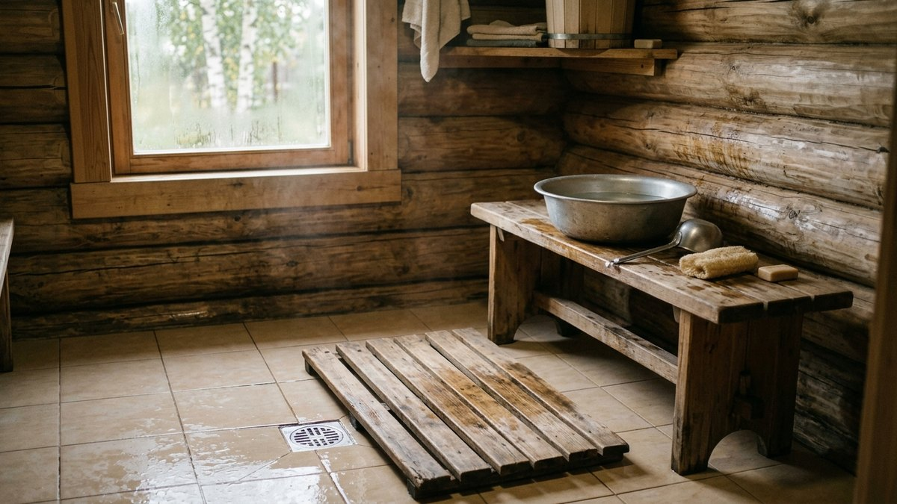
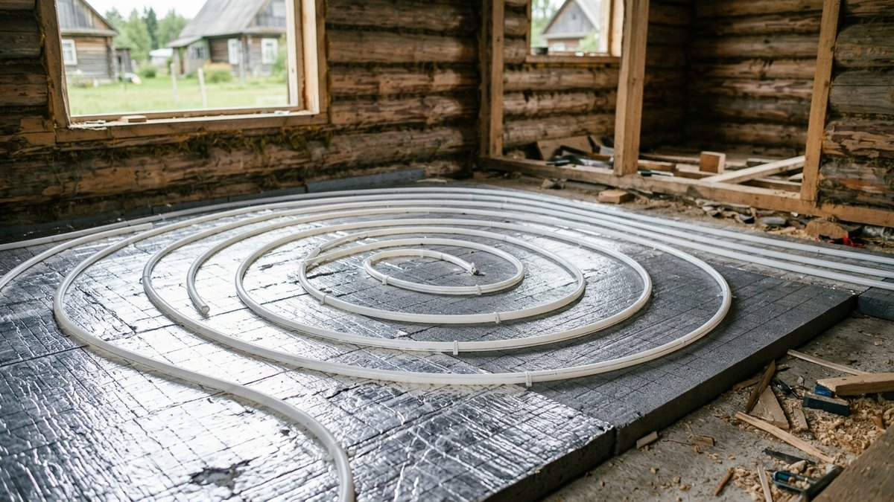
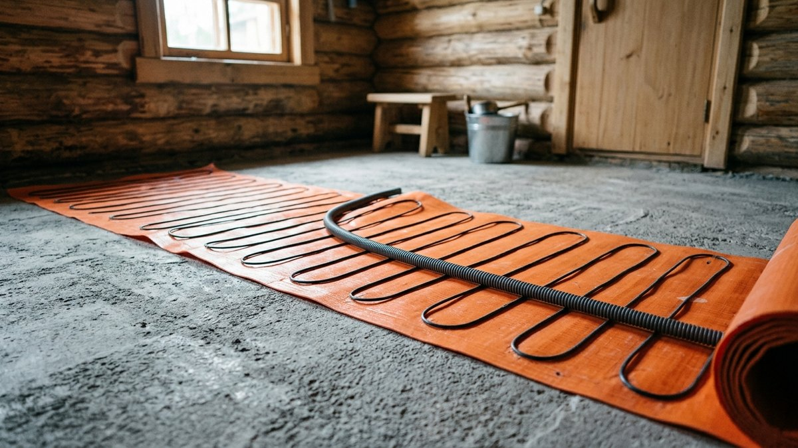
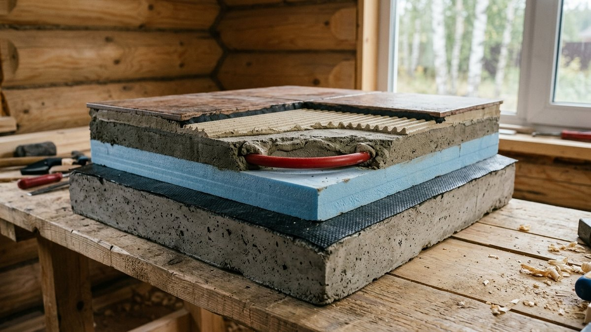
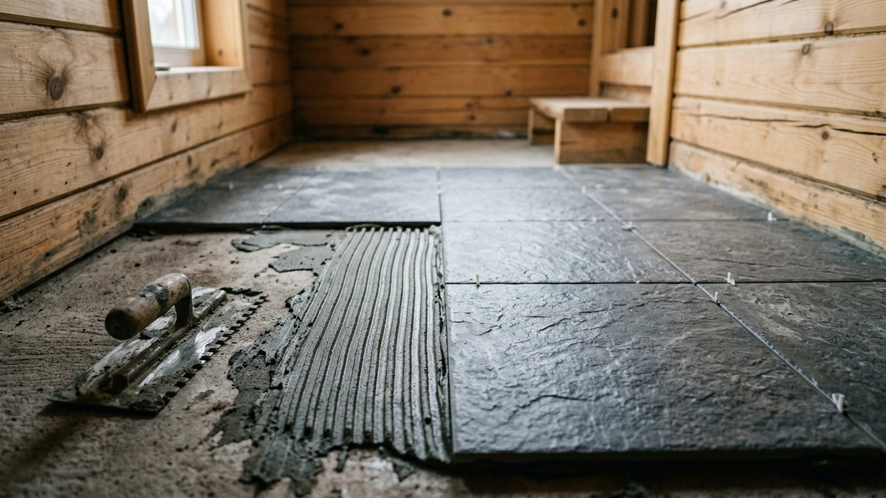
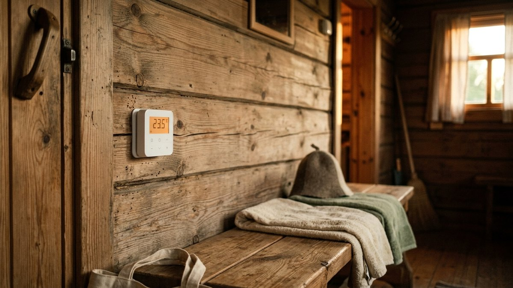

# Тёплый пол в бане: водяной от печи или электрический, где можно и где нельзя

Тёплый пол в бане решает старую проблему: под полком жарко, а ноги
мёрзнут. Особенно это заметно в моечной и в предбаннике зимой. Но баня
— не дом. В ней сырость, перепады от мороза до +100 °C, и зимой её
неделями не топят. Обычная схема тёплого пола здесь либо замерзает,
либо становится опасной. Разберём, где в бане тёплый пол уместен, как
сделать водяной контур от печи, чтобы его не разорвало зимой, и как
безопасно положить электрический пол в мокрой зоне. В конце —
калькулятор мощности, длины трубы и расходов.

## Где в бане нужен тёплый пол, а где нет

| Помещение | Тёплый пол | Почему |
|---|---|---|
| Парилка | Не делают | Внизу и так тепло, а нагрев сверху до +80…+100 °C выше допустимого для кабеля и труб |
| Моечная | Да, главное место | Плитка, вода и сквозняк от двери — самый холодный пол в бане |
| Предбанник | Да | Сюда выходят из парилки, тянет от входной двери |
| Комната отдыха | Да, по желанию | Обычный жилой режим: можно любой пол, как в доме |

В парилке пол прохладный только у самой двери, а у полка и печи он
нагревается от конвекции. Инструкции к греющим кабелям и плёнкам, как правило,
запрещают монтаж в саунах и парилках: выше +60…+70 °C изоляция
стареет, и пол становится опасным. Если в парилке холодно ногам,
причина почти всегда в продухах, двери или неутеплённом основании, а
не в отсутствии подогрева.

Если пол в бане проливной, с зазорами между досками, подогреть его
нельзя: тепло уходит в подполье. Утеплить сам поддон можно, это
разобрано в статье [проливной пол в бане своими
руками](https://mir-doma.pro/prolivnoy-pol-v-bane-svoimi-rukami/).
Тёплый пол делают по стяжке, под плиткой или керамогранитом.

## Водяной пол от печи: как работает и где подвох

Идея простая: тепло, которое печь всё равно отдаёт во время топки,
забирают теплообменником и гонят по трубам в стяжке моечной и
предбанника. Схема:

1. **Теплообменник.** Регистр в топке, кожух-«самовар» на трубе или
   бак на печи с патрубками. Мощность зависит от модели печи. Нужен
   теплообменник, рассчитанный на работу в закрытой системе под
   давлением, иначе его раздует.
2. **Циркуляционный насос.** Самотёком вода по контуру в стяжке почти
   не идёт: труба лежит горизонтально, а сопротивление петли велико.
3. **Расширительный бак и группа безопасности** с манометром,
   предохранительным клапаном и воздухоотводчиком. Без клапана при
   перетопе давление разорвёт теплообменник.
4. **Смесительный узел.** Из печи теплоноситель выходит горячее
   +80 °C, а пол должен быть не горячее +31 °C на поверхности. Такой
   предел для помещений с временным пребыванием людей задаёт СП
   60.13330. Трёхходовой термосмесительный клапан подмешивает обратку и
   держит в петле 35–45 °C.
5. **Петли из PEX или металлопластика 16 мм** с шагом 15–20 см, одна
   петля не длиннее 80 м, в стяжке не тоньше 3 см над трубой.

**Подвох — пол тёплый только пока топится печь.** Через 3–4 часа после
протопки стяжка остывает. Если нужен тёплый пол в комнате отдыха весь
вечер или постоянно, к контуру добавляют электрический ТЭН в баке или
электрокотёл. Либо выбирают электрический пол.

### Зима: антифриз или слив

Баня, которую не топят неделю, промерзает насквозь. Вода в трубах
внутри стяжки замерзает и рвёт трубу. Слить петлю в стяжке полностью
невозможно, поэтому есть два пути:

- **Залить незамерзающий теплоноситель на основе пропиленгликоля.**
  Он нетоксичен и подходит для бани, где течь может попасть на пол
  моечной. Этиленгликоль ядовит, в бане его не используют. Пропорцию
  берут под морозы своего региона: обычно готовый теплоноситель на −30
  °C. Учтите, что гликоль переносит тепло хуже воды примерно на 10–15%,
  а насос нужен чуть мощнее.
- **Держать баню выше нуля.** Электрический обогреватель или дежурный
  режим котла на +5 °C. Подходит только для бани, где есть постоянное
  электричество и куда приезжают часто.

Отдельно проверьте, где проходят трубы между печью и стяжкой. Участки
у пола, в подполье и у двери промерзают первыми. Как топить баню зимой
после простоя, чтобы не повредить печь и трубы, разобрано в статье [как
топить баню зимой](https://mir-doma.pro/kak-topit-banyu-zimoy/).

## Электрический пол в мокрой зоне

Для бани наездами электрический пол практичнее. Он не боится мороза,
включается за час-два до приезда, если терморегулятор умеет удалённое
управление, и не зависит от печи. Но сырость предъявляет к нему
строгие требования.

**Что класть.**

- **Под плитку в моечной и предбаннике** — двухжильный экранированный
  кабель или тонкий мат 150 Вт/м² в клей или стяжку.
- **В комнате отдыха под ламинат или доску** — мат или кабель в
  стяжку, 120–150 Вт/м².
- **Инфракрасную плёнку** в моечную не кладут. Она рассчитана на сухие
  помещения и сухой монтаж под ламинат.

Какие виды электрических полов бывают и чем отличаются, подробно
разобрано в статье [тёплый пол на даче](https://mir-doma.pro/teplyy-pol-na-dache/).
Здесь речь о том, что меняется именно в бане.

**Электробезопасность — без компромиссов.**

- **Отдельная линия от щитка с УЗО на 30 мА**, а для моечной лучше на
  10 мА. Подключение и автомат подбирают по мощности пола.
- **Экран кабеля или сетка мата заземлены.** Без заземления
  экранированный кабель теряет смысл.
- **Терморегулятор и коробки — вне мокрой зоны:** в предбаннике или
  комнате отдыха, на высоте от 1 м. В моечную выводят только датчик.
- **Датчик пола — в гофротрубке** с заглушкой на конце. Если он
  сломается, его можно вытянуть и заменить, не вскрывая плитку.

Если в бане электрическая печь, проверьте суммарную мощность: печь на
6–9 кВт и тёплый пол на 1–2 кВт вместе могут превысить выделенную
мощность участка. Как оценить нагрузку и сравнить печи по расходу,
описано в статье [дровяная или электрическая печь для
бани](https://mir-doma.pro/drovyanaya-ili-elektricheskaya-pech-dlya-bani/).

## Основание: без утеплителя тепло уйдёт в землю

Тёплый пол без утеплителя под ним греет грунт или подполье. Это
особенно заметно в бане на столбах или сваях, где под полом свободно
гуляет ветер. Пирог снизу вверх:

1. Бетонная плита или черновое основание по лагам с влагостойкой
   плитой.
2. Гидроизоляция: плёнка или обмазка, с заходом на стены на 15–20 см.
3. Утеплитель **экструдированный пенополистирол 50–100 мм**. Минвата
   под стяжкой в бане не годится: она набирает влагу и проседает.
4. Отражающий слой с разметкой, по которому раскладывают трубу или
   кабель. Фольгу без защитной плёнки под стяжку не кладут: цементный
   раствор её разъедает.
5. Труба или кабель, стяжка 30–50 мм или плиточный клей для тонкого
   мата.
6. Гидроизоляция под плитку в моечной, плитка с уклоном к трапу.

Как утеплить деревянный пол на лагах, если баня каркасная или
брусовая, разобрано в статье [утепление пола на
даче](https://mir-doma.pro/uteplenie-pola-na-dache/). Под тёплый пол
пирог тот же, но сверху добавляется стяжка или плита.

## Калькулятор тёплого пола для бани

Введите площадь, которую хотите подогреть. Шкафы, лавки и полки не
считайте: под ними пол не греют. Для электрического пола калькулятор
покажет мощность, длину кабеля и расход за визит и за месяц. Для
водяного — длину трубы и объём теплоносителя.

<!-- wp:html -->

  
Калькулятор тёплого пола в бане

  <label class="md-calc__label" for="mdTpT">Тип пола</label>
  <select id="mdTpT" class="md-calc__input">
    <option value="el" selected>Электрический (кабель или мат)</option>
    <option value="w">Водяной от печи</option>
  </select>
  <label class="md-calc__label" for="mdTpM">Моечная, свободная площадь пола, м²</label>
  <input type="number" id="mdTpM" class="md-calc__input" min="0" step="0.5" value="4">
  <label class="md-calc__label" for="mdTpP">Предбанник и комната отдыха, свободная площадь, м²</label>
  <input type="number" id="mdTpP" class="md-calc__input" min="0" step="0.5" value="6">
  <label class="md-calc__label" for="mdTpH">Часов работы за один визит (с прогревом)</label>
  <input type="number" id="mdTpH" class="md-calc__input" min="1" step="1" value="5">
  <label class="md-calc__label" for="mdTpV">Визитов в месяц</label>
  <input type="number" id="mdTpV" class="md-calc__input" min="1" step="1" value="4">
  <label class="md-calc__label" for="mdTpR">Тариф, руб. за кВт·ч</label>
  <input type="number" id="mdTpR" class="md-calc__input" min="1" step="0.1" value="6">
  <label class="md-calc__label" for="mdTpD">Для водяного: расстояние от печи до пола в одну сторону, м</label>
  <input type="number" id="mdTpD" class="md-calc__input" min="0" step="0.5" value="3">
  
Заполните поля

<!-- /wp:html -->

## Монтаж электрического пола в моечной пошагово

1. **Проверьте основание.** Оно должно быть ровным, перепады не
   больше 3–5 мм на 2 м. Под тонкий мат основание грунтуют.
2. **Начертите схему** раскладки: где пройдёт кабель, где датчик, где
   выход провода к терморегулятору. Отступите 5–10 см от стен и 20–30 см
   от трапа. Под лавками и шкафами кабель не кладут.
3. **Измерьте сопротивление кабеля** мультиметром и сверьте с паспортом.
   Запишите цифру: так же нужно проверить кабель после укладки и после
   плитки.
4. **Разложите мат или кабель.** Кабель не должен перехлёстываться и
   касаться сам себя. Расстояние между витками — не меньше 8 см.
5. **Уложите датчик в гофре** между витками, в 50 см от стены. Конец
   гофры заглушите.
6. **Сделайте гидроизоляцию** обмазкой поверх стяжки или по клеевому
   слою, с лентой в углах и заходом на стены.
7. **Положите плитку** на клей, выдержите его полностью: обычно 28 дней
   для стяжки и 7 дней для клея. Только после этого включайте пол.

Плитку для моечной берут с противоскользящей поверхностью. Для мокрых
зон, где ходят босиком, ориентир — класс B или C по DIN 51097. Мокрый подогретый пол скользкий, а падение на плитку в бане —
самая частая травма.

## Частые ошибки

- **Тёплый пол в парилке.** Кабель или плёнка перегреваются, изоляция
  трескается. Ремонт — только вскрывая пол.
- **Вода в водяном контуре в бане, которую не отапливают зимой.**
  Первые морозы рвут трубу в стяжке. Ремонт — вскрыть пол.
- **Контур от печи без группы безопасности.** При перетопе давление
  растёт за минуты, и теплообменник раздувает.
- **Горячий пол без смесителя.** Теплоноситель +80 °C в стяжке плитки
  — ожоги стоп и трещины плитки.
- **Терморегулятор в моечной.** Пар и брызги выводят электронику из
  строя, а розетка в мокрой зоне опасна.
- **Мат без утеплителя на бетонной плите.** Половина тепла уходит в
  грунт, счёт за электричество выходит вдвое больше расчёта.
- **Включили пол до высыхания стяжки.** Стяжка трескается, плитка
  отходит.

## Частые вопросы

### Можно ли сделать тёплый пол в парилке

Нет. Температура под потолком парилки +80…+100 °C, у пола тоже
бывает выше +60 °C, а греющие кабели и плёнки на такой нагрев не
рассчитаны, и инструкции к ним, как правило, запрещают монтаж в саунах. Холодный
пол в парилке лечат утеплением основания и порогом, а не подогревом.

### Как сделать тёплый пол в бане от печи

Нужен теплообменник на печи, рассчитанный на закрытую систему,
циркуляционный насос, расширительный бак с группой безопасности и
смесительный клапан на 35–45 °C. Трубы PEX 16 мм кладут на утеплитель с
шагом 15–20 см и заливают стяжкой. Если баня зимой промерзает, контур
заполняют пропиленгликолем.

### Какой тёплый пол лучше для бани: водяной или электрический

Для бани наездами — электрический: он не боится морозов, включается
заранее и не зависит от печи. Водяной от печи бесплатный в работе, но
греет только во время протопки и требует антифриза. Он оправдан,
когда в бане парятся часто и долго.

### Нужен ли тёплый пол в моечной бани

В моечной он полезнее всего: плитка, вода и сквозняк от двери делают
её пол самым холодным в бане. Для 4 м² моечной хватит мата на 600 Вт.
За визит на 5 часов он тратит около 2 кВт·ч.

### Можно ли класть тёплый пол под плитку в бане

Да, это основной вариант для моечной и предбанника. Кабель или мат
кладут в стяжку или в слой клея, сверху — гидроизоляция и
противоскользящая плитка. Включать пол можно только после полного
высыхания клея и стяжки.
