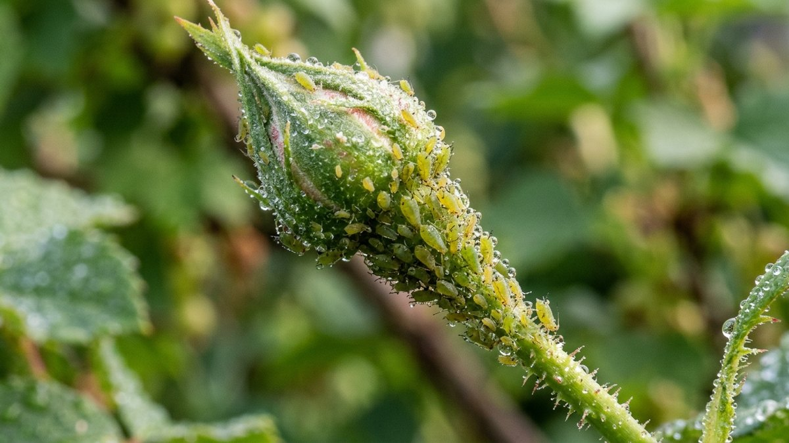
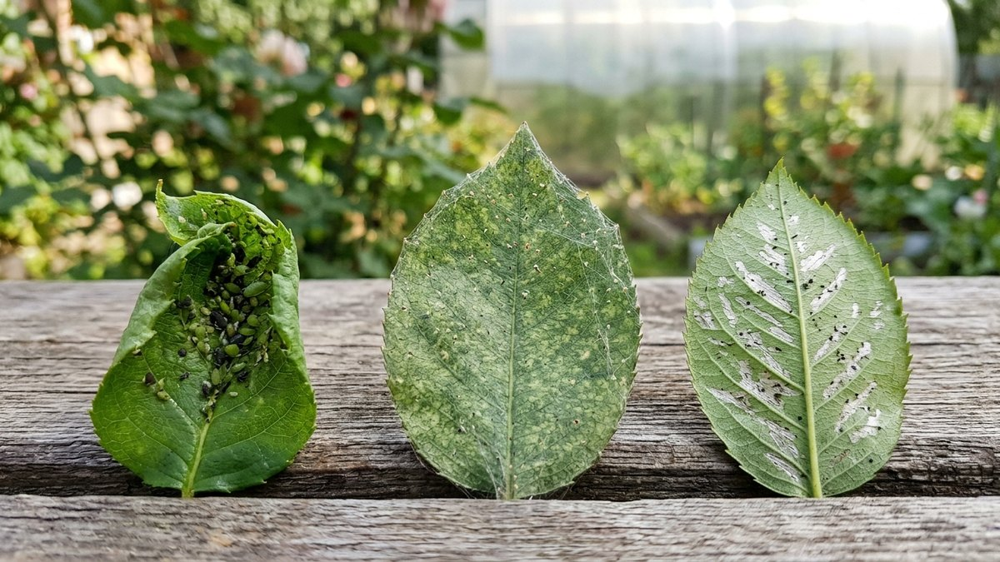
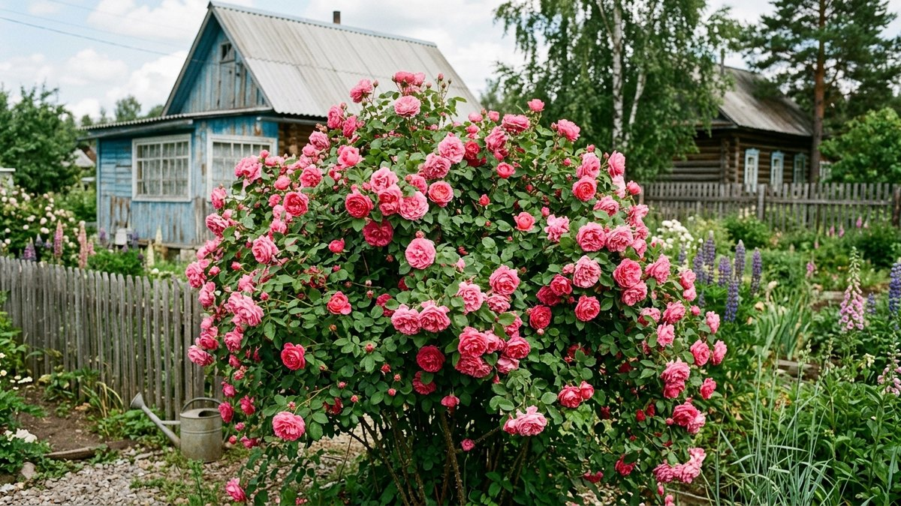
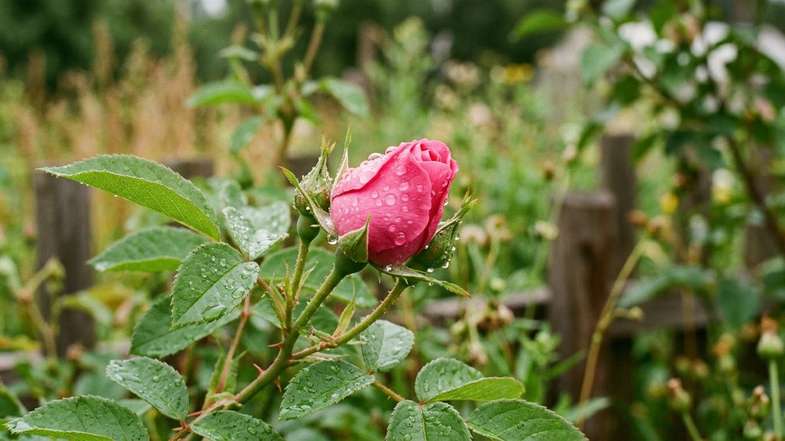

# Тля на розе в саду: чем обработать и как не навредить цветению

Тля любит розы больше почти любой другой культуры в саду: сочные молодые
побеги и бутоны — идеальная еда. Но именно у роз обработка сложнее, чем у
овощей на грядке — куст цветёт весь сезон волнами, и нельзя просто один раз
пройтись сильным препаратом и забыть. Разберём, чем обработать тлю на розе
на разных стадиях — до, во время и после цветения — и как не отпугнуть
пчёл, которые опыляют соседние растения.

## Почему тля выбирает именно розы

Молодые побеги и бутоны роз — самые сочные ткани в саду, а тля питается
именно клеточным соком, откладывая яйца там, где корм постоянно обновляется.
Розы к тому же часто перекормлены азотом ради пышного роста — а избыток
азота даёт рыхлые, водянистые ткани, которые тля осваивает быстрее всего.
Если куст страдает от тли из года в год, стоит проверить схему подкормок —
разбор по сезону есть в статье [посадка и уход за
розами](https://mir-doma.pro/rozy-posadka-i-uhod/).

## Как распознать тлю на розе, а не другого вредителя

Тля селится плотными колониями на верхушках побегов и внутри ещё закрытых
бутонов — липкие листья и деформированные, не раскрывающиеся бутоны почти
всегда её работа. Паутинный клещ вместо этого оставляет тонкую паутину на
нижней стороне листа и мелкие светлые точки, а трипсы — серебристые полосы
на лепестках уже раскрывшихся цветков. Если куст к тому же желтеет
листьями, причина не всегда в тле — полный разбор возможных причин с
таблицей симптомов есть в статье [почему желтеют листья у
роз](https://mir-doma.pro/zhelteyut-listya-u-roz/).

## Чем обработать: по стадии цветения

- **До цветения, пока бутоны закрыты.** Можно применять системные препараты
  (имидаклоприд, ацетамиприд) — они не попадут на открытые лепестки и не
  затронут опылителей, а защита держится 2–3 недели.
- **В период цветения.** Системные препараты откладывают — вместо них
  мыльный раствор (25–30 г хозяйственного мыла на литр воды) или настой
  чеснока, обработка строго вечером, когда пчёлы не летают, и точечно по
  колониям, а не по всему кусту с открытыми цветками.
- **После цветения и перед обрезкой.** Любые препараты снова можно
  использовать без ограничений — это подходящий момент для системной
  защиты перед новой волной бутонов.

Полный список из 10 народных рецептов и сравнение биопрепаратов и химии —
в статье [как избавиться от тли на
растениях](https://mir-doma.pro/kak-izbavitsya-ot-tli/); здесь — только то,
что специфично именно для розы и её цикла цветения.

## Безопасно для срезки: если розы идут в букет

Если розы выращиваются на срез, за 3–4 дня до планируемой срезки
обработку любым препаратом, кроме мыльного раствора, прекращают — химия и
системные средства остаются в тканях и могут вызвать раздражение при частом
контакте с цветком в помещении. Мыльный раствор при этом смывается чистой
водой перед срезкой без остатка.

## Профилактика на весь сезон

- **Компаньоны рядом с кустом.** Бархатцы, лаванда и чеснок отпугивают тлю
  запахом и привлекают её естественных врагов — божьих коровок и златоглазок.
- **Не перекармливать азотом.** Разовая ударная доза азотного удобрения
  весной провоцирует именно тот рыхлый прирост, который любит тля —
  подкормки лучше распределять по сезону дробно.
- **Прореживающая обрезка.** Загущенный куст держит влагу и создаёт
  укромные места для колоний — весенняя и летняя санитарная обрезка снижает
  и риск тли, и риск грибных болезней вроде чёрной пятнистости. Как и когда
  обрезать розы — в статье [обрезка
  роз](https://mir-doma.pro/obrezka-roz/).
- **Осмотр перед укрытием на зиму.** Тля и её яйца, оставленные на побегах
  под зимним укрытием, — гарантия вспышки следующей весной сразу после
  снятия защиты. Обработка перед подготовкой к зиме входит в общий чек-лист
  — [укрытие роз на зиму](https://mir-doma.pro/ukrytie-roz-na-zimu/).

## Частые ошибки

- **Обработка системным препаратом по открытым цветкам.** Опасно для пчёл и
  других опылителей — системные средства оставляют в цветке действующее
  вещество на весь период защиты.
- **Одна обработка на весь сезон.** Роза цветёт волнами, и каждая новая
  волна бутонов — новый корм для тли; профилактику и точечные обработки
  повторяют весь сезон, а не один раз в мае.
- **Игнорирование муравьёв рядом с кустом.** Муравьи разносят тлю по кусту и
  защищают колонии от хищников ради сладких выделений — без контроля
  муравьёв тля возвращается даже после обработки.
- **Сильная химия сразу, без пробной обработки.** Не все препараты одинаково
  переносятся лепестками — сильная химия может оставить ожоги на открытых
  цветках, стоит сначала попробовать на одном побеге.

## Частые вопросы

### Можно ли обрабатывать розы от тли во время цветения

Можно, но только мягкими средствами вроде мыльного или чесночного раствора,
вечером и точечно по колониям — системные и сильные химические препараты
на период цветения откладывают.

### Опасна ли тля для розы, если её не выводить

Да — тля деформирует и не даёт раскрыться бутонам, ослабляет молодые
побеги и переносит вирусные инфекции растений. Куст, который каждый год
страдает от тли без лечения, слабеет и хуже переносит зимовку.

### Как часто обрабатывать розы от тли за сезон

Столько раз, сколько появляются новые колонии — обычно раз в 7–10 дней в
активный период до полного исчезновения тли, плюс профилактический осмотр
после каждой новой волны бутонов.

### Безопасны ли народные средства для пчёл на цветущих розах

Мыльный раствор при вечерней точечной обработке — да, он не оставляет
токсичных остатков и не действует на пчёл после высыхания. Табачный и
острый перечный настои раздражают и опылителей — их применяют только до
раскрытия бутонов.

