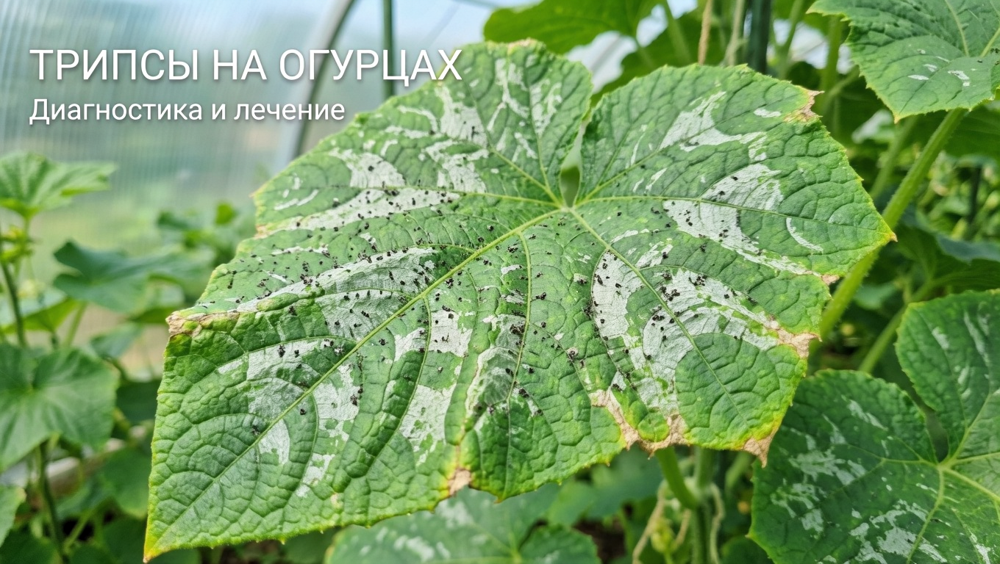
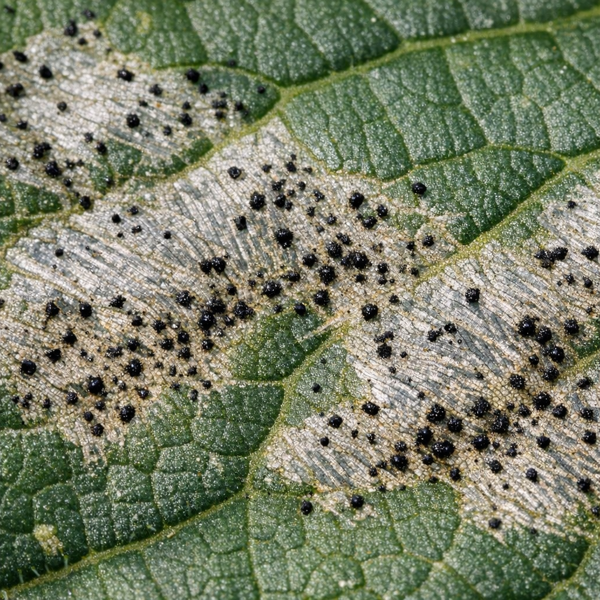
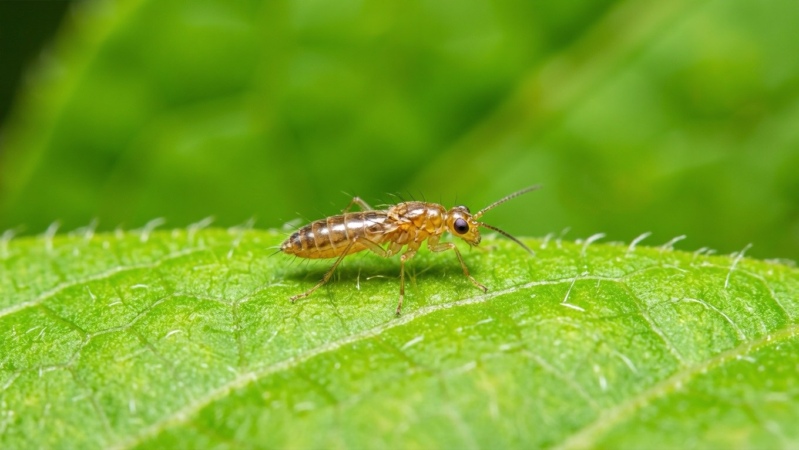
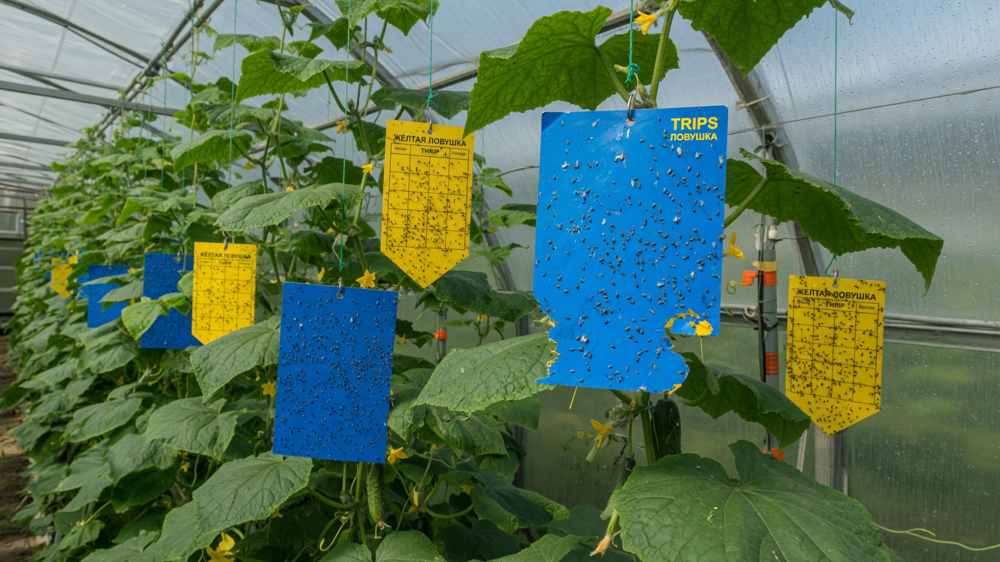
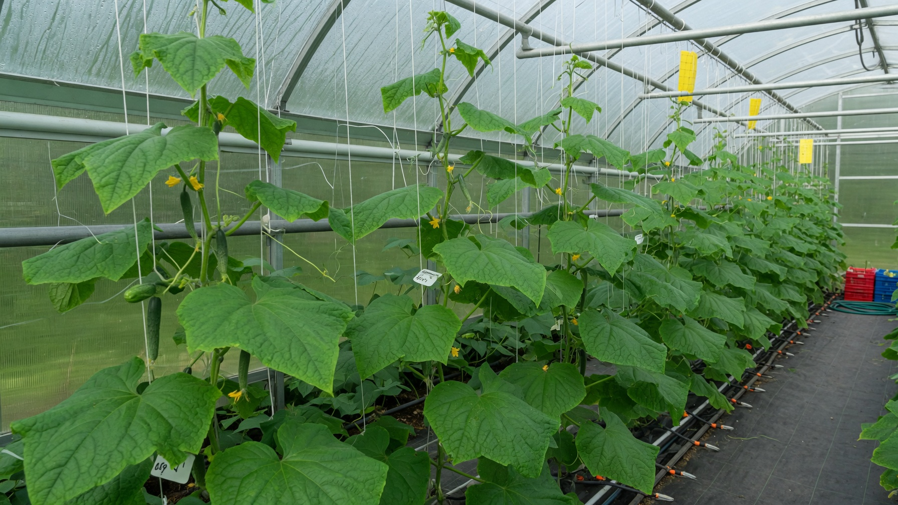

Трипсы — мелкие, почти невидимые вредители, которых замечают уже по последствиям: листья огурцов покрываются серебристыми штрихами, буреют и засыхают. Опасны они не только тем, что высасывают сок, — трипсы переносят вирусные болезни, от которых лекарства нет. И избавиться от них сложнее, чем от тли: часть их жизненного цикла проходит в почве, куда обычное опрыскивание не достаёт. Разберём, чем обработать огурцы от трипсов, почему одной обработки мало и как не допустить вредителя в теплице.

## 🔍 Как понять, что на огурцах трипсы

Самого вредителя разглядеть трудно — это продолговатое насекомое длиной 1–2 мм, жёлто-бурое или почти чёрное, очень подвижное. Поэтому ориентируются на следы:

- **серебристые штрихи и полоски** на листьях — главный признак: трипс прокалывает ткань, и опустевшие клетки отсвечивают серебром;
- **мелкие чёрные точки** — экскременты вредителя рядом со штрихами;
- со временем штрихи сливаются, лист **буреет, скручивается и засыхает**;
- **деформация** молодых листьев, завязей и плодов, огурцы растут кривыми;
- при встряхивании растения над жёлтым или белым листом бумаги осыпаются мелкие подвижные насекомые.

## ⚖️ Как отличить от клеща и белокрылки

Три главных тепличных вредителя огурца легко перепутать, а средства нужны разные:

| Вредитель | По чему узнать |
|---|---|
| **Трипс** | **Серебристые штрихи** и чёрные точки, паутины нет |
| **Паутинный клещ** | Тонкая **паутина** и россыпь светлых точек |
| **Белокрылка** | **Белые мошки** взлетают облачком, липкий налёт на листьях |

Если видите паутину — это [паутинный клещ](https://mir-doma.pro/pautinnyy-kleshch-na-ogurtsah/), и от него нужны акарициды. Если над кустом вьётся белое облачко — это [белокрылка](https://mir-doma.pro/belokrylka-v-teplitse/). Серебристый «штриховой» рисунок без паутины означает трипсов.

## 🌡️ Откуда берутся и почему размножаются

Трипсы любят жару и сухость — в теплице для них курорт:

- **тепло +25…+30 °C и сухой воздух** ускоряют размножение в разы;
- **зимуют** в растительных остатках, верхнем слое почвы и щелях конструкций;
- **заносятся** с новой рассадой, цветами, на одежде и инструменте;
- **сорняки** внутри и вокруг теплицы служат резервуаром вредителя;
- цикл развития короткий, поэтому за сезон сменяется несколько поколений.

## ⚠️ Почему одной обработки недостаточно

Это ключевая особенность трипсов, из-за которой их считают трудным вредителем:

- **яйца отложены внутри тканей листа** — контактный препарат до них не добирается;
- **личинки уходят окукливаться в почву**, где опрыскивание их не достаёт;
- **взрослые особи летают** и возвращаются на обработанные растения;
- при частом применении одного средства трипсы быстро **вырабатывают устойчивость**.

Отсюда правило: обработки проводят **курсом — 3–4 раза с интервалом 5–7 дней**, обязательно **чередуя препараты** из разных химических групп, и вместе с растениями **проливают почву**.

## 🧪 Чем обработать огурцы от трипсов

Порядок действий при обнаружении вредителя:

1. **Убрать сильно поражённые листья** и вынести с участка, оборвать сорняки в теплице.
2. **Развесить клеевые ловушки** — трипсы хорошо летят на **синий** и жёлтый цвет. Ловушки нужны и для отлова, и для контроля: по ним видно, снижается ли численность.
3. **Промыть растения** струёй воды и повысить влажность — сухой воздух работает на вредителя.
4. **Обработать инсектицидом.** Из биопрепаратов эффективен фитоверм (авермектины) — он безопаснее и с коротким сроком ожидания, что важно в период плодоношения. При сильном заражении применяют системные инсектициды по инструкции.
5. **Пролить почву** под растениями рабочим раствором — там прячутся куколки.
6. **Повторить 3–4 раза** каждые 5–7 дней, меняя препараты, и выдержать срок ожидания перед сбором плодов.

Из биологических методов в теплицах хорошо работают хищные клещи-энтомофаги — их выпускают на растения, и они выедают личинок трипса.

## 🦠 Главная опасность — вирусы

Трипс не просто ослабляет растение: прокалывая ткани, он **переносит вирусные инфекции**, в том числе вирус бронзовости томата, поражающий и огурцы. Вирусные болезни не лечатся — поражённые растения приходится удалять целиком.

Поэтому с трипсом не тянут: чем раньше вы его заметите и начнёте курс обработок, тем меньше риск, что вместе с вредителем в теплицу придёт вирус.

## 🛡️ Как не допустить трипсов

- **Держите ловушки постоянно** — так вы заметите первых особей задолго до вспышки.
- **Не пересушивайте воздух**: регулярный полив и умеренная влажность сдерживают размножение.
- **Убирайте сорняки** в теплице и вокруг неё — это резервуар вредителя.
- **Осматривайте новую рассаду и цветы** перед тем, как заносить их в теплицу.
- **Ставьте сетки** на форточки и двери.
- **Убирайте растительные остатки и дезинфицируйте теплицу** осенью, включая верхний слой грунта, — подробно в статье про [обработку теплицы осенью](https://mir-doma.pro/obrabotka-teplicy-osenyu/).

## ❓ Частые вопросы

**Чем обработать огурцы от трипсов?**
Биопрепаратом фитоверм в период плодоношения или системным инсектицидом при сильном заражении. Обработки проводят курсом 3–4 раза с интервалом 5–7 дней, чередуя препараты, и обязательно проливают почву.

**Как понять, что на огурцах именно трипсы?**
По серебристым штрихам и мелким чёрным точкам на листьях без паутины. Если встряхнуть растение над листом бумаги, осыпятся мелкие подвижные насекомые длиной 1–2 мм.

**Почему трипсы возвращаются после обработки?**
Потому что яйца спрятаны в тканях листа, а куколки — в почве, куда опрыскивание не достаёт. Нужен курс из нескольких обработок с проливом грунта и сменой препаратов.

**Помогают ли клеевые ловушки от трипсов?**
Да, особенно синие. Полностью проблему они не решают, но отлавливают взрослых особей и показывают, растёт численность или падает.

**Чем трипсы отличаются от паутинного клеща?**
У клеща появляется тонкая паутина и светлые точки, у трипса — серебристые штрихи и чёрные точки экскрементов без паутины. И препараты нужны разные: от клеща акарициды, от трипса инсектициды.

**Можно ли есть огурцы после обработки от трипсов?**
Только после срока ожидания, указанного на упаковке препарата. У биопрепаратов он короткий (обычно 2–3 дня), у системных инсектицидов заметно дольше.

**Как избавиться от трипсов в теплице навсегда?**
Провести курс обработок с проливом почвы, держать ловушки, убирать сорняки и растительные остатки, а осенью продезинфицировать теплицу и верхний слой грунта, где вредитель зимует.

---

Трипсы коварны своей незаметностью и тем, что прячутся сразу в двух местах — внутри листа и в почве. Поэтому побеждают их не разовым опрыскиванием, а системой: ловушки для контроля, курс обработок со сменой препаратов, пролив грунта и осенняя дезинфекция теплицы. Полный разбор остальных болезней и вредителей огурцов собран в статье про [мучнистую росу на огурцах](https://mir-doma.pro/muchnistaya-rosa-na-ogurtsah/), а если листья желтеют без штрихов и паутины — причина может быть в уходе, см. [почему желтеют листья у огурцов](https://mir-doma.pro/zhelteyut-listya-u-ogurtsov/).
