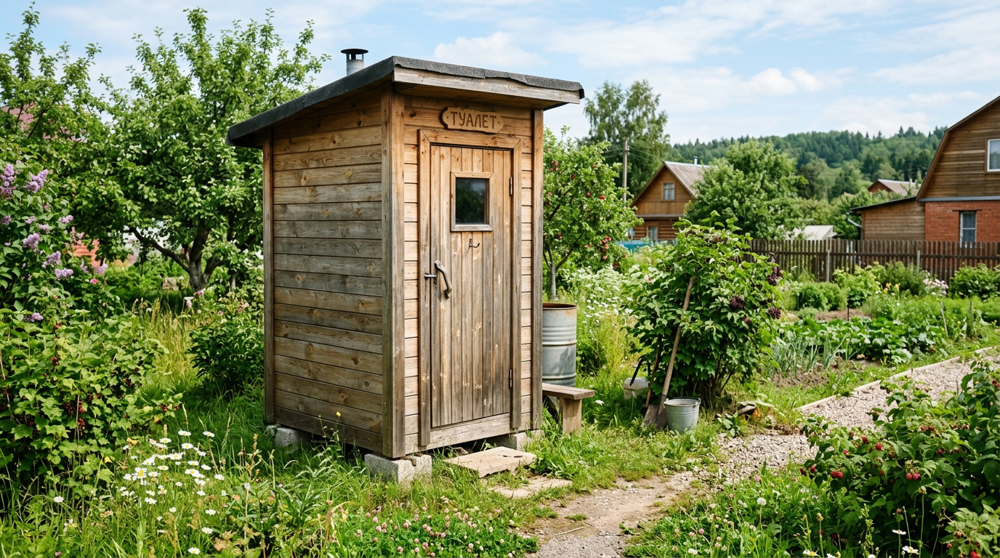
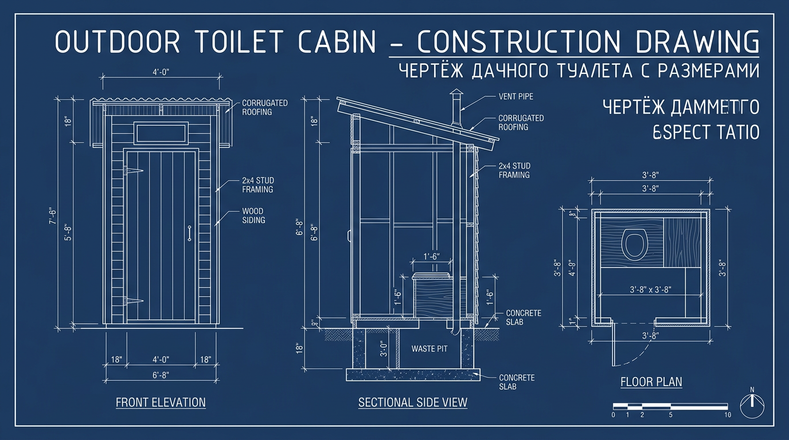
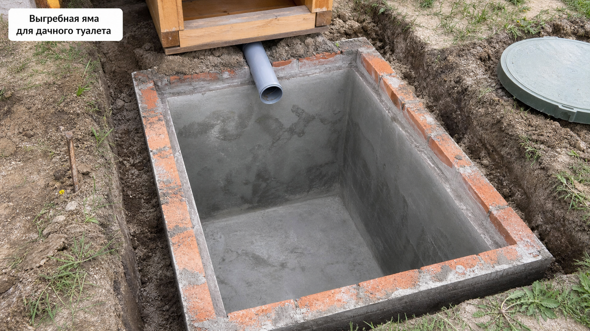
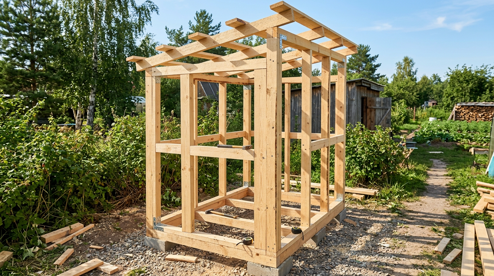
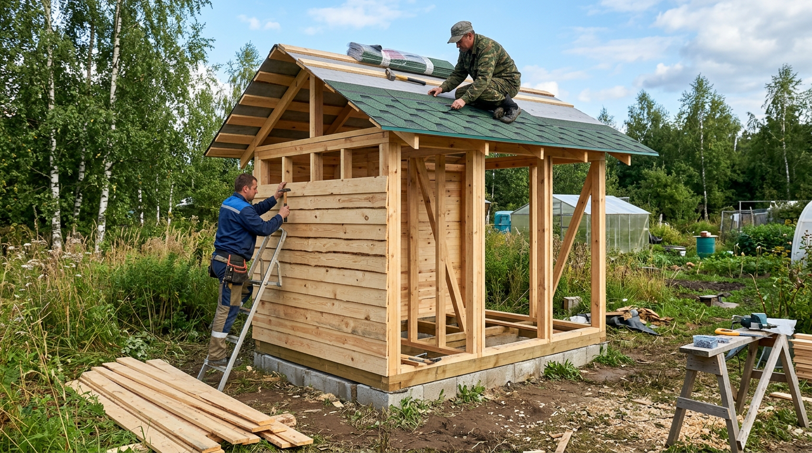
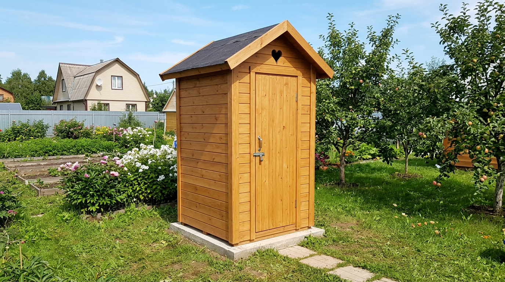

Туалет — первая постройка, без которой не обойтись на любой даче. И построить его своими руками вполне по силам каждому: нужен простой каркасный домик, понятный чертёж и пара выходных. Главное — выбрать подходящий тип, выдержать размеры и правильно разместить туалет по санитарным нормам, чтобы не загрязнить воду на участке. В этой статье разберём, как сделать туалет на даче своими руками: какие бывают виды, какие размеры и чертёж выбрать, как выкопать яму, собрать каркас и обшить домик.

## 🚽 Виды дачных туалетов

Прежде чем строить, нужно выбрать тип туалета — от этого зависит и конструкция, и расположение.

- **С выгребной ямой** — классический вариант: под домиком копают яму, куда собираются отходы. Прост и привычен, но требует определённого уровня грунтовых вод.
- **Пудр-клозет** — без ямы: отходы пересыпают торфом или золой в съёмную ёмкость и затем компостируют. Идеален при высоком уровне грунтовых вод.
- **Люфт-клозет** — с герметичной выгребной ямой, которую периодически откачивают.
- **Биотуалет** — готовая ёмкость с реагентами или торфом, не требует ямы.

Если на даче есть полноценная канализация, вместо выгребной ямы стоки отводят в [септик](https://mir-doma.pro/septik-dlya-dachi/) — тогда туалет делают как обычное помещение с унитазом.

Если на участке высоко стоят грунтовые воды, выгребную яму делать нельзя — она загрязнит воду. В этом случае выбирают пудр-клозет или герметичную ёмкость.

## 📐 Размеры дачного туалета

У дачного туалета есть проверенные стандартные размеры, на которые удобно ориентироваться:

- **Площадь основания** — 1×1 метр (минимум) или 1×1,3–1,5 метра для большего комфорта.
- **Высота** — около 2,2–2,5 метра в передней части (для удобства входа).
- **Дверь** — шириной 70–80 см и высотой 1,8–2 метра.
- **Высота сиденья (стульчака)** — около 40 см, как у обычного унитаза.

Эти размеры закладывают в чертёж. Самая популярная форма домика — «скворечник» (прямой, с односкатной крышей) или «теремок» (с двускатной крышей). По той же каркасной технологии на даче строят и [сарай](https://mir-doma.pro/saray-svoimi-rukami/), так что, освоив её, вы легко возведёте обе постройки. Передняя стенка делается выше задней — так получается уклон крыши для стока воды. Не делайте домик слишком тесным: в кабинке шириной меньше метра неудобно, поэтому при возможности закладывайте 1–1,2 метра по ширине.

## 🕳️ Выгребная яма

Если выбран туалет с ямой, начинают именно с неё:

1. **Выкопайте яму** глубиной 1,5–2 метра и размером чуть больше основания домика.
2. **Укрепите стенки** — кирпичом, бетонными кольцами, досками или бетоном, чтобы яма не осыпалась.
3. **Сделайте дно** — для люфт-клозета герметичное (бетон), для обычной ямы оставляют грунтовое (но только при низком уровне грунтовых вод).

Для пудр-клозета яма не нужна — под сиденьем ставят выдвижную ёмкость, а отходы пересыпают торфом. Объём ямы рассчитывают по числу пользователей: для семьи обычно достаточно ямы на 1,5–2 кубометра, которую при наполнении откачивают или, в случае простой ямы, домик переносят на новое место.

## 🧱 Основание и каркас

Домик туалета — это лёгкий каркас, который собирают по чертежу:

1. **Основание.** По периметру ямы укладывают опоры (бетонные блоки или столбики) и на них — нижнюю раму из бруса (50×100 мм), обработанного антисептиком, с гидроизоляцией.
2. **Стойки.** Ставят четыре вертикальные стойки из бруса (50×50 или 50×100 мм). Передние делают выше задних — для уклона крыши.
3. **Верхняя обвязка.** Связывают стойки сверху брусом.
4. **Стропила и обрешётка.** Укладывают стропила с выносом за стены и набивают обрешётку под кровлю.
5. **Площадка для сиденья.** Внутри сооружают каркас стульчака высотой около 40 см с отверстием.

Все деревянные детали обрабатывают антисептиком — это защита от гнили и насекомых, ведь туалет стоит во влажной среде. Каркас собирают на оцинкованный крепёж и проверяют вертикальность стоек по уровню, чтобы домик не перекосило.

## 🧰 Обшивка, крыша и дверь

Готовый каркас обшивают и накрывают:

- **Стены** обшивают доской внахлёст, вагонкой, имитацией бруса или профнастилом.
- **Крышу** кроют профнастилом, ондулином или шифером по обрешётке; технология та же, что у [крыши из профнастила](https://mir-doma.pro/krysha-iz-profnastila-svoimi-rukami/).
- **Дверь** собирают из доски или бруска и навешивают на петли, ставят щеколду и крючок.

Не забудьте про важные детали: **вентиляционную трубу** (стояк из ямы, выведенный выше крыши) — она убирает запах; **окошко или щель** под крышей для света; при необходимости — освещение. Вентиляционную трубу выводят из ямы через заднюю стенку или сиденье и поднимают выше конька крыши — чем выше, тем лучше тяга и меньше запаха.

## 📏 Нормы расположения

Это самый важный момент: неправильно размещённый туалет загрязняет питьевую воду. Ориентировочные расстояния:

- от колодца или скважины — не менее 20–25 метров (а лучше дальше, с учётом уклона участка);
- от жилого дома — около 12 метров;
- от границы соседнего участка — не менее 1 метра;
- от водоёма — от 10 метров.

Туалет располагают **ниже по уклону, чем колодец**, чтобы стоки не попадали в питьевую воду. Размещение санитарных объектов удобно продумать ещё на этапе [планировки участка](https://mir-doma.pro/planirovka-uchastka-10-sotok/). Точные нормы зависят от действующих правил, их уточняют заранее.

## 🛡️ Частые ошибки

- **Туалет близко к колодцу.** Главная и опасная ошибка — загрязнение питьевой воды. Соблюдайте расстояние и уклон.
- **Нет вентиляции.** Без вытяжной трубы из ямы в туалете стоит запах.
- **Яма без укрепления.** Незакреплённые стенки осыпаются, яма разрушается.
- **Выгребная яма при высокой воде.** Загрязняет грунтовые воды — нужен пудр-клозет или герметичная ёмкость.
- **Нет гидроизоляции каркаса.** Дерево тянет влагу от основания и гниёт.

## ❓ Частые вопросы

### Какие размеры у дачного туалета?

Стандартный дачный туалет имеет основание 1×1 метр (или 1×1,3–1,5 метра для удобства), высоту около 2,2–2,5 метра в передней части, дверь шириной 70–80 см и высотой 1,8–2 метра. Сиденье делают высотой около 40 см. Эти размеры закладывают в чертёж.

### На каком расстоянии от колодца можно строить туалет?

Туалет с выгребной ямой располагают не ближе 20–25 метров от колодца или скважины, причём ниже по уклону участка, чтобы стоки не попадали в питьевую воду. Это важнейшее санитарное требование — несоблюдение грозит загрязнением воды.

### Какой туалет сделать при высоком уровне грунтовых вод?

При высоких грунтовых водах выгребную яму делать нельзя — она загрязнит воду. В этом случае выбирают пудр-клозет (с торфом и съёмной ёмкостью), люфт-клозет с герметичной ямой или готовый биотуалет. Они не контактируют с грунтовыми водами.

### Как избавиться от запаха в дачном туалете?

Главное — вентиляция: из ямы выводят вытяжную трубу-стояк выше крыши, и запах уходит наружу. В пудр-клозете отходы пересыпают торфом или золой, которые поглощают запах. Помогают и специальные биопрепараты для выгребных ям.

### Какой глубины делать яму для дачного туалета?

Обычно выгребную яму копают глубиной 1,5–2 метра. Делать её глубже не имеет смысла и опаснее с точки зрения грунтовых вод. Стенки укрепляют кирпичом, бетонными кольцами или досками, чтобы яма не осыпалась со временем.

### Из чего построить туалет на даче?

Чаще всего домик делают каркасным: лёгкий каркас из бруса обшивают доской, вагонкой или профнастилом и накрывают односкатной или двускатной крышей. Это быстро, недорого и по силам одному человеку. Реже строят из кирпича или блоков — капитально, но дороже.

### Сколько стоит и долго ли строить дачный туалет?

Каркасный туалет — одна из самых бюджетных построек: основные затраты идут на брус, обшивку и кровлю. По времени простой домик с ямой реально построить за пару выходных, не считая земляных работ и обустройства ямы.

## Заключение

Туалет на даче своими руками построить несложно: выберите подходящий тип (с ямой или пудр-клозет в зависимости от грунтовых вод), составьте чертёж по стандартным размерам, выкопайте и укрепите яму, соберите лёгкий каркас, обшейте его и накройте крышей. Самое важное — правильно разместить туалет по санитарным нормам, подальше от колодца и ниже по уклону, и сделать вентиляцию. Тогда дачный туалет получится аккуратным, удобным и прослужит долгие годы. А обшивка в цвет других построек — сарая, забора, беседки — впишет его в общий вид участка и сделает двор аккуратным.

А какой туалет вы построили или планируете на даче? Делитесь чертежами и опытом в комментариях и подписывайтесь, чтобы не пропустить новые статьи о стройке и обустройстве дачи.
