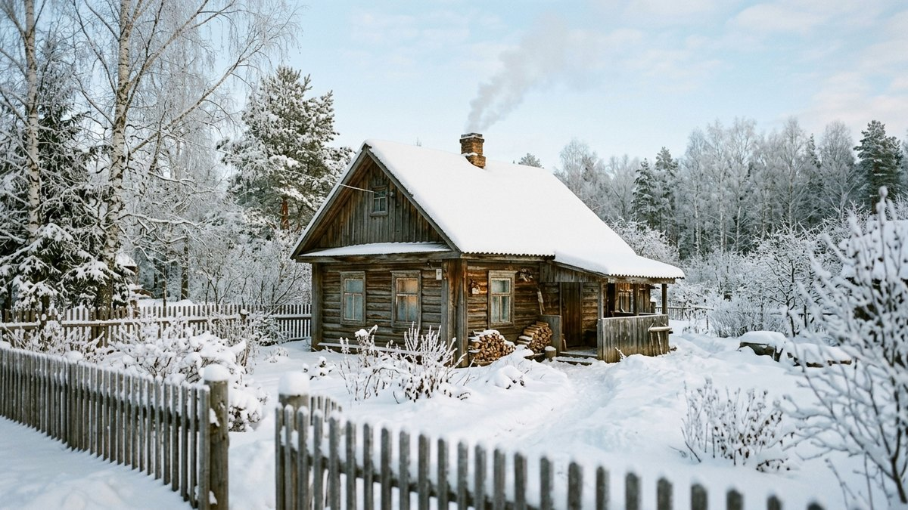
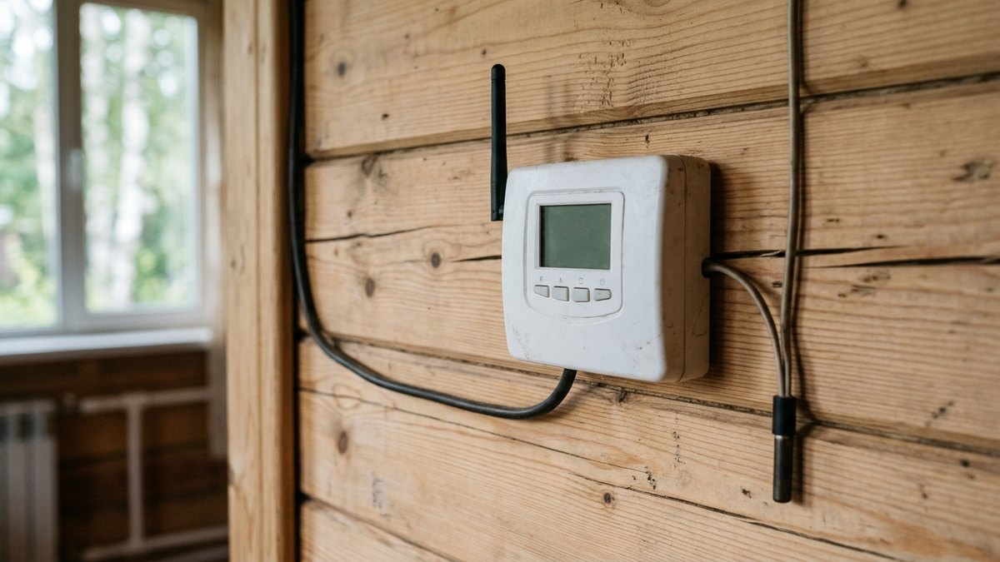
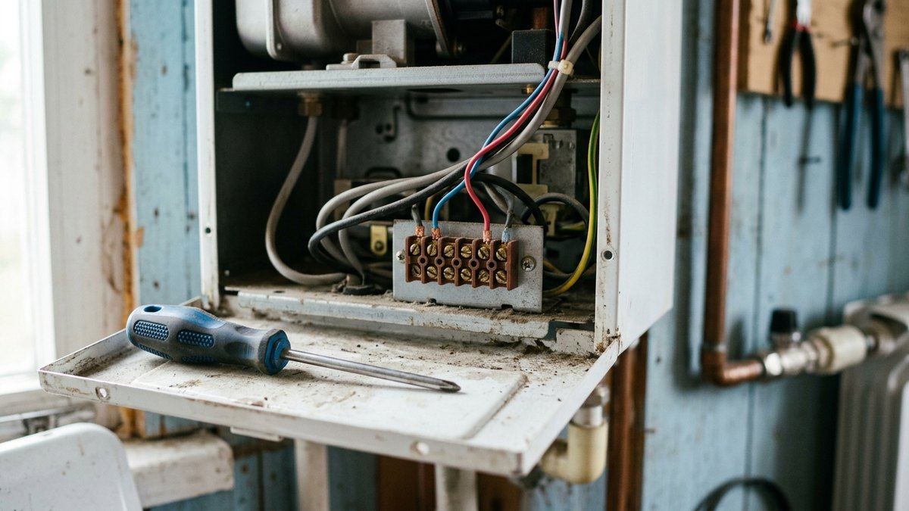
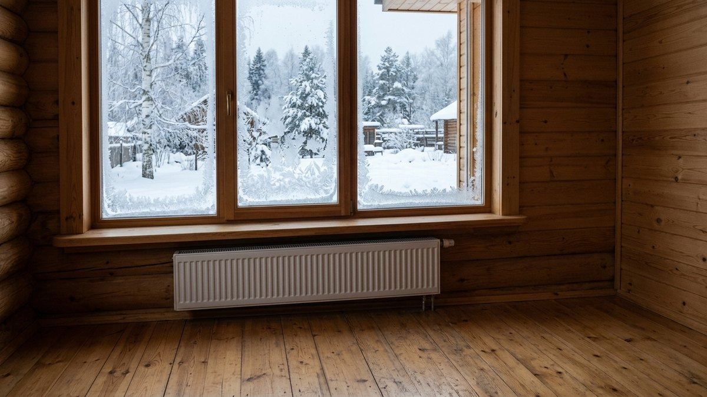
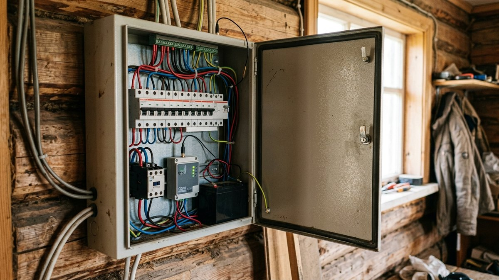
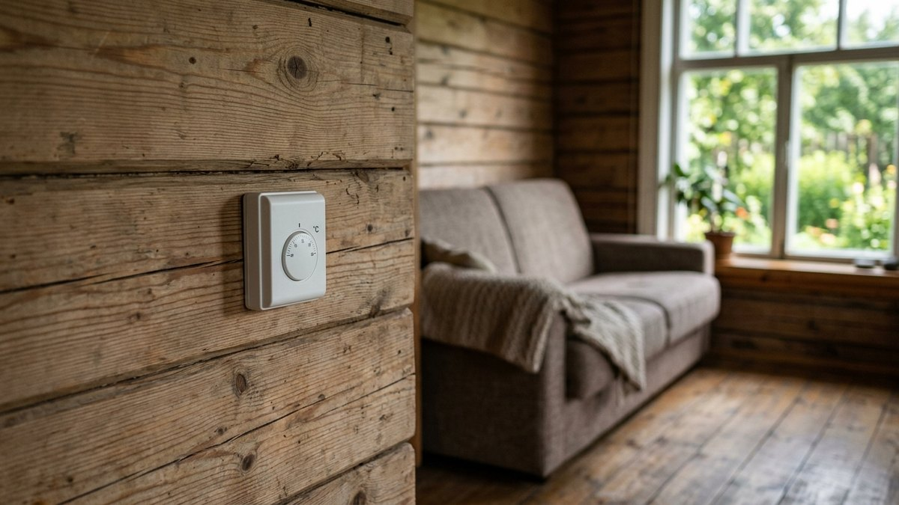

# Удалённое управление отоплением на даче: GSM- и Wi-Fi-термостат для котла

Зимняя дача без присмотра живёт в двух плохих режимах: либо отопление
выключено и трубы рискуют замёрзнуть, либо дом греется на полную ради
тех двух дней в месяц, когда вы приезжаете. Удалённое управление
отоплением на даче убирает оба: дом держит дежурные +5 °C, а за день до
приезда вы с телефона поднимаете температуру до комфортной. Разберём,
что выбрать — GSM- или Wi-Fi-термостат, как подключить его к газовому,
электрическому и твердотопливному котлу, что делать при отключении
света, и посчитаем калькулятором, сколько экономит дежурный режим.

## Что вообще можно включать удалённо

Всё зависит от источника тепла. Одно устройство на все случаи не
подходит.

| Источник тепла | Что можно сделать удалённо | Чем управлять |
|---|---|---|
| Электрообогреватели, конвекторы | Включить, выключить, держать температуру | Умная розетка на каждый прибор или GSM-реле на линию |
| Электрокотёл | Держать заданную температуру, менять её | Термостат на клеммы котла или реле через контактор |
| Газовый котёл | Держать заданную температуру, менять её | Комнатный термостат на клеммы котла (GSM, Wi-Fi, OpenTherm) |
| Твердотопливный котёл | Только следить за температурой и включать электрический ТЭН, если он есть | GSM-термометр, реле ТЭН |
| Печь на дровах | Ничего, только следить | GSM-датчик температуры |

Главный вывод: **дистанционно поддерживать тепло можно только
тем, что работает от электричества или газа.** Дровяную печь или
твердотопливный котёл телефон не растопит. Если зимой дача отапливается
только ими, удалённое управление даст контроль температуры и
тревогу, но не тепло. Сравнение источников тепла по цене за
киловатт — в статье [отопление дачи: что дешевле](https://mir-doma.pro/otoplenie-dachi-chto-deshevle/).

## GSM или Wi-Fi: что выбрать

| | GSM-термостат | Wi-Fi-термостат |
|---|---|---|
| Что нужно на даче | Сотовая связь и SIM-карта | Постоянный интернет: роутер с 4G-модемом или проводной |
| Управление | SMS, звонок, часто приложение | Приложение |
| При пропаже интернета | Работает, SMS проходят и при слабой связи | Не управляется, пока роутер не вернётся в сеть |
| При отключении света | Модели с аккумулятором присылают SMS «нет 220 В» | Молчит: роутер тоже без питания |
| Стоимость владения | Абонентская плата за SIM | Плата за мобильный интернет роутера |
| Для кого | Дача без интернета или со слабой связью | Дача, где уже есть стабильный интернет и камеры |

Для типичной дачи в СНТ, где интернет держится через 4G-модем и
пропадает при каждом скачке напряжения, **GSM надёжнее**. Если интернет
на участке нестабилен из-за слабого сигнала, его можно поправить
антенной на мачте: как замерить сигнал и выбрать комплект, разобрано в
статье [как провести интернет на дачу](https://mir-doma.pro/internet-na-dachu/).
Но даже с хорошим интернетом GSM-канал для котла надёжнее: SMS проходит
там, где приложение не открывается. Wi-Fi удобнее, если интернет на
даче уже есть и работает стабильно — например, ради
[видеонаблюдения](https://mir-doma.pro/videonablyudenie-na-dache-svoimi-rukami/).

О SIM-карте в GSM-устройстве стоит подумать заранее: следите за
балансом и уточните у оператора правила блокировки неактивных номеров.
Карта, которая только принимает SMS раз в месяц, может попасть под
такие правила.

## Подключение к котлу: газовый, электрический, твердотопливный

### Газовый котёл

У большинства настенных газовых котлов есть клеммы для комнатного
термостата. С завода на них стоит перемычка, и котёл работает по
собственному датчику. Термостат подключают вместо перемычки двумя
проводами: его реле замыкает и размыкает контакт («сухой контакт»),
и котёл включается или останавливается. Где находятся клеммы, указано
в инструкции к котлу. Внутрь газовой части котла при этом никто не
лезет.

Второй вариант — **OpenTherm**. Такой термостат не просто включает
котёл, а управляет мощностью горелки, поэтому котёл работает ровнее и
экономнее. Перед покупкой проверьте, что котёл поддерживает этот
протокол. У многих производителей есть и свои Wi-Fi-модули, которые
подключаются к конкретной серии котлов.

Если сомневаетесь, какие клеммы использовать, или котёл на гарантии,
подключение лучше поручить сервисному мастеру.

### Электрокотёл

Схема та же: у большинства электрокотлов есть вход для внешнего
термостата. Важное отличие — **силовую нагрузку котла нельзя пускать
через реле термостата.** Реле рассчитано на сигнал, а не на 6–12 кВт.
Если у котла нет входа под термостат, ставят контактор: реле
термостата управляет контактором, а контактор — котлом.

Сколько мощности нужно котлу под площадь дома и какой тип вообще
выбрать, разобрано в статье [котёл для дачи](https://mir-doma.pro/kotel-dlya-dachi/).

### Конвекторы и обогреватели

Самый простой случай. Прибор мощностью до 2 кВт можно включать
через умную розетку с запасом по току. Как выбрать розетку, чем она
подводит на морозе и сколько мощности закладывать, объяснено в статье
[умная розетка для дачи](https://mir-doma.pro/umnaya-rozetka-dlya-dachi/).
Если конвекторов несколько и они на одной линии, удобнее одно GSM-реле
с контактором в щитке, чем пять розеток с пятью приложениями. Какой
обогреватель потянет площадь дома, считает калькулятор в статье
[какой обогреватель выбрать для дачи](https://mir-doma.pro/kakoy-obogrevatel-vybrat-dlya-dachi/).

### Твердотопливный котёл

Удалённо запустить его нельзя. Разумная схема для зимы — GSM-датчик
температуры плюс электрический ТЭН, если котёл его поддерживает или
в системе стоит отдельный электрокотёл. ТЭН держит дежурный плюс, пока
вас нет, а дровами топите, когда приехали.

## Режим +5 °C: сколько он экономит

Дежурный режим — главная причина ставить удалённое управление. При
+5 °C вода в трубах не замерзает, стены не промерзают, конденсата
меньше, а тратится на поддержание заметно меньше, чем на +20 °C.

Калькулятор сравнивает месячный расход при постоянных +20 °C и при
дежурных +5 °C для электрического отопления. Коэффициенты теплопотерь
согласованы с годовыми нормами из статьи
[отопление дачи: что дешевле](https://mir-doma.pro/otoplenie-dachi-chto-deshevle/)
(от 40–70 до 150–200 кВт·ч на м² в год в зависимости от утепления).
Это оценка порядка расходов, а не теплотехнический расчёт.

<!-- wp:html -->

  
Сколько стоит месяц отопления: +20 °C против дежурных +5 °C

  <label class="md-calc__label" for="mdDtS">Отапливаемая площадь, м²</label>
  <input type="number" id="mdDtS" class="md-calc__input" min="10" step="5" value="60">
  <label class="md-calc__label" for="mdDtK">Утепление дома</label>
  <select id="mdDtK" class="md-calc__input">
    <option value="1.6">Без утепления</option>
    <option value="0.9" selected>Стандартное</option>
    <option value="0.5">Хорошее</option>
  </select>
  <label class="md-calc__label" for="mdDtT">Средняя температура на улице за месяц, °C</label>
  <input type="number" id="mdDtT" class="md-calc__input" min="-40" max="5" step="1" value="-10">
  <label class="md-calc__label" for="mdDtP">Тариф, руб. за кВт·ч</label>
  <input type="number" id="mdDtP" class="md-calc__input" min="1" step="0.1" value="6">
  <label class="md-calc__label" for="mdDtV">Сколько дней в месяц вы на даче (греете до +20 °C)</label>
  <input type="number" id="mdDtV" class="md-calc__input" min="0" max="30" step="1" value="6">
  
Заполните поля

<!-- /wp:html -->

Калькулятор не учитывает прогрев дома с +5 до +20 перед приездом. Это
дополнительные несколько часов работы на полную мощность, но на фоне
месяца дежурного режима разница небольшая.

## За сколько включать отопление перед приездом

Точного правила нет: всё зависит от утепления и мощности котла. Дом,
который держал +5 °C, прогревается до комфортной температуры заметно
быстрее промёрзшего. Воздух греется за пару часов, стены и мебель
дольше. Практичный способ узнать своё время: в первую поездку
включите нагрев заранее и посмотрите в приложении или по SMS-отчётам,
как растёт температура. Большинство термостатов хранят график, и к
следующему разу вы будете знать своё время прогрева.

Если отопление водяное и дача остаётся без присмотра надолго, подумайте
о незамерзающем теплоносителе вместо воды: при длительном отключении
света система не разморозится. Об этом — в разделе про комплектацию
системы в статье [котёл для дачи](https://mir-doma.pro/kotel-dlya-dachi/).

## Что будет при отключении света

Удалённое управление бесполезно, если электричество пропало на двое
суток, а вы об этом не знаете. На что смотреть при выборе:

- **Аккумулятор в самом термостате.** Без него GSM-устройство не
  отправит SMS о пропаже питания, потому что тоже обесточено.
- **Оповещение о пропаже и возврате 220 В.** Позволяет понять, что
  отопление стоит, и решить, ехать ли на дачу.
- **Поведение после возврата питания.** Термостат должен сам вернуться
  к заданному режиму, а не ждать команды.
- **Тревога по нижнему порогу температуры.** Например, SMS при
  падении до +3 °C: отопление не справляется или котёл ушёл в ошибку.

Скачки напряжения в СНТ выбивают электронику котлов чаще, чем
полное отключение. Защита — стабилизатор перед котлом, как его
подобрать по мощности и типу, разобрано в статье
[какой стабилизатор напряжения выбрать](https://mir-doma.pro/kakoy-stabilizator-napryazheniya-vybrat/).

Если на даче уже стоит [GSM-сигнализация](https://mir-doma.pro/gsm-signalizaciya-dlya-dachi-svoimi-rukami/),
проверьте её возможности: у многих охранных GSM-панелей есть датчик
температуры и управляемый выход, и отдельный термостат может не
понадобиться.

## Как выбрать термостат: короткий список

- **Тип связи** — GSM для дачи со слабым интернетом, Wi-Fi при
  стабильной сети.
- **Выход реле** — сухой контакт под вход котла, или силовое реле для
  конвекторов (с запасом по току), или управление контактором.
- **Выносной датчик температуры** на проводе — ставят в жилой комнате
  на высоте около метра, подальше от котла и окон.
- **Аккумулятор и оповещение о 220 В** — обязательно для дачи, где
  никто не живёт.
- **Тревога по нижнему порогу** — отдельно от основной уставки.
- **Работа без приложения** — SMS-команды на случай, когда сервер
  производителя недоступен.

## Частые ошибки

- **Силовая нагрузка через реле термостата.** Реле на сигнал не
  рассчитано на электрокотёл или несколько конвекторов, нужен
  контактор.
- **Датчик рядом с котлом или у окна.** Термостат поддерживает
  температуру не в доме, а в одной точке, и дом недогрет или перегрет.
- **Термостат без аккумулятора.** При отключении света вы узнаете об
  этом только по приезде.
- **Wi-Fi на даче без стабильного интернета.** Управление пропадает
  ровно тогда, когда оно нужнее всего.
- **Надежда на удалённую растопку твердотопливного котла.** Её нет;
  без электрического ТЭН дежурный режим не получится.

## Частые вопросы

### Как управлять отоплением на даче через телефон

Поставить GSM- или Wi-Fi-термостат, подключённый к котлу или к линии
обогревателей, и управлять им через SMS или приложение. Для
обогревателей до 2 кВт хватит умной розетки.

### Какая температура нужна в доме зимой, если никто не живёт

Обычно держат +5…+8 °C. Этого хватает, чтобы вода в трубах не
замерзала, а стены не промерзали насквозь. При водяной системе на
воде важно, чтобы температура не опускалась ниже нуля ни в одной
точке, включая трубы у наружных стен.

### Можно ли подключить GSM-термостат к газовому котлу

Да, если у котла есть клеммы для комнатного термостата. Подключение
идёт вместо заводской перемычки. Место клемм указано в инструкции к
котлу. Если котёл на гарантии, подключение лучше доверить сервису.

### Что лучше для дачи: GSM или Wi-Fi-термостат

Для дачи без постоянного интернета — GSM: SMS проходит при слабой
связи, а модели с аккумулятором сообщают об отключении света. Wi-Fi
удобнее, если интернет на даче стабилен.

### Сколько стоит держать дачу на +5 градусах

Зависит от площади, утепления и морозов. Для дома 60 м² со
стандартным утеплением при −10 °C на улице — примерно вдвое меньше,
чем при +20 °C. Свой расчёт — в калькуляторе выше.

## Итог

Удалённое управление отоплением на даче — это термостат, который
умеет связываться с вами, и источник тепла, который он может включить.
Для газового и электрического котла это клеммы под термостат, для
конвекторов — розетка или реле с контактором, для дров — только
контроль температуры. На даче без стабильного интернета выбирайте
GSM с аккумулятором и оповещением о 220 В. Дежурные +5 °C с прогревом
к приезду обходятся на 30–50% дешевле постоянного тепла, а трубы
при этом не замерзают.
