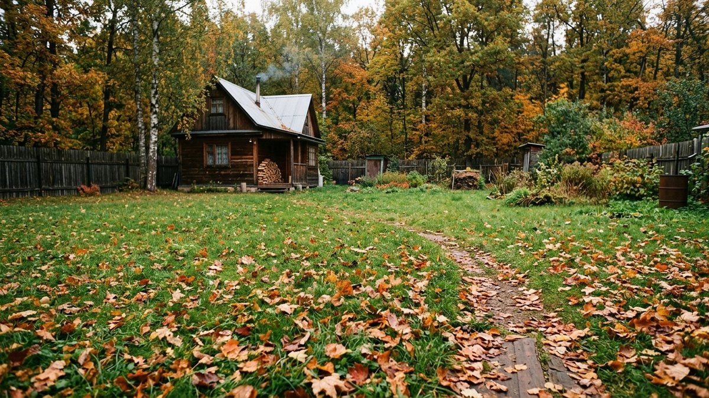
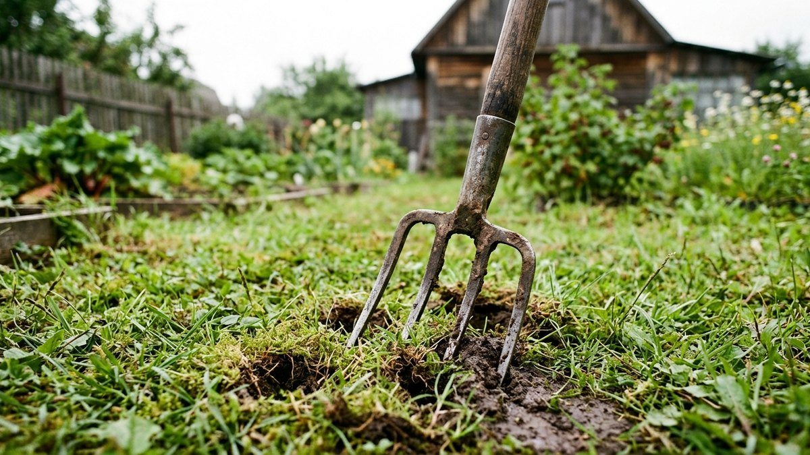
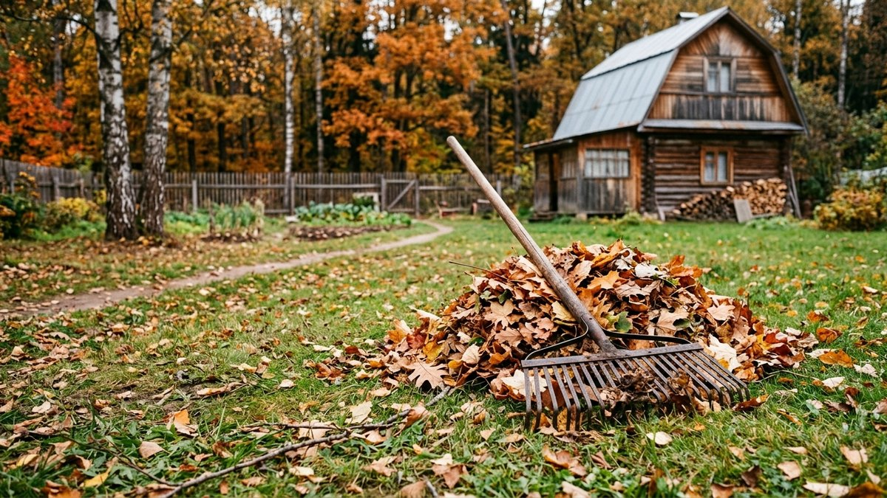
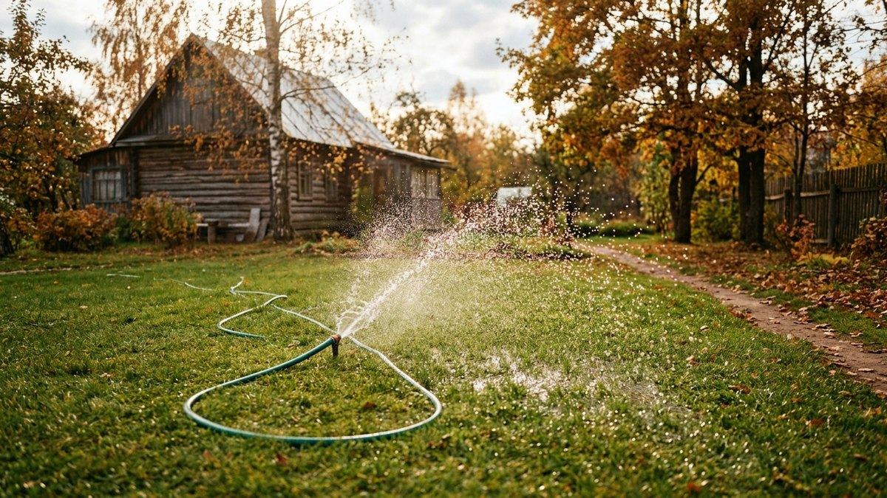
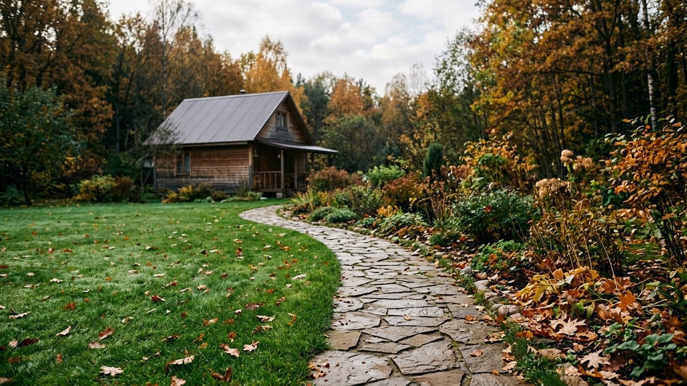
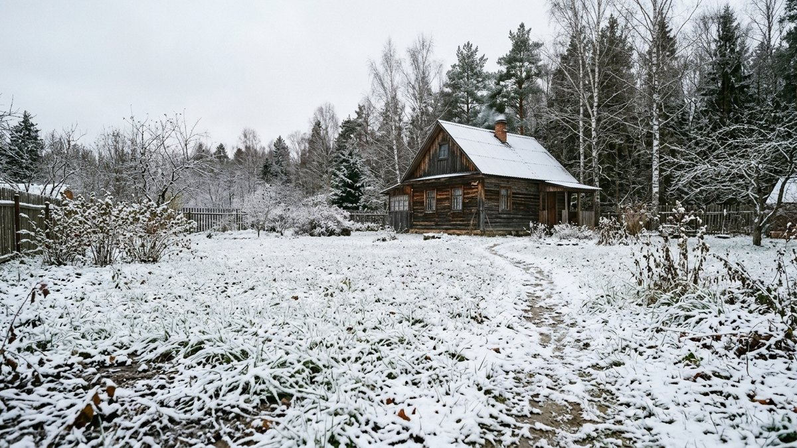

# Уход за газоном осенью: подготовка к зиме

Газон, оставленный без осеннего ухода, выходит из-под снега пятнами: где-
то трава выпревает под слоем несобранных листьев, где-то вымерзает
из-за слишком короткой последней стрижки. Разберём, что сделать с уже
растущим газоном осенью — от последней стрижки до подсева проплешин —
чтобы весной не пришлось пересевать заново.

## Зачем нужен осенний уход

За лето газон накапливает войлок (старые срезанные стебли и корни),
уплотняется почва, а неубранная листва перекрывает доступ света и
воздуха. Без осенней подготовки трава уходит в зиму ослабленной — весной
это оборачивается проплешинами, грибковыми пятнами и медленным
восстановлением.

## Последняя стрижка: когда и на какую высоту

Стричь газон продолжают, пока трава растёт — обычно до конца сентября
или начала октября, в зависимости от региона. Последнюю стрижку делают
чуть ниже обычной летней высоты, но не «под ноль»: оптимально оставлять
4–5 см. Слишком короткая трава хуже переносит морозы и промерзает
быстрее, слишком длинная — приминается под снегом и преет.

## Аэрация и вычёсывание войлока

- **Аэрация** — прокалывание газона вилами или специальным аэратором на
  глубину 5–10 см. Улучшает доступ воздуха и воды к корням, особенно
  важна на плотных глинистых почвах.
- **Скарификация (вычёсывание войлока)** — граблями или скарификатором
  убирают старую подстилку из отмерших стеблей, которая мешает воздуху
  и влаге доходить до корней.

Обе процедуры делают до наступления заморозков, чтобы газон успел
восстановиться перед зимой.

## Осенняя подкормка

Летние азотные удобрения осенью не подходят — азот стимулирует рост
зелёной массы, а перед зимой газону это не нужно. Осенью используют
удобрения с преобладанием калия и фосфора — они укрепляют корневую
систему и повышают морозостойкость травы. Подкормку вносят за 3–4 недели
до устойчивых заморозков, чтобы удобрение успело подействовать.

## Уборка листвы

Опавшие листья — одна из главных причин выпревания газона под снегом:
слой листвы перекрывает свет и воздух, под ним скапливается влага, и
трава преет или заражается грибком. Листья убирают регулярно по мере
опадания, а не одним разом в конце сезона — иначе газон успевает
пострадать под первым же плотным слоем.

## Подсев проплешин

Если за лето на газоне появились проплешины или вытоптанные места,
раннюю осень — ещё подходящее время для подсева, пока почва тёплая, а
заморозков нет. Подготовка участка, выбор травосмеси и норма высева
семян подробно разобраны в статье [как посеять газон своими
руками](https://mir-doma.pro/kak-poseyat-gazon/) — для подсева проплешин
подходит тот же порядок действий, но в меньшем масштабе.

## Полив перед морозами

Если осень сухая, газон продолжают умеренно поливать вплоть до
устойчивых заморозков — пересушенная перед зимой трава хуже
переносит холода. С наступлением стабильных минусовых температур полив
прекращают полностью.

## Заодно на участке

Осенний уход за газоном обычно совпадает по срокам с другими осенними
работами на участке — подготовкой плодовых деревьев и кустарников к
зиме, разобранной в статье [подготовка сада к зиме](https://mir-doma.pro/podgotovka-sada-k-zime/).
Если по краю газона проложены садовые дорожки, перед зимой стоит
проверить и их состояние — уход и защита материалов дорожек от морозов
разобраны в статье [садовые дорожки своими руками](https://mir-doma.pro/sadovye-dorozhki-svoimi-rukami/).
А если дорожку только предстоит замостить рядом с газоном, для покупки
плитки без лишних поездок в магазин пригодится [расчёт нужного
количества](https://mir-doma.pro/raschet-trotuarnoy-plitki/).

## Частые ошибки

- **Стригут газон слишком коротко перед зимой** — короткая трава хуже
  переносит морозы и вымерзает пятнами.
- **Не убирают листву регулярно** — слой листьев перекрывает свет и
  провоцирует выпревание и грибок под снегом.
- **Вносят летнее азотное удобрение осенью** — стимулирует рост зелени
  вместо укрепления корней перед зимой.
- **Игнорируют аэрацию на плотной почве** — уплотнённый грунт хуже
  пропускает воду и воздух к корням в течение всей зимы и весны.

## Частые вопросы

**Когда делать последнюю стрижку газона осенью?**
Пока трава ещё растёт, обычно до конца сентября — начала октября, на
высоту 4–5 см — не короче и не длиннее обычной летней стрижки.

**Нужно ли подкармливать газон осенью?**
Да, удобрением с калием и фосфором, без азота — это укрепляет корни и
повышает морозостойкость травы перед зимой.

**Что будет, если не убирать листья с газона?**
Под слоем листвы трава преет и заражается грибком из-за отсутствия
света и воздуха — весной на этом месте появляются проплешины.

**Можно ли подсевать газон осенью?**
Да, в начале осени, пока почва ещё тёплая и заморозков нет — для
подсева отдельных проплешин подходит тот же порядок, что и при посеве
нового газона.

**Нужна ли аэрация газону каждую осень?**
Не обязательно ежегодно, но на плотных глинистых почвах и участках с
интенсивной нагрузкой — раз в 1–2 года аэрация заметно улучшает
состояние газона.
