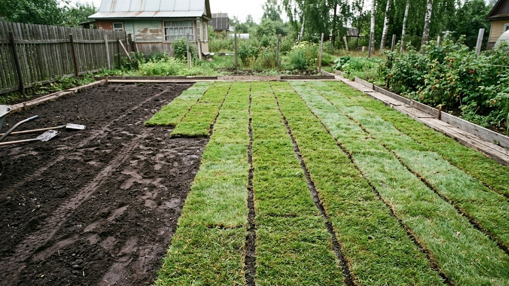
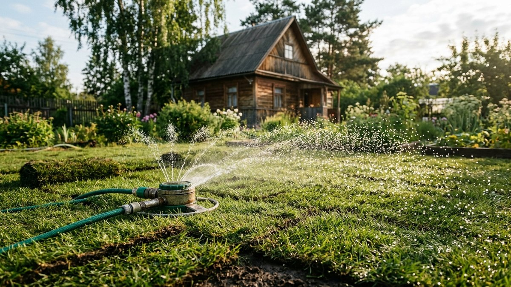
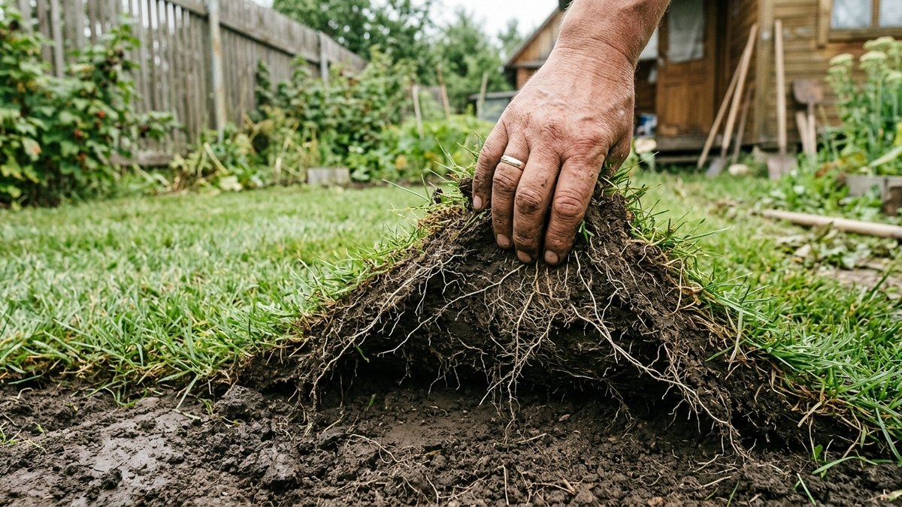
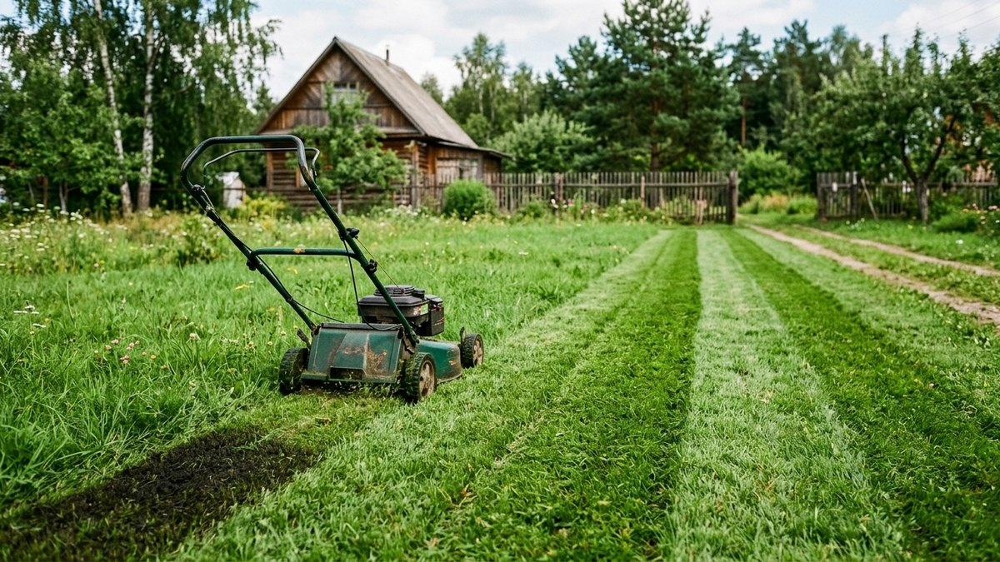
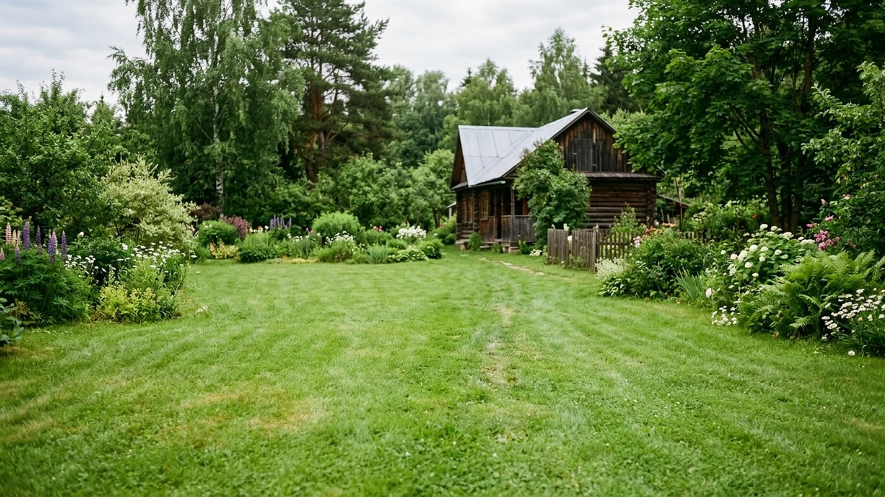
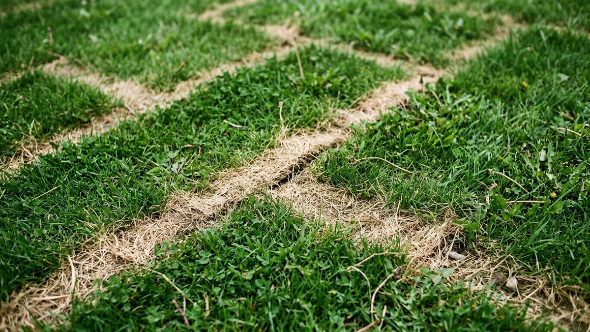

Рулонный газон укладывают уже готовым зелёным ковром, но это не значит, что уход на нём заканчивается в день укладки, — первые две-три недели решают, приживётся дёрн или начнёт сохнуть пятнами. Это отдельный процесс, непохожий на уход за посевным газоном: там ждут всходов, здесь — укоренения уже выросшей травы в новую почву. Разберём, что делать в первые недели по шагам.

## Первые две недели — самые критичные

Сразу после укладки корни дёрна ещё не проросли в почву под ним — рулон держится на участке буквально как ковёр, а не как живое растение с опорой. Всё это время трава питается влагой, которую вы даёте поливом, а не собственными корнями из грунта. Именно в этот период чаще всего теряют газон — не от плохого качества рулонов, а от пропущенного полива в жаркие дни.

## Полив в первые дни

Первые 10–14 дней газон поливают ежедневно, а в жаркую погоду — дважды в день, рано утром и вечером. Норма — не лёгкое увлажнение поверхности, а полив, при котором вода промачивает и сам дёрн, и почву под ним минимум на 2–3 см. Проверить это просто: приподнимите уголок полотна в незаметном месте — почва под ним должна быть влажной, а не сухой.

Если под палящим солнцем края рулонов подсыхают и начинают темнеть или скручиваться — это сигнал, что полива не хватает, реагировать нужно сразу, а не через день-два.

## Когда можно ходить по газону

Первые одну-две недели по газону лучше не ходить вообще — вес человека сдвигает ещё не укоренившиеся полотна относительно друг друга и почвы, из-за чего швы расходятся и хуже срастаются. Если нужно пройти для полива, ступайте на широкую доску, положенную поверх газона, — она распределяет вес и не продавливает дёрн точечно.

## Проверка укоренения

Через 10–14 дней после укладки можно проверить, укоренился ли газон: аккуратно потяните за уголок полотна в незаметном месте. Если чувствуется заметное сопротивление и полотно не отрывается от земли — корни проросли в почву, и нагрузка на газон уже не так критична. Если угол легко поднимается, как в день укладки, — нужно продолжать бережный режим ещё неделю.

## Швы между полотнами

В первые дни после укладки стоит пройтись по газону садовым катком (или заменить его широкой доской и аккуратно примять) — это плотно прижимает дёрн к почве и убирает воздушные карманы под ним, через которые корни хуже прорастают. Если между полотнами заметны щели шире 5–7 мм, их присыпают смесью песка и плодородной земли — иначе именно в швах трава пересыхает быстрее всего и появляются заметные светлые полосы.

## Первая стрижка

Первую стрижку проводят не раньше, чем газон укоренился и подрос на 3–4 см выше исходной высоты рулона, — обычно это происходит через 2–3 недели после укладки, у рулонного газона заметно быстрее, чем у посевного (у него на первую стрижку уходит несколько недель ожидания всходов — этот процесс разобран в статье [«Как посеять газон своими руками»](https://mir-doma.pro/kak-poseyat-gazon/)). Срезают только треть длины травинки, не больше, — и обязательно хорошо заточенной косилкой, чтобы срез был ровным, а не рваным.

## Что дальше

После укоренения и первой стрижки рулонный газон уходит в тот же режим ухода, что и обычный, — регулярный полив по погоде, стрижка раз в 1–2 недели, осенняя подготовка к зиме. Как ухаживать за уже взрослым газоном осенью — стрижка, аэрация и подкормка без азота — разобрано в статье [«Уход за газоном осенью»](https://mir-doma.pro/ukhod-za-gazonom-osenyu/). Чтобы не поливать вручную каждый день в критичные первые недели, есть смысл заранее продумать автоматический полив — устройство простой системы разобрано в статье [«Система автоматического полива газона своими руками»](https://mir-doma.pro/sistema-poliva-gazona-svoimi-rukami/).

## Частые ошибки

- **Пропускать полив в первую неделю.** Дёрн ещё не укоренился и не может добыть воду сам — пропуск даже одного жаркого дня оставляет сухие пятна.
- **Ходить по газону в первые недели.** Сдвигает неукоренившиеся полотна и мешает срастанию швов.
- **Стричь слишком рано.** Пока корни не проросли в почву, газонокосилка может сдвинуть или порвать полотна.
- **Не укатывать после укладки.** Воздушные карманы под дёрном мешают корням прорасти равномерно.
- **Не подсыпать широкие швы.** Открытые щели между полотнами пересыхают быстрее остального газона и заметны как светлые полосы.

## Частые вопросы

### Как часто поливать рулонный газон после укладки?

Первые 10–14 дней — ежедневно, в жару дважды в день, так, чтобы вода промачивала дёрн и почву под ним на 2–3 см. После укоренения переходят на обычный режим полива по погоде.

### Когда можно первый раз ходить по рулонному газону?

Лучше выждать одну-две недели до полного укоренения. Если нужно пройти раньше, используйте широкую доску поверх газона, чтобы распределить вес.

### Как понять, что рулонный газон укоренился?

Аккуратно приподнимите уголок полотна в незаметном месте — если чувствуется заметное сопротивление и оно не отрывается легко от земли, корни проросли в почву.

### Когда стричь рулонный газон в первый раз?

Через 2–3 недели после укладки, когда газон укоренился и подрос на 3–4 см выше исходной высоты. Срезают не больше трети длины травинки за раз.

### Нужно ли укатывать рулонный газон после укладки?

Да, желательно в первые дни — садовым катком или через доску, чтобы плотно прижать дёрн к почве и убрать воздушные карманы, мешающие укоренению.
