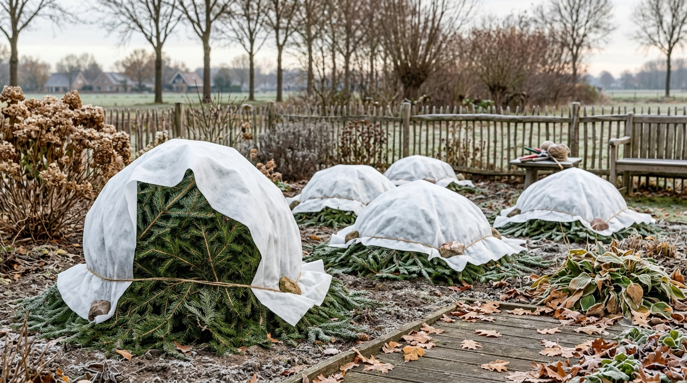
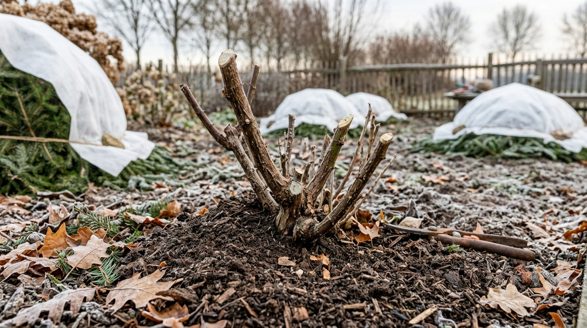
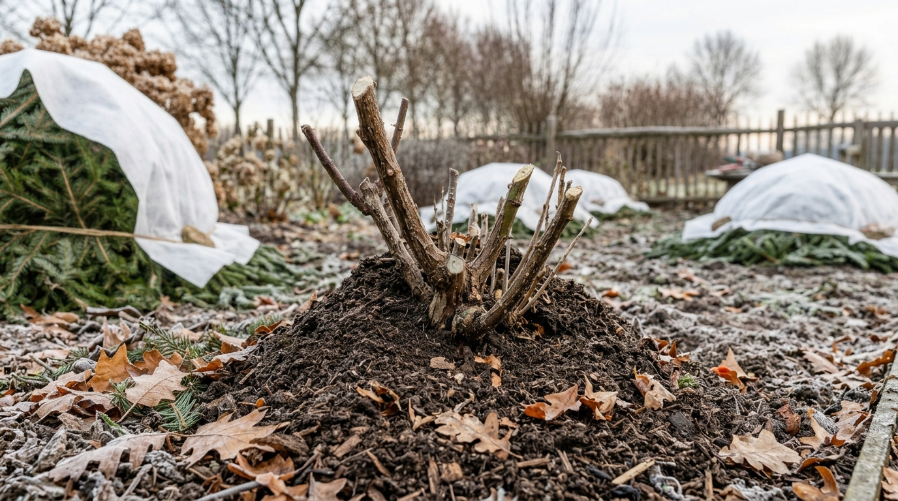
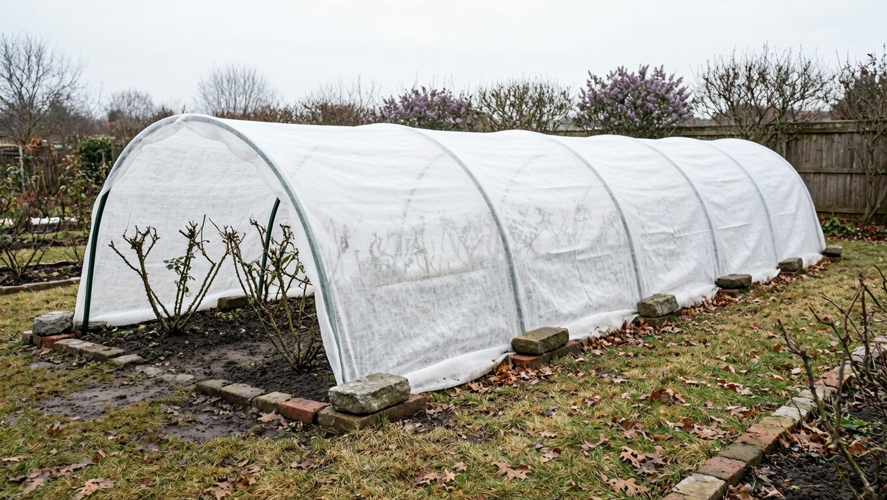
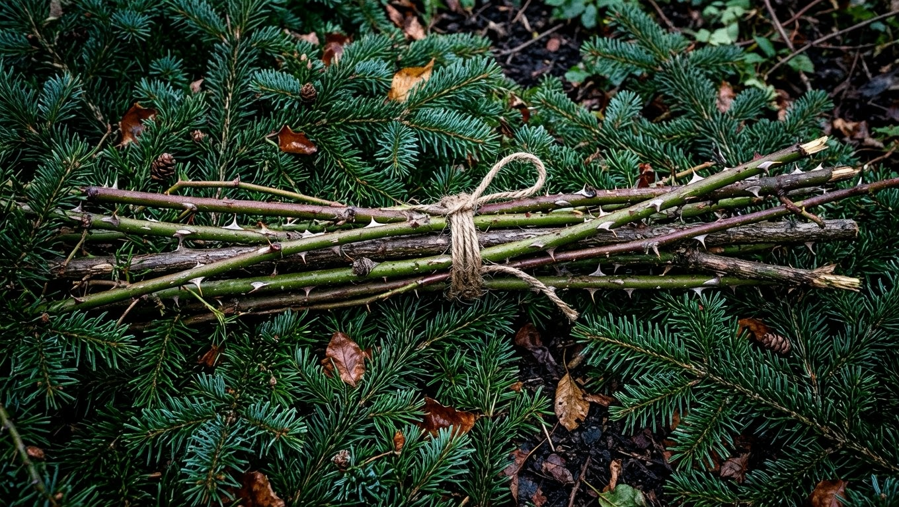
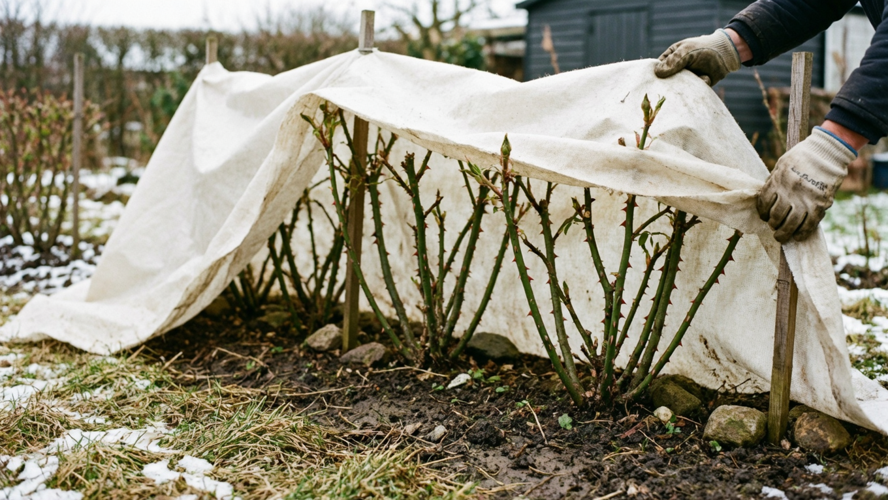

Правильное укрытие — то, от чего зависит, встретите ли вы весну с живыми пышными кустами или с почерневшими побегами. И главный парадокс здесь в том, что **розы чаще гибнут не от мороза, а от выпревания** под слишком рано или слишком плотно наложенным укрытием. Разберём, когда укрывать розы на зиму, как подготовить кусты, чем укрывать разные виды роз и когда снимать укрытие весной.

## 🌹 Нужно ли укрывать розы

Зависит от группы роз и климата:

- **Парковые и видовые розы** — самые зимостойкие, в средней полосе часто зимуют без укрытия, достаточно окучивания.
- **Флорибунда, чайно-гибридные, английские** — укрывать обязательно: они подмерзают даже в мягкие зимы.
- **Плетистые** — укрывать обязательно, предварительно сняв с опоры и уложив.
- **Штамбовые** — самые уязвимые, требуют особого подхода (пригибание или обматывание кроны).

Если сомневаетесь в сорте — лучше укрыть: непострадавший от укрытия куст всегда лучше вымерзшего.

## 📅 Когда укрывать розы

Это **самый важный вопрос**, и ошибаются в нём чаще всего. Правило простое: **укрывают после установления устойчивых лёгких морозов**, обычно −5…−7 °C, когда земля начала подмерзать. В средней полосе это чаще конец октября — ноябрь.

Почему нельзя раньше:

- в тепле под укрытием куст **преет** — почки и кора загнивают, появляется инфекция;
- роза не успевает пройти закалку и хуже переносит зиму;
- под тёплым укрытием растение может тронуться в рост.

Лёгкий мороз розам не вреден — он как раз закаляет куст. Опасны для них не первые заморозки, а сырость и оттепели под преждевременным укрытием.

## ✂️ Подготовка кустов к укрытию

Перед укрытием куст готовят — это половина успеха:

1. **Прекратить азотные подкормки** ещё в конце лета, перейти на фосфор и калий — они помогают побегам вызреть.
2. **Не срезать цветы и не рыхлить** почву в сентябре, чтобы не стимулировать рост.
3. **Обрезать** — укоротить длинные побеги (на высоту будущего укрытия), убрать невызревшие мягкие верхушки, больные и слабые ветви.
4. **Оборвать листья** — на них зимует инфекция, а под укрытием они гниют.
5. **Убрать растительные остатки** из-под куста и вынести с участка.
6. **Обработать** куст и почву фунгицидом (медьсодержащим) — профилактика грибковых болезней.

Если летом куст болел или его мучили вредители, обработка обязательна — подробнее о проблемах роз в статьях [почему желтеют листья у роз](https://mir-doma.pro/zhelteyut-listya-u-roz/) и [почему не цветут розы](https://mir-doma.pro/pochemu-ne-tsvetut-rozy/).

## ⛰️ Окучивание — обязательный минимум

Даже если больше ничего не делать, **основание куста нужно окучить**. Именно там находится место прививки — самая уязвимая часть розы.

- насыпают холмик высотой **20–30 см** вокруг основания;
- используют **сухую землю, песок, торф или компост**, принесённые со стороны;
- **не сгребают землю из-под самого куста** — оголятся корни;
- окучивают в сухую погоду, по сухой почве.

Для парковых роз окучивания часто достаточно, для остальных — это база, поверх которой делают укрытие.

## 🛡️ Чем укрывать: материалы

- **Лапник (еловые ветви)** — классика: держит снег, пропускает воздух, отпугивает грызунов.
- **Спанбонд, лутрасил (нетканый материал)** — плотностью от 60 г/м², в 2 слоя; дышит и защищает от ветра.
- **Сухая листва** — только сухая и здоровая, обычно как наполнитель внутри каркасного укрытия.
- **Каркас** — дуги, ящики, щиты: создают воздушную прослойку, чтобы материал не лежал на побегах.

Чего **не использовать**: плёнку и любые непроницаемые материалы прямо на куст — под ними скапливается конденсат, и роза выпревает. Плёнку допустимо класть только поверх каркаса, оставляя торцы открытыми для проветривания.

## 🏠 Воздушно-сухое укрытие — самый надёжный способ

Лучший вариант для чайно-гибридных, флорибунды и плетистых роз. Суть — **создать вокруг куста сухую воздушную камеру**:

1. Окучить основание.
2. Установить над кустом **каркас** (дуги, ящик, щиты) высотой 30–50 см.
3. Уложить внутрь лапник или сухую листву.
4. Накрыть каркас **нетканым материалом** в 2 слоя, сверху при желании плёнкой от дождя.
5. **Оставить торцы открытыми** для проветривания — закрыть их окончательно только с приходом устойчивых морозов.
6. Прижать края укрытия камнями или досками, чтобы не сдуло ветром.

Воздух — лучший теплоизолятор, а сухость защищает от выпревания. Поэтому такое укрытие надёжнее, чем плотно набитый утеплитель.

## 🌿 Особенности разных видов роз

**Кустовые (чайно-гибридные, флорибунда).** Обрезать до 30–40 см, окучить, накрыть лапником и нетканым материалом на каркасе.

**Плетистые.** Аккуратно снять с опоры (в тёплую погоду — на морозе побеги ломкие), связать плети в пучок, уложить на лапник или доски (не на голую землю!), пришпилить и укрыть сверху. Никогда не укрывают прямо на опоре.

**Штамбовые.** Самые сложные: молодые штамбы аккуратно пригибают к земле и укрывают целиком; взрослые, которые уже не гнутся, обматывают крону лапником и нетканым материалом, а основание окучивают.

**Почвопокровные.** Достаточно окучить и накрыть лапником — они зимуют легче.

## ☀️ Когда снимать укрытие весной

Снимать тоже нужно вовремя — весной розы гибнут от выпревания не реже, чем зимой от мороза:

- начинайте **проветривать** с приходом стабильного тепла: открывайте торцы в тёплые дни;
- **снимайте укрытие постепенно**, в несколько приёмов, в пасмурную погоду или вечером;
- полностью убирайте, когда минует угроза сильных возвратных заморозков;
- **разокучивайте основание** после схода снега, когда почва оттает;
- первое время притеняйте кусты — после зимовки побеги легко получают солнечные ожоги.

Резко открытый на ярком солнце куст обгорает и обезвоживается, поэтому спешить нельзя.

## ❌ Частые ошибки

- **Укрыли слишком рано, в тепло** — куст преет, побеги чернеют и гниют. Самая частая и самая губительная ошибка.
- **Накрыли плёнкой прямо на куст** — конденсат и выпревание.
- **Укрытие лежит на побегах** — нет воздушной прослойки, ветви подмерзают и преют.
- **Не оборвали листья** — под укрытием они гниют и разносят инфекцию.
- **Сгребли землю из-под куста** — оголились корни.
- **Плетистые уложили на голую землю** — побеги отсыревают, нужна подложка.
- **Сняли укрытие поздно или резко** — выпревание или солнечные ожоги весной.

## ❓ Частые вопросы

**Когда укрывать розы на зиму?**
После установления устойчивых лёгких морозов (около −5…−7 °C), обычно в конце октября — ноябре. Раньше нельзя: в тепле под укрытием куст выпревает.

**Чем лучше укрывать розы?**
Лапником и нетканым материалом (спанбонд от 60 г/м² в 2 слоя) на каркасе. Плёнку кладут только поверх каркаса, не на сам куст, иначе будет конденсат.

**Нужно ли обрезать розы перед укрытием?**
Да, побеги укорачивают до высоты укрытия (обычно 30–40 см у кустовых), убирают невызревшие верхушки, больные ветви и обрывают все листья.

**Как укрыть плетистую розу?**
Снять плети с опоры в тёплую погоду, связать, уложить на лапник или доски (не на голую землю), пришпилить и накрыть лапником и нетканым материалом.

**Нужно ли укрывать парковые розы?**
Обычно нет — они самые зимостойкие, достаточно окучить основание. Чайно-гибридные, флорибунду и плетистые укрывать нужно обязательно.

**Когда снимать укрытие с роз весной?**
Постепенно, с приходом устойчивого тепла: сначала проветривать, открывая торцы, затем снимать в несколько приёмов в пасмурную погоду, когда минует угроза сильных заморозков.

**Почему розы чернеют под укрытием?**
Это выпревание — от слишком раннего или слишком плотного укрытия, конденсата под плёнкой и неубранных листьев. Розе нужны сухость и воздух, а не тепло любой ценой.

---

Укрытие роз — история не про то, чтобы потеплее закутать, а про то, чтобы сохранить куст сухим и проветриваемым. Дождитесь устойчивых лёгких морозов, подготовьте и окучьте кусты, сделайте воздушно-сухое укрытие на каркасе — и весной розы проснутся здоровыми. Полный сезонный уход собран в статье [розы: посадка и уход](https://mir-doma.pro/rozy-posadka-i-uhod/), а остальные осенние работы в саду — в материале про [подготовку сада к зиме](https://mir-doma.pro/podgotovka-sada-k-zime/).
