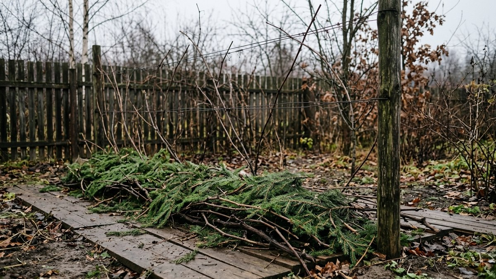
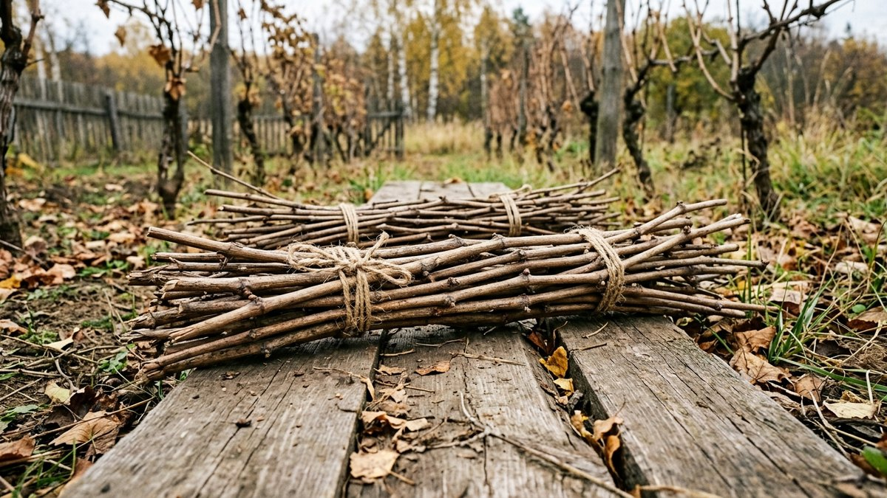
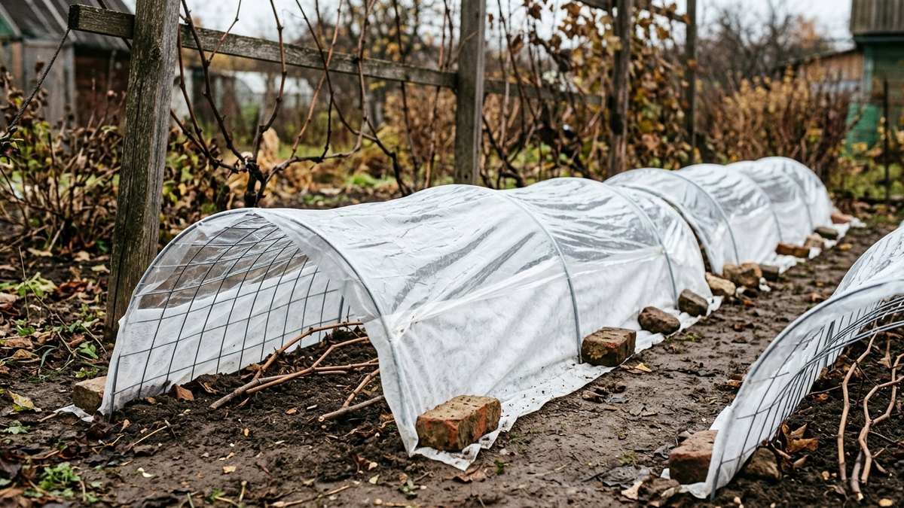
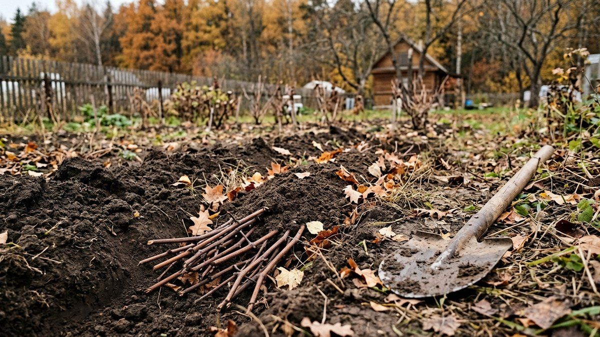
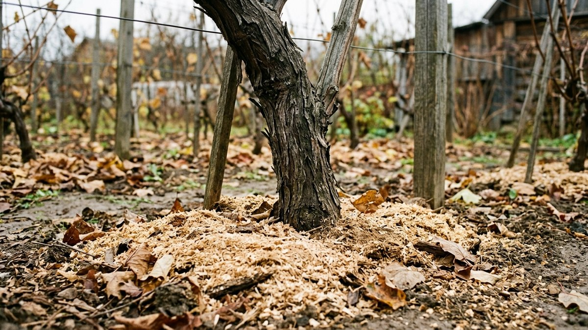
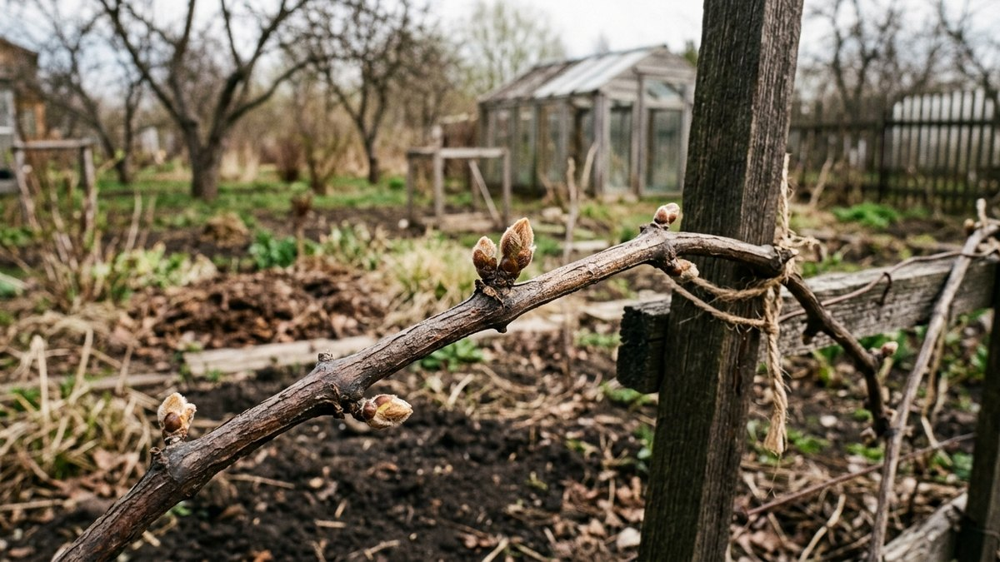

# Укрытие винограда на зиму: когда, чем и как укрыть лозу, чтобы не выпрела

Виноград в средней полосе погибает зимой чаще не от мороза, а от
ошибок укрытия: лоза выпревает под плёнкой, укрытой слишком рано,
гниёт на сырой земле или погибает от вымерзания корней в бесснежную
зиму. Разберём укрытие винограда на зиму по шагам: какие сорта
укрывать, когда начинать, как подготовить лозу и какой из четырёх
способов подходит вашему участку.

## Какой виноград нужно укрывать

Всё зависит от сорта и региона.

- **Укрывные сорта** — большинство столовых сортов с крупной ягодой.
  Их лоза выдерживает около −20 °C, а в средней полосе морозы бывают
  сильнее. Такие сорта укрывают всегда.
- **Неукрывные (зимостойкие) сорта** — в основном технические и часть
  гибридных столовых, выдерживающих до −28…−35 °C. В средней полосе их
  можно оставлять на шпалере, но молодые кусты первые 2–3 года всё равно
  укрывают.
- **Корни** уязвимее лозы у любых сортов. У европейских сортов корни
  повреждаются уже при промерзании почвы до −5…−7 °C, поэтому
  приствольный круг мульчируют даже у неукрывных сортов.

Если сорт неизвестен, укрывайте: лишнее укрытие реже губит куст, чем
его отсутствие.

## Когда укрывать виноград

**После листопада и первых заморозков, но до устойчивых морозов.** В
средней полосе это обычно конец октября — начало ноября.

- **Рано** (тёплый октябрь, лоза ещё зелёная) — лоза выпревает под
  укрытием и поражается грибком.
- **Поздно** (после морозов ниже −8…−10 °C) — лоза становится хрупкой,
  при пригибании ломается, а глазки могут уже подмёрзнуть.

Лёгкие заморозки до −5 °C лозе полезны: она проходит закалку перед
зимой.

## Подготовка лозы

1. **Осенняя обрезка.** После листопада удаляют невызревшие зелёные
   побеги, отплодоносившие рукава и лишние лозы. Вызревшая лоза —
   коричневая, при сгибе потрескивает. Общие правила осенней обрезки и
   что нельзя делать в это время, разобраны в статье
   [обрезка плодовых деревьев осенью](https://mir-doma.pro/obrezka-plodovyh-derevev-osenyu/):
   для винограда логика та же — санитарная обрезка вызревшей древесины.
2. **Влагозарядковый полив** в сухую осень: влажная почва промерзает
   медленнее сухой.
3. **Обработка от грибков.** Лозу и почву вокруг опрыскивают
   фунгицидом, разрешённым для винограда, по инструкции. Многие
   используют железный купорос в концентрации, указанной на упаковке.
4. **Снятие со шпалеры.** Лозу связывают в пучок шпагатом, не
   перетягивая.
5. **Подстилка.** Лозу **не кладут на голую землю**: от контакта с
   сырой почвой она гниёт. Подкладывают доски, лапник, сухие стебли
   или шифер.

## Четыре способа укрытия

| Способ | Как | Плюсы | Минусы |
|---|---|---|---|
| Лапник | Лоза на подстилке, сверху слой лапника 15–20 см | Дышит, держит снег, отпугивает грызунов | Нужен запас лапника |
| Земля | Лоза в неглубокой траншее, засыпана землёй 15–25 см | Надёжно в бесснежные зимы | Трудоёмко, весной лозу легко повредить при откапывании |
| Спанбонд на дугах | Дуги над лозой, 2 слоя плотного спанбонда | Просто, не душит лозу | Одного спанбонда мало в морозные бесснежные зимы |
| Воздушно-сухое | Дуги, спанбонд, сверху плёнка с продухами по торцам | Самый тёплый, сухой воздух внутри | Нужно открывать продухи в оттепели |

### Лапник

Самый простой и «дышащий» способ. Лапник удерживает снег, а снег —
лучшая изоляция. Колючие ветки заодно отпугивают мышей. Подходит для
снежных зим.

### Земля

Лозу укладывают в траншею глубиной 20–30 см на подстилку и засыпают
землёй, взятой не из-под куста, а из междурядья, чтобы не оголить
корни. Самый надёжный вариант для малоснежных зим. Весной землю
снимают аккуратно, чтобы не поломать проснувшиеся почки.

### Спанбонд на дугах

Над лозой ставят невысокие дуги и натягивают два слоя плотного
спанбонда (60 г/м²), края прижимают. Спанбонд пропускает воздух, лоза
не выпревает. В бесснежные морозные зимы его дополняют лапником.

### Воздушно-сухое укрытие

Над лозой на дугах — спанбонд, сверху плёнка. По торцам оставляют
продухи, которые на морозе закрывают, а в оттепели открывают. Внутри
сухой воздух, и лоза хорошо зимует даже в сильные морозы. Но это
укрытие требует присмотра: в оттепель под закрытой плёнкой лоза
выпревает.

## Корни и приствольный круг

Даже если лоза неукрывного сорта остаётся на шпалере, корни защищают:
приствольный круг мульчируют слоем 10–15 см опилок, торфа или листьев
здоровых деревьев. Корни виноградной лозы повреждаются при более слабом
морозе, чем надземная часть.

## Грызуны под укрытием

Под укрытием зимуют мыши и повреждают кору лозы. Поможет лапник вокруг
и поверх укрытия. Если мышей на участке много, стоит заранее разложить
приманки в защищённых от птиц и детей контейнерах. Общие меры защиты
сада от грызунов осенью — в статье
[подготовка сада к зиме](https://mir-doma.pro/podgotovka-sada-k-zime/).

## Когда снимать укрытие весной

Постепенно, в апреле, когда минуют сильные морозы:

1. Сначала открывают продухи и снимают плёнку, чтобы лоза не выпрела
   в первые тёплые дни.
2. Через одну-две недели убирают лапник или землю.
3. Спанбонд оставляют под рукой до конца возвратных заморозков: почки,
   тронувшиеся в рост, повреждаются уже при −2…−3 °C.
4. Лозу подвязывают на шпалеру после того, как почки начнут
   набухать.

Ягодные кустарники на соседней грядке укрывают по той же логике — не
раньше заморозков и без плотной плёнки. Как это делают с клубникой,
разобрано в статье
[чем укрыть клубнику на зиму](https://mir-doma.pro/chem-ukryt-klubniku-na-zimu/).

## Частые ошибки

- **Укрыть в тёплом октябре.** Лоза выпревает под плёнкой и болеет.
- **Положить лозу на голую землю.** Гниёт в месте контакта.
- **Сплошная плёнка без продухов.** Конденсат, выпревание, плесень.
- **Землю для укрытия брать из-под куста.** Оголяются корни.
- **Не укрыть корни у неукрывного сорта.** Лоза переживёт мороз, корни
  — нет.
- **Резко снять всё укрытие весной.** Возвратный заморозок бьёт по
  тронувшимся почкам.

## Частые вопросы

### Когда укрывать виноград на зиму в средней полосе

После листопада и первых лёгких заморозков, до устойчивых морозов
ниже −8…−10 °C. Обычно это конец октября — начало ноября.

### Чем лучше укрыть виноград на зиму

Для снежных зим — лапником на подстилке, для малоснежных — землёй или
воздушно-сухим укрытием из спанбонда и плёнки с продухами.

### Нужно ли укрывать виноград, если сорт морозостойкий

Лозу взрослого куста неукрывного сорта можно оставлять на шпалере, но
молодые кусты первые 2–3 года укрывают, а приствольный круг мульчируют
всегда.

### Можно ли укрывать виноград плёнкой

Только поверх спанбонда на дугах и с продухами по торцам. Плёнка прямо
на лозе даёт конденсат и выпревание.

### Когда снимать укрытие с винограда весной

Постепенно в апреле: сначала плёнку, через одну-две недели лапник или
землю. Спанбонд держат под рукой до конца возвратных заморозков.

## Итог

Укрывают виноград после листопада и первых заморозков, но до сильных
морозов. Лозу обрезают, снимают со шпалеры, кладут на подстилку и
укрывают лапником, землёй, спанбондом или воздушно-сухим способом.
Корни мульчируют у всех сортов. Весной укрытие снимают постепенно,
держа спанбонд наготове до конца возвратных заморозков.
