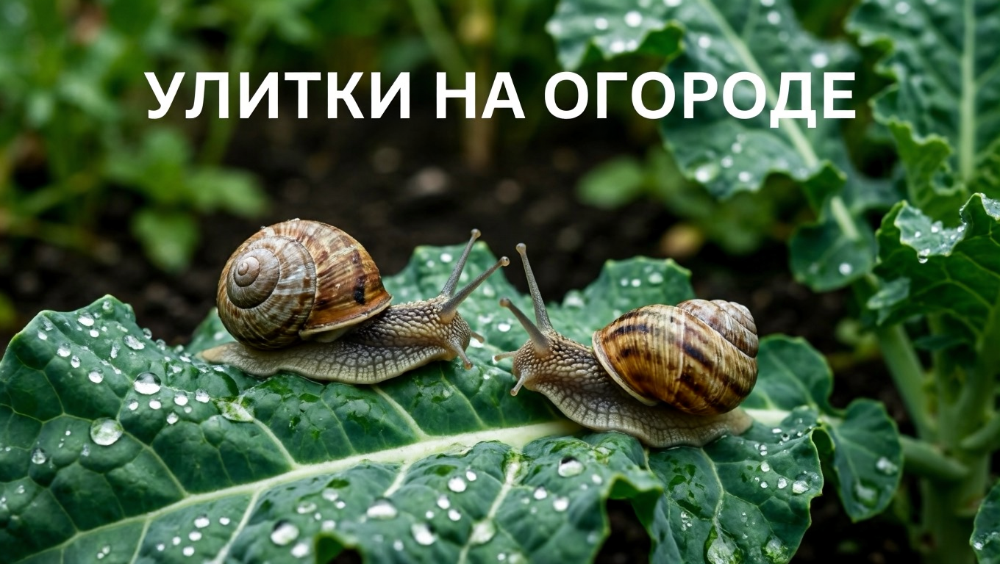
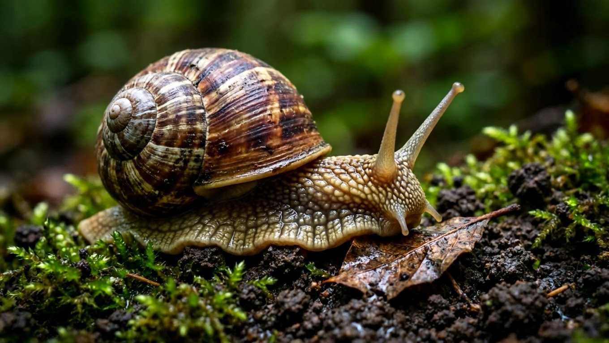
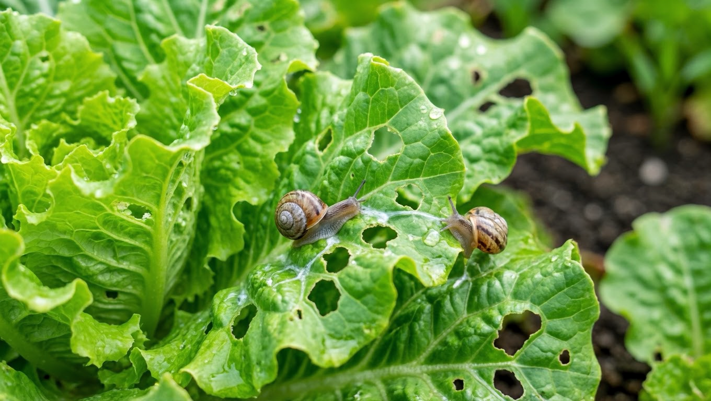
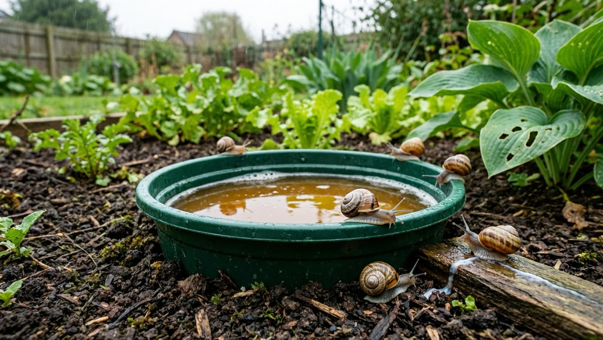
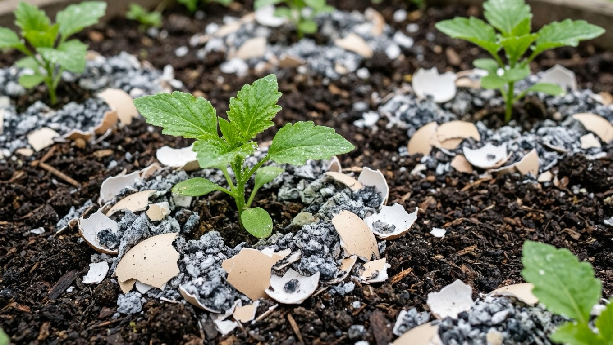
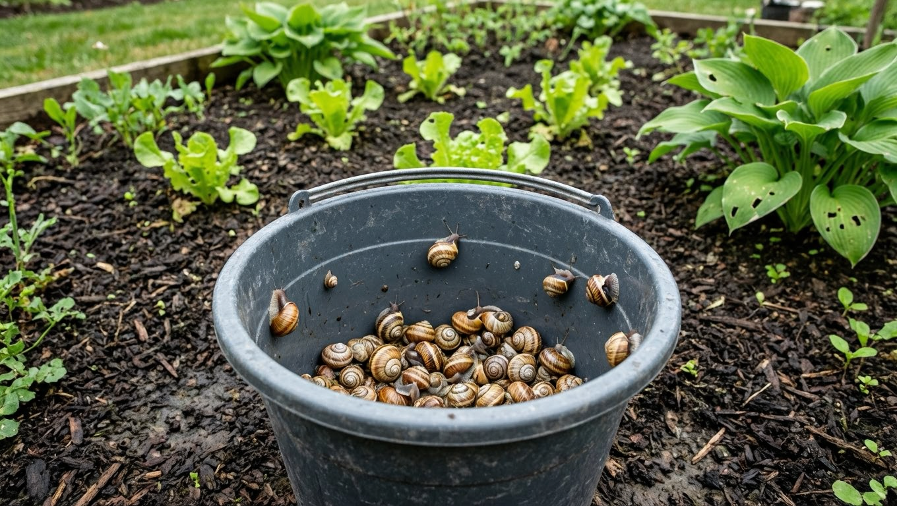

Улитки на грядках вызывают меньше отвращения, чем слизни, но вреда приносят не меньше: за ночь они способны обглодать всходы, продырявить листья капусты и испортить ягоды. При этом не каждая улитка на участке — вредитель, и прежде чем начинать борьбу, стоит разобраться, кто именно поселился на грядках. Разберём, чем улитки отличаются от слизней, все ли они вредны и как от них избавиться без вреда для урожая.

## 🐌 Улитка или слизень: в чём разница

Формально это близкие родственники — наземные брюхоногие моллюски. Главное отличие очевидно: **у улитки есть раковина, у слизня её нет.** Но из этого следуют вполне практические различия:

| Признак | Улитка | Слизень |
|---|---|---|
| Раковина | Есть | Нет |
| Где прячется днём | Втягивается в раковину, может сидеть открыто | Только во влажных укрытиях: под досками, в мульче |
| Устойчивость к сухости | Выше — раковина защищает от испарения | Низкая, быстро высыхает |
| Зимовка | Часто зимует взрослой особью, запечатав раковину | Чаще зимуют яйца |
| Вред | Схожий, но обычно меньше | Сильнее, особенно при массовости |
| Сложность борьбы | Проще заметить и собрать | Труднее — прячется, активен ночью |

Практический вывод: **методы борьбы одинаковы**, но улиток проще собирать руками — их видно, они медленнее и не забиваются так глубоко в укрытия. Зато барьеры из золы и песка работают против них хуже: раковина частично защищает моллюска от контакта с сухими материалами.

Если на участке именно слизни, полезнее будет статья про [слизней на огороде](https://mir-doma.pro/slizni-na-ogorode/), а при массовом нашествии крупных особей стоит проверить, не завёлся ли [испанский слизень](https://mir-doma.pro/ispanskiy-slizen/).

## 🌿 Не все улитки вредят

Прежде чем травить всех подряд, посмотрите, кто именно на грядках:

**Вредят:**

- **мелкие улитки** (садовая, кустарниковая и подобные) — именно они обгрызают всходы, листья салата и капусты, ягоды земляники;
- активны в сырую погоду, ночью и рано утром;
- размножаются быстро, при влажном лете дают вспышку численности.

**Скорее полезны или нейтральны:**

- **виноградная улитка** — крупная, с характерной коричневатой полосатой раковиной до 4–5 см. Питается в основном увядающими и отмершими частями растений, падалицей и разлагающейся органикой, живые растения ест неохотно. На участке она скорее санитар, чем вредитель, а в некоторых регионах и вовсе охраняется.
- **улитки в компосте** — перерабатывают органику и вреда грядкам не наносят.

Поэтому первым делом стоит определить масштаб: единичные крупные улитки на участке — не повод для тревоги. Бороться имеет смысл, когда мелких улиток становится много и появляются реальные повреждения.

## 🔍 Как понять, что вредят именно улитки

Признаки узнаваемые:

- **дырки неправильной формы** в середине листа, края объедены фестонами;
- **обглоданные всходы** и молодая рассада — иногда исчезают целиком за ночь;
- **выеденные ямки** в ягодах земляники, кабачках, тыкве, лежащих на земле;
- **серебристые подсохшие дорожки слизи** на листьях, дорожках и почве — самый верный признак;
- повреждения появляются **за ночь**, а днём виновника не видно;
- сами улитки — под досками, камнями, в густой траве, на нижней стороне листьев.

Если дорожек слизи нет, ищите другого виновника: похожие дырки оставляют гусеницы и жуки, но борются с ними иначе.

## 🛠️ Как избавиться от улиток

Работает система из нескольких приёмов, а не одно средство.

**1. Ручной сбор — самый эффективный способ для улиток.** Их хорошо видно, и в отличие от слизней они не так прячутся. Собирают вечером, ранним утром и после дождя, обязательно в перчатках. Крупных виноградных улиток можно просто отнести подальше от грядок, мелких вредителей — уничтожить.

**2. Ловушки-укрытия.** Разложите на грядках доски, куски шифера, влажную мешковину, половинки грейпфрута или капустные листья. Улитки заберутся туда переждать день — утром останется собрать.

**3. Пивные ловушки.** Вкопайте в почву банку или контейнер вровень с землёй и налейте немного пива. Запах брожения приманивает моллюсков. Ловушки проверяют и обновляют каждые пару дней; ставить их лучше по периметру, а не в центре грядок, чтобы не приманивать улиток к посадкам.

**4. Барьеры.** Улитку останавливает то, по чему неприятно ползти:

- **медная лента** по краю грядки или кашпо — самый надёжный барьер, работает и во влажную погоду;
- **сухая зола, песок, измельчённая скорлупа, кофейная гуща** — работают только сухими, после дождя требуют обновления;
- **хвойный опад и мелкий гравий** в мульче.

**5. Гранулы-моллюскоциды.** На основе **фосфата железа** — безопаснее для домашних животных, ежей и почвы, предпочтительный вариант для участка. На основе **метальдегида** — эффективнее, но опасен для собак, кошек и ежей, требует осторожности при раскладке.

**6. Естественные враги.** Улиток едят ежи, жабы, ящерицы, землеройки, птицы (дрозды, скворцы), а также домашние утки и куры. Жужелицы и их личинки поедают яйца и молодь. Главное условие, чтобы это работало: **не применять сплошные обработки инсектицидами** — они уничтожают жужелиц заодно с вредителями.

## 🌾 Профилактика: убрать сырость и укрытия

Улиткам нужны влага и тень. Уберите их — и численность упадёт сама:

- **поливайте утром**, а не вечером: к ночи поверхность подсохнет;
- переходите на [капельный полив](https://mir-doma.pro/kapelnyy-poliv-svoimi-rukami/) вместо дождевания;
- **не загущайте посадки**, обеспечивайте проветривание грядок;
- **убирайте укрытия** — доски, старые мешки, кучи скошенной травы у грядок;
- **скашивайте траву** вдоль дорожек и заборов;
- **мульчируйте сухими материалами** (хвоя, солома), а не влажной травой;
- **убирайте падалицу** и порченые плоды, лежащие на земле;
- **осматривайте покупную рассаду** — улитки и кладки часто приезжают вместе с грунтом.

Помогает и обустройство дорожек: по сухому гравию или плитке улиткам передвигаться неудобно, и грядки становятся менее доступны — как их сделать, в статье про [садовые дорожки](https://mir-doma.pro/sadovye-dorozhki-svoimi-rukami/).

## 🍂 Что сделать осенью

Осенняя работа снижает численность следующего года сильнее, чем летняя борьба:

- **уберите растительные остатки** — в них зимуют и улитки, и кладки;
- **перекопайте почву** — яйца и зимующие особи поднимаются на поверхность и гибнут от мороза или склёвываются птицами;
- **уберите доски, мешки и мусор** с участка, чтобы лишить моллюсков зимних укрытий;
- **обработайте теплицу** — в ней улитки зимуют особенно охотно: подробно в статье про [обработку теплицы осенью](https://mir-doma.pro/obrabotka-teplicy-osenyu/).

## ❓ Частые вопросы

**Чем улитки отличаются от слизней?**
У улитки есть раковина, у слизня нет. Из-за раковины улитка лучше переносит сухость и может сидеть на открытом месте, а слизень прячется во влажных укрытиях. Вредят они схоже, но улиток проще собирать руками.

**Все ли улитки вредят огороду?**
Нет. Основной вред наносят мелкие садовые улитки. Крупная виноградная улитка питается в основном увядающими и отмершими частями растений и падалицей — на участке она скорее санитар. Её достаточно отнести подальше от грядок.

**Как избавиться от улиток на огороде?**
Сочетайте ручной сбор (самый эффективный способ), ловушки-укрытия и пивные ловушки, барьеры из медной ленты или сухой золы, а при сильном заражении — гранулы на основе фосфата железа. И привлекайте естественных врагов: ежей, жаб, птиц, жужелиц.

**Чем обработать растения от улиток?**
Опрыскивать растения от улиток бессмысленно — моллюски питаются с поверхности и не реагируют на контактные препараты, как насекомые. Работают приманки-гранулы, барьеры и ловушки, а не обработка листьев.

**Помогает ли яичная скорлупа от улиток?**
Помогает как барьер, но только пока она сухая: измельчённую скорлупу насыпают кольцом вокруг растений. После дождя и полива барьер теряет свойства, и его нужно обновлять. Медная лента в этом смысле надёжнее.

**Почему улиток стало так много?**
Обычно причина в сырости: дождливое лето, вечерний полив, загущённые посадки, влажная мульча и обилие укрытий. Уберите эти условия — и численность заметно снизится.

**Когда собирать улиток?**
Вечером после захода солнца, рано утром и сразу после дождя — в это время они выходят кормиться. Днём в сухую погоду ищите их под досками, камнями и на нижней стороне листьев.

---

Улитки — тот случай, когда полезно сначала присмотреться, а потом действовать: крупная виноградная улитка вреда почти не приносит, а вот мелкие садовые способны за ночь оставить от всходов черешки. Ручной сбор, ловушки и сухие барьеры решают проблему без химии, а осенняя уборка и перекопка снижают численность на следующий сезон.

**Куда идти дальше:**

- Если на грядках не улитки, а бесраковинные вредители, методы отличаются в деталях: [слизни на огороде](https://mir-doma.pro/slizni-na-ogorode/).
- При массовом нашествии крупных особей стоит проверить, не завёлся ли инвазивный [испанский слизень](https://mir-doma.pro/ispanskiy-slizen/) — с ним борьба системнее.
- Осенняя перекопка и уборка бьют по зимующим особям и кладкам — полный список работ в статье про [подготовку сада к зиме](https://mir-doma.pro/podgotovka-sada-k-zime/).
