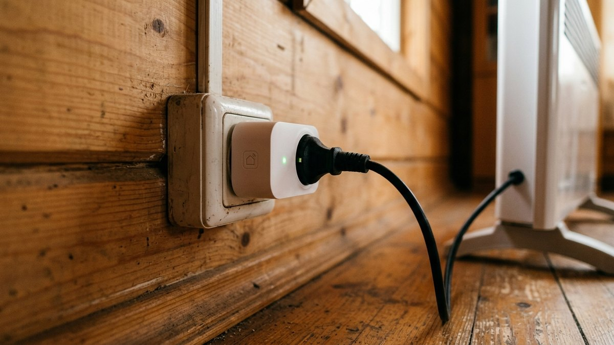
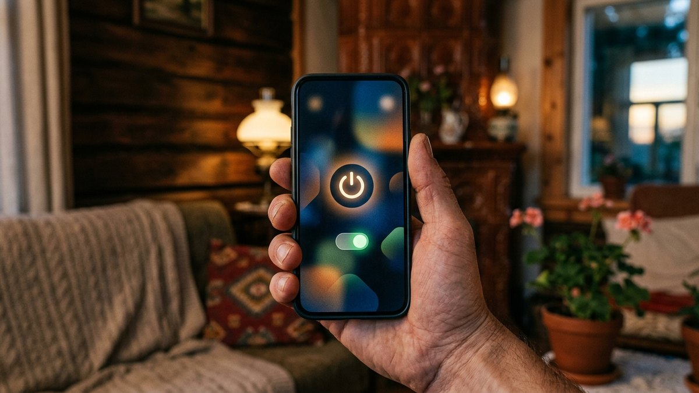
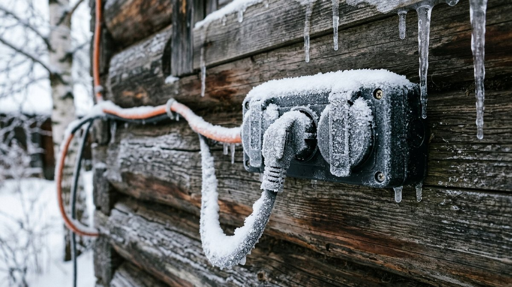
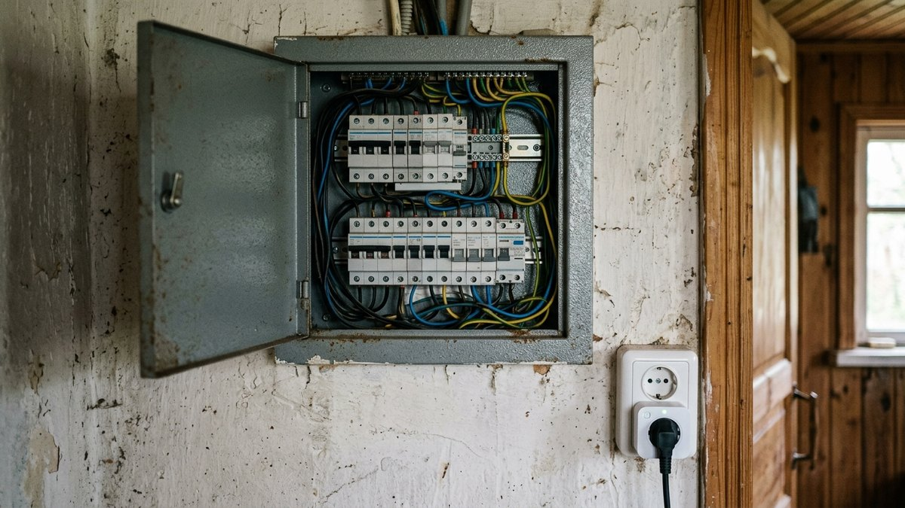
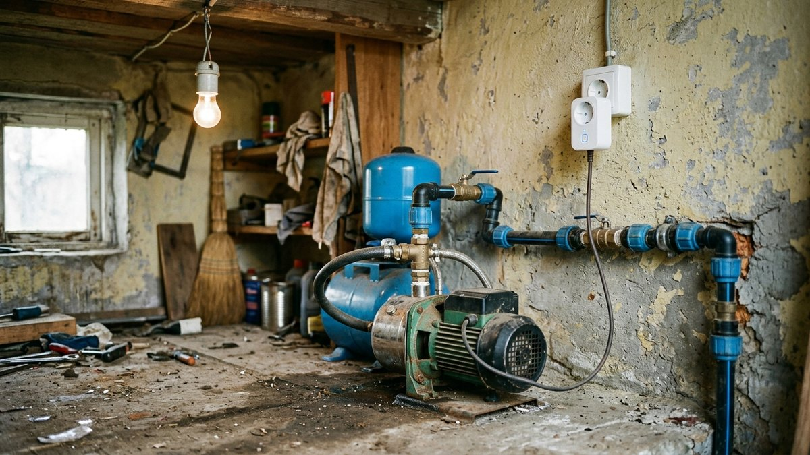
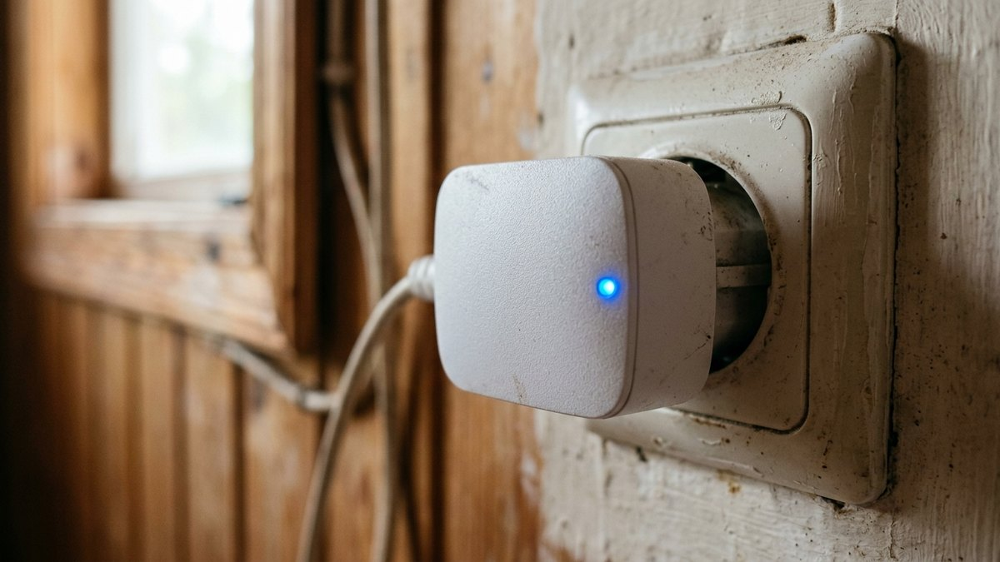

Главный сценарий, ради которого дачники берут умную розетку, — включить обогреватель по дороге, чтобы к приезду в доме уже было тепло. Работает это далеко не всегда так гладко, как в рекламе: у розетки есть реальные минусы, которые вылезают именно на даче — на морозе, при нестабильном интернете и через пару лет эксплуатации. Разберём и то, и другое честно, а не только сильные стороны.

## Что такое умная розетка и при чём тут отопление

Умная розетка — это переходник со своим Wi-Fi-модулем: втыкается в обычную розетку, а в неё уже включается прибор — обогреватель, конвектор, тёплый пол, бойлер. Через приложение на телефоне можно включить и выключить прибор удалённо, поставить расписание или таймер, а некоторые модели ещё и показывают, сколько прибор потребляет энергии.

Для дачи типичный сценарий — включить обогрев за час-два до выезда, чтобы не мёрзнуть первые полчаса после приезда и не топить дом с нуля весь вечер. Это единственная причина, ради которой большинство дачников вообще берёт умную розетку, а не просто механический таймер.

## Минусы, о которых не пишут в рекламе

Три вещи, с которыми на практике сталкивается почти каждый, кто держит умную розетку на неотапливаемой зимой даче.

**Теряет связь на морозе.** Электроника в дешёвых розетках рассчитана не на самый широкий температурный диапазон, а дом между визитами зимой не отапливается — розетка висит при минусовой температуре неделями. По личному опыту: именно в морозы розетка чаще всего отваливается от Wi-Fi и перестаёт отвечать в приложении — то есть ровно тогда, когда удалённое включение отопления нужнее всего, оно с наибольшей вероятностью не сработает.

**Через пару лет перестаёт работать.** Циклы «минус двадцать зимой — плюс двадцать пять на солнце летом» и постоянная нагрузка от обогревателя изнашивают реле и электронику внутри розетки быстрее, чем в квартире с ровной температурой. На практике розетка редко ломается сразу — сначала начинает реже отвечать, потом перестаёт включаться удалённо совсем, оставаясь просто проходной розеткой.

**Встречаются жалобы на нагрев и возгорания.** Сам с этим не сталкивался, но в отзывах на маркетплейсах регулярно попадаются истории про оплавленный корпус или запах гари — почти всегда это дешёвые розетки без имени бренда, нагруженные близко к паспортному пределу мощным прибором (обогреватель, чайник, бойлер) на много часов подряд. Игнорировать это нельзя: ниже — конкретно, что делает такую ситуацию менее вероятной.

## Как выбирать, чтобы минусы не превратились в проблему

- **Оставляйте запас по мощности.** Если обогреватель на 2 кВт, розетка с паспортным пределом 2,5–3 кВт будет работать на пределе часами — грейтесь безопаснее с запасом минимум в полтора раза. Расчёт под конкретный прибор — в калькуляторе ниже.
- **Не берите ноунейм для мощной нагрузки.** Для лампочки или чайника на 10 минут разница некритична, для обогревателя, который работает часами без присмотра, — нет: экономия в 500 рублей того не стоит.
- **Проверьте поведение при потере интернета.** У части моделей при обрыве связи с сервером розетка сбрасывается в выключенное состояние, у других — держит последнее заданное. Для отопления на удалённой даче со слабой сетью (а сеть в СНТ часто именно такая — подробнее в статье [«Какой стабилизатор напряжения выбрать»](https://mir-doma.pro/kakoy-stabilizator-napryazheniya-vybrat/)) второй вариант надёжнее.
- **Проверьте поведение при отключении электричества.** После скачка напряжения или временного отключения важно, чтобы розетка вернулась в прежнее состояние сама, а не ждала ручного включения через приложение, до которого вы доберётесь только на следующих выходных.
- **Wi-Fi или Zigbee.** Wi-Fi-розетка работает от домашнего роутера напрямую — проще в настройке, но зависит от домашнего интернета. Zigbee устойчивее к помехам, но требует отдельного хаба, у которого тот же домашний интернет и есть точка отказа — принципиальной разницы для дачи с нестабильной связью это не даёт.

<!-- wp:html -->

  
Калькулятор запаса мощности — сколько должна выдерживать розетка под ваш прибор

  <label class="md-calc__label" for="mdScW">Мощность прибора, Вт</label>
  <input type="number" id="mdScW" class="md-calc__input" min="100" step="50" placeholder="например, 2000">
  
Введите мощность прибора

<!-- /wp:html -->

## Как пользоваться безопаснее

- Первое включение нового прибора через розетку проконтролируйте лично — не уезжайте сразу, посмотрите, что всё работает штатно.
- Периодически проверяйте саму розетку на ощупь после нескольких часов работы под нагрузкой — заметный нагрев корпуса это повод её заменить, а не игнорировать.
- Умная розетка не заменяет автомат защиты линии — если проводка в доме старая, сначала актуальна она, розетка тут ничего не решает. Разбор проводки — в статье [«Схема электропроводки на даче»](https://mir-doma.pro/skhema-elektroprovodki-na-dache/).
- Для мощных обогревателей смотрите на класс защиты и то, что реально пишет производитель в паспорте, а не на маркетинговое «до 3600 Вт» на упаковке — какой обогреватель и с каким запасом выбрать под конкретную площадь, разобрано в статье [«Какой обогреватель выбрать для дачи»](https://mir-doma.pro/kakoy-obogrevatel-vybrat-dlya-dachi/).

## Что ещё умеет умная розетка на даче, кроме отопления

- Включить насос водоснабжения за полчаса до приезда, чтобы вода в системе была под давлением сразу.
- Отключить забытый утюг или зарядку удалённо, не переживая всю дорогу до дачи.
- В связке с видеонаблюдением — увидеть в камере, что прибор действительно включился, а не полагаться на статус в приложении; как настроить камеры на даче, разобрано в статье [«Видеонаблюдение на даче своими руками»](https://mir-doma.pro/videonablyudenie-na-dache-svoimi-rukami/).
- Если домашний интернет на участке нестабилен и умная розетка регулярно отваливается от сети, GSM-сигнализация с управлением по SMS не зависит от домашнего Wi-Fi вообще — сравнение подходов в статье [«GSM-сигнализация для дачи своими руками»](https://mir-doma.pro/gsm-signalizaciya-dlya-dachi-svoimi-rukami/).

## Частые ошибки

- **Брать самую дешёвую розетку под мощный обогреватель.** Экономия на розетке за 500–1000 рублей не стоит риска нагрева при многочасовой нагрузке.
- **Не проверять поведение при потере связи и электричества.** Узнать об этом на морозе в момент, когда розетка не включила отопление, — худший момент для сюрприза.
- **Уезжать сразу после первого подключения нового прибора.** Первый запуск стоит проконтролировать лично, а не по статусу в приложении.
- **Считать умную розетку заменой нормальной проводки и автомата.** Она управляет включением, а не защищает линию.

## Частые вопросы

### Почему умная розетка теряет Wi-Fi на морозе?

Электроника бюджетных моделей не рассчитана на широкий температурный диапазон, а дом между визитами зимой не отапливается — розетка неделями работает при минусовой температуре, и модуль связи может отваливаться от сети. Для дачи стоит искать модели с явно указанным рабочим диапазоном температур, а не полагаться на среднюю розетку «для квартиры».

### Сколько служит умная розетка на даче?

На практике меньше, чем в квартире, — из-за перепадов температуры и постоянной нагрузки от обогревателя срок службы часто ограничивается парой сезонов, после чего розетка начинает реже отвечать на команды, а затем перестаёт включаться удалённо совсем.

### Правда ли, что умные розетки могут гореть?

В отзывах на маркетплейсах такие случаи встречаются, почти всегда у дешёвых розеток без бренда при многочасовой нагрузке близко к паспортному пределу. Риск снижается запасом мощности минимум в полтора раза от нагрузки прибора и периодической проверкой розетки на нагрев на ощупь.

### Можно ли подключить обогреватель через умную розетку?

Можно, если паспортная мощность розетки минимум в полтора раза выше мощности обогревателя. Для приборов свыше 3,5 кВт умная розетка уже не подходит — нужна отдельная защищённая линия с автоматом.

### Что выбрать для дачи: Wi-Fi или Zigbee умную розетку?

Для дачи принципиальной разницы нет — Wi-Fi-розетка зависит от домашнего роутера, Zigbee зависит от хаба, который тоже подключён к тому же домашнему интернету. Разница в стабильности связи на даче определяется в первую очередь качеством самого интернета на участке, а не протоколом розетки.

### Держит ли умная розетка состояние при отключении электричества?

Зависит от модели — уточняйте это до покупки, а не после. Для сценария с удалённым включением отопления важно, чтобы розетка сама возвращалась в прежнее состояние после скачка напряжения или временного отключения, а не ждала ручной команды через приложение.
