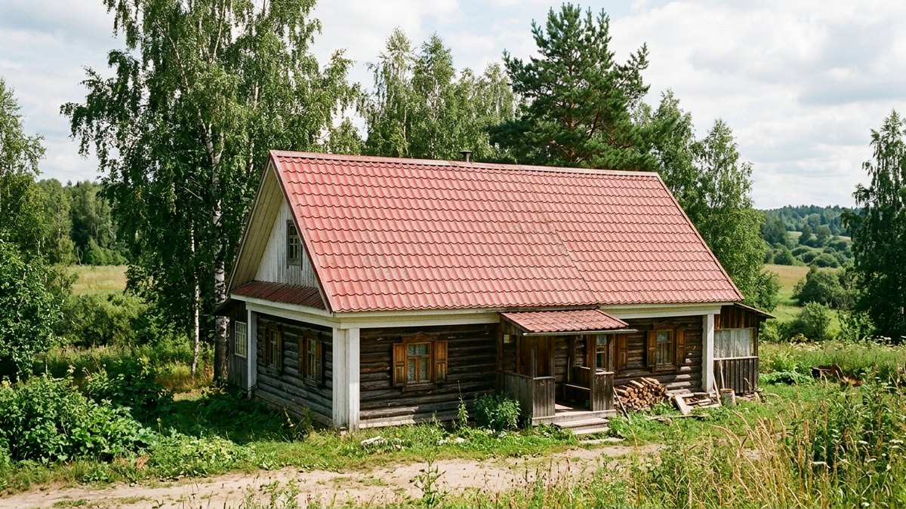
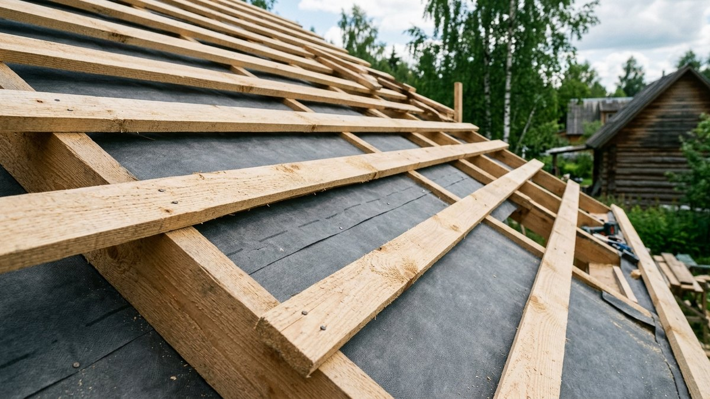
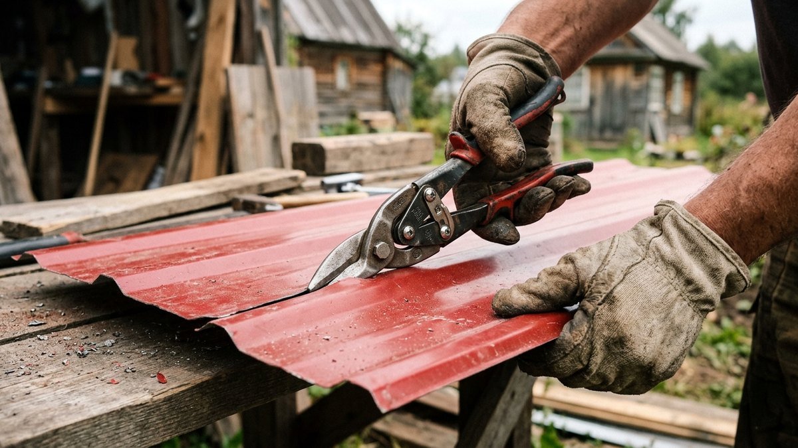
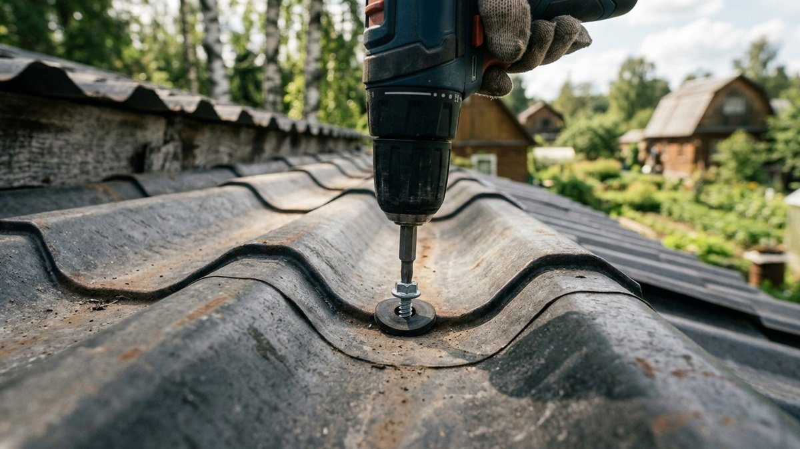
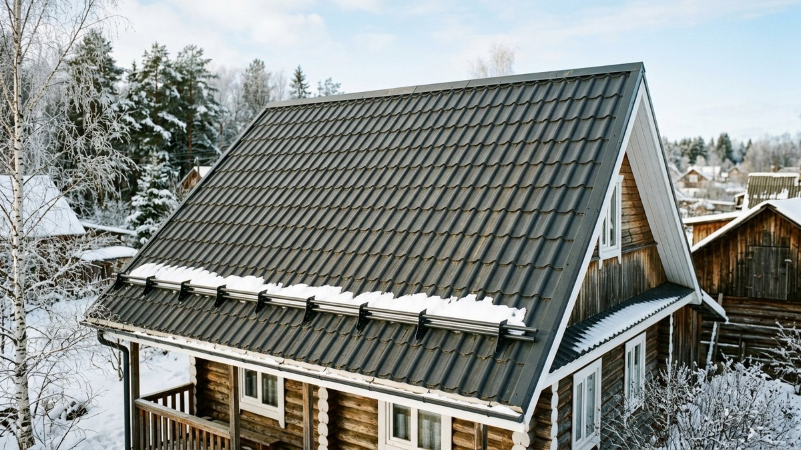
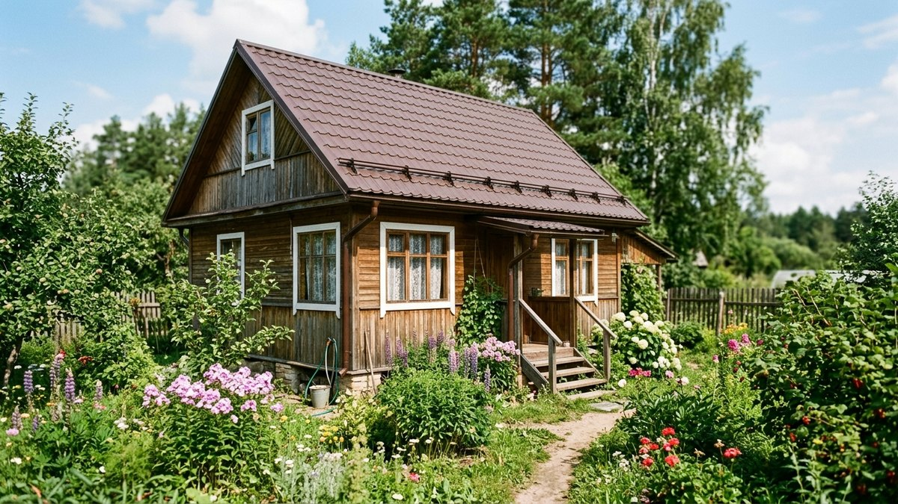

# Устройство кровли из металлочерепицы: пирог, обрешётка и монтаж пошагово

У металлочерепицы своя логика устройства кровли, и она заметно отличается
от профнастила, хоть оба материала — металл с полимерным покрытием.
Волна металлочерепицы формирует рисунок «под черепицу» с чётким шагом, и
именно под этот шаг подбирается обрешётка — сплошной лист или редкая
решётка профнастила здесь не подходят. Разберём кровельный пирог, шаг
обрешётки и монтаж пошагово от старта листа до доборных элементов.

## Кровельный пирог под металлочерепицу

Снизу вверх: стропила → пароизоляция (со стороны мансарды, если она
утеплена) → утеплитель между стропилами, если крыша тёплая → гидро-
ветрозащитная мембрана поверх стропил → контробрешётка для вентиляционного
зазора → обрешётка под шаг волны → металлочерепица. Вентиляционный зазор
между мембраной и обрешёткой обязателен даже на холодной кровле — без него
конденсат скапливается под листами и коррозия покрытия изнутри начинается
за несколько сезонов.

## Шаг обрешётки: главное отличие от профнастила

Обрешётка под металлочерепицу — не сплошная, но и не такая редкая, как под
профнастил: доски крепят с шагом, кратным шагу волны конкретного профиля
(чаще всего 30–40 см у ходовых профилей вроде «Монтеррей» или «Каскад») —
точный шаг всегда указан в паспорте на выбранную марку. Первую доску от
карниза ставят на 5 см ближе остальных — так капиллярная канавка листа
попадает точно на обрешётку и не провисает в воздухе. Сечение доски — от
32×100 мм, шаг проверяют по месту перед каждым рядом, а не только по общему
расчёту на весь скат. У профнастила логика другая — там обрешётка чаще и
проще, потому что лист жёстче держит форму сам по себе; устройство и
монтаж профнастила по шагам разобраны в статье [крыша из профнастила
своими руками](https://mir-doma.pro/krysha-iz-profnastila-svoimi-rukami/).

## Расчёт материала

Считают по площади ската с запасом 5–10% на подрезку, увеличивая запас до
15% на вальмовой или сложной кровле — там лист режется кратно волне и в
обрезки уходит заметно больше, чем на простой двускатной крыше. Отдельно
считают доборные элементы: конёк, ендовы, карнизную и торцевую планку,
снегозадержатели — их количество зависит от периметра и конфигурации ската,
а не от площади. Общая логика сравнения материалов и что дешёвый материал
даёт дорогую крышу из-за подрезки и доборов — в статье [чем покрыть крышу
дачи](https://mir-doma.pro/chem-pokryt-kryshu-dachi/).

## Инструменты

Ножницы по металлу или электролобзик с полотном по металлу для подрезки —
болгарка сжигает полимерное покрытие по кромке реза и провоцирует ржавчину
именно в месте среза. Шуруповёрт с ограничителем крутящего момента —
перетянутый саморез продавливает резиновую шайбу и течёт. Строительные
мостики или стремянка-траверса для ходьбы по уже смонтированным листам.

## Монтаж металлочерепицы пошагово

1. Смонтировать обрешётку по шагу волны, проверяя расстояние перед каждым
   рядом досок.
2. Установить карнизную планку и капельник по всему нижнему краю ската.
3. Уложить первый лист от торца, совместив с карнизом и торцевой планкой —
   именно он задаёт направление для всех следующих.
4. Крепить саморезы **в прогиб волны**, а не в гребень — на гребне вода
   скапливается и затекает под шляпку самореза; по краям листа крепят в
   каждую волну, в поле — через одну.
5. Укладывать следующие листы внахлёст на одну волну, выравнивая по
   карнизу на каждом ряду — лист, ушедший в перекос на старте, к коньку
   уводит всю кровлю в сторону.
6. Установить конёк, ендовы (если есть) и торцевые планки — под коньком
   ставится уплотнитель профиля, повторяющий волну листа, иначе под конёк
   задувает снег.
7. Смонтировать снегозадержатели и элементы безопасности до сдачи кровли —
   после укладки готового кровельного покрытия ходить по листам без
   мостиков уже нельзя.

## Доборные элементы

- **Карнизная планка** — защищает торец обрешётки и направляет воду в
  водосток. О самом водостоке — в статье [водосток своими
  руками](https://mir-doma.pro/vodostok-svoimi-rukami/).
- **Торцевая (ветровая) планка** — закрывает боковой край ската от
  задувания ветром и косым дождём.
- **Планка конька фигурная** — повторяет волну листа, под ней обязателен
  уплотнитель.
- **Ендовный узел** — нижняя и верхняя планка ендовы с подкладочным ковром
  между ними, самый уязвимый узел кровли по протечкам.

## Техника безопасности при монтаже

Металлочерепица тоньше и более гулкая под ногой, чем профнастил, а её
лицевой слой легко продавить точечным упором — ходить по уже уложенным
листам можно только по линии обрешётки, наступая рядом с волной, а не в
прогиб, и лучше по деревянным мостикам, распределяющим вес. Работа на
скате всегда со страховкой и в сухую погоду — влажное покрытие
металлочерепицы скользкое сильнее, чем шифер или ондулин.

## Частые ошибки

- **Сплошная обрешётка вместо шага под волну.** Перерасход досок и
  нарушение вентиляции подкровельного пространства без всякой пользы —
  металлочерепице сплошное основание не нужно.
- **Резка болгаркой.** Раскалённая окалина повреждает полимерное покрытие
  по всему листу, а не только в месте реза, и ржавчина начинается уже
  через один сезон дождей.
- **Крепление в гребень волны.** Вода не уходит и скапливается вокруг
  самореза — со временем это гарантированная протечка в этой точке.
- **Экономия на подкладочном ковре под ендовой.** Ендова — самый нагруженный
  водой узел кровли, и без ковра там протечёт в первый же ливень с боковым
  ветром.

## Частые вопросы

### Какой шаг обрешётки нужен под металлочерепицу

Шаг равен шагу волны конкретного профиля — чаще всего 30–40 см, но точное
значение всегда указано в техническом паспорте на выбранную марку листа.

### Можно ли резать металлочерепицу болгаркой

Не стоит — раскалённая окалина от диска сжигает полимерное покрытие по
кромке и провоцирует ржавчину. Правильный инструмент — ножницы по металлу
или электролобзик с полотном по металлу.

### В гребень или в прогиб волны крепят саморезы металлочерепицы

В прогиб волны, плотно к обрешётке — так же, как и у профнастила. На
гребне вода задерживается и со временем протекает через отверстие самореза.

### Нужен ли вентиляционный зазор под металлочерепицей на холодной кровле

Да, даже без утепления зазор между гидро-ветрозащитной мембраной и
обрешёткой нужен всегда — без него конденсат скапливается под листами и
коррозия покрытия начинается изнутри.

