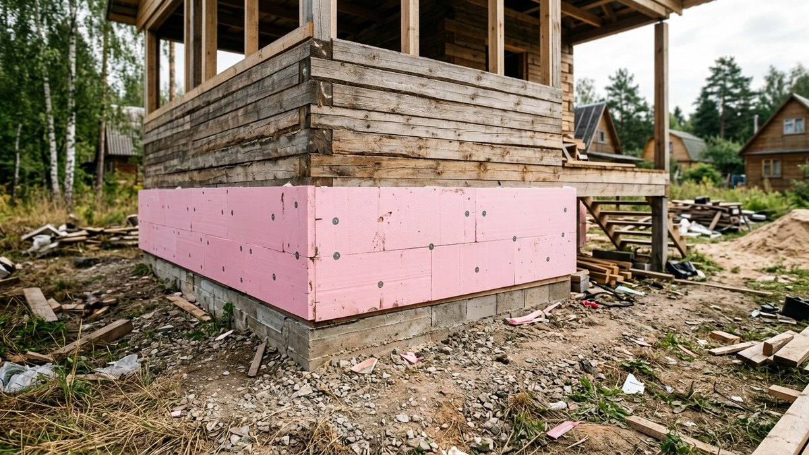
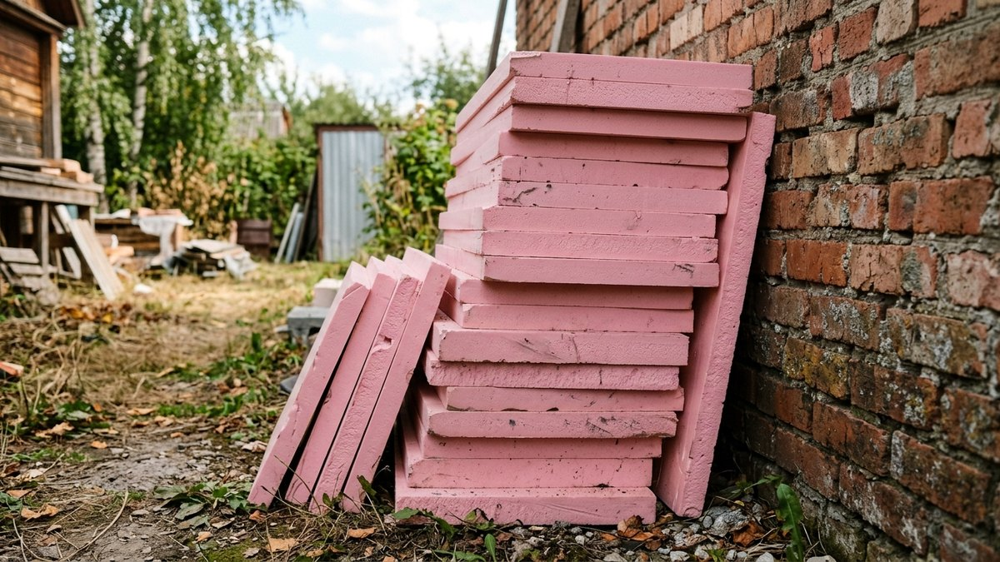
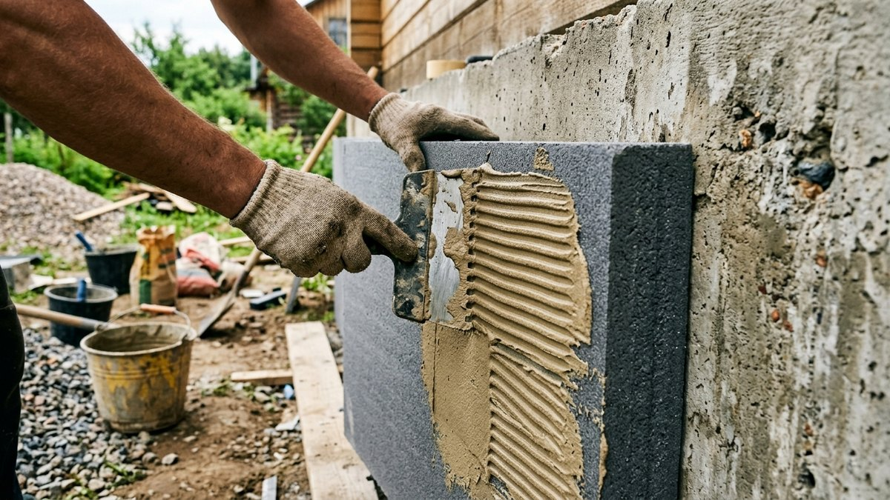
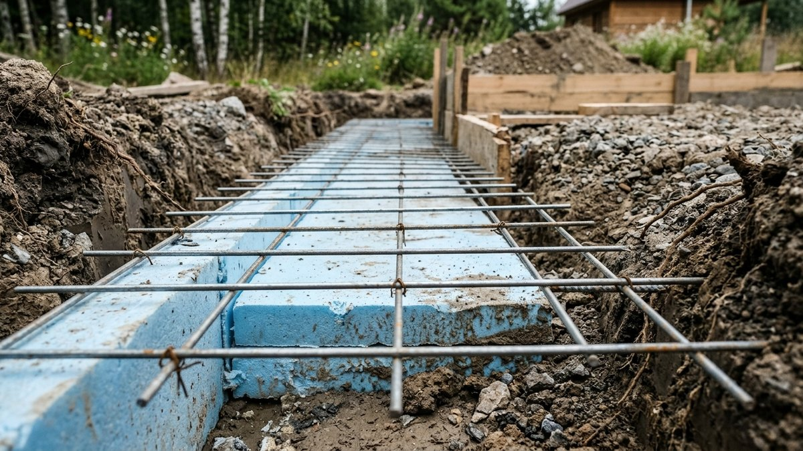
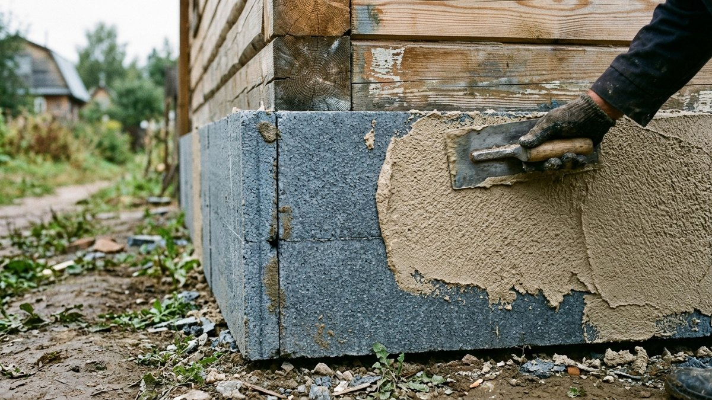
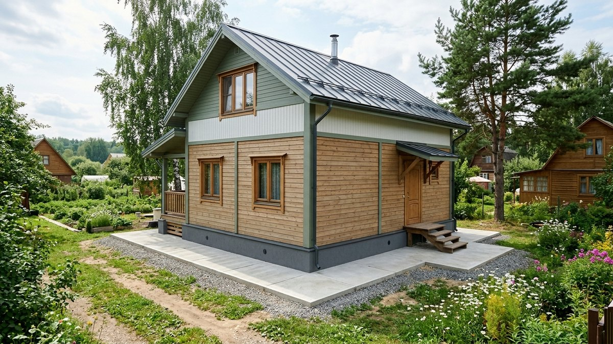

Через неутеплённый цоколь и верхнюю часть фундамента уходит заметная доля тепла первого этажа — холод поднимается снизу через плиту пола и промерзающую стену цоколя даже при утеплённых стенах дома. Разберём, как правильно утеплить цоколь пеноплексом снаружи: какой толщины брать плиты, чем клеить, как защитить утеплитель от влаги и грызунов и чем закрыть его сверху.

## Почему именно пеноплекс, а не минвата

Цоколь — самая влажная зона фундамента: на него попадают брызги от отмостки, талый снег, конденсат из грунта. Минеральная вата в таких условиях впитывает влагу и теряет теплоизоляционные свойства почти полностью, а экструдированный пенополистирол (пеноплекс, ЭППС) воду не впитывает и не боится прямого контакта с землёй. Именно поэтому для наружного утепления цоколя и фундамента используют только ЭППС, а не универсальные утеплители — этот же принцип уже разбирался применительно к стенам дома в статье про [утепление ППУ и других материалов](https://mir-doma.pro/uteplenie-ppu/).

## Какую толщину пеноплекса брать

Толщина зависит от климатической зоны и от того, отапливается ли дом зимой постоянно или наездами:

| Регион | Дом с зимним проживанием | Дачный дом с редкими наездами |
|---|---|---|
| Юг, тёплые зимы | 50 мм | 30–50 мм |
| Средняя полоса | 100 мм | 50–100 мм |
| Северные регионы, Урал, Сибирь | 100–150 мм | 100 мм |

Точный расчёт делают по сопротивлению теплопередаче для конкретного региона, но на практике для большинства дачных домов средней полосы достаточно плит толщиной 100 мм — это распространённый и хорошо доступный в продаже вариант.

<!-- wp:html -->

<h3 class="md-ck__title">Калькулятор пеноплекса, дюбелей и клея на цоколь</h3>

Нормы клея и дюбелей — усреднённые, уточняйте по инструкции конкретного производителя.

<label class="md-ck__f">Периметр цоколя, м<input type="number" id="ckPer" value="30" min="1" max="500" step="0.1"></label>
<label class="md-ck__f">Высота утепляемой части, м<input type="number" id="ckH" value="1" min="0.1" max="5" step="0.1"></label>
<label class="md-ck__f">Размер плиты
<select id="ckSize">
<option value="0.72" selected>1200×600 мм (0,72 м²)</option>
<option value="0.68">1180×580 мм (0,68 м²)</option>
<option value="2.0">2000×1000 мм (2,0 м²)</option>
<option value="custom">Свой размер</option>
</select></label>
<label class="md-ck__f" id="ckCustomWrap" hidden>Свой размер плиты, мм (Ш × Д)
<input type="number" id="ckCw" value="600" min="100" max="3000" step="1"><input type="number" id="ckCh" value="1200" min="100" max="3000" step="1"></label>
<label class="md-ck__f">Запас на подрезку, %<input type="number" id="ckRes" value="10" min="0" max="30" step="1"></label>
<label class="md-ck__f">Дюбелей на 1 м²<input type="number" id="ckDow" value="6" min="1" max="15" step="1"></label>
<label class="md-ck__f">Расход клея, кг/м²<input type="number" id="ckGlue" value="4.5" min="1" max="15" step="0.1"></label>
<label class="md-ck__f">Вес мешка клея, кг<input type="number" id="ckBag" value="25" min="1" max="50" step="1"></label>

Площадь цоколя<b id="ckArea">30,0 м²</b>

Плит без запаса<b id="ckRaw">42 шт</b>

Плит с запасом<b id="ckFin">47 шт</b>

Дюбелей<b id="ckDowels">180 шт</b>

Клея<b id="ckGlueKg">135 кг</b>

Мешков клея<b id="ckBags">6 шт</b>

Площадь считается по периметру и высоте без вычета оконных и дверных проёмов в цоколе — при их наличии вычтите площадь проёмов вручную.

<button type="button" id="ckCopy" class="md-ck__btn md-ck__btn--main">Скопировать результат</button>
<a id="ckVk" class="md-ck__btn md-ck__btn--vk" href="#" target="_blank" rel="noopener noreferrer">Поделиться ВКонтакте</a>
<a id="ckTg" class="md-ck__btn md-ck__btn--tg" href="#" target="_blank" rel="noopener noreferrer">Поделиться в Telegram</a>
<button type="button" id="ckShareNative" class="md-ck__btn" hidden>Поделиться…</button>
<button type="button" id="ckPrint" class="md-ck__btn">Печать</button>

<!-- /wp:html -->

## Порядок утепления цоколя пеноплексом

1. **Откопать траншею** вдоль фундамента на глубину утепляемой части — обычно 40–60 см ниже уровня земли, если утепляется ещё и верхняя часть подземной стены фундамента, а не только видимый цоколь.
2. **Очистить и просушить поверхность** от грязи, старой отделки и высолов.
3. **Обработать битумной мастикой или праймером** — это и гидроизоляция, и грунт для лучшей адгезии клея.
4. **Приклеить плиты пеноплекса** специальным клеем на битумной или полиуретановой основе (обычный цементный клей для пенополистирола на фундаменте не годится — он держит хуже во влажной зоне). Плиты клеят снизу вверх, вразбежку, стыки проклеивают монтажной пеной.
5. **Зафиксировать тарельчатыми дюбелями** дополнительно к клею — особенно в подземной части, где клей может ослабнуть при постоянной влажности грунта.
6. **Закрыть геотекстилем** зону утеплителя ниже уровня земли — защита от механического повреждения при засыпке и от корней растений.
7. **Засыпать траншею**, утрамбовывая грунт слоями.
8. **Отделать надземную часть** цоколя финишным материалом.

## Гидроизоляция и защита от грызунов

Перед утеплением цоколь обязательно гидроизолируют — без этого влага из грунта проникает под утеплитель и годами держит стену сырой, несмотря на пеноплекс сверху. Стандартная схема — обмазочная битумная гидроизоляция в два слоя до наклейки плит.

Отдельная проблема пеноплекса — мыши и полёвки любят прокладывать в нём ходы, особенно в подземной части. Металлическая сетка (оцинкованная, ячейка 5–10 мм), уложенная поверх утеплителя перед засыпкой или в его нижней части, перекрывает грызунам доступ и не даёт им проделывать тоннели вдоль фундамента.

## Чем закрыть пеноплекс сверху

Сам по себе пеноплекс разрушается под ультрафиолетом и не переносит механических нагрузок, поэтому надземную часть обязательно закрывают финишным материалом:

- **Цокольный сайдинг** — самый практичный вариант: не требует дополнительного армирования, монтируется на обрешётку.
- **Декоративная штукатурка по армирующей сетке** — классический «мокрый фасад», требует аккуратной подготовки, но выглядит как окрашенная стена.
- **Клинкерная плитка или искусственный камень** на специальном клее — самый долговечный и дорогой вариант.
- **Профлист** — бюджетно, но менее декоративно, чаще используют на хозяйственных постройках, а не на жилом доме.

## Утепление цоколя и общий тепловой контур дома

Утепление цоколя работает в связке с утеплением пола первого этажа и продухов — если утеплить только цоколь снаружи, а полы и вентиляцию подполья оставить как есть, эффект будет заметно слабее ожидаемого. Как выглядит утепление дома целиком и с чего начинать, если утепляете не только цоколь, разобрано в статье про [утепление дачного дома для зимнего проживания](https://mir-doma.pro/kak-uteplit-dachnyy-dom/). А расчёт бюджета на утепление всего дома, включая цоколь, стены и кровлю, — в статье про то, [сколько стоит утеплить дачный дом](https://mir-doma.pro/skolko-stoit-uteplit-dachnyy-dom/).

Если фундамент свайный, а не ленточный или монолитный — утеплять сплошной цоколь бессмысленно, там своя технология с забиркой и утеплённым полом; какой тип фундамента вообще выбрать под дом, разобрано в статье про [ленточный или свайный фундамент](https://mir-doma.pro/kakoy-fundament-vybrat-dlya-doma/).

Если дом уже стоит с готовой отмосткой и снаружи утеплить нельзя, остаётся
утепление подвала изнутри — там другой набор рисков (точка росы уходит в
стену, а не наружу) и другие требования к материалу и пароизоляции, разбор
— в статье [утепление подвала изнутри](https://mir-doma.pro/uteplenie-podvala-iznutri/).

## Частые ошибки

- **Клеили пеноплекс обычным цементным клеем.** Во влажной подземной зоне такой клей теряет адгезию за один-два сезона, и плиты начинают отходить.
- **Пропустили гидроизоляцию перед утеплением.** Влага из грунта проникает под пеноплекс и годами держит цоколь сырым изнутри, хотя снаружи всё выглядит сухим.
- **Не защитили утеплитель от грызунов.** Мыши прокладывают ходы вдоль всего цоколя за одну зиму, и утепление теряет смысл.
- **Оставили пеноплекс без финишной отделки.** Ультрафиолет разрушает поверхность плит за один сезон, а первый удар или зацеп проламывает материал.
- **Утеплили только цоколь, забыв про отмостку.** Без утеплённой отмостки вода и холод всё равно подходят к фундаменту сбоку, снижая эффект утепления цоколя.

## Частые вопросы

### Нужно ли утеплять цоколь, если дом используется только летом?

Если дом не отапливается зимой, утепление цоколя не критично для комфорта, но всё равно полезно: оно снижает промерзание фундамента и защищает его от разрушения при частых циклах замерзания-оттаивания влажного грунта.

### Можно ли утеплять цоколь пенопластом вместо пеноплекса?

Не рекомендуется: обычный пенопласт (ПСБ) впитывает влагу и разрушается при контакте с грунтом заметно быстрее экструдированного пенополистирола. Разница в цене между материалами не окупает разницу в сроке службы под землёй.

### На какую глубину нужно утеплять фундамент?

Как правило, утепляют цоколь и верхние 40–60 см фундамента ниже уровня земли — этого достаточно, чтобы отсечь основной путь промерзания к плите пола. Полное утепление фундамента на всю глубину закладки делают редко, только в регионах с очень суровыми зимами.

### Сколько слоёв клея нужно для приклейки пеноплекса?

Клей наносят точечно-полосовым способом на плиту: по периметру сплошной полосой и несколькими точками в центре — так остаётся вентиляционный зазор и обеспечивается нужная площадь контакта с поверхностью, обычно не менее 40%.

### Что делать, если утепление цоколя планируется на уже готовый дом с отмосткой?

Отмостку придётся частично демонтировать вдоль цоколя, чтобы получить доступ к стене фундамента и уложить утеплитель, а после — восстановить с новым утеплённым слоем ЭППС под её основанием.

## Заключение

Утепление цоколя пеноплексом снаружи — это гидроизоляция, приклейка и дюбелирование плит нужной толщины, защита от грызунов сеткой и обязательная финишная отделка сверху. В связке с утеплённой отмосткой и полом первого этажа эта работа снимает значительную часть теплопотерь дома через самый холодный узел — стык фундамента с землёй.
