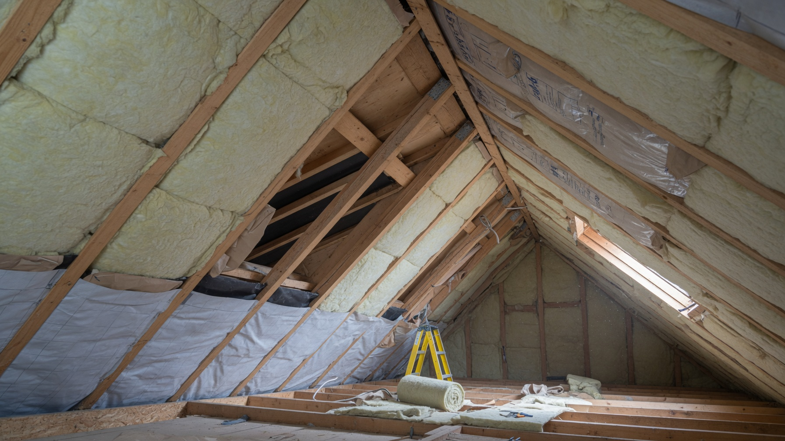
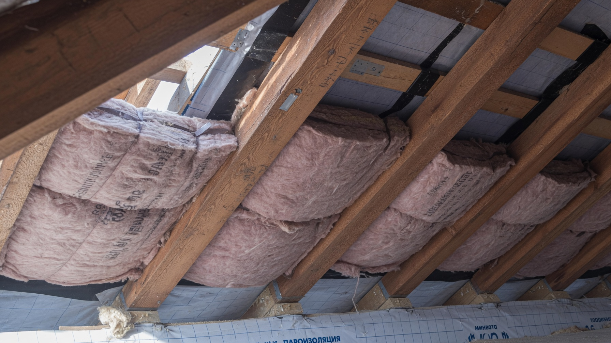
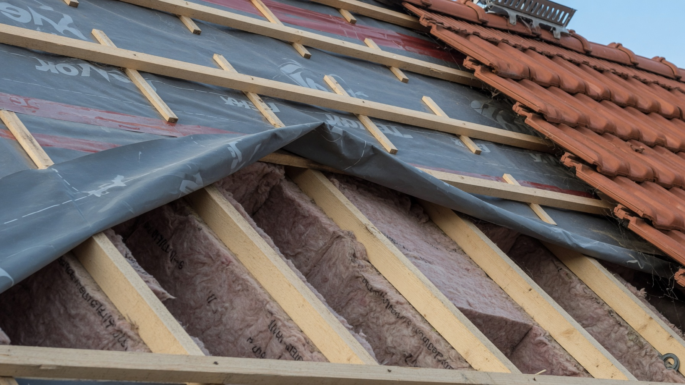
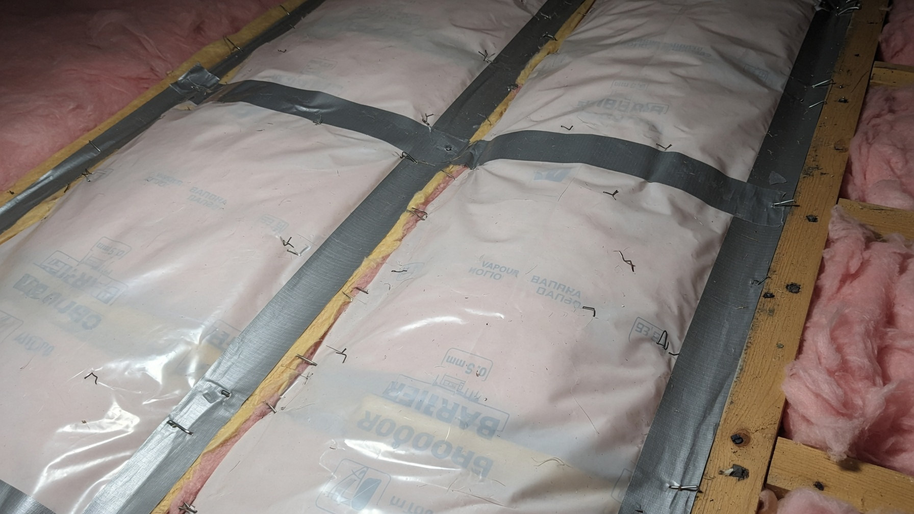
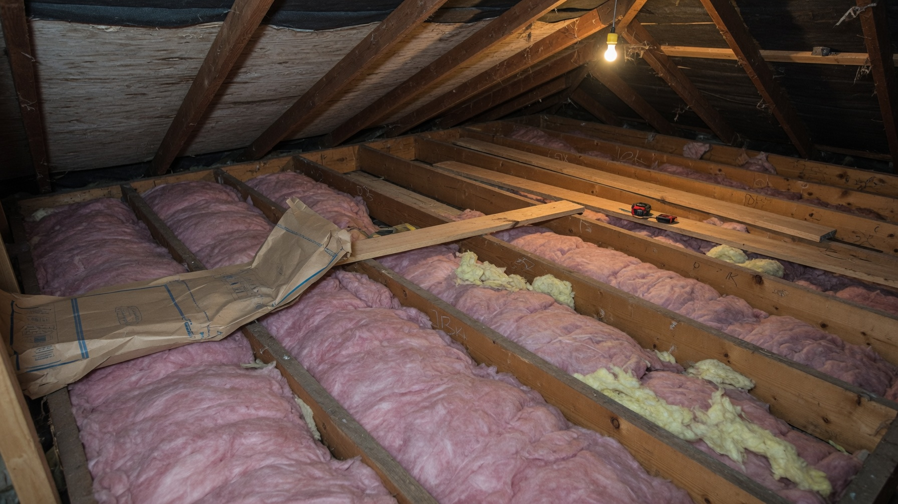
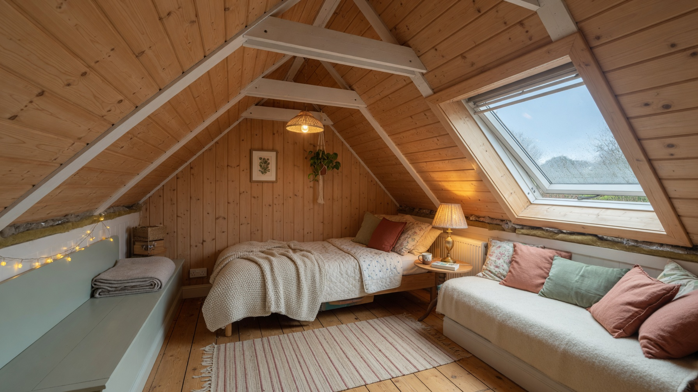

Тёплый воздух поднимается вверх, поэтому именно через крышу и потолок дом теряет больше всего тепла — до четверти и больше. Но утепление крыши — не просто «набить ваты между стропилами»: тут легко испортить всю конструкцию, если перепутать плёнки или забыть про вентзазор. Разберём, как утеплить крышу и мансарду дачного дома: что утеплять — потолок или скаты, чем, какой толщины и как правильно собрать кровельный пирог.

## 🔀 Что утеплять: потолок или скаты

Это первая развилка, и ошибка здесь стоит дорого. Всё зависит от того, жилой у вас чердак или нет:

- **Холодный чердак (нежилой).** Утепляют **перекрытие** — то есть пол чердака (он же ваш потолок). Скаты крыши при этом **не утепляют**: чердак остаётся холодным и проветривается, а тепло держится внизу, в жилой части.
- **Мансарда (жилой чердак).** Утепляют **скаты крыши** — утеплитель укладывают между стропилами, а сам чердак становится тёплым помещением.

Типичная ошибка — утеплить скаты, оставив чердак нежилым и холодным. Тогда вы греете пустой чердак, а тепло из комнат всё равно уходит через неутеплённое перекрытие. Утеплять нужно **что-то одно** — по границе тёплого контура дома.

## 🧰 Чем утеплить крышу

- **Минеральная вата** — основной выбор для скатов: держится в распор между стропилами, паропроницаема, негорюча. Требует защиты от влаги плёнками.
- **Эковата** — задувная, заполняет полости бесшовно, «дышит»; нужна техника.
- **Пенополиуретан (ППУ)** — напыляется сплошным слоем, идеален для сложной геометрии со стропилами и не требует плёнок, но дорог и наносится бригадой. Подробнее — в статье про [утепление ППУ](https://mir-doma.pro/uteplenie-ppu/).
- **Керамзит, опилки** — старые способы для **перекрытия** холодного чердака: дёшево, негорюче (керамзит), но слой нужен толстый.
- **Пенопласт и ЭППС** — годятся для перекрытия, но **для скатов не рекомендуются**: не пропускают пар, горючи и оставляют щели у стропил, через которые уходит тепло.

## 📏 Какая нужна толщина

Крышу утепляют **толще, чем стены** — именно вверх уходит тепло активнее всего. Ориентиры для средней полосы:

- **скаты мансарды** — 150–200 мм минваты (в северных регионах больше);
- **перекрытие холодного чердака** — 200–250 мм и более: тут ограничений по толщине нет, слой можно смело увеличивать.

На потолке экономить бессмысленно — это самое выгодное вложение в тепло. Если толщины стропил не хватает, их наращивают дополнительными брусками, чтобы уместить нужный слой.

## 🥪 Кровельный пирог мансарды

Порядок слоёв **изнутри наружу** (запомнить проще так: «пар не пускаем изнутри, влагу выпускаем наружу»):

1. **Внутренняя отделка** (вагонка, гипсокартон).
2. **Вентзазор** — обрешётка 2–3 см между отделкой и пароизоляцией.
3. **Пароизоляция** — плёнка со стороны тёплого помещения, стыки обязательно проклеены лентой.
4. **Утеплитель** между стропилами, плотно, враспор, без щелей.
5. **Гидро-ветрозащитная мембрана** (супердиффузионная) — пропускает пар из утеплителя наружу, но не пускает воду внутрь.
6. **Вентзазор** — контробрешётка 3–5 см между мембраной и кровлей.
7. **Обрешётка и кровельное покрытие.**

Обратите внимание: **вентзазора в пироге два** — под отделкой и под кровлей. Верхний особенно важен: через него уходит влага, вышедшая из утеплителя, и подкровельный конденсат. Без него вата намокает, а стропила гниют.

## 🌬️ Пароизоляция: почему без неё всё сгниёт

Пар из дома (от дыхания, готовки, стирки) поднимается вверх и стремится наружу. Если он свободно войдёт в утеплитель и упрётся в холодную кровлю — выпадет конденсатом.

Последствия предсказуемы: **мокрая вата не греет** (её теплопроводность резко растёт), стропила и обрешётка начинают гнить, на потолке появляются пятна и плесень.

Поэтому:

- **пароизоляция — всегда снизу**, со стороны тёплого помещения;
- **мембрана — сверху**, со стороны холода;
- **стыки пароизоляции проклеиваются** специальной лентой, а не «внахлёст на глазок»;
- плёнки нельзя менять местами: пароизоляция сверху запрёт влагу в утеплителе.

## 🪜 Утепление чердачного перекрытия

Если чердак холодный, всё проще и дешевле:

1. Со стороны комнаты (снизу) — **пароизоляция**.
2. Между балками перекрытия — **утеплитель** (минвата, эковата, керамзит), плотно и без щелей.
3. Сверху — при необходимости ветрозащита; чердак при этом должен **проветриваться** (слуховые окна, продухи).
4. Для передвижения по чердаку кладут мостки или настил — но **не приминая утеплитель**: спрессованная вата теряет свойства.

И обязательно **утеплите чердачный люк** — через него уходит масса тепла, а сам люк часто остаётся тонкой фанеркой. Его утепляют и снабжают уплотнителем по периметру.

## ❌ Частые ошибки

- **Перепутали плёнки местами** — пароизоляция оказалась сверху, влага заперта в утеплителе.
- **Нет вентзазора под кровлей** — конденсат остаётся внутри, стропила гниют.
- **Щели у стропил** — утеплитель уложен неплотно, тепло уходит по краям. Резать вату нужно на 1–2 см шире шага стропил, чтобы она встала враспор.
- **Утеплитель примяли** — сжатая минвата греет намного хуже.
- **Тонкий слой** — на крыше экономия особенно бессмысленна.
- **Утеплили скаты при холодном чердаке** — греете улицу.
- **Забыли про люк** — «дыра» в утеплённом потолке.
- **Утепляли по сырой конструкции** — влагу «запечатали» внутри.

## ❓ Частые вопросы

**Чем лучше утеплить крышу дачного дома?**
Для скатов мансарды — минеральной ватой (или эковатой, ППУ). Для перекрытия холодного чердака подойдут также керамзит и другие сыпучие утеплители. Пенопласт для скатов не рекомендуется.

**Какая толщина утеплителя нужна для крыши?**
В средней полосе — 150–200 мм для скатов мансарды и 200–250 мм и более для чердачного перекрытия. Крышу утепляют толще, чем стены.

**Что утеплять — потолок или скаты крыши?**
Если чердак нежилой и холодный — перекрытие (потолок). Если чердак жилой (мансарда) — скаты. Утеплять и то, и другое не нужно: тёплый контур должен быть один.

**Нужна ли пароизоляция при утеплении крыши?**
Обязательно, со стороны тёплого помещения, с проклейкой стыков. Без неё пар из дома попадёт в утеплитель, выпадет конденсатом, вата намокнет и перестанет греть, а стропила начнут гнить.

**Можно ли утеплить крышу изнутри, не разбирая кровлю?**
Да, для мансарды это стандартный способ: утеплитель укладывают между стропилами изнутри, снизу — пароизоляция и отделка. Важно, чтобы под кровлей были гидроизоляция и вентзазор.

**Можно ли утеплять крышу пенопластом?**
Для скатов нежелательно: он не пропускает пар, горюч, и между жёсткими плитами и стропилами остаются щели-мостики холода. Для перекрытия холодного чердака применять можно.

**Нужно ли утеплять чердачный люк?**
Обязательно. Неутеплённый люк — это дыра в тёплом контуре: тепло уходит через него, а на нём самом образуется конденсат. Люк утепляют и ставят уплотнитель.

---

Утепление крыши — самое выгодное вложение в тепло дома, но и самое требовательное к технологии. Определитесь, где проходит тёплый контур (перекрытие или скаты), не жалейте толщины, не путайте плёнки местами и обязательно оставьте вентзазоры — тогда утеплитель будет сухим и прослужит десятилетия. Остальные узлы разобраны отдельно: [чем утеплить стены снаружи](https://mir-doma.pro/uteplenie-sten-snaruzhi/) и общий план — [утепление дачного дома](https://mir-doma.pro/kak-uteplit-dachnyy-dom/). А если кровля подтекает, сначала устраните течь — об этом в статье про [ремонт крыши](https://mir-doma.pro/remont-kryshi-na-dache/).
