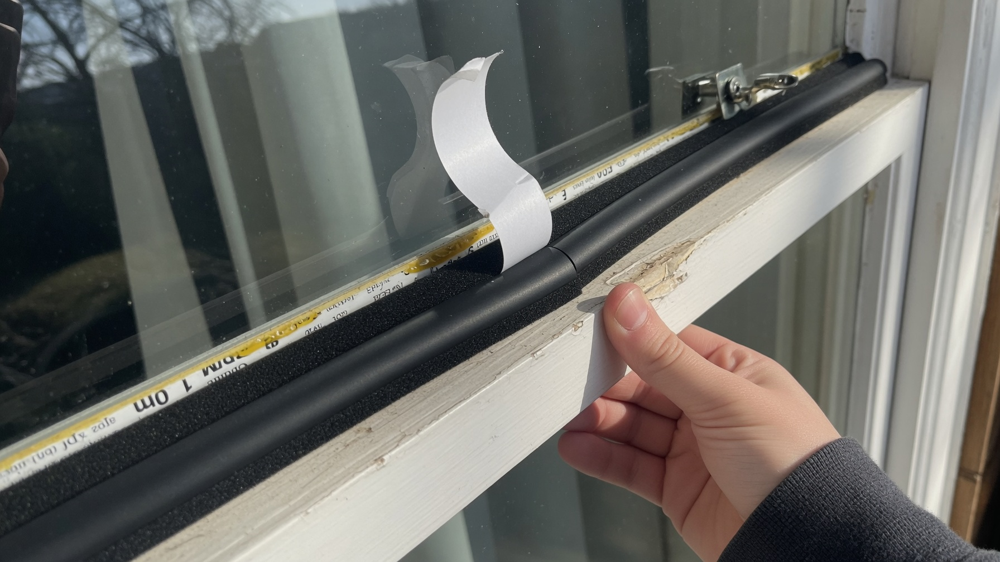
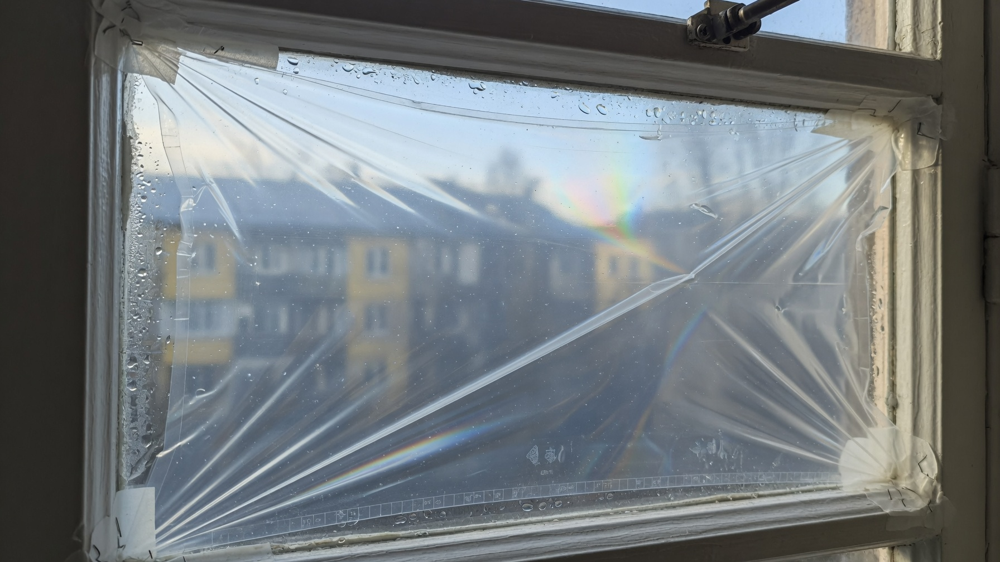
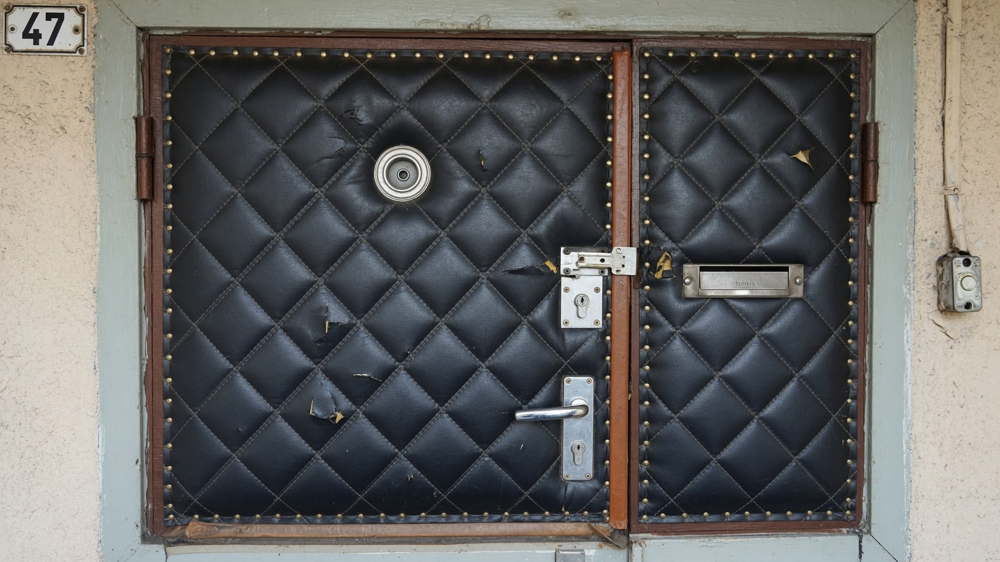
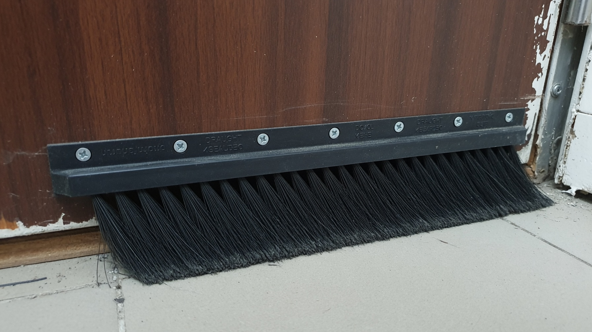

Окна и двери — самое слабое место дачного дома: через щели в старых рамах и по периметру двери уходит до пятой части тепла. И это тот редкий случай, когда серьёзный результат достигается копеечными средствами за один выходной — не нужны ни бригада, ни фасадные работы. Разберём, как утеплить окна и двери на даче на зиму: где искать сквозняки, чем заделать щели, какие уплотнители работают и что даёт максимальный эффект.

## 🔎 Сначала найдите сквозняки

Утеплять вслепую бессмысленно — сперва определите, откуда именно дует. Самый простой способ: пронесите вдоль рамы **зажжённую свечу или зажигалку** — там, где пламя колышется, есть щель. Подойдёт и мокрая ладонь: она чувствует поток холодного воздуха.

Проверять нужно не только створки:

- притвор (место, где створка прилегает к раме);
- стык стекла и рамы (штапики, замазка);
- **откосы и монтажный шов** — щель между рамой и стеной;
- подоконник снизу — частый источник холода;
- порог и низ двери;
- петли и замок.

Очень часто выясняется, что дует не само окно, а **щель вокруг него**, — и тогда заклеивать створки бесполезно.

## 🪟 Утепление деревянных окон

Классика дачи — старые деревянные рамы. Вот что с ними делать, от долговечного к сезонному:

**Уплотнитель по притвору.** Самоклеящаяся резиновая или силиконовая лента, наклеенная по контуру створки. Дёшево, ставится за час, окно при этом **продолжает открываться**. Поролоновые уплотнители дешевле, но живут один сезон.

**Заделка щелей между стеклом и рамой.** Старая замазка растрескивается — её удаляют и наносят новую или силиконовый герметик, при необходимости подбивают штапики.

**Заделка щелей между рамой и стеной.** Крупные зазоры задувают монтажной пеной, мелкие — герметиком, затем закрывают откосами (пену обязательно защитить от солнца — на УФ она разрушается).

**Утепление «по-шведски»** — в створке фрезеруют паз и вставляют трубчатый уплотнитель. Самый долговечный вариант: держится годами, окно открывается, продувание уходит почти полностью.

**Сезонная заклейка.** Проверенный дедовский способ: щели забивают ватой, поролоном или бумагой и заклеивают бумажными лентами, малярным скотчем или тканью. Дёшево и эффективно, но окно до весны **не откроется**, а при снятии скотч может повредить краску.

## 🎞️ Теплосберегающая плёнка

Отдельно стоит упомянуть энергосберегающую плёнку — дешёвый способ получить эффект «третьего стекла». Плёнку натягивают на раму (обычно на двусторонний скотч) и прогревают феном, чтобы она разгладилась и натянулась.

Между плёнкой и стеклом образуется **воздушная камера**, которая заметно снижает теплопотери и убирает «холодное дыхание» от окна. Важно клеить на чистую сухую раму, иначе скотч отойдёт.

## 🔧 Пластиковые окна тоже дуют

Стеклопакет не гарантия тепла — со временем и он начинает продувать:

- **Переведите фурнитуру в «зимний режим».** У большинства окон на торце створки есть эксцентрики (цапфы) — поворотом они усиливают прижим створки к раме. Летом прижим ослабляют обратно, чтобы уплотнитель не изнашивался.
- **Замените уплотнитель.** Резинка со временем дубеет, трескается и перестаёт держать. Меняется она просто, стоит недорого.
- **Проверьте откосы и монтажный шов.** Очень часто дует не окно, а щель между рамой и стеной — её герметизируют и закрывают откосами.

## 🚪 Утепление входной двери

Через дверь уходит много тепла, а холодный воздух тянет по полу.

- **Уплотнитель по периметру коробки** — первое и самое простое: самоклеящаяся лента по притвору полотна.
- **Обивка полотна** — классика для дачи: под дермантин (или другой материал) подкладывают поролон, изолон или войлок. Получается и теплее, и тише.
- **Утепление деревянной двери изнутри** — на полотно набивают каркас из бруска, закладывают минвату или пенопласт и обшивают. Эффективно для старых щитовых дверей.
- **Откосы и монтажный шов** — щель между коробкой и стеной задувают пеной и закрывают.

## 🧹 Щель под дверью и порог

Про низ двери забывают чаще всего, а именно оттуда тянет по ногам. Решения:

- **щёточный уплотнитель** (шлегель), прикрученный к нижней кромке полотна;
- **накладной или регулируемый порог**;
- **«колбаса»-утеплитель** — мягкий валик, который просто кладут к щели (самый простой временный вариант).

Зазор снизу должен быть минимальным, но дверь при этом должна свободно открываться.

## 🏠 Тамбур — самое эффективное решение

Если есть возможность, обустройте **тамбур или сени** — небольшое помещение перед входом. Это создаёт **воздушную прослойку**: холод с улицы не врывается сразу в дом, а гасится в тамбуре. Эффект от него больше, чем от любых уплотнителей.

Бюджетные варианты той же идеи — **вторая (внутренняя) дверь** или плотная тёплая штора-занавес на входе, отсекающая поток холодного воздуха.

## 📋 С чего начать: порядок действий

Чтобы получить максимум эффекта за минимум денег:

1. **Найдите щели** свечой — по окнам, откосам, подоконнику, двери и порогу.
2. **Заделайте щели** вокруг рам и коробок (пена, герметик) — это часто главный источник холода.
3. **Поставьте уплотнители** на створки и дверное полотно.
4. **Закройте низ двери** щёточным уплотнителем или порогом.
5. **Натяните плёнку** на окна, если рамы старые.
6. **Обустройте тамбур** или повесьте штору, если позволяет вход.

## ❌ Частые ошибки

- **Заклеили створки, забыв про откосы и подоконник** — дует по-прежнему, только уже мимо ваших усилий.
- **Загерметизировали всё наглухо** — дом перестал дышать: на окнах конденсат, в углах плесень. Проветривание должно остаться (хотя бы форточка или клапан).
- **Утеплили дверь, оставив щель под порогом** — холод продолжает тянуть по полу.
- **Плёнка на грязную раму** — скотч отходит через неделю.
- **Монтажная пена без защиты** — на солнце разрушается и крошится, её нужно закрывать.
- **Поролоновый уплотнитель «на века»** — он сминается за сезон; для долгой службы берите резиновый или трубчатый.

## ❓ Частые вопросы

**Чем утеплить деревянные окна на зиму?**
Самое эффективное — самоклеящийся резиновый уплотнитель по притвору плюс заделка щелей между рамой и стеной. Дополнительно натягивают теплосберегающую плёнку. Сезонный вариант — заклеить щели ватой и бумажными лентами.

**Как утеплить окна, чтобы они открывались?**
Использовать уплотнители (самоклеящиеся или трубчатые по шведской технологии), а не заклейку бумагой. Окно останется рабочим, а продувание уйдёт.

**Помогает ли теплосберегающая плёнка на окнах?**
Да, она создаёт дополнительную воздушную камеру и заметно снижает теплопотери, убирая холод от стекла. Это дешёвый способ, особенно для старых одинарных рам.

**Дует из пластикового окна — что делать?**
Перевести фурнитуру в зимний режим (повернуть эксцентрики на створке), заменить задубевший уплотнитель и проверить откосы: часто дует не окно, а монтажный шов вокруг него.

**Чем утеплить входную дверь на даче?**
Поставить уплотнитель по периметру, обить полотно поролоном или изолоном под дермантин, а щель под дверью закрыть щёточным уплотнителем или порогом.

**Как убрать щель под дверью?**
Прикрутить щёточный уплотнитель к нижней кромке полотна, установить накладной или регулируемый порог. Временно поможет мягкий валик-«колбаса».

**Нужен ли тамбур на даче?**
Тамбур или сени дают самый заметный эффект: воздушная прослойка не пускает холод в дом. Если строить его негде, помогут вторая дверь или плотная штора на входе.

---

Утепление окон и дверей — самая дешёвая и быстрая часть подготовки дачи к зиме: за один выходной и небольшие деньги вы убираете до пятой части теплопотерь. Начните со сквозняков, заделайте щели, поставьте уплотнители — и в доме сразу станет теплее. А капитальные работы разобраны отдельно: [чем утеплить стены снаружи](https://mir-doma.pro/uteplenie-sten-snaruzhi/), [утепление крыши и мансарды](https://mir-doma.pro/uteplenie-kryshi-i-mansardy/) и общий план — [утепление дачного дома](https://mir-doma.pro/kak-uteplit-dachnyy-dom/). В утеплённом доме и [печь](https://mir-doma.pro/pech-dlya-dachi/) греет совсем иначе.
