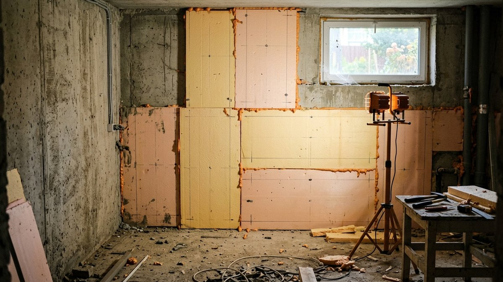
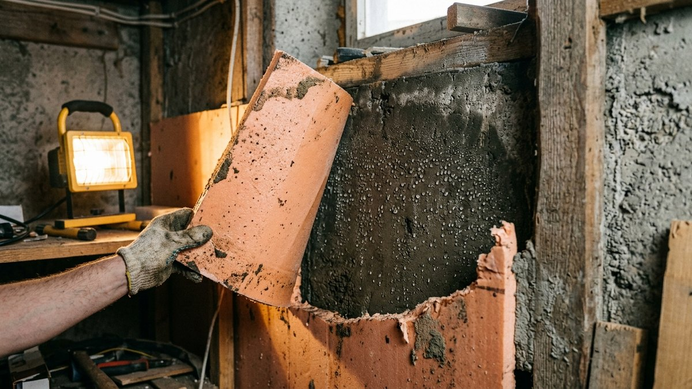
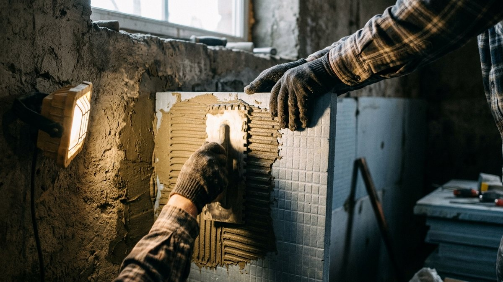
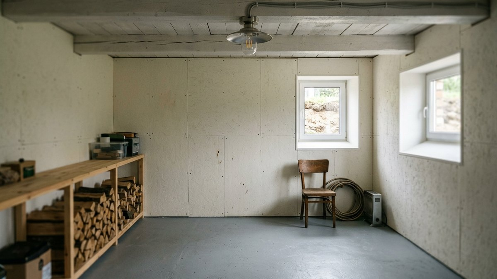
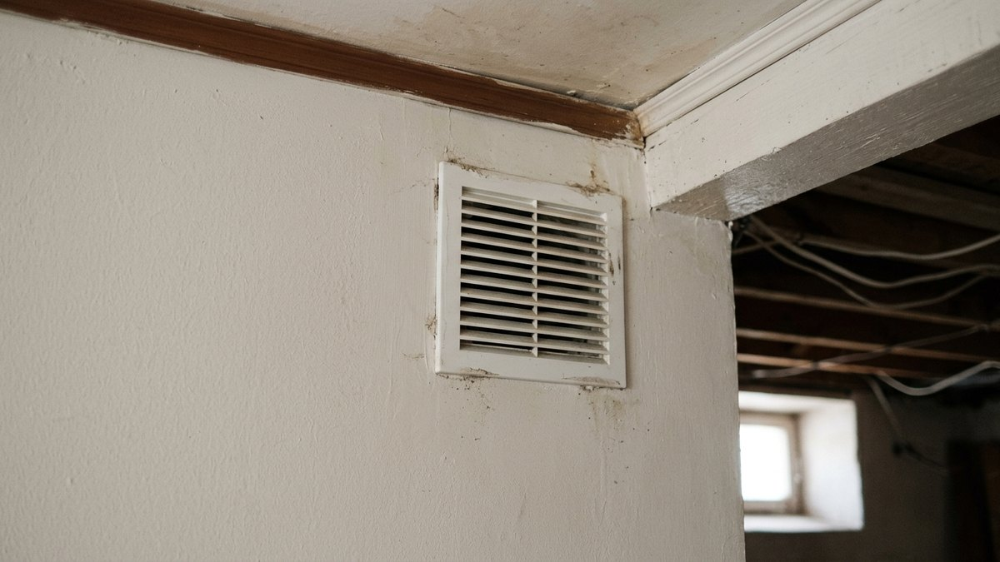
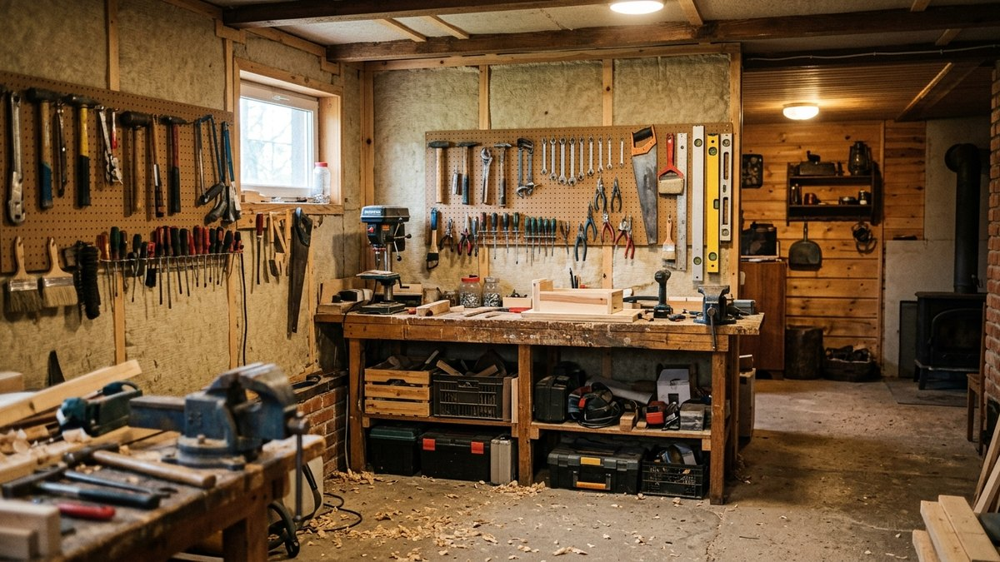

# Утепление подвала изнутри в частном доме: чем и как не развести плесень

Подвал частного дома — не то же самое, что погреб для хранения урожая:
погребу нужна вентиляция и холод, а подвал, который используют как
мастерскую, котельную, прачечную или кладовую с постоянным пребыванием
человека, нуждается в тепле. Если снаружи подвал утеплить уже нельзя —
дом стоит с готовой отмосткой и раскопки не входят в план, — остаётся
утепление изнутри. У него один серьёзный риск: точка росы смещается прямо в
стену, и без правильного материала и пароизоляции под утеплителем через
сезон заводится плесень. Разберём, как этого избежать.

## Сначала — можно ли утеплить снаружи

Утепление снаружи всегда предпочтительнее: точка росы уходит в толщу
утеплителя за пределами стены, и намокать там нечему. Если дом ещё
строится или отмостка не залита, разумнее утеплить фундамент и цоколь
снаружи — технология и толщина пеноплекса разобраны в статье [утепление
цоколя фундамента пеноплексом](https://mir-doma.pro/uteplenie-cokolya-fundamenta-penopleksom/).
Утепление изнутри — вынужденный вариант для уже готового дома, где
наружные работы невозможны или экономически не оправданы.

## Почему утепление изнутри рискованно

Когда утеплитель на внутренней стороне стены, холодный бетон снаружи и
тёплое помещение внутри создают точку росы прямо на границе утеплителя и
стены — если туда проникает водяной пар из воздуха помещения, он
конденсируется именно там, где его не видно и не просушить. Отсюда два
жёстких требования: утеплитель с закрытыми порами, который сам не
пропускает пар, и герметичная пароизоляция со стороны помещения без единой
щели.

## Чем утеплять: закрытые поры обязательны

- **Экструдированный пенополистирол (ЭППС, пеноплекс).** Сам по себе почти
  не пропускает пар, но все швы между плитами нужно проклеивать монтажной
  пеной — через щель между плитами конденсат всё равно доберётся до стены.
- **Напыляемый пенополиуретан (ППУ).** Даёт бесшовный герметичный слой без
  единого мостика холода и без щелей по определению — самый надёжный
  вариант для утепления изнутри именно из-за отсутствия швов, хотя дороже
  и требует бригады с оборудованием. Подробнее про материал — в статье
  [утепление ППУ](https://mir-doma.pro/uteplenie-ppu/).
- **Минеральная вата — не для этого случая.** Она паропроницаема и без
  вентилируемого зазора для отвода влаги наружу превращается в мокрую губку
  на границе со стеной. Для утепления изнутри без вентзазора наружу вату не
  используют.

## Порядок утепления подвала изнутри

1. Просушить и обработать стены антисептиком от плесени до утепления — под
   слоем утеплителя её уже не достать.
2. Заделать все трещины и стыки в бетоне гидроизоляционным раствором —
   капиллярная влага через трещину сведёт на нет любое утепление.
3. Приклеить плиты ЭППС на специальный клей для пенополистирола (не на
   монтажную пену как основной крепёж — только для проклейки швов) и
   зафиксировать дюбелями-грибками.
4. Проклеить все швы между плитами монтажной пеной без пропусков.
5. Смонтировать сплошную пароизоляционную плёнку поверх утеплителя, все
   стыки — на скотч, нахлёст не менее 10 см.
6. Закрыть финишной отделкой, устойчивой к возможной остаточной влажности —
   не гипсокартон без обработки, а влагостойкие плиты или вагонка с зазором
   для проветривания.

## Вентиляция после утепления — не опция

Утеплённый подвал без притока свежего воздуха накапливает влажность от
дыхания, стирки или самого факта пребывания человека — вентиляция
(принудительная или как минимум решётки на приток и вытяжку) обязательна
после утепления, а не только до него. Если подвал граничит с погребом для
хранения урожая, для той части нужна противоположная логика — не тепло, а
холод и приток воздуха, разбор именно для хранения — в статье
[обустройство погреба](https://mir-doma.pro/obustroystvo-pogreba/).

## Частые ошибки

- **Минеральная вата без вентзазора.** Впитывает конденсат с границы
  утепления и стены, не успевает просохнуть — уже через сезон появляется
  затхлый запах и грибок.
- **Утепление без пароизоляции изнутри.** Даже пеноплекс не спасает, если
  пар из помещения всё равно проникает к границе утеплителя через щели
  отделки.
- **Пропуск швов между плитами при проклейке пеной.** Одна непроклеенная
  щель — и в ней локально образуется тот же конденсат, что и без утепления
  вовсе.
- **Утепление сырых, не просушенных стен.** Влага, запечатанная под
  утеплителем с самого начала, никуда не денется и продолжит разрушать
  бетон изнутри.

## Частые вопросы

### Чем отличается утепление подвала от утепления погреба

Подвал утепляют, когда там находится человек и нужно тепло — мастерская,
котельная, прачечная. Погреб для хранения урожая утеплять не нужно: там
важны стабильный холод и вентиляция, а не тепло.

### Можно ли утеплить подвал изнутри минеральной ватой

Не рекомендуется без организованного вентиляционного зазора для отвода
влаги наружу — без него вата впитывает конденсат с границы утепления и
работает во вред. Для утепления изнутри лучше подходят материалы с
закрытыми порами: ЭППС с проклейкой швов или напыляемый ППУ.

### Нужна ли пароизоляция при утеплении подвала пеноплексом

Да — пеноплекс сам по себе почти не пропускает пар, но швы между плитами
и щели по периметру всё равно нужно закрывать пароизоляционной плёнкой,
иначе точка росы найдёт обходной путь именно через эти места.

### Как понять, что в подвале уже есть проблема с конденсатом

Затхлый запах, тёмные пятна и разводы на стенах, отслаивающаяся краска или
штукатурка — все эти признаки означают, что нужно сначала устранить
источник сырости и просушить помещение, и только потом утеплять.

