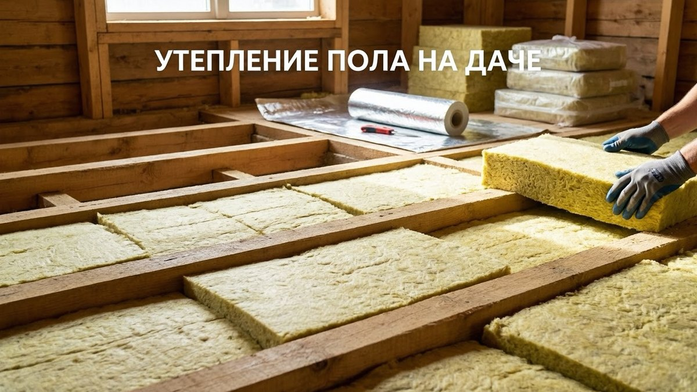
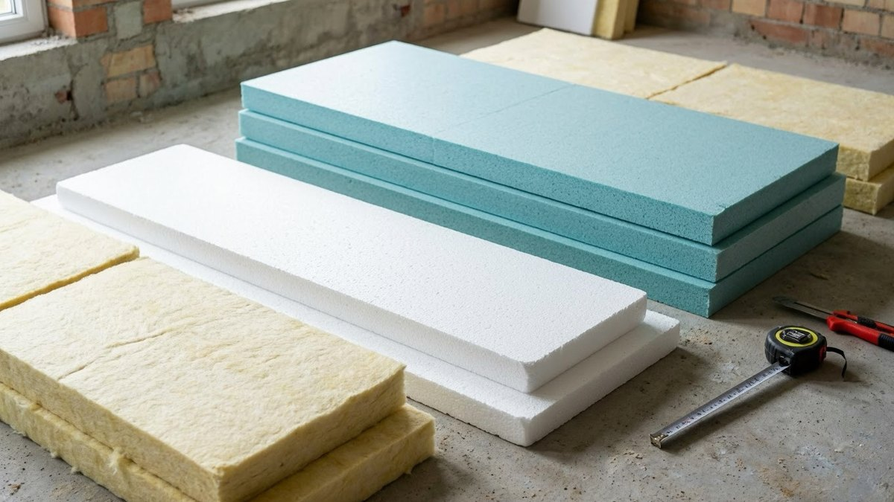
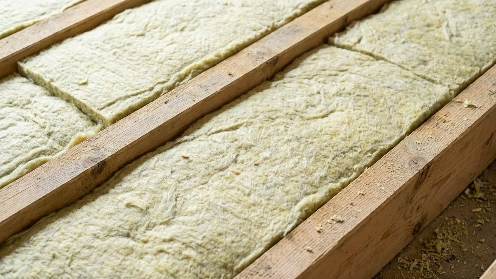
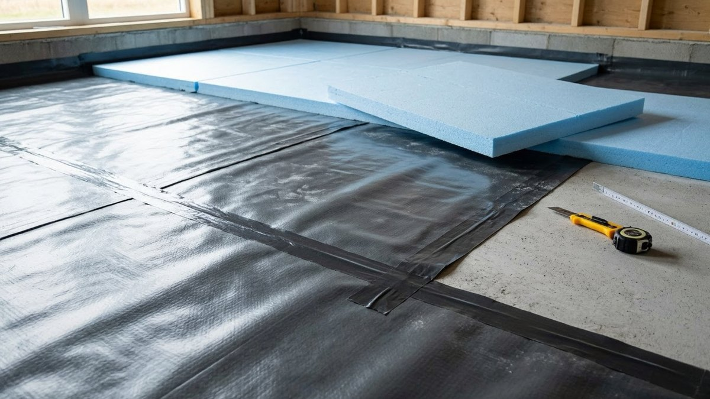
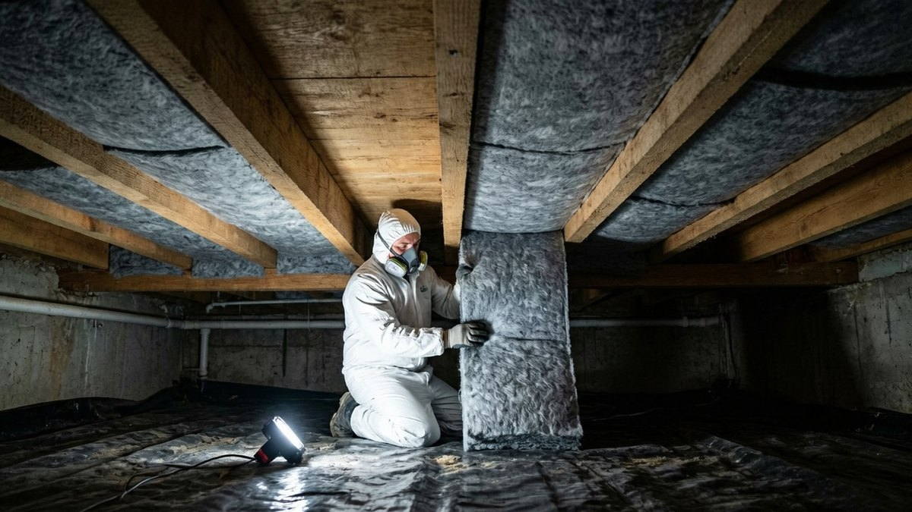
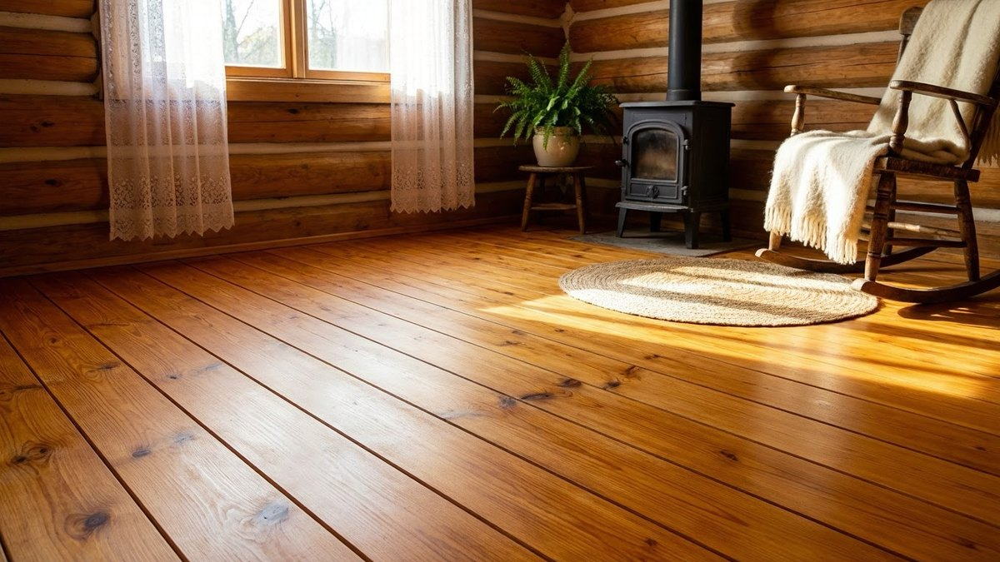

Холодный пол — одна из главных причин, по которой на даче зябко даже при работающем отоплении. Через неутеплённый пол уходит до пятой части тепла, а от земли тянет сыростью и холодом. Утеплить пол вполне можно своими руками — важно выбрать подходящий материал и не забыть про гидро- и пароизоляцию. Разберём, как утеплить пол на даче: чем, какими способами и по шагам.

## 🥶 Зачем утеплять пол на даче

Тёплый пол — это не только комфорт, но и экономия и здоровье дома:

- через холодный пол уходит значительная часть тепла, отопление работает вхолостую;
- по неутеплённому полу неприятно и холодно ходить, особенно зимой;
- от земли поднимается сырость — появляются конденсат, плесень и гниль;
- утеплённый пол — обязательное условие для комфортного зимнего проживания.

Утепление пола часто делают в комплексе с общим утеплением дома — как утеплить стены, крышу и окна, разбирали в статье про [утепление дачного дома](https://mir-doma.pro/kak-uteplit-dachnyy-dom/).

## 🧱 Чем утеплить пол: выбор материала

Материалов много, у каждого свои плюсы и минусы:

| Материал | Плюсы | Минусы |
|---|---|---|
| Минеральная вата | Тёплая, негорючая, дышит | Боится влаги, нужна пароизоляция |
| Пенопласт | Дешёвый, лёгкий, не боится влаги | Горючий, грызут мыши |
| ЭППС (пеноплекс) | Прочный, влагостойкий, тонкий | Дороже, горючий |
| Керамзит | Дешёвый, негорючий, от грызунов | Толстый слой, хуже держит тепло |
| Эковата | Экологичная, заполняет всё | Нужна техника для задувки |

Для деревянного пола по лагам чаще всего берут минвату (с обязательной пароизоляцией) или пенопласт/ЭППС. Для пола по грунту и стяжки — керамзит и ЭППС. Отдельный вариант — напыляемый [пенополиуретан (ППУ)](https://mir-doma.pro/uteplenie-ppu/): он ложится бесшовно и не требует плёнок, но наносится только бригадой с оборудованием.

## 🏗️ Утепление деревянного пола по лагам

Это самый частый случай на даче. Порядок работ:

1. **Снять чистовой пол** (доски), чтобы добраться до лаг.
2. **Устроить черновой настил** — по низу лаг набить черепные бруски и уложить на них доски или листы, на которые ляжет утеплитель.
3. **Ветро-влагозащита** — застелить черновой пол паропроницаемой мембраной. Она защищает утеплитель от влаги и ветра снизу, но выпускает пар. Обычная полиэтиленовая плёнка здесь не подходит: вместе с пароизоляцией сверху она запрёт влагу в минвате.
4. **Уложить утеплитель** между лагами враспор, без щелей и мостиков холода. Толщина — обычно 100–150 мм.
5. **Пароизоляция** — сверху утеплитель закрыть пароизоляционной плёнкой, чтобы пар из помещения не намочил его. Стыки проклеить.
6. **Настелить чистовой пол**, оставив вентзазор между пароизоляцией и досками.

## 🧊 Утепление бетонного пола

Если пол бетонный (по грунту или плита), утепляют иначе:

- по грунту насыпают и трамбуют слой **керамзита**, поверх — гидроизоляция и стяжка;
- или укладывают плиты **ЭППС** прямо на основание, а сверху заливают стяжку;
- поверх утеплённой стяжки можно уложить любое финишное покрытие, а для максимального комфорта — тёплый пол.

ЭППС здесь удобнее всего: он прочный, не боится влаги и держит нагрузку стяжки.

## 🔧 Утепление пола снизу

Если вскрывать чистовой пол не хочется (или он новый), пол утепляют **снизу, из подполья**. Между лагами со стороны подвала подшивают утеплитель (минвату или ЭППС), закрывают его снизу гидроветрозащитой и подшивают досками или листовым материалом. Способ трудоёмкий (работать приходится снизу), зато не нужно разбирать пол в комнатах. Он хорош, когда есть доступ в подполье.

## 🏠 Каркасный дом на сваях: пол без подполья

У дома на винтовых или буронабивных сваях под полом гуляет ветер, и
утеплитель работает как стена, только лежачая. Поэтому пирог здесь
полный, как у наружной стены, и толще, чем у пола над тёплым
подпольем:

1. **Снизу, по балкам** — защита от грызунов: оцинкованная сетка с
   ячейкой 5–10 мм. Мыши охотно селятся в минвате.
2. **Черновой пол снизу** — OSB-3 9–12 мм или доска по черепным
   брускам, если снизу можно подлезть. Если нельзя, укладывают по
   черепным брускам сверху.
3. **Ветро-влагозащитная мембрана** — паропроницаемая. Она не пускает
   ветер в вату, но выпускает пар наружу.
4. **Утеплитель между балками** — 150–200 мм минваты в средней полосе.
   Двумя слоями вразбежку, если балки высокие, или с наращиванием
   поперечными брусками, если низкие.
5. **Пароизоляция** с проклеенными стыками, с заходом на стены на
   10–15 см.
6. **Черновой и чистовой пол** сверху. Под ламинат и линолеум нужна
   ровная основа из фанеры или OSB.

**Забирка (цокольное ограждение)** между сваями — профнастил,
фиброцементные плиты или ЦСП на каркасе — снижает ветер под домом и
защищает пирог. Но наглухо её не закрывают: оставляют продухи, иначе
под полом скопится влага. Утеплённая забирка не заменяет утепление
пола, а только помогает ему.

## 🌬️ Пароизоляция и вентиляция подпола

Утеплённый пол прослужит долго только при правильной защите от влаги:

- **Ветро-влагозащита снизу** — паропроницаемая мембрана — защищает утеплитель от сырости и ветра из подполья.
- **Пароизоляция сверху** не пускает в утеплитель влажный воздух из помещения.
- **Продухи (вентиляционные отверстия)** в цоколе обеспечивают проветривание подпола — без них там копится сырость и дерево гниёт. На зиму их прикрывают, летом открывают.

Игнорировать пароизоляцию нельзя: намокший утеплитель перестаёт греть, а лаги и пол начинают гнить.

### Калькулятор утепления пола

<!-- wp:html -->

  
Утепление пола: утеплитель, плёнки, черновой пол

  <label class="md-calc__label" for="mdPlA">Площадь пола, м²</label>
  <input type="number" id="mdPlA" class="md-calc__input" min="1" step="0.5" value="36">
  <label class="md-calc__label" for="mdPlU">Что под полом</label>
  <select id="mdPlU" class="md-calc__input">
    <option value="3">Подполье с цоколем, продухи (150 мм)</option>
    <option value="4" selected>Сваи, открыто снизу (200 мм)</option>
    <option value="2">Юг, подполье (100 мм)</option>
  </select>
  <label class="md-calc__label" for="mdPlS">Шаг лаг или балок, см</label>
  <select id="mdPlS" class="md-calc__input">
    <option value="60" selected>60 см</option>
    <option value="40">40 см</option>
  </select>
  <label class="md-calc__label" for="mdPlL">Длина лаги (пролёт), м</label>
  <input type="number" id="mdPlL" class="md-calc__input" min="1" step="0.1" value="6">
  <label class="md-calc__label" for="mdPlK">Площадь упаковки минваты при толщине 50 мм, м²</label>
  <input type="number" id="mdPlK" class="md-calc__input" min="1" step="0.01" value="5.76">
  
Заполните поля

<!-- /wp:html -->

## 🔥 Тёплый пол: стоит ли делать

После утепления многие задумываются о тёплом поле — он даёт не просто отсутствие холода, а приятное тепло под ногами. Основные варианты:

- **Электрический (кабель, маты, инфракрасная плёнка)** — проще в монтаже, подходит под плитку и ламинат, но повышает счёт за электричество.
- **Водяной** — экономичнее в эксплуатации, но требует котла и сложнее в устройстве; чаще делают при капитальном ремонте.

Тёплый пол укладывают **поверх утеплённого основания** — без утепления он будет греть землю, а не дом, поэтому сначала утепление, потом обогрев. Для дачи, где живут наездами, часто достаточно электрической плёнки в нужных зонах (кухня, санузел). Если же дом для постоянного зимнего проживания — водяной тёплый пол в стяжке окупается комфортом и экономией.

## ❌ Частые ошибки

- **Уложили минвату без пароизоляции** — она намокает от пара и теряет свойства.
- **Оставили щели и мостики холода** — тепло уходит через зазоры между плитами.
- **Заложили продухи наглухо** — подпол не проветривается, появляется сырость и гниль.
- **Пенопласт без защиты от грызунов** — мыши устраивают в нём ходы.
- **Слишком тонкий слой** — экономия на толщине сводит утепление на нет.

## ❓ Частые вопросы

**Как утеплить пол в каркасном доме на сваях?**
Снизу по балкам — сетка от грызунов и черновой пол из OSB или доски, на
него паропроницаемая ветро-влагозащитная мембрана, между балками 150–200
мм минваты, сверху пароизоляция с проклеенными стыками и чистовой пол.
Забирка между сваями помогает, но продухи в ней оставляют.

**Чем лучше утеплить пол на даче?**
Для деревянного пола по лагам — минватой с пароизоляцией или ЭППС/пенопластом. Для бетонного основания — керамзитом или ЭППС под стяжку. Выбор зависит от типа пола и бюджета.

**Как утеплить пол, не вскрывая его?**
Утеплить снизу, из подполья: подшить утеплитель между лагами со стороны подвала и закрыть его ветрозащитой. Так не придётся разбирать чистовой пол.

**Нужна ли пароизоляция при утеплении пола?**
Для минеральной ваты — обязательно: без неё утеплитель намокает от пара и перестаёт греть. Для влагостойких ЭППС и пенопласта она менее критична, но гидроизоляция снизу нужна всегда.

**Какой утеплитель не грызут мыши?**
Мыши не устраивают гнёзда в керамзите, а также хуже трогают минвату и ЭППС высокой плотности. Обычный пенопласт грызуны любят больше всего.

**Какой толщины должен быть утеплитель для пола?**
Для дачи обычно достаточно 100–150 мм минваты или пенопласта; для холодных регионов и зимнего проживания слой увеличивают.

**Как утеплить холодный пол в старом дачном доме?**
Проще всего утеплить снизу из подполья или, при ремонте пола, вскрыть доски и уложить утеплитель между лагами с гидро- и пароизоляцией. Заодно стоит проверить и обновить сам пол — об этом в статье про [обновление старой дачи](https://mir-doma.pro/kak-obnovit-staruyu-dachu/).

---

Утеплённый пол делает дачу по-настоящему тёплой и сухой, а отопление — эффективным. Выберите материал под свой тип пола, обязательно уложите гидро- и пароизоляцию и не забудьте про вентиляцию подпола. В паре с хорошим [отоплением](https://mir-doma.pro/pech-dlya-dachi/) тёплый пол превратит дачу в дом, комфортный даже зимой.
