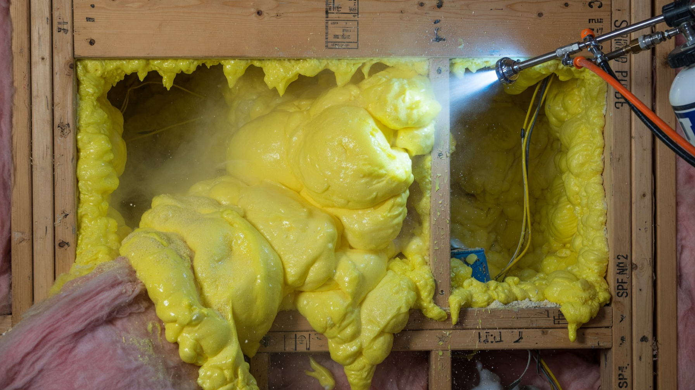
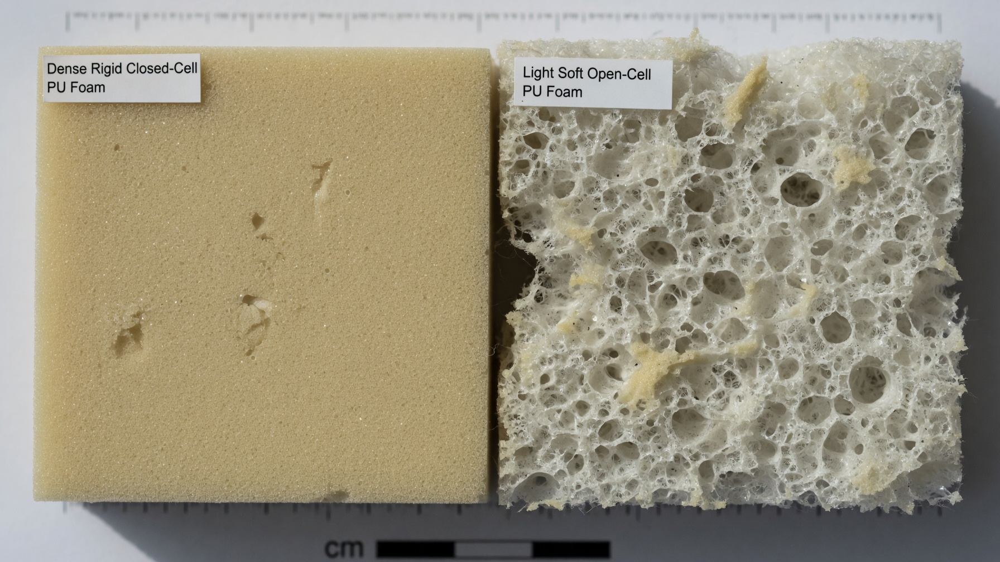
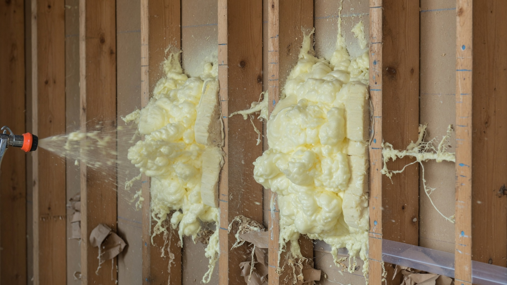
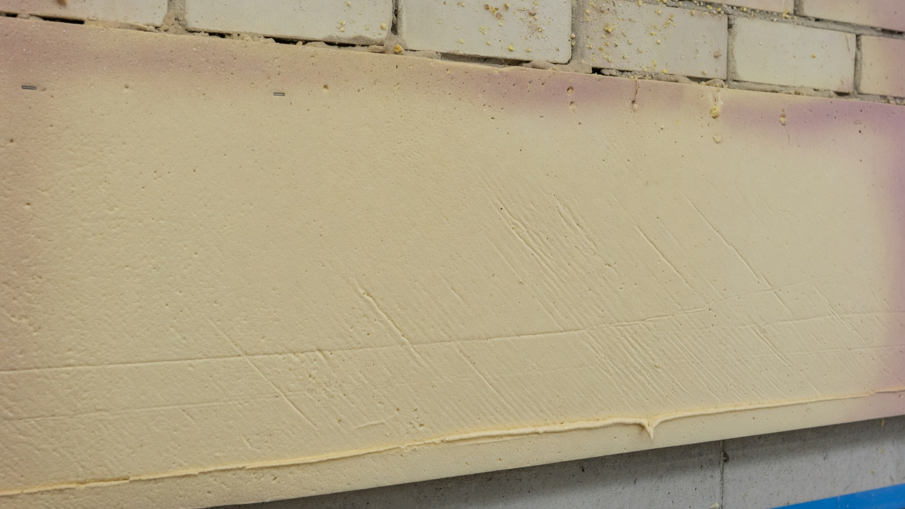
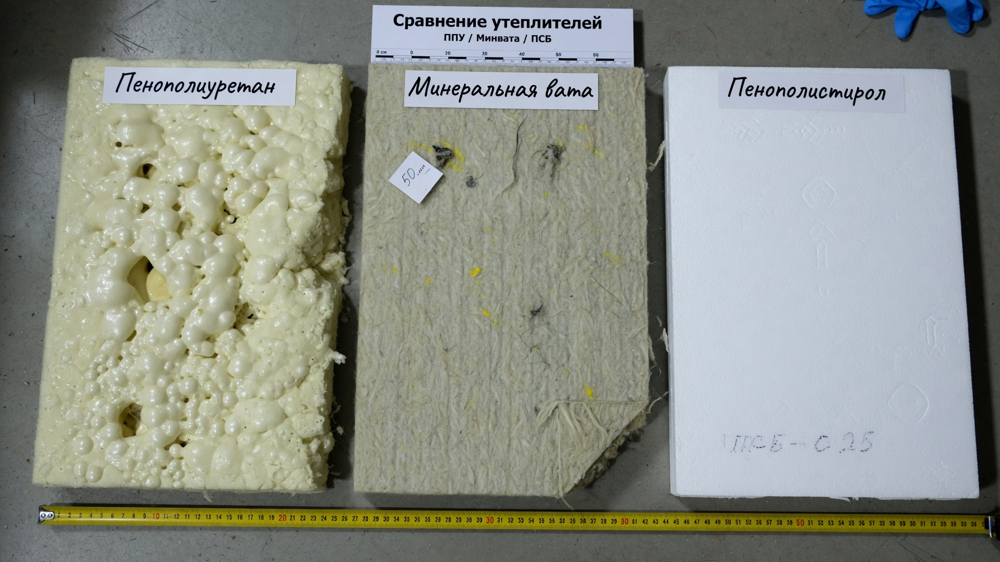
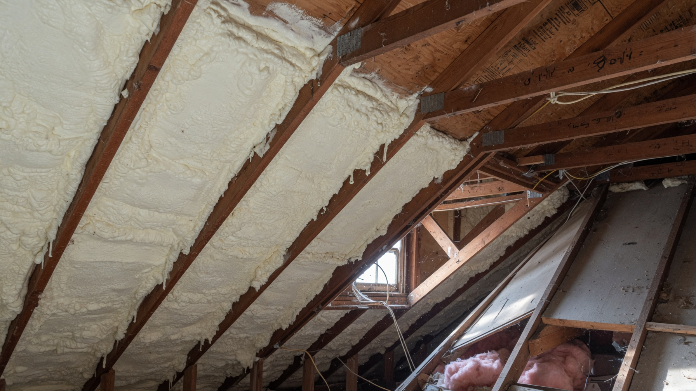

ППУ — пенополиуретан — утеплитель, который не укладывают, а **напыляют**: жидкая смесь вспенивается прямо на поверхности и за секунды застывает, образуя сплошной бесшовный слой. У него отличная теплоизоляция и полное отсутствие щелей и мостиков холода, но есть и особенности, о которых лучше знать заранее. Разберём плюсы и минусы утепления ППУ, из чего складывается цена, чем он отличается от минваты и пенопласта и где его стоит применять на даче.

## 🧴 Что такое ППУ и как его наносят

Пенополиуретан — это двухкомпонентная смесь, которую смешивают и под давлением подают через распылитель. На поверхности пена мгновенно расширяется в десятки раз, заполняя все полости, и застывает. Получается монолитный слой утеплителя, намертво сцепленный с основанием.

Наносят ППУ специальным оборудованием — это работа для бригады, а не самостоятельный монтаж (о баллонных наборах — ниже). Помимо напыляемого, ППУ выпускают и в виде готовых плит, но главная его сила именно в напылении.

**Два вида пены — и это важно при выборе:**

- **Закрытоячеистый (жёсткий, плотный).** Ячейки замкнуты, пена почти не впитывает влагу и не пропускает пар. Прочный, плотный, применяется снаружи: фасады, цоколь, фундамент, кровля, полы.
- **Открытоячеистый (лёгкий, мягкий).** Ячейки открыты, пена «дышит», паропроницаема, но боится воды. Дешевле, применяется внутри: каркасные стены, перекрытия, мансарда, чердак.

## ✅ Плюсы утепления ППУ

- **Бесшовность.** Главное преимущество: нет стыков, щелей и мостиков холода. Пена заполняет любые полости, щели и сложную геометрию, куда плиты просто не влезут.
- **Высокая теплоизоляция.** У ППУ одна из самых низких теплопроводностей среди распространённых утеплителей — тот же результат достигается меньшей толщиной слоя.
- **Отличная адгезия.** Пена липнет к дереву, бетону, кирпичу, металлу — не нужен крепёж, дюбели и каркас под утеплитель.
- **Гидроизоляция в одном слое.** Закрытоячеистый ППУ не впитывает влагу, поэтому часто не требует дополнительной паро- и гидроизоляции.
- **Скорость.** Большие площади утепляются за день-два, без раскроя, подгонки и крепежа.
- **Малый вес.** Не нагружает конструкцию — удобно для старых дачных домов и лёгких каркасников.
- **Долговечность.** Слой служит десятилетиями, не оседает и не сползает со временем (в отличие от ваты в стенах).
- **Не привлекателен для грызунов.** В плотной жёсткой пене мыши не устраивают ходы охотно, как в пенопласте (хотя абсолютной гарантии нет).

## ❌ Минусы ППУ

Честно о недостатках — их тоже хватает:

- **Нужна бригада и оборудование.** Своими руками полноценно напылить ППУ нельзя: требуется установка высокого давления. Это главный минус для дачника-самодельщика.
- **Цена выше.** ППУ дороже минваты и пенопласта — и материалом, и работой.
- **Боится ультрафиолета.** На солнце пена разрушается, поэтому наружный слой обязательно закрывают обшивкой, штукатуркой или краской.
- **Горючесть.** ППУ относится к горючим материалам (даже самозатухающие марки), а при горении даёт токсичный дым. Требуется защита негорючей отделкой.
- **Неразборность.** Слой невозможно аккуратно снять: он намертво сцеплен с основанием. Ремонт конструкции под ним превращается в проблему.
- **Закрытоячеистый «не дышит».** В деревянном доме это может «запечатать» стену: если не рассчитать точку росы и не обеспечить вентиляцию, древесина под пеной начнёт отсыревать. Для дерева чаще выбирают паропроницаемый открытоячеистый ППУ.

## 💰 Из чего складывается цена

Стоимость утепления ППУ считают либо **за квадратный метр при заданной толщине слоя**, либо **за кубометр напылённой пены**. На итог влияют:

- **толщина слоя** — главный фактор: чем толще, тем больше пены и дороже;
- **тип пены** — закрытоячеистая плотнее и дороже открытоячеистой;
- **объём работ** — на больших площадях цена за метр ниже, на маленьких выезд бригады «съедает» экономию;
- **сложность и доступность** — высота, стеснённые условия, подготовка поверхности;
- **регион и подрядчик.**

Ориентир простой: ППУ обходится **дороже минваты и пенопласта**, зато в цену уже входят работа и, по сути, гидро- и пароизоляция, на которых можно сэкономить. Конкретные расценки лучше запрашивать у нескольких подрядчиков — цены заметно различаются по регионам и быстро меняются. И считайте не «за метр», а стоимость всего пирога: у ППУ нет расходов на каркас, крепёж и плёнки.

## ⚖️ ППУ, минвата или пенопласт: сравнение

| Критерий | ППУ | Минвата | Пенопласт |
|---|---|---|---|
| Монтаж | Напыление, нужна бригада | Своими руками | Своими руками |
| Швы и мостики холода | Нет (бесшовно) | Есть на стыках | Есть на стыках |
| Влагостойкость | Высокая (закрытоячеистый) | Боится влаги | Не боится |
| Паропроницаемость | Низкая (или средняя у открытого) | Высокая, «дышит» | Низкая |
| Горючесть | Горюч | Негорюча | Горюч |
| Грызуны | Малопривлекателен | Могут селиться | Любят |
| Цена | Выше | Ниже | Самая низкая |

Вывод: **минвата** — универсал для стен и крыши, когда важно «дыхание» и негорючесть; **пенопласт и ЭППС** — бюджет и влагостойкость; **ППУ** — когда нужны бесшовность, скорость и сложная геометрия и есть бюджет.

## 🏠 Где применять ППУ на даче

- **Каркасные стены** — пена заполняет полости между стойками целиком, без щелей.
- **Мансарда и скаты крыши** — сложная геометрия со стропилами, где плиты приходится подрезать: ППУ ложится сплошным слоем.
- **Холодный чердак и перекрытия** — быстро и без мостиков холода.
- **Цоколь, фундамент, отмостка** — закрытоячеистый ППУ не боится влаги и грунта.
- **Пол и подполье** — напыление снизу по лагам избавляет от плёнок; о других способах читайте в статье про [утепление пола на даче](https://mir-doma.pro/uteplenie-pola-na-dache/).
- **Хозпостройки, гараж, курятник** — там, где важна скорость и не нужна изысканная отделка.

## ⚠️ Частые ошибки

- **Слишком тонкий слой** — экономия на толщине сводит на нет весь эффект.
- **Напыление на влажную или грязную поверхность** — пена плохо прилипает и со временем отслаивается.
- **Оставили слой открытым** — на солнце ППУ разрушается за пару сезонов, его нужно закрыть отделкой.
- **Закрытоячеистый ППУ в деревянном доме без расчёта** — древесина может отсыревать под непроницаемым слоем.
- **Отсутствие вентиляции.** Дом после ППУ становится очень герметичным — обязательно продумайте воздухообмен, иначе будет сырость и духота.
- **Экономия на подрядчике.** Качество напрямую зависит от оборудования, пропорций смеси и опыта бригады.

## ❓ Частые вопросы

**Что такое утепление ППУ?**
Это напыление пенополиуретана — двухкомпонентной смеси, которая вспенивается на поверхности и застывает сплошным бесшовным слоем утеплителя без швов и мостиков холода.

**Сколько стоит утепление ППУ?**
Цену считают за м² при нужной толщине или за м³ пены. Она зависит от толщины слоя, типа пены, объёма и сложности работ и региона. ППУ дороже минваты и пенопласта, но в стоимость входят работа и гидроизоляция. Актуальные расценки уточняйте у подрядчиков.

**Можно ли напылить ППУ своими руками?**
Полноценно — нет: нужна установка высокого давления и опыт. В продаже есть баллонные наборы, но они годятся лишь для небольших участков (задуть щели, утеплить люк), а не для дома целиком.

**Вреден ли ППУ для здоровья?**
После полимеризации застывшая пена инертна и безопасна. Опасность есть только в момент напыления — испарения компонентов, поэтому работают в защите, а помещение проветривают. Главное — соблюдать технологию и не жить в доме во время работ.

**Грызут ли мыши ППУ?**
Плотный жёсткий ППУ значительно менее привлекателен для грызунов, чем пенопласт: в нём труднее устроить ходы и гнёзда. Но абсолютной гарантии не даёт ни один утеплитель.

**Что лучше — ППУ или минвата?**
Минвата дешевле, негорюча и «дышит» — она универсальна для стен и крыши. ППУ выигрывает бесшовностью, скоростью и работой со сложной геометрией, но дороже, горюч и требует бригады. Для деревянного дома важно учитывать паропроницаемость.

**Сколько служит ППУ?**
Слой служит десятилетиями и не оседает, если защищён от ультрафиолета и механических повреждений отделкой.

---

ППУ — не панацея, а инструмент под конкретную задачу: он незаменим там, где нужен бесшовный слой на сложной геометрии, и избыточен там, где спокойно ляжет минвата. Главное — правильно выбрать тип пены, не экономить на толщине и обязательно закрыть слой от солнца. А как утеплить дачу целиком — стены, пол, крышу, окна и фундамент — собрано в основной статье про [утепление дачного дома](https://mir-doma.pro/kak-uteplit-dachnyy-dom/). В паре с хорошим [отоплением](https://mir-doma.pro/pech-dlya-dachi/) утеплённый дом становится комфортным даже в морозы.
