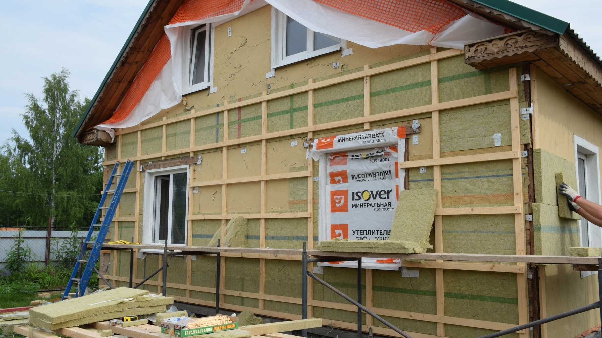
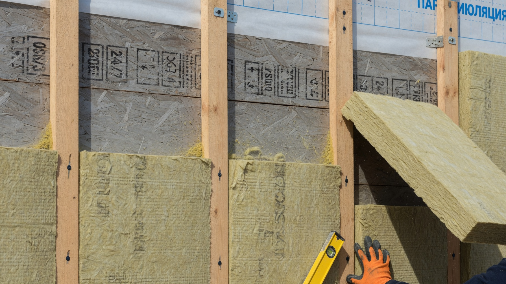
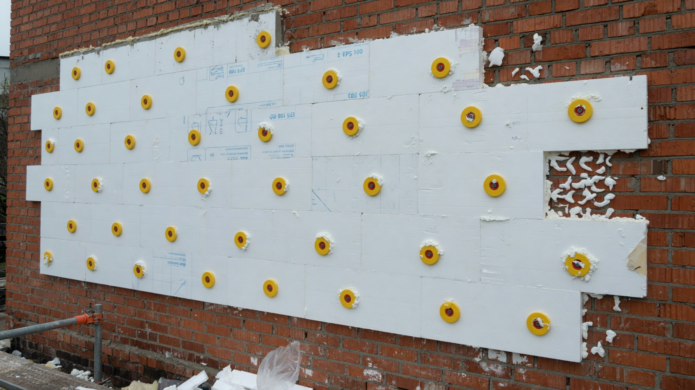
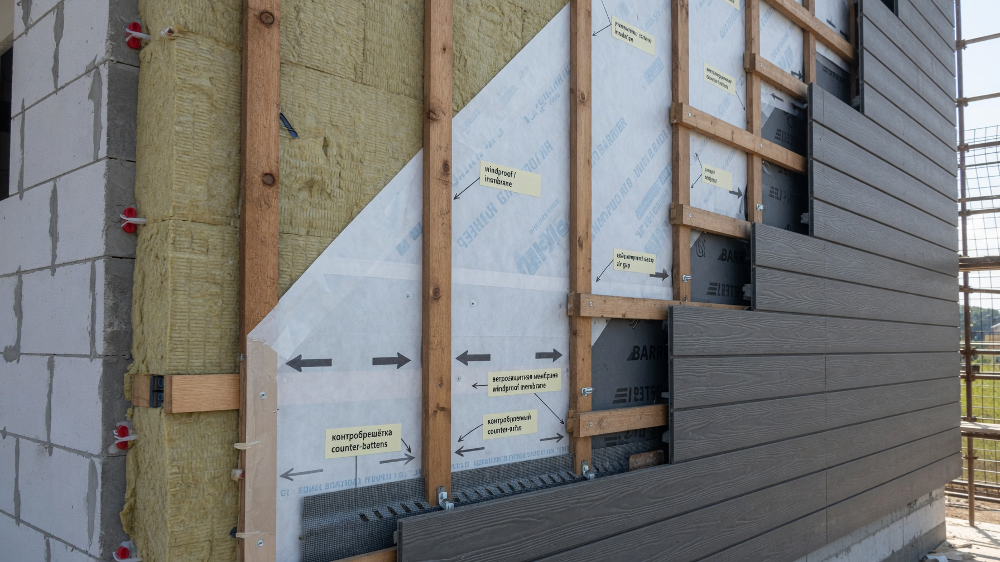
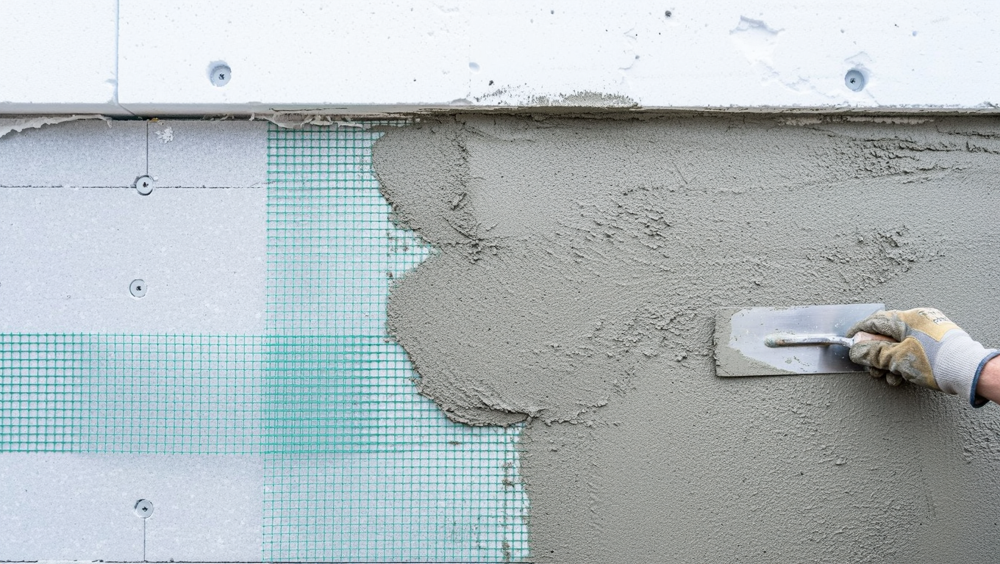
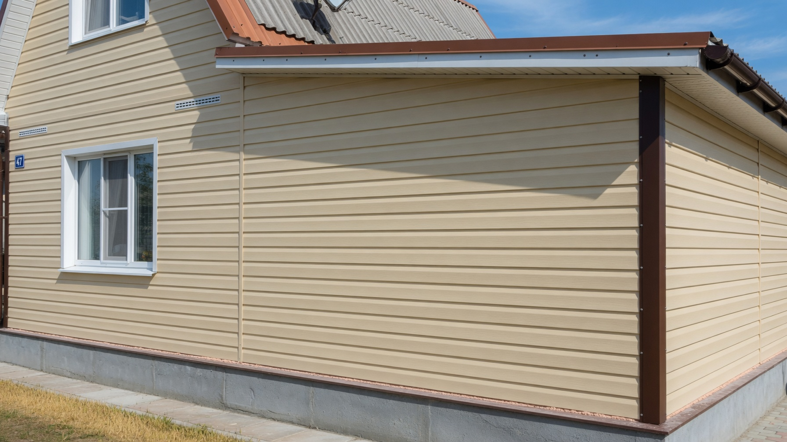

Стены дают самые большие потери тепла в доме, поэтому именно с них начинают утепление дачи. Но материалов на рынке десяток, и выбор не так очевиден: то, что отлично подходит для кирпичного дома, способно погубить деревянный. Разберём, чем утеплить стены дачи снаружи: сравним минвату, пенопласт, ЭППС, эковату и ППУ, выберем материал под ваш тип стен, определим толщину и разберём два способа монтажа.

## 🧱 Почему стены утепляют снаружи

Наружное утепление почти всегда правильнее внутреннего, и вот почему:

- **«Точка росы» выносится за стену.** Конденсат образуется в утеплителе снаружи, а сама стена остаётся тёплой и сухой.
- **Стена не промерзает** — увеличивается срок службы конструкции.
- **Не съедается площадь** внутри дома.
- **Стена работает как аккумулятор тепла** — дом медленнее остывает.

Утепление изнутри применяют только тогда, когда снаружи утеплить нельзя (фасад трогать запрещено или нет доступа). Оно крадёт площадь и требует безупречной пароизоляции: иначе между утеплителем и холодной стеной копится конденсат, и стена начинает сыреть и плесневеть.

## 🧰 Сравнение материалов

Пять основных утеплителей для наружных стен — со всеми плюсами и подводными камнями.

**Минеральная (каменная) вата.** Паропроницаема — «дышит», негорючая, хорошо утепляет. Главный минус — боится влаги: намокнув, теряет свойства, поэтому обязательно нужна ветрозащитная мембрана и вентзазор. Лучший выбор для деревянных и каркасных домов.

**Пенопласт (ПСБ).** Самый дешёвый и лёгкий, не боится влаги, прост в монтаже. Но горюч, совсем не пропускает пар и любим грызунами. Подходит для каменных стен под штукатурку; для дерева не рекомендуется.

**Экструдированный пенополистирол (ЭППС).** Прочный, плотный, влагостойкий — незаменим для цоколя и фундамента. На стенах используют реже: он паронепроницаем, поэтому для деревянного дома не годится.

**Эковата.** Задувной целлюлозный утеплитель: заполняет полости без швов, «дышит», экологичен. Требует специального оборудования для задувки.

**Пенополиуретан (ППУ).** Напыляется бесшовным слоем, отлично держит тепло, не требует плёнок, но дорог, горюч и наносится только бригадой с оборудованием. Подробно — в статье про [утепление ППУ](https://mir-doma.pro/uteplenie-ppu/).

| Материал | Дышит | Влагостойкость | Горючесть | Цена | Монтаж |
|---|---|---|---|---|---|
| Минвата | Да | Низкая | Негорючая | Средняя | Своими руками |
| Пенопласт | Нет | Высокая | Горюч | Низкая | Своими руками |
| ЭППС | Нет | Очень высокая | Горюч | Выше среднего | Своими руками |
| Эковата | Да | Средняя | Слабогорючая | Средняя | Нужна техника |
| ППУ | Зависит от типа | Высокая | Горюч | Высокая | Только бригада |

## 🏠 Что выбрать под ваш тип стен

Это ключевой вопрос — здесь чаще всего ошибаются.

**Деревянный дом (брус, бревно, каркас).** Дереву необходимо отдавать влагу наружу. Поэтому нужен **паропроницаемый утеплитель — минвата или эковата** и обязательно вентилируемый фасад с зазором. **Пенопласт и ЭППС для дерева не подходят:** они «запирают» влагу в стене, и древесина под ними начинает отсыревать и гнить. Это самая частая и самая дорогая ошибка.

**Каменный дом (кирпич, блок, бетон).** Здесь выбор шире: подойдут и минвата, и пенопласт, и ЭППС. Пенопласт под штукатурку — самый бюджетный вариант, минвата — если хочется негорючести и «дышащей» стены.

**Каркасный дом.** Утеплитель уже стоит внутри каркаса; при наружном доутеплении добавляют слой минваты поверх стоек и закрывают ветрозащитой. Логика та же: только паропроницаемые материалы.

## 📏 Какая нужна толщина

Толщина зависит от климата и материала стены. Ориентиры для средней полосы:

- **каркасный или щитовой дом** — 150 мм и более;
- **брус 100–150 мм** — около 100–150 мм утеплителя;
- **кирпич в 1,5 кирпича** — 100 мм и больше;
- **северные регионы** — слой увеличивают.

Правило простое: **экономить на толщине нельзя.** Доложить утеплитель потом гораздо дороже, чем сразу сделать нужный слой — придётся заново разбирать фасад. Если хотите точности, попросите теплотехнический расчёт: он учитывает материал стены, климат и нужное сопротивление теплопередаче.

## 🏗️ Два способа монтажа

**1. Вентилируемый фасад** (навесной) — для деревянных, каркасных и любых стен, где важна паропроницаемость.

Пирог снизу вверх: стена → обрешётка → утеплитель между стойками → ветро-влагозащитная мембрана → **вентиляционный зазор 3–5 см** (контробрешётка) → обшивка (сайдинг, вагонка, панели, профлист).

Вентзазор — не формальность: именно через него уходит влага, вышедшая из стены и утеплителя. Без зазора фасад превращается в ловушку для сырости.

**2. Мокрый (штукатурный) фасад** — для каменных стен.

Пирог: стена → клей → утеплитель (пенопласт или плотная минвата) → дюбели-«грибки» → армирующая сетка на клей → грунт → декоративная штукатурка. Получается монолитная утеплённая стена без каркаса и зазоров.

## 🌬️ Главное правило «пирога»

Есть принцип, который объясняет большинство ошибок утепления: **паропроницаемость слоёв должна расти изнутри наружу.** Пар из дома должен свободно выходить, а не упираться в непроницаемый слой.

Отсюда следствия:

- пароизоляция — **изнутри** (со стороны тёплого помещения), ветрозащита — **снаружи** утеплителя;
- нельзя закрывать паропроницаемую стену непроницаемым утеплителем (дерево + пенопласт);
- вентзазор обязателен при навесном фасаде.

Нарушение этого правила — причина сырых стен, плесени и гниющего каркаса под красивым сайдингом.

## ❌ Частые ошибки

- **Пенопласт или ЭППС на деревянный дом** — стена перестаёт дышать, древесина гниёт.
- **Нет вентзазора** — влага не выходит, утеплитель намокает.
- **Минвата без ветрозащиты** — продувается и намокает, теряя свойства.
- **Слишком тонкий слой** — экономия, которая не окупается.
- **Утеплили сырую стену** — влагу «запечатали» внутри.
- **Пароизоляция снаружи вместо ветрозащиты** — классическая путаница плёнок, ведущая к конденсату в стене.
- **Оставили утеплитель без отделки** — минвата намокнет, пенопласт и ППУ разрушатся на солнце.

## ❓ Частые вопросы

**Чем лучше утеплить стены дачного дома снаружи?**
Для деревянного и каркасного дома — минватой или эковатой под вентилируемый фасад. Для кирпичного и блочного подойдут и пенопласт, и ЭППС, и минвата (под штукатурку или навесной фасад).

**Можно ли утеплять деревянный дом пенопластом?**
Не стоит. Пенопласт не пропускает пар, влага запирается в древесине, и стена начинает отсыревать и гнить. Для дерева нужны паропроницаемые утеплители — минвата или эковата.

**Какая толщина утеплителя нужна для стен?**
В средней полосе обычно 100–150 мм минваты в зависимости от материала стены; для каркасных домов и северных регионов — больше. Точную цифру даёт теплотехнический расчёт.

**Что дешевле — пенопласт или минвата?**
Пенопласт дешевле, но горюч, не дышит и его грызут мыши. Минвата дороже, зато негорючая и паропроницаемая — для дерева она безальтернативна.

**Нужна ли пароизоляция при наружном утеплении?**
Снаружи утеплитель закрывают **ветро-влагозащитной мембраной**, а пароизоляцию ставят изнутри дома. Если перепутать плёнки местами, пар запрётся в стене и появится конденсат.

**Можно ли утеплить стены изнутри?**
Только если снаружи нельзя. Внутреннее утепление крадёт площадь и требует тщательной пароизоляции — иначе между утеплителем и холодной стеной будет копиться конденсат.

**Чем закрыть утеплитель снаружи?**
Сайдингом, вагонкой, фасадными панелями или профлистом (навесной фасад) либо штукатуркой по сетке (мокрый фасад). Оставлять утеплитель открытым нельзя.

---

Выбор утеплителя для стен решается одним вопросом: из чего построен дом. Деревянному нужны «дышащие» минвата или эковата и вентзазор, каменному подойдёт и пенопласт под штукатурку. Не экономьте на толщине, не путайте плёнки местами — и стены перестанут выпускать тепло. Как утеплить дачу целиком — пол, крышу, окна и фундамент — собрано в статье про [утепление дачного дома](https://mir-doma.pro/kak-uteplit-dachnyy-dom/), а холодный пол разобран отдельно: [утепление пола на даче](https://mir-doma.pro/uteplenie-pola-na-dache/). Заодно с фасадом удобно привести в порядок и весь дом — идеи в статье про [обновление старой дачи](https://mir-doma.pro/kak-obnovit-staruyu-dachu/).
