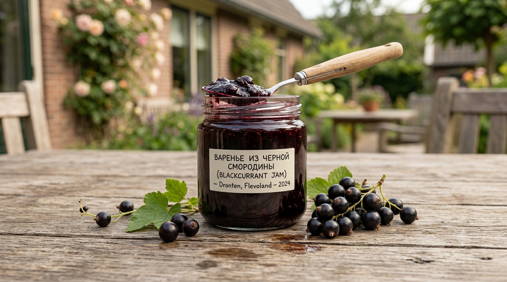
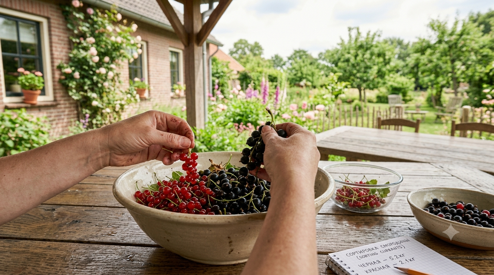
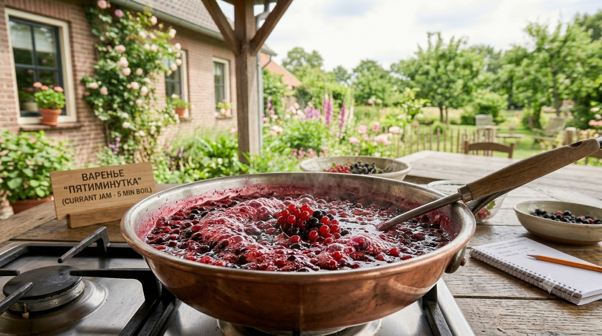
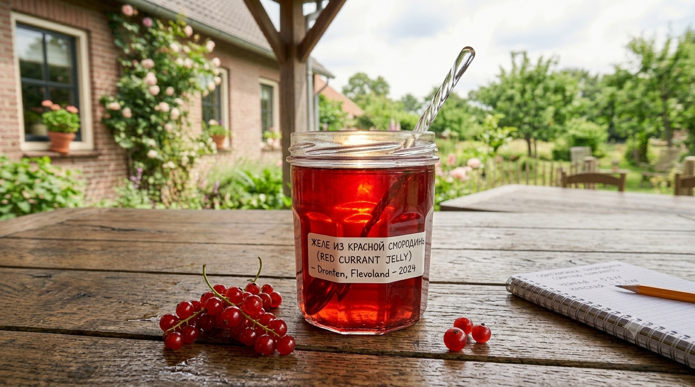
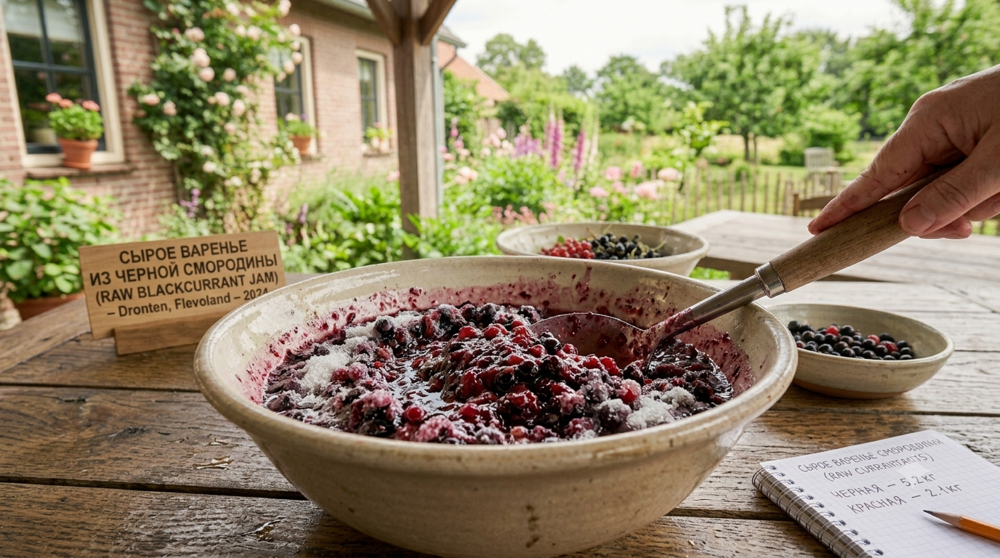
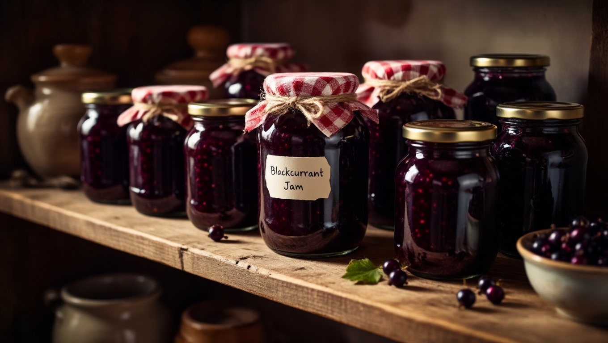

Смородина — идеальная ягода для варенья: она кислая, ароматная и, что важнее всего, **богата пектином**, поэтому варенье из неё густеет само, без желатина и загустителей. Из одного и того же урожая можно сделать классическое варенье с целыми ягодами, быструю «пятиминутку», прозрачное желе или сырое варенье без варки. Разберём все четыре рецепта с пропорциями и секретами.

## 🫐 Чёрная или красная смородина

Оба вида хороши, но результат разный:

- **Чёрная смородина** — ароматная, сладковатая, варенье получается насыщенным, тёмным и густым. Самая популярная для классического варенья.
- **Красная и белая** — кислее и содержат ещё больше пектина, поэтому идеально идут на **желе**: масса застывает буквально сама.

Можно смешивать оба вида, а также добавлять малину, крыжовник или вишню — ассорти получается интереснее по вкусу.

## 🧺 Подготовка ягод

Смородину готовят просто, но пара нюансов важна:

- перебрать, убрать веточки, листья и подпорченные ягоды;
- **хвостики (сухие соцветия) снимать не обязательно** для варки и желе — при протирании они всё равно отсеются; для классического варенья с целыми ягодами их лучше убрать;
- промыть и **обязательно обсушить** — лишняя вода делает варенье жидким;
- у чёрной смородины плотная кожица: чтобы ягоды не сморщивались, их иногда бланшируют 2–3 минуты в кипятке или прокалывают.

## ⚖️ Пропорции

Смородина кислая, поэтому сахара не жалеют:

- **классическое варенье** — 1 кг ягод : 1,2–1,5 кг сахара;
- **пятиминутка** — 1 кг : 1–1,2 кг;
- **желе** — 1 л сока : 1–1,2 кг сахара;
- **сырое варенье без варки** — 1 кг : 1,5–2 кг (сахар здесь единственный консервант).

Меньше сахара класть рискованно: варенье забродит. Общие принципы варки разобраны в статье про [варенье на зиму](https://mir-doma.pro/varene-na-zimu/).

## 🍯 Классическое варенье

Густое, с целыми ягодами в прозрачном сиропе:

1. Ягоды засыпать сахаром и оставить на 3–4 часа (или на ночь), чтобы пустили сок.
2. Поставить на слабый огонь, довести до кипения, аккуратно помешивая, проварить 5–7 минут и снять пену.
3. Полностью остудить.
4. Повторить нагрев и остывание ещё 1–2 раза — так ягоды пропитаются сиропом и останутся целыми.
5. В последнюю варку довести до готовности (капля не растекается на холодном блюдце) и разложить по стерильным банкам.

Если хочется совсем без воды — её и не добавляют: смородина даёт достаточно сока.

## ⏱️ Пятиминутка

Самый быстрый способ, сохраняющий витамины, цвет и свежий вкус:

1. Ягоды засыпать сахаром, дать постоять пару часов.
2. Довести до кипения и **проварить ровно 5 минут**, снимая пену.
3. Сразу горячим разлить по стерильным банкам и закатать.

Пятиминутка получается менее густой, чем классическое варенье, зато ярче по вкусу. Хранить её надёжнее в прохладном месте.

## 🍮 Желе из смородины

Благодаря пектину желе получается даже у новичка, безо всяких загустителей:

1. Ягоды залить небольшим количеством воды (примерно полстакана на килограмм) и прогреть до размягчения, помяв толкушкой.
2. Протереть массу через сито или отжать через марлю — получится чистый сок без кожицы и косточек.
3. Сок смешать с сахаром, довести до кипения и проварить 10–15 минут, снимая пену.
4. Разлить горячим по стерильным банкам — при остывании масса застынет.

Желе из красной смородины застывает особенно хорошо и получается прозрачно-рубиновым.

## ❄️ Сырое варенье без варки

Максимум пользы — витамины не разрушаются нагревом:

1. Ягоды тщательно перебрать, промыть и **очень хорошо обсушить** (влага здесь недопустима).
2. Перекрутить через мясорубку или пробить блендером.
3. Смешать с сахаром в пропорции 1:1,5–2 и мешать, пока сахар полностью не растворится.
4. Разложить по сухим стерильным банкам, сверху можно насыпать слой сахара «пробкой».

**Важно:** сырое варенье хранят **только в холодильнике или холодном погребе**. При комнатной температуре оно забродит.

## 💡 Секреты

- **Пектин — ваш союзник.** Смородина густеет сама, поэтому не переваривайте её в попытке добиться густоты: масса загустеет при остывании.
- **Снимайте пену** — с ней варенье дольше хранится и выглядит чище.
- **Варите в широкой посуде** — так влага испаряется равномерно и варенье не пригорает.
- **Не жалейте сахара** для сырого варенья — он единственный консервант.
- **Сухие банки и крышки** — капля воды провоцирует плесень.

## 🫙 Как хранить

- **классическое варенье и желе** в стерильных банках — 1–2 года в тёмном прохладном месте;
- **пятиминутка** — надёжнее в прохладе (погреб, холодильник);
- **сырое варенье** — только холодильник или холодный погреб.

Общие правила — в статье [как хранить овощи зимой](https://mir-doma.pro/kak-hranit-ovoshchi-zimoy/). Часть урожая удобно [заморозить](https://mir-doma.pro/chto-zamorozit-na-zimu/) и варить варенье порциями зимой, а из ягод отлично получается и [компот](https://mir-doma.pro/kompot-na-zimu/).

## ❓ Частые вопросы

**Сколько сахара на 1 кг смородины?**
Для классического варенья — 1,2–1,5 кг, для пятиминутки — 1–1,2 кг, для сырого варенья без варки — 1,5–2 кг. Смородина кислая, поэтому сахара нужно больше, чем для сладких ягод.

**Нужно ли убирать хвостики у смородины?**
Для желе и протёртых заготовок — нет, они отсеются при протирании. Для классического варенья с целыми ягодами хвостики лучше удалить, чтобы варенье было аккуратнее.

**Почему варенье из смородины получается густым?**
Смородина богата пектином — природным желирующим веществом. Поэтому варенье густеет само при остывании, и добавлять желатин или загустители не нужно.

**Сколько варить варенье-пятиминутку?**
Ровно 5 минут с момента закипания, после чего сразу разливают по стерильным банкам. Долгая варка убивает свежий вкус и цвет, ради которых пятиминутку и делают.

**Как сделать желе из смородины без желатина?**
Прогреть ягоды, протереть через сито, смешать сок с сахаром и проварить 10–15 минут. Собственного пектина смородины достаточно, чтобы масса застыла при остывании.

**Сколько хранится сырое варенье из смородины?**
Несколько месяцев, но **только в холодильнике или холодном погребе**. При комнатной температуре оно забродит, поэтому сахара в него кладут максимум.

**Можно ли варить варенье из замороженной смородины?**
Да, зимой это удобно: ягоды не размораживают, а сразу засыпают сахаром и варят. Вкус будет чуть менее ярким, чем из свежих.

---

Смородина прощает новичку почти всё: хотите густое варенье с целыми ягодами — варите в несколько приёмов, хотите сохранить витамины — сделайте пятиминутку или сырое варенье, а из красной смородины получится идеальное желе безо всякого желатина. Другие сладкие заготовки — [варенье на зиму](https://mir-doma.pro/varene-na-zimu/) и [компот](https://mir-doma.pro/kompot-na-zimu/). А чтобы урожая ягод было больше, кусты нужно вовремя обрезать — об этом в статье про [обрезку смородины](https://mir-doma.pro/obrezka-smorodiny/).
