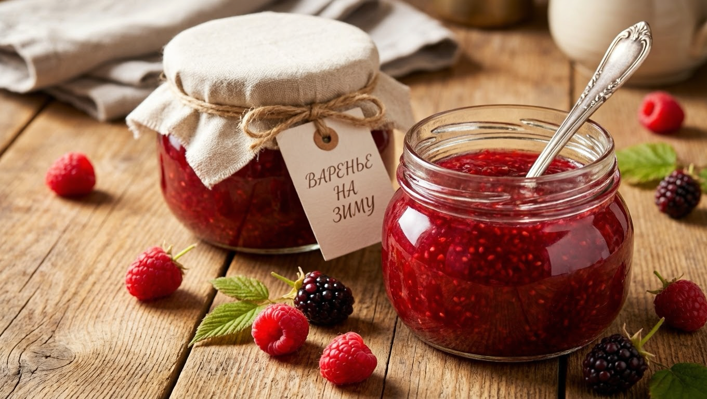
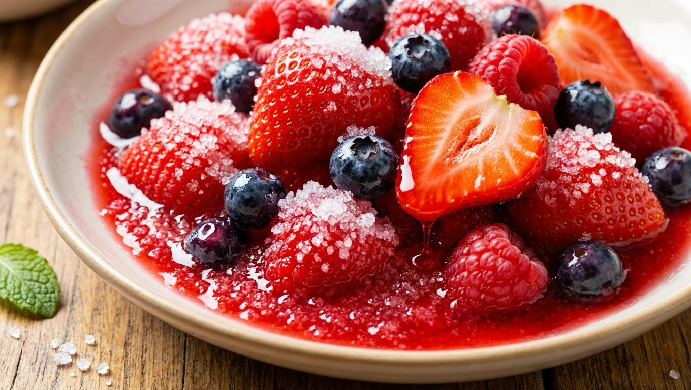
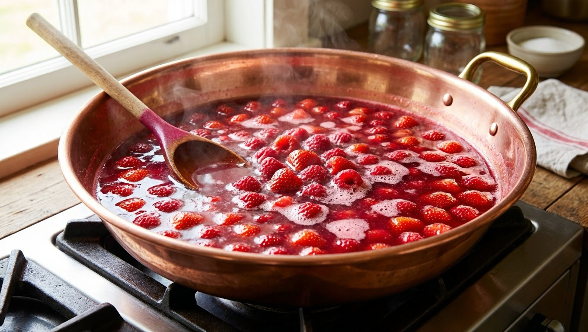
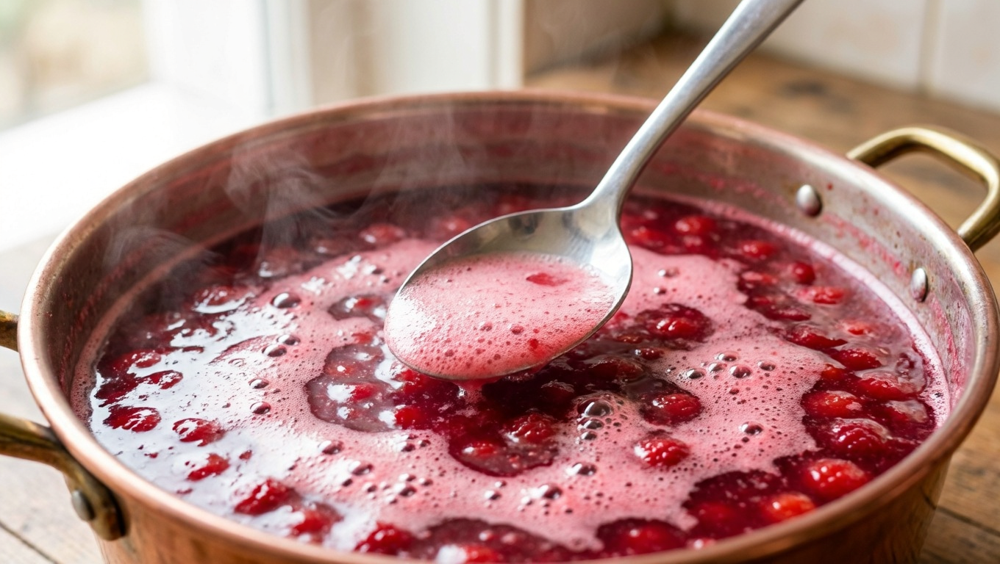
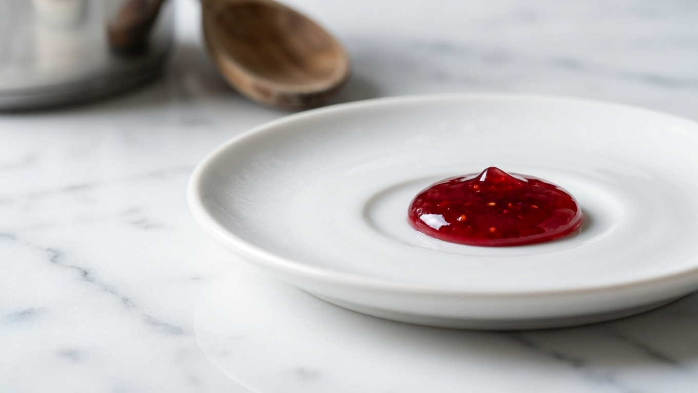
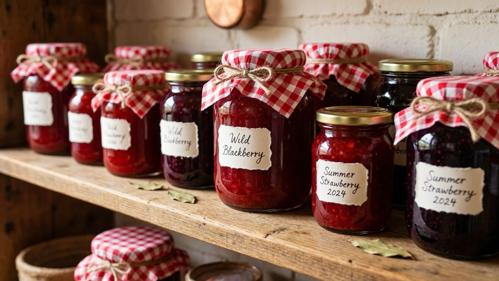

Домашнее варенье — заготовка, которая пахнет детством: ложка ягодного варенья к чаю зимой возвращает вкус лета. Сварить его несложно, но у хорошего варенья есть свои законы — правильные пропорции, точка готовности и пара секретов, без которых оно либо засахаривается, либо бродит. Разберём, как правильно варить варенье на зиму: в каких пропорциях брать ягоды и сахар, как понять, что оно готово, и чем варенье отличается от пятиминутки и джема.

## 🍯 Каким бывает варенье

Прежде чем варить, полезно понимать разницу — под разные задачи разные способы:

- **Классическое варенье** — ягоды или фрукты варят в сиропе, плоды остаются целыми, а сироп прозрачный. Варят в несколько приёмов.
- **«Пятиминутка»** — быстрая варка (около 5 минут кипения), иногда в несколько подходов. Сохраняет больше витаминов, вкуса и цвета, но хранится чуть хуже.
- **Джем** — уваренная однородная масса густой желеобразной консистенции, плоды разварены.
- **Повидло** — ещё гуще джема, из протёртых плодов, часто без добавления воды.
- **Варенье «сырое» (без варки)** — ягоды перетирают с сахаром без нагрева; максимум пользы, но хранят только в холоде.

Дальше — общие принципы, которые работают для всех вариантов.

## 🍓 Пропорции ягод и сахара

Сахар в варенье — не только сладость, но и **консервант**: чем его больше, тем надёжнее хранится заготовка. Базовые ориентиры:

- **классическое варенье** — ягоды и сахар **1:1** (на 1 кг ягод 1 кг сахара);
- **кислые ягоды** (смородина, крыжовник, вишня) — можно чуть больше сахара, до 1:1,2;
- **сладкие фрукты** — достаточно 1:0,7–0,8;
- **«пятиминутка»** — обычно 1:1;
- **сырое варенье без варки** — сахара берут больше, 1:1,5–2, так как только он и консервирует.

Уменьшать сахар сильно нельзя: варенье с малым количеством сахара быстро закисает и бродит.

## 🍲 Как варить варенье: базовый способ

Классический принцип варки в несколько приёмов:

1. **Подготовка ягод.** Перебрать, промыть, дать обсохнуть. Крупные фрукты нарезать, у вишни при желании удалить косточки.
2. **Засыпать сахаром.** Пересыпать ягоды сахаром и оставить на несколько часов (лучше на ночь) — они пустят сок, и варить можно без добавления воды.
3. **Первая варка.** Довести до кипения на среднем огне, аккуратно помешивая, проварить 5–10 минут и снять с огня.
4. **Настаивание.** Дать варенью полностью остыть (несколько часов) — ягоды пропитаются сиропом и не разварятся.
5. **Повторные варки.** Повторить нагрев и остывание 2–3 раза — так плоды остаются целыми, а сироп густеет и становится прозрачным.
6. **Закатка.** Горячее варенье разложить в стерильные банки и закатать (или закрыть капроновыми крышками для хранения в холоде).

Варка в несколько приёмов — секрет того, чтобы ягоды остались целыми, а не превратились в кашу.

## 🥄 Секреты хорошего варенья

- **Варите в широком тазу или низкой кастрюле** — большая площадь испарения даёт равномерное уваривание, варенье не подгорает.
- **Снимайте пену** — она портит вид и сокращает срок хранения.
- **Не варите слишком долго за раз** — переваренное варенье темнеет и засахаривается; лучше несколько коротких варок.
- **Помешивайте бережно**, чтобы не помять ягоды, и деревянной или силиконовой ложкой.
- **От засахаривания** помогает добавление в конце **лимонной кислоты или сока лимона** — они же дают приятную кислинку.
- **Против брожения** — достаточно сахара, стерильные банки и сухие крышки.

## ✅ Как понять, что варенье готово

Несколько проверенных признаков готовности:

- **капля не растекается** — капните сироп на холодное блюдце: готовое варенье держит форму, а не расплывается;
- **сироп стал густым и прозрачным**, тянется за ложкой;
- **ягоды равномерно распределены** в сиропе, а не всплывают наверх;
- **пена собирается в центре**, а не по краям.

Недоваренное варенье жидкое и может забродить, переваренное — тёмное и засахаренное. Ориентируйтесь на пробу капли — это самый надёжный тест.

## 🫙 Как и сколько хранить

Правильно сваренное варенье с достаточным количеством сахара хранится **1–2 года**:

- **классическое и джем** в стерильных банках — в тёмном прохладном месте, выдерживают комнатную температуру;
- **«пятиминутка» и сырое варенье без варки** — надёжнее хранить в холоде (погреб, холодильник);
- банки и крышки стерилизовать, а перед закаткой убедиться, что крышки сухие — капля воды провоцирует плесень.

Общие правила хранения заготовок — в статье [как хранить овощи зимой](https://mir-doma.pro/kak-hranit-ovoshchi-zimoy/). А часть ягод можно [заморозить](https://mir-doma.pro/chto-zamorozit-na-zimu/) и варить варенье порциями зимой.

## ❓ Частые вопросы

**В каких пропорциях варить варенье?**
Классически ягоды и сахар берут 1:1. Для кислых ягод сахара чуть больше (до 1:1,2), для сладких фруктов меньше (1:0,7–0,8). Сильно уменьшать сахар нельзя — варенье забродит.

**Как варить варенье, чтобы ягоды остались целыми?**
Варить в несколько коротких приёмов с полным остыванием между ними: ягоды пропитываются сиропом и не развариваются. Предварительно их засыпают сахаром, чтобы пустили сок.

**Как понять, что варенье готово?**
Капнуть сироп на холодное блюдце — готовое варенье не растекается. Сироп при этом густой, прозрачный, тянется за ложкой, а ягоды равномерно распределены.

**Почему варенье засахарилось?**
Из-за избытка сахара или слишком долгой варки. Помогает добавление лимонной кислоты или сока лимона в конце варки, а также соблюдение времени варки.

**Почему варенье забродило?**
Мало сахара, недоварено, банки плохо простерилизованы или крышки были влажными. Достаточный сахар, стерильная сухая тара и правильная варка решают проблему.

**Чем варенье отличается от джема?**
В варенье плоды остаются целыми в прозрачном сиропе, а джем — это уваренная однородная желеобразная масса с разваренными плодами. Повидло ещё гуще, из протёртых плодов.

**Нужно ли добавлять воду в варенье?**
Обычно нет: если засыпать ягоды сахаром и дать постоять, они пускают достаточно сока. Воду добавляют лишь для очень плотных или сухих плодов.

---

Варенье — заготовка, которая прощает новичку многое, если помнить два правила: не жалеть сахара и варить в несколько коротких приёмов. Тогда ягоды останутся целыми, сироп — прозрачным, а банка простоит не один год. Разбор конкретных рецептов по ягодам — в статье про [варенье из смородины](https://mir-doma.pro/varene-iz-smorodiny/) (классическое, пятиминутка, желе и сырое без варки). В компанию к варенью закройте ароматный [компот на зиму](https://mir-doma.pro/kompot-na-zimu/), а урожай ягод для того и другого дают правильно обрезанные кусты — об этом в статьях про [обрезку смородины](https://mir-doma.pro/obrezka-smorodiny/) и [обрезку малины](https://mir-doma.pro/obrezka-maliny/).
